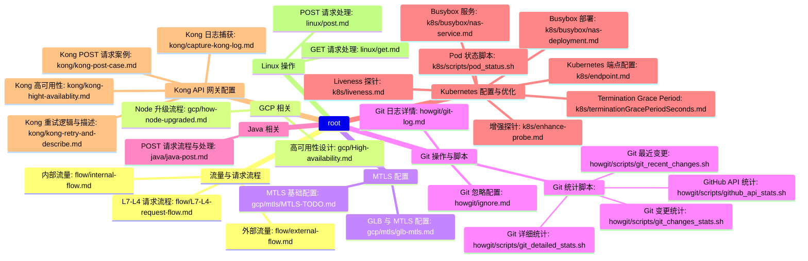

# 知识点概念总结
- 在 Markdown 中以图形化方式展示你的知识点，可以通过 Mermaid 生成一个简单的 MindMap 树形图

## 1. 流量与请求流程
- **L7-L4 请求流程**
  - `flow/L7-L4-request-flow.md`
- **外部流量**
  - `flow/external-flow.md`
- **内部流量**
  - `flow/internal-flow.md`

## 2. GCP 相关
- **高可用性设计**
  - `gcp/High-availability.md`
- **Node 升级流程**
  - `gcp/how-node-upgraded.md`

## 3. MTLS 配置
- **MTLS 基础配置**
  - `gcp/mtls/MTLS-TODO.md`
- **GLB 与 MTLS 配置**
  - `gcp/mtls/glb-mtls.md`

## 4. Java 相关
- **POST 请求流程与处理**
  - `java/java-post.md`

## 5. Kubernetes 配置与优化
- **Busybox 部署**
  - `k8s/busybox/nas-deployment.md`
- **Busybox 服务**
  - `k8s/busybox/nas-service.md`
- **Kubernetes 端点配置**
  - `k8s/endpoint.md`
- **增强探针**
  - `k8s/enhance-probe.md`
- **Liveness 探针**
  - `k8s/liveness.md`
- **Pod 状态脚本**
  - `k8s/scripts/pod_status.sh`
- **Termination Grace Period**
  - `k8s/terminationGracePeriodSeconds.md`

## 6. Kong API 网关配置
- **Kong 日志捕获**
  - `kong/capture-kong-log.md`
- **Kong 高可用性**
  - `kong/kong-hight-availablity.md`
- **Kong POST 请求案例**
  - `kong/kong-post-case.md`
- **Kong 重试逻辑与描述**
  - `kong/kong-retry-and-describe.md`

## 7. Linux 操作
- **GET 请求处理**
  - `linux/get.md`
- **POST 请求处理**
  - `linux/post.md`

