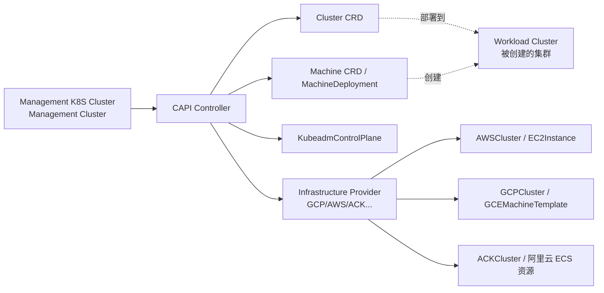
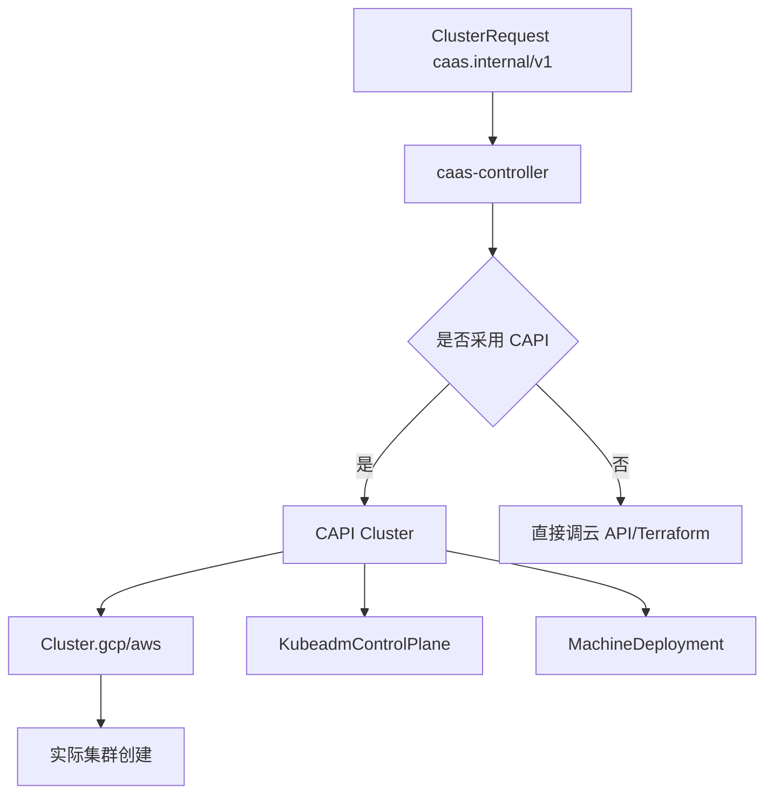
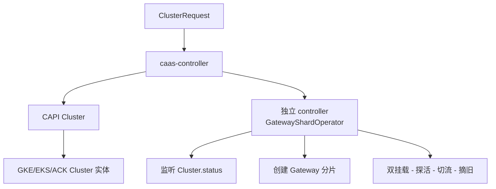

# Cluster API 作为 CaaS 基础设施:自研 vs 复用 CAPI 的边界

# 问题分析

`caas-concepts.md` §"长期" 提到过一句:"长期才是真正意义上的多云控制面(类似 Crossplane、Cluster API 这种'用 K8S 管 K8S'的模式,Cluster API 本身就有 GCP/AWS/阿里云的 Provider,是自建 CaaS 控制面的一个现成基础设施选择)"。

但具体**什么时候用 CAPI / 用了能裁掉哪些自研 / 哪些是 CAPI 解决不了必须自研**,这份判断细节没有展开。

本文聚焦三件事:

1. **CAPI 是什么、能解决什么、不能解决什么**
2. **CaaS 的能力在 CAPI 模型下的对应与差异**(避免重复造轮子)
3. **决策建议: 走 CAPI / 不走 CAPI / 走混合**

---

# 解决方案

## 一、 Cluster API 是什么



**核心抽象**:**两个 Cluster**——管理集群(跑 CAPI controller)与工作集群(被 CAPI 创建/管理的目标集群)。所有操作以 K8S 资源的方式表达。

| 资源                              | 作用                                                |
| ------------------------------- | ------------------------------------------------- |
| `Cluster`                       | **要什么样的 K8S 集群**                                 |
| `MachineDeployment`             | 节点池,声明性表达                                        |
| `KubeadmControlPlane`           | 自建控制面时使用                                        |
| `AWSCluster` / `GCPCluster` 等   | 云特定的"集群拓扑 + 凭证 + 网络" 表达                         |
| `ClusterResourceSet`            | 把附加资源(RBAC/CNI/CSI)自动塞到新集群                       |
| `MachineHealthCheck`            | 节点健康检查 + 自动替换                                    |
| `ClusterClass`                  | **"集群模板"概念**,可以将"集群配方"参数化(类比 Terraform Module) |

**Provider 矩阵**:

| Provider      | 覆盖程度                         |
| ------------- | ---------------------------- |
| AWS           | ✅ 成熟(CAPI 官方主推)              |
| GCP           | ✅ 成熟                          |
| Azure         | ✅ 成熟                          |
| 阿里云(ACK)     | 🔶 社区版有,生产可用性需评估              |
| vSphere       | 🔶 大量用例,但**自建依赖 vCenter 凭证**  |
| Bare metal    | 🔶 多种实现(Metal³ / Tinkerbell) |
| Docker (kind) | ✅ 测试用                        |
| OpenStack     | 🔶 社区版可用                      |

## 二、 你的 CaaS 能力 × CAPI 能力映射

| CaaS 能力(看现有文档)                                           | CAPI 是否覆盖                                  | CaaS 必须自己做的部分                          |
| --------------------------------------------------------- | -------------------------------------------- | --------------------------------------- |
| `ClusterRequest` schema(CloudProvider/Region/Tier/Network)| ✅ Cluster CR + ClusterClass(模板化)             | CRD 上的业务侧字段(tier/multiTenancy 等)        |
| Terraform 创建集群                                            | ✅ 各 Provider 自带 IaC(就是该 Provider 的 Go 代码)   | 业务方申请意图的 frontend;成本预演                  |
| Day-0 策略注入(Kyverno/Cilium/Calico/ClusterRole baseline) | ✅ ClusterResourceSet → 自动 apply 到新集群       | 仅"选择哪一套模板"                            |
| 集群版本升级                                                    | 🔶 KubeadmControlPlane 可以,**但云端托管需每个 Provider 自己实现** | 升级编排的 state machine(canary 策略)         |
| 节点池扩缩容                                                    | ✅ MachineDeployment/MachineHealthCheck       | 业务方"做什么形状的扩容"的产品形态                    |
| Quota 预检查                                                  | ❌ CAPI 不管 quota                              | 自研(对接云 quota API)                       |
| 合规套餐(compliance.frameworks 数组)                         | 🔶 ClusterResourceSet 可塞 Kyverno policy,但**套餐管理**没有 | 套餐表、合规与 Kyverno 模板的对应表                  |
| FinOps 成本归集                                                | ❌ CAPI 不管成本                                  | 自研(沿用 caas-finops.md 里的设计)              |
| 自助门户 / 审批流                                                | ❌ CAPI 不管 portal                              | 自研(沿用 caas-portal.md 里的设计)             |
| 跨集群 Gateway 分片(GKE Gateway API)                        | ❌ CAPI 不管这个                                  | 自研(沿用 gke-caas.md 里的设计)               |
| 网关自动扩容迁移(双挂载探活切流)                                       | ❌ CAPI 不管这个                                  | 自研(你的核心领域)                            |
| Slack 模板库 / Kyverno 模板库                                      | ❌ CAPI 不管基线                                | 自研(policies/ 仓库)                      |

**简化的结论**:

- CAPI ≈ CaaS 的**"Day-0 + Day-1 控制面基础"**(集群创建、节点池、健康检查、模板化)
- CAPI 不能解决 CaaS 的**"产品化层"**(Portal、审批、FinOps、合规套餐策略包、业务侧字段抽象)
- CAPI 不能解决 CaaS 的**"业务专门能力"**(你的 Gateway 分片、自动切流)

## 三、 两个核心问题:CAPI 与现有 controller 怎么共存?

### 问题 A:`ClusterRequest` 和 CAPI 的 `Cluster` 谁做主?



**两种走法**:

| 走法   | 你的 controller 做啥                            | CAPI 做啥                              | 耦合度                  |
| ---- | ----------------------------------------- | ------------------------------------- | -------------------- |
| **走法 1** (CAPI-only) | 只是把 ClusterRequest 翻译成 CAPI 资源,set ownerRef | 实际创建/管理集群                            | 完全交给 CAPI,**最省力**     |
| **走法 2** (混合)      | ClusterRequest 直接生成 Cluster CR(ownerRef)+ 管理 Day-2 | 创建由 CAPI/Provider 完成,Day-2 自管         | 最灵活,**推荐**            |
| **走法 3** (完全不用)    | 自己调云 API                                  | —                                    | 100% 自研,**只在 CAPI 不适用时** |

**我的推荐:走法 2**。理由:

- 你已经有"丰富的 CaaS 业务侧字段",直接调云 API 会写一大堆 adapter;**用 CAPI 替掉那部分基础设施代码**(节点池、健康检查、版本升级)
- 你又有"Gateway 分片 + 自动切流"这种 CAPI 解决不了的业务能力,**自己 controller 控制 Day-2**
- 不走"完全自研"(走法 3)是因为你已经把控全局,但**基础设施 adapter 代码是公认的脏活**,CAPI 替你做了

### 问题 B:Gateway 分片这套,怎么嵌进 CAPI 模型?



→ Gateway 分片天然与 CAPI **正交**—— 它监听 `Cluster.status.ready=true` 后操作目标集群内的 Gateway / HTTPRoute,**跟 CAPI controller 互不影响**。

## 四、 CAPI 之外的几个机制相似项目(横向对比)

| 项目      | 抽象范围             | 与 CaaS 的关系                                |
| ------- | ---------------- | ----------------------------------------- |
| **CAPI** | 集群 + 节点          | 最接近 CaaS Day-0 需求                          |
| **Crossplane** | 任意云资源(不只是 K8S) | 包住 CaaS 也管"业务侧资源的声明交付"(比 CaaS 更广)      |
| **Crossplane + CAPI** 组合 | K8S + 云任意资源       | 业务方能"声明式申请数据库 / LB / DNS + 集群",可与 CaaS 协同 |
| **Terraform Cloud / Atlantis / Spacelift** | Terraform 编排平台  | 只覆盖 Terraform 层,**不感知 K8S**              |
| **Rancher / OpenShift** | 现成的"多云多集群"管理平台 | **可作为 CaaS 的前端 / 或作为 CaaS 自身的实现**(取舍分析见下) |

## 五、 决策建议(分你的现状看)

### 路径 X:自研 CaaS + 用 CAPI 作为底层(推荐度最高 ⭐⭐⭐⭐⭐)

```
[你的 CaaS Controller] -- 调 --> [CAPI Cluster]
                            |
                            +-> [CAPI AWS/GCP Provider]
                            +-> [CAPI ACK Provider (社区版)]
                            +-> [CAPI on-prem Provider]
```

**优势**:

- 你的业务侧字段、CRD、审批流、FinOps 是 CaaS 核心(CAPI 替换不了),保留自研
- 替你干掉那些"为每朵云分别写 Terraform 创建模块"的脏活,统一用 Go provider
- ClusterClass 支持"集群模板",与你的 ClusterRequest spec 字段可做映射
- 升级/扩缩容的 CRD 化逻辑用 CAPI 表达式,你只需要写 controller orchestration

**风险**:

- 阿里云 CAPI Provider 成熟度低:生产前需要评估测试
- 自建(vSphere/Bare-metal)场景需要选 Provider,生态分散
- 引入 CAPI = 引入新一套生命周期理念,**团队需要学习 Cluster / MachineDeployment 概念**

### 路径 Y:不引入 CAPI,继续自研(推荐度中等 ⭐⭐⭐)

**适合场景**:已经跑了 v1/v2 CaaS 在生产、不能承担 CAPI 迁移成本;或 Provider 矩阵短(<2 朵云)。

**优势**:

- 你对流程每一行 100% 掌控
- 无 Provider 兼容性测试压力

**劣势**:

- 你要继续维护"为每朵云写 Provider Adapter + Day-2 controller"
- 上面 §二 表里标记"✅ CAPI 覆盖" 的事(节点池、健康检查、版本升级的 CAPI CRD 化)你都要自己做

### 路径 Z:用 Rancher / OpenShift / KubeSphere 替代 CaaS(推荐度低 ⭐⭐)

**适合场景**:你完全不做自己的 CaaS,**直接采用一个商业/开源"多集群管理平台"**。

**优势**:不维护 CaaS 主控

**劣势**:

- 这些平台很"全景",不是"为你们的 custom 治理模型而生"
- 多租户 / 合规套餐 / 财务归集这些**"你们公司自己才懂"的逻辑**,商业平台全做不到,最终还是要在外面包一层
- 锁定到一家平台,后期迁移痛苦

### 我的最终推荐

**走 路径 X: 自研 CaaS + CAPI 作为底层**。

理由:

| 因素                | 走 X                  | 走 Y(纯自研) | 走 Z(用现成平台) |
| ----------------- | -------------------- | ---------- | --------- |
| 业务侧字段 100% 灵活     | ✅                   | ✅         | ❌        |
| 适配器代码量大量减少       | ✅(用 CAPI Provider)    | ❌         | ✅(平台自带)   |
| 业务专门能力(Gateway 分片) | ✅(自研 controller 兼管) | ✅         | 🔶(需绕平台)  |
| 团队迁移成本            | 中(学 CAPI 概念)        | 低          | 高(学平台)    |
| 长期演化              | 容易(用 ClusterClass 增模板) | 中        | 受限于平台     |

---

# 代码示例

## 1. ClusterRequest → CAPI Cluster 的翻译

```go
// reconciler 中把 ClusterRequest 翻译为 CAPI Cluster + MachineDeployment
func (r *ClusterRequestReconciler) reconcileProvisionViaCAPI(ctx context.Context, cr *caasv1.ClusterRequest) error {
    // 1. 生成 CAPI Cluster
    cluster := &capiv1.Cluster{
        ObjectMeta: metav1.ObjectMeta{
            Name:      cr.Spec.Name,
            Namespace: cr.Namespace,    // CaaS 所在的 namespace
            OwnerReferences: []metav1.OwnerReference{
                *metav1.NewControllerRef(cr, caasv1.GroupVersion.WithKind("ClusterRequest")),
            },
        },
        Spec: capiv1.ClusterSpec{
            ClusterNetwork: capiv1.ClusterNetwork{
                Pods: capiv1.NetworkRanges{
                    CIDRBlocks: []string{cr.Spec.Network.PodCIDR},    // 比如 10.244.0.0/16
                },
                Services: capiv1.NetworkRanges{
                    CIDRBlocks: []string{"10.96.0.0/12"},
                },
                ServiceDomain: "cluster.local",
            },
            ControlPlaneRef: &corev1.ObjectReference{
                APIVersion: controlplanev1.GroupVersion.String(),
                Kind:       "KubeadmControlPlane",
                Name:       fmt.Sprintf("%s-cp", cr.Spec.Name),
                Namespace:  cr.Namespace,
            },
            InfrastructureRef: &corev1.ObjectReference{
                Kind:       providerKindFor(cr.Spec.CloudProvider),  // AWSCluster / GCPCluster / ACKCluster ...
                Name:       fmt.Sprintf("%s-infra", cr.Spec.Name),
                Namespace:  cr.Namespace,
            },
        },
    }

    // 2. 选 Provider(根据 cloudProvider 字段)
    switch cr.Spec.CloudProvider {
    case "gcp":
        cluster.Spec.InfrastructureRef = &corev1.ObjectReference{
            APIVersion: infrav1.GroupVersion.String(),
            Kind:       "GCPCluster",
            Name:       fmt.Sprintf("%s-infra", cr.Spec.Name),
            Namespace:  cr.Namespace,
        }
        // ... 还要生成 GCPMachineTemplate / GCPClusterIdentity 等
    case "aws":
        cluster.Spec.InfrastructureRef = &corev1.ObjectReference{
            APIVersion: infrav1exp.GroupVersion.String(),
            Kind:       "AWSCluster",
            Name:       fmt.Sprintf("%s-infra", cr.Spec.Name),
            Namespace:  cr.Namespace,
        }
        // ... 同样展开
    }

    if err := r.Client.Create(ctx, cluster); err != nil {
        return err
    }

    // 3. 生成 MachineDeployment(节点池)
    nodePools := []capiv1.MachineDeployment{}
    for _, np := range cr.Spec.NodePools {
        nodePools = append(nodePools, capiv1.MachineDeployment{
            ObjectMeta: metav1.ObjectMeta{Name: np.Name, Namespace: cr.Namespace},
            Spec: capiv1.MachineDeploymentSpec{
                ClusterName: cr.Spec.Name,
                Replicas:    ptr.Int32(int32(np.MinSize)),
                Template: capiv1.MachineTemplateSpec{
                    Spec: capiv1.MachineSpec{
                        ClusterName: cr.Spec.Name,
                        Version:      ptr.String(cr.Spec.KubernetesVersion),
                        // 各 Provider 在子模板(MachineTemplate)里还要写
                        InfrastructureRef: ...,
                        BootstrapRef:      ...,
                    },
                },
            },
        })
    }
    return nil
}
```

> **写在 ClusterClass 之上**:这个翻译可以更进一步——**用 ClusterClass 把"翻译规则"参数化**,这样你只需要定义一次"ClusterRequest → ClusterClass Variables 映射",不需要每个 spec 改写 controller 代码。这是 CAPI 的中长期价值。

## 2. ClusterClass(集群模板,参数化)

```yaml
# cluster-class/autopilot-golden-path.yaml
apiVersion: cluster.x-k8s.io/v1beta1
kind: ClusterClass
metadata:
  name: caas-autopilot-golden-path
spec:
  controlPlane:
    ref:
      apiVersion: controlplane.cluster.x-k8s.io/v1beta1
      kind: KubeadmControlPlaneTemplate
      name: caas-autopilot-cp-template
  workers:
    machineDeployments:
      - class: caas-general-nodepool
        template:
          ref:
            apiVersion: cluster.x-k8s.io/v1beta1
            kind: MachineDeploymentTemplate
            name: caas-autopilot-md-template
  variables:
    - name: region
      required: true
      schema:
        openAPIV3Schema:
          type: string
          enum: ["asia-east1", "asia-northeast1", "europe-west1"]
    - name: kubernetesVersion
      required: true
      schema:
        openAPIV3Schema:
          type: string
          pattern: "^v\\d+\\.\\d+\\.\\d+$"
    - name: enableAutopilot
      default: true
      schema:
        openAPIV3Schema:
          type: boolean
    - name: initialShards
      required: true
      schema:
        openAPIV3Schema:
          type: integer
          minimum: 1
          maximum: 20
  patches:
    - name: caas-business-side-patch
      definitions:
        - selector:
            apiVersion: cluster.x-k8s.io/v1beta1
            kind: Cluster
          merge:
            spec:
              topology:
                variables:
                  - name: enableAutopilot
                    value: true
```

**`ClusterRequest` 的 `spec` 字段映射到 `ClusterClass` 的 `variables`**:

```go
func clusterRequestToClassVariables(cr *caasv1.ClusterRequest) []capiv1.ClusterVariable {
    return []capiv1.ClusterVariable{
        {Name: "region", Value: capiv1.VariableValue{Literal: cr.Spec.Region}},
        {Name: "kubernetesVersion", Value: capiv1.VariableValue{Literal: cr.Spec.KubernetesVersion}},
        {Name: "enableAutopilot", Value: capiv1.VariableValue{Literal: cr.Spec.Tier == "autopilot"}},
        {Name: "initialShards", Value: capiv1.VariableValue{Literal: strconv.Itoa(cr.Spec.GatewayStrategy.InitialShards)}},
    }
}
```

## 3. OwnerReference:你 controller 与 CAPI 协同时的"权责分界"

```yaml
# ClusterRequest 管理 Cluster 的 ownerReference
apiVersion: caas.internal/v1
kind: ClusterRequest
metadata:
  name: bbuk-team-a-prod
spec:
  cloudProvider: gcp
  region: asia-east1
---
apiVersion: cluster.x-k8s.io/v1beta1
kind: Cluster
metadata:
  name: bbuk-team-a-prod
  ownerReferences:
    - apiVersion: caas.internal/v1
      kind: ClusterRequest
      name: bbuk-team-a-prod
      controller: true            # 标记是 controller reference
      blockOwnerDeletion: true    # 删除 ClusterRequest 时,先删 Cluster
spec:
  topology:
    class: caas-autopilot-golden-path
    version: v1.30.1
    variables:
      - name: region
        value: asia-east1
      - name: initialShards
        value: "3"
```

**这套关联语义**保证:

- ClusterRequest 删除 → Cluster 通过 OwnerRef 级联删除 → CAPI 触发销毁
- Cluster 状态变化 → 通过 status 字段回流到 ClusterRequest(`status.observedGeneration` / `status.clusterEndpoint`)
- 不存在"ClusterRequest 删了但 Cluster 还在" 的孤儿资源

## 4. CAPI Provider 适配层选择(代码不写,选型是关键)

| 场景                          | 推荐 Provider(版本号都基于 CAPI v1beta1/v1)       |
| --------------------------- | ------------------------------------------- |
| 公有云 SaaS:AWS                | `cluster-api-provider-aws` 官方,成熟度高         |
| 公有云 SaaS:GCP                | `cluster-api-provider-gcp` 官方,但**生产前必须验证其与 GKE Autopilot 的兼容性**——这是另一个上游 |
| 公有云 SaaS:Azure             | `cluster-api-provider-azure` 官方            |
| 公有云 SaaS:阿里云 ACK            | `cluster-api-provider-alibabacloud`(**社区成熟度低**,前评估再上) |
| 自建(vSphere)                | `cluster-api-provider-vsphere` 大量案例        |
| 自建(Bare metal / 物理机)       | `metal3-io` / `tinkerbell`                  |
| 自建(纳管现有集群、不自建控制面)         | **CAPI 不擅长**——改用 caas-onprem.md 里的 ClusterRegistration 方案 |

---

# 注意事项

1. **CAPI 的"管理集群"与"工作集群"是两个集群**——别合并。CAPI controller 不应该跟自己管理的集群放一起,**分离是 CAPI 的核心设计**,合并等于绕过它。
2. **Provider 选型是 CAPI 的最大决策**:阿里云 CAPI Provider 是社区版,**生产前必须在 staging 跑断电/关机/网络分区测试,验证管控面真实可用**。不要被 README 看起来 ok 迷惑。
3. **CAPI 提供的 controller 与你的 controller 一起跑会冲突资源**:例如 `Cluster`、`MachineDeployment` 各自被 CAPI 与你的 controller 监听,**必须通过 OwnerReference 明确所有权**——否则会出现 controller 抢着改资源的隐性问题。
4. **CAPI 不是一个"给你交付集群"的 SaaS 工具,而是一个"给我交付 K8S 资源"的框架**:你要自己写前端、写审批、做 FinOps、塞业务字段。CAPI 不替代"产品化"。
5. **CAPI 复杂度的隐形成本**:CAPI 涉及多个 controller(MD 控制器 / 控制面 provider 控制器 / MachineHealthCheck 控制器 / 集群资源集控制器)+ 每朵云各自的 Provider,**Debug 跨多个 controller 是常态**。投入 1-2 个人员专攻是合理的,不要指望"只读文档能上手"。
6. **CAPI 替代 Terraform,不替代 K8S 知识**:你必须懂 K8S CRD / Controller / Patch / OwnerRef。**不要再考虑"什么是 CRD"的问题**之后再评估 CAPI。
7. **ClusterClass 不解决"非 K8S 资源"问题**:ClusterClass 只能在 CAPI 资源体系内生根,**业务侧资源(如 ArgoCD Application / cert-manager ClusterIssuer)请用 `ClusterResourceSet` 或外部 GitOps**,别硬塞进 CAPI。
