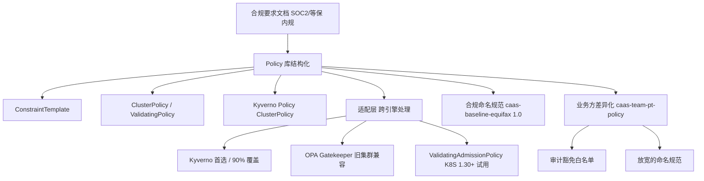
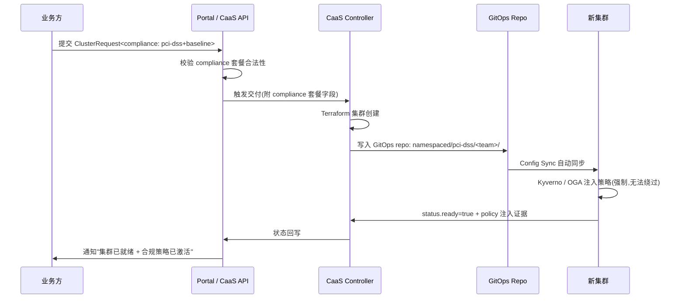

# 安全 / 合规基线:在 CaaS 交付集群时"开箱即用"地注入

# 问题分析

你现有的 `gke-caas.md` 里,合规 / 安全的注入只散落两处:

1. `GatewayStrategy` 注入 mTLS Server TLS Policy
2. `GitOpsPolicyApplier.ApplyBaseline` 一笔带过 "RBAC / 多租户基线"

——这是**远远不够**的。如果 CaaS 真要承担"业务方动动手就能拿到生产级合规集群"的定位,合规基线需要被当作**一等公民**:从 CRD 上强制声明、到 Policy 模板库里结构化、再到多集群差异配置上避免重复造轮子。

本文把合规基线拆成四块:

1. **合规维度矩阵**:国内(等保 2.0、密码法、PIPL、关基条例) + 国际(SOC2、ISO27001、PCI-DSS) × K8S 控制域
2. **Policy 模板库组织方式**:用什么引擎(Kyverno / OPA Gatekeeper / ValidatingAdmissionPolicy)+ 怎么分版本
3. **基线注入时机**:Day-0 创建时 vs Day-1 上线后巡检
4. **多集群差异配置**:合规标准统一,但**实施细节有差异**——比如"数据驻留在国内"对不同云有不同落点

---

# 解决方案

## 一、 合规控制矩阵

> 控制域 × 合规框架的覆盖矩阵。✅ = 标准库有现成策略 / 🔶 = 需要适配 / ❌ = 暂不覆盖或需自建
> 
> **简化的口径**:每行同一合规框架在不同云/不同集群上的"实施细节"在第四节处理,这里只点覆盖度。

| 控制域                          | 类别   | 等保 2.0       | SOC2          | ISO27001     | PCI-DSS      | PIPL  /  个保法       | K8S 原语                            |
| ----------------------------- | ---- | ------------ | ------------- | ------------ | ------------ | ------------------- | ---------------------------------- |
| **身份与认证**                | 安全   | 8.1.4 单级登录    | CC6.1         | A.9          | 7.1          | —                   | OIDC / RBAC / Workload Identity     |
| **网络隔离 / E/W 流量控制**     | 安全   | 8.1.3 边界防护    | CC6.6         | A.13         | 1.2 / 1.3    | —                   | NetworkPolicy + Gateway / Service Mesh |
| **数据加密 落盘 (at-rest)**    | 加密   | 8.1.4 数据保密    | CC6.7         | A.10         | 3.4          | —                   | KMS / Secrets / CSI 加密             |
| **数据加密 传输 (in-transit)**  | 加密   | 8.1.4 通信保密    | CC6.7         | A.10         | 4.1          | ✅ 跨境传输评估需求     | mTLS / Server TLS Policy            |
| **镜像签名 / 软件供应链**        | 完整性 | 8.1.10 漏洞扫描 | CC7.1          | A.12         | 6.3 / 6.5    | —                   | Sigstore / Cosign / SLSA / 准入策略      |
| **运行时安全**                  | 安全   | 8.1.5 入侵防范    | CC6.6 / CC7.2  | A.13         | 11.4         | —                   | PodSecurity / Runtime 检测 / seccomp |
| **审计日志**                    | 审计   | 8.1.6 审计       | CC7.2 / CC7.3 | A.12.4       | 10.1-10.7    | ✅ 处理记录保存 3 年 | K8S Audit / k-audit / Cloud Audit |
| **数据驻留 / 跨境**              | 合规   | —            | —             | —            | —            | ❌ 核心要求            | 集群 Region 选择 + 数据存储位置 |
| **变更审计 / 批准**              | 治理   | 8.1.7 变更       | CC8.1         | A.12.1       | 6.4.5        | —                   | GitOps + PR 审批 + 准入策略              |
| **配置基线 / 加固**              | 加固   | 8.1.2 物理 / 网络 | CC6.1         | A.12         | 2.2          | —                   | CIS Benchmark / Operator 准入       |

> **严格口径**:
> - 等保 2.0 控制项编号以 **GB/T 22239-2019** 为准
> - SOC2 信托服务标准 **TSC 2017(更新版)**
> - PCI-DSS v4.0(2024 年生效)
> - PIPL 涉及的"个人信息处理记录保存 3 年"对应 CSL 第 55 条,GB/T 35273 是推荐性配套
> - **数据驻留 / 跨境传输不是 K8S 技术问题**,是 CaaS Region 选择策略问题——但 CaaS 要在 schema 层强制要求 `spec.region` 填报理由,见 §三

## 二、 Policy 引擎选型与模板库组织



**3 个引擎在 CaaS 里的角色分工**:

| 引擎                          | 角色        | 用法                                                                  |
| --------------------------- | --------- | ------------------------------------------------------------------- |
| **Kyverno**(推荐主选)         | 主策略引擎    | 命名规范 / 镜像白名单 / ResourceQuota / 标签强制;YAML 原生,GitOps 友好            |
| **OPA Gatekeeper**(兼容存量)   | 过渡引擎      | 已经在用 OPA Gatekeeper 的旧集群继续使用;不强制所有新集群采用                            |
| **ValidatingAdmissionPolicy** | 未来潜在方案   | K8S 1.30+ GA,无外部依赖;但 CEL 表达力有限,**复杂合规策略暂不推荐**                      |

**模板库的结构**(单仓 `policies/`,按"合规框架"分子目录,不是按"业务"):

```
policies/
├── baseline/                # 🔒 所有集群必备
│   ├── 01-image-security/   # 镜像白名单 + 签名校验
│   ├── 02-network/          # 默认 deny + 显式 allow
│   ├── 03-rbac/             # 禁止 default SA / 禁用 serviceaccount token mount
│   └── 04-resource-quota/   # Namespace 配额基线
├── pci-dss/                 # 🛒 PCI 集群额外启用
│   ├── network-segmentation
│   ├── secret-rotation
│   └── privileged-pod-denied
├── pip/                     # 🇪🇺 PIPL/PIPL 集群
│   ├── data-residency
│   └── cross-border-transfer-locked
└── exceptions/              # 📝 业务方申请的豁免(双签审批)
    └── README.md
```

**命名规范**:`<合规框架>-<控制域>-<版本>`,例:`baseline-image-security-v1.2.3`。所有模板都要求有 Git tag + 准入审计记录,**不允许 Secret hand-edit Kyverno 集群内编辑**。

## 三、 Day-0 注入 vs Day-1 巡检



**两种基线的区别**:

| 维度      | Day-0 注入(创建时) | Day-1 巡检(上线后)                                          |
| ------- | -------------- | ------------------------------------------------------- |
| **做什么** | Kyverno / OGA 强制基线     | 集群画像采集(CIS scan / 镜像签名覆盖率 / NetworkPolicy 覆盖度) |
| **谁做**  | CaaS Controller | 合规 Bot(独立于交付,周期性跑)                                 |
| **失败响应** | 阻断交付              | 告警 + 强制修复 + 严重违规冻结 Pod 调度                                  |
| **示例** | 创建即装上 Kyverno baseline     | 每 7 天跑一次 kube-bench / kube-hunter                            |

---

# 代码示例

## 1. ClusterSpec 加 `compliance` 套餐字段(扩展 `gke-caas.md` 里的 CRD)

```yaml
spec:
  cloudProvider: aws
  region: cn-north-1   # 注意:不是所有 region 都满足数据驻留约束
  tier: standard
  compliance:
    frameworks:                  # 合规框架列表,见 §一
      - baseline                 # 必备,不可省略
      - pip                      # 海外业务追加
      - pci-dss                  # 支付业务追加
    dataResidency:
      regionConstraint: "cn"     # 限制集群必须落在中国 region
      allowedCrossBorder: false  # false 时所有数据流被策略禁止跨境
    exceptions:
      - policyRef: baseline-image-security-v1.2.3   # 引用具体模板
        namespaceSelector: "team-a/prod-checkout"   # 豁免范围
        reason: "P0 业务线 - 审批单 #12345"
        approver: "platform-team-leads@company.com"
```

**配套 CRD Schema 扩展**:

```yaml
spec:
  type: object
  properties:
    compliance:
      type: object
      required: ["frameworks"]
      properties:
        frameworks:
          type: array
          items:
            type: string
            enum: ["baseline", "pci-dss", "pip", "soc2", "iso27001"]
        dataResidency:
          type: object
          properties:
            regionConstraint:
              type: string
              enum: ["cn", "eu", "us", "any"]
              default: "any"
            allowedCrossBorder: { type: boolean, default: true }
        exceptions:
          type: array
          items:
            type: object
            required: ["policyRef", "namespaceSelector", "reason", "approver"]
            properties:
              policyRef:
                type: string
                pattern: "^[a-z0-9-]+-v\\d+\\.\\d+\\.\\d+$"
              namespaceSelector: { type: string }
              reason: { type: string, minLength: 30 }
              approver:
                type: string
                pattern: "^.+@.+$"
```

> **校验目的**:`policyRef` 必须是真实存在的模板名(后续 admission webhook 校验),`reason` 不能太短(防止随便填),`approver` 必须是邮箱格式(防止打错字)——**合规字段的格式严谨度本身就在证明你的合规态度**。

## 2. Kyverno 模板示例:`baseline-image-security-v1.2.3`

```yaml
# policies/baseline/01-image-security/disallow-latest-tag.yaml
apiVersion: kyverno.io/v1
kind: ClusterPolicy
metadata:
  name: baseline-image-security-v1.2.3
  annotations:
    policies.kyverno.io/title: "禁止 latest 标签 + 强制镜像签名"
    policies.kyverno.io/severity: high
    compliance.company.io/frameworks: "baseline,soc2,pci-dss"   # 自定义注解,关联合规框架
spec:
  validationFailureAction: Enforce        # 硬性阻断,不 Audit
  backgroundScan: true                    # 存量资源也扫,防止绕过
  rules:
    - name: deny-latest-tag
      match:
        any:
          - resources:
              kinds: ["Pod", "Workload"]  # K8S 原生或 CRD 都覆盖
              namespaces: ["*"]
      validate:
        message: "禁止使用 :latest 标签或省略 tag,必须用 digest 或固定版本"
        pattern:
          spec:
            containers:
              - image: "*:*"
              - image: "*@sha256:*"
        anyPattern:
          - spec:
              containers:
                - image: "!*:*latest"
    - name: require-cosign-signature
      match:
        any:
          - resources:
              kinds: ["Pod"]
              namespaces: ["*"]
              subjectAccounts: ["*"]      # 所有 SA,但要配合下面 image pullpolicy
      verifyImages:                       # Kyverno 1.7+ verifyImages 支持 sigstore
        - imageReferences:
            - "registry.company.io/*"     # 限制只验公司内部仓库
          attestors:
            - entries:
                - keys:
                    publicKeys: "k8s://registry-keys/cosign-pub"
        repository: "registry.company.io/cosign-attestation"
  exclusion:
    namespaces:                           # 豁免目录:必须在 spec.exceptions 里登记
      - kube-system
      - caas-system
```

**模板里不应该出现**:具体业务 namespace、具体团队名字。**所有豁免从 spec.exceptions 动态注入到副本**,模板本身不针对业务。

## 3. 合规 Bot 巡检脚本骨架(CIS Benchmark 风格)

```python
# caas-compliance-bot/cluster_image.py
# 周期性(7 天一次)跑合规巡检,与 CaaS Controller 解耦

class ComplianceCheck:
    async def run(self, cluster: ClusterEndpoint) -> ComplianceReport:
        results = []

        # 1. CIS Benchmark via kube-bench
        kube_bench = await self.shell.run(
            "./kube-bench run --json --target=node", cluster=bastion(cluster)
        )
        results.append(CISNodeResult.from_json(kube_bench))

        # 2. CIS Kubernetes via sonobuoy
        sonobuoy = await self.shell.run(
            "sonobuoy run --mode=certified-conformance --wait --json", cluster
        )
        results.append(SonobuoyCertifiedConformance.from_json(sonobuoy))

        # 3. Kyverno 策略覆盖率
        coverage = await self.k8s_client(
            cluster, "/apis/policies.kyverno.io/v1/clusterpolicies"
        )
        report = KynaernoCoverageReport.from_kyverno_list(
            coverage_items=coverage,
            expected=self.expected_policies(cluster.team_profile.compliance.frameworks)
        )

        # 4. 镜像签名覆盖率:扫所有 Deployments,统计有多少 image 被 Cosign 验证过
        unsigned_images = await self.scan_images_without_signature(cluster)
        results.append(ImageSignatureCoverage(clusters=cluster, unsigned=unsigned_images))

        # 5. NetworkPolicy 覆盖度
        npcov = await self.networkpolicy_coverage(cluster)
        results.append(NetworkPolicyCoverage(cluster=cluster, coverage=npcov))

        # 6. 审计:把结果写到 status.conditions + 推送到合规审计 channel
        report = ComplianceReport(
            cluster=cluster.name,
            results=results,
            severity=sorted_severity(results)
        )
        await self.audit_log.write(report)
        await self.notifier.send(report, channel="#compliance-audit")
        return report
```

---

# 注意事项

1. **合规基线不是"加了 Kyverno 策略就完事"**:基线策略经常和业务方"我就是要开特权"诉求对抗,**豁免流程的严谨度**(谁批、批多久、批几次后必须修)往往比模板本身更重要。
2. **不要做"超集模板"**(想要兼容所有合规框架,做了 1000 行 Rego):会把模板变成黑盒,**业务方看不懂、出了问题没人能改**。每个框架单独一份模板,可读性 > 代码复用。
3. **ValidatingAdmissionPolicy(VAP)是潜在替代品,但还没到能替换 Kyverno 的程度**:VAP 写起来比 Kyverno policy 啰嗦,但没有外部依赖、链路更短。建议新集群只对**一类非常简单的策略**尝试 VAP(比如"禁止某些 namespace 的某些 kind"),复杂的还是走 Kyverno。
4. **合规审核/豁免的审计数据要在 CaaS 内闭环**:`exceptions` 必须能在 Compliance Bot 跑出来的报告里反查到"这条不合规是有人批过的",否则审计现场会被挑战。
5. **跨境传输属于"合规+架构"双重问题**:PIPL / GDPR 不止要求集群在境内,**所有日志/镜像/数据存储都不能出 Region**。Kyverno 的 `verifyImages` 不能依赖境外镜像仓库,否则一开始就走不通。
6. **合规模板的版本管理要沿用"模板一次升级,所有集群先 Dry-Run 后强制"路径**(参考 Istio revision 升级):发现某条策略要严格了,不能直接 `kubectl apply` 到所有集群,**先在 non-prod 集群跑 7-14 天**,再推到 prod。
