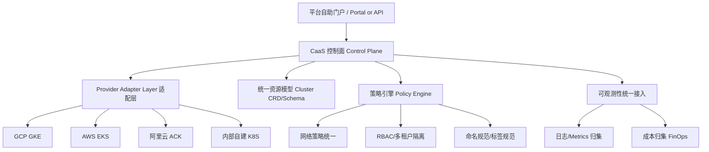

# 问题分析

"Cluster as a Service"（CaaS，集群即服务）本质上是把 **"创建/管理一个 Kubernetes 集群"这件事本身，抽象成平台的一个自助式产品能力**，而不是让业务团队直接对接 GCP Console、阿里云控制台、AWS Console 或内部 IaC 脚本去手动开集群。

对于你们已经接入 GCP、阿里云、内部 K8S、AWS 这种多云/混合云场景来说，CaaS 的核心价值是：**屏蔽底层云厂商差异，提供统一的集群生命周期管理入口**。

---

# CaaS 的核心能力构成

## 1. 统一的集群生命周期管理

| 阶段                  | 说明                                                          | 跨云差异点                                                |
| --------------------- | ------------------------------------------------------------- | --------------------------------------------------------- |
| Provisioning（创建）  | 用户填参数（region、node pool、版本），平台自动调用对应云 API | GKE Autopilot/Standard vs EKS vs ACK vs 内部 kubeadm/自建 |
| Configuration（配置） | 网络、IAM/RBAC、Add-ons（CNI、CSI、Ingress）                  | VPC-native (GKE) vs VPC CNI (EKS) vs 专有网络 (阿里云)    |
| Upgrade（升级）       | 控制面/节点池版本滚动升级                                     | 各云版本节奏、维护窗口机制不同                            |
| Scaling（伸缩）       | 节点自动伸缩、集群规模治理                                    | Cluster Autoscaler vs Karpenter vs 阿里云 ACK 弹性        |
| Decommission（销毁）  | 资源回收、成本核销                                            | 需要统一的资源标签/账单归集策略                           |

## 2. 抽象层设计（这是关键）

**适配层（Provider Adapter）**是整个 CaaS 能否落地的核心：需要把 GKE 的 `Autopilot/Node Pool`、EKS 的 `Managed Node Group`、ACK 的 `节点池`、内部平台的自定义资源，统一映射成一套内部的 `ClusterSpec` 抽象（可以用 CRD 或者内部 API Schema 表示），业务方只感知这套抽象，不感知底层实现。

## 3. 典型对外暴露的产品化能力

- **自助申请集群**：选 Region、规模、网络模式（是否需要 mTLS/Service Mesh、是否接 Gateway API）
- **多租户隔离**：Namespace-as-a-Service 或独立集群模式的选择（成本 vs 隔离度权衡）
- **网络接入标准化**：这个跟你已有的 GCP mTLS LB / Gloo Gateway / Istio Ambient 经验直接相关——CaaS 交付出来的集群，Ingress/Gateway 层应该是"开箱即用"接入到统一网关的
- **合规基线**：Pod Security、网络策略、镜像扫描策略在创建时就注入，而不是事后补
- **成本可视化**：跨云的集群成本需要归一化展示（GCP/AWS/阿里云计费模型不同）

---

# 结合你们现有架构的落地思路

考虑到你已经在做 GKE Gateway API 配额治理、ASM→Gloo 迁移、GCP mTLS LB 这些工作，CaaS 在你们场景里更现实的定位可能是：

1. **短期**：先把"集群创建+网络基线注入"做成模板化（Terraform Module / Config Sync + Fleet 管理），而不是急着做多云统一控制面
2. **中期**：用 **GKE Fleet / Anthos Config Management** 之类的机制统一管理多个 GKE 集群的策略下发，如果要扩展到 EKS/ACK，需要抽象出跨云通用的策略下发机制（比如统一走 Kyverno/OPA + GitOps）
   3**长期**：才是真正意义上的多云控制面（类似 Crossplane、Cluster API 这种"用 K8S 管 K8S"的模式，Cluster API 本身就有 GCP/AWS/阿里云的 Provider，是自建 CaaS 控制面的一个现成基础设施选择）

---

# 注意事项

- **不要一上来就追求"完全统一"**：四朵云的网络模型、IAM 模型差异很大（尤其阿里云 vs GCP/AWS），过度抽象会导致适配层复杂度失控，建议先统一"可以统一的 80%"（生命周期、可观测性、合规基线），云厂商特有能力（比如 GKE Autopilot）保留逃逸舱口
- **Cluster API（CAPI）值得重点评估**：如果要自建 CaaS 控制面，CAPI 是业界比较成熟的路线，天然支持 GCP/AWS/阿里云 Provider，比自己从零写适配层更省力
- **和你现有的 Istio Ambient / KongDP / Gloo Gateway 工作要打通**：CaaS 交付的集群，其 Ingress/Mesh 接入方式应该纳入模板，否则会出现"集群交付了但网络没法用"的割裂

如果你想针对某一朵云（比如先落地 GKE 这条线）深入设计 CaaS 的具体 Terraform/CRD Schema，或者想看 Cluster API 的落地方案，可以告诉我具体方向。
