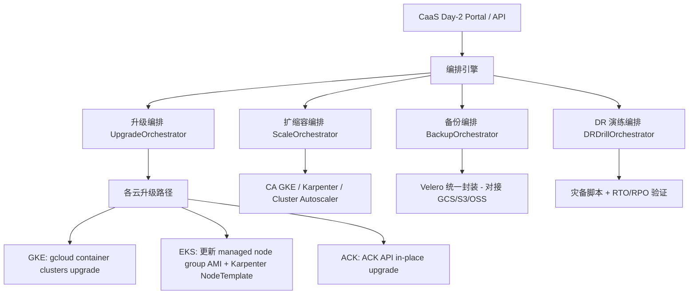
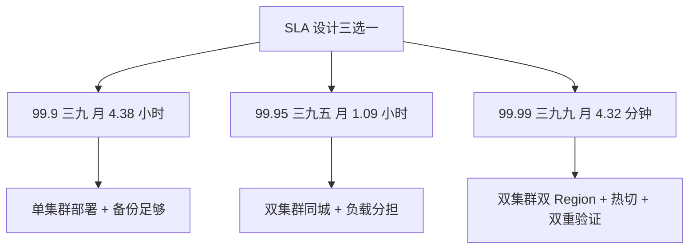
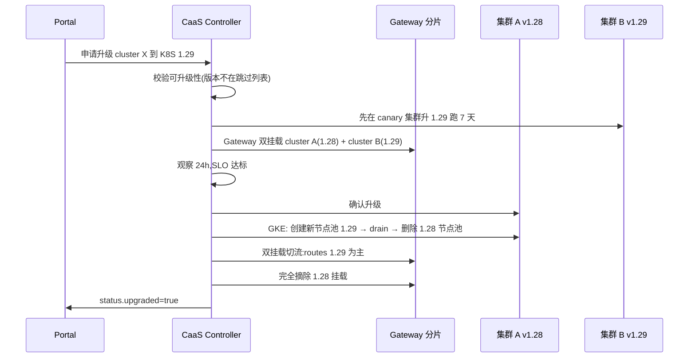

# Day-2 运维 & SLA / 灾备:把 CaaS 从"交付"延伸到"长期可用"

# 问题分析

`gke-caas.md` 整套讲的是 **Day-0**(创建 + 基础设施注入)+ **部分 Day-1**(Controller 状态推进)。但集群一旦上线,真正决定业务方"用得多久不出问题"的,是 **Day-2 运维**——升级、备份、DR、扩缩容、证书轮换、监控、应急响应。

这块在现有文档里只散落两笔:

- `gke-caas.md` §"统一集群生命周期管理" 表格里 "Upgrade(升级)" 一行
- 注意事项里提到"Autopilot 逃逸舱口"

如果 Day-2 是断的,CaaS 交付出去的集群:

- 一次重大 GKE 版本升级就崩了
- 一次节点池扩缩容就把生产流量打挂了
- etcd 没有备份、勒索软件来了毫无抵抗力
- 证书 90 天到期没人管,客户被拒服

——这些都是真实生产事故,**不是"理论风险"**。

本文把 Day-2 拆成 6 个能力域,逐个回答 "CaaS 必须做什么 / 哪些云原生能做 / 哪些需要 CaaS 包一层"。

---

# 解决方案

## 一、 Day-2 能力矩阵(6 大能力域 × 4 朵云)

> 标注:✅ 平台原生 / 🔶 需要 CaaS 适配层 / ❌ 需要业务方自管(并标注工具)

| 能力域                       | GKE                                          | AWS EKS                                | 阿里云 ACK                       | 内部自建 K8S                            |
| -------------------------- | -------------------------------------------- | -------------------------------------- | ---------------------------- | ----------------------------------- |
| **集群版本升级**                 | 自动化(快慢通道)+Maintenance Window          | 手动 + 滚动节点组                          | 手动+支持原地升级                   | 自定 kubeadm upgrade,易出错              |
| **节点池扩缩容**                 | Cluster Autoscaler / Autopilot 自动             | Karpenter/CA(都要装)                 | 节点池 Auto Scaling                | 自建 CA 或 external scaler              |
| **etcd / 控制面备份**            | GCP 自动                                  | AWS 需手装 Velero + Control Plane   | 阿里云需手装 Velero                 | 必须自己装 Velero + etcd snapshot       |
| **应用层备份 / DR**              | 需装 Velero + GCS                            | 需装 Velero + S3                       | 需装 Velero + OSS                | 需装 Velero + 内部对象存储                |
| **证书轮换 / 管理**               | ManagedCertificate(自动) + cert-manager     | ACM(自动)+ cert-manager         | 阿里云 SSL(自动) + cert-manager | cert-manager 是唯一选择,ACME issuer 必要 |
| **监控 / 告警 / Oncall**         | Cloud Logging/Monitoring/Trace(基本免费)  | CloudWatch Container Insights(要付费) | ARMS + 日志服务                    | 自建 Prometheus + Alertmanager + Oncall |

**简化的结论**:

- **GKE 的 Day-2 在四朵云里最省心**——GCP 自家控制面备份、托管 LB/证书、自动发通道控制面升级,但"省心"也意味着"出问题时你只能走 GCP support"
- **EKS/ACK 的 Day-2 大都需要三件套**:Velero(备份) + cert-manager(证书) + 自监控(可观测性)——这三件套缺一不可,CaaS 必须把它们当一等公民装上
- **自建 Day-2 是真正的"全栈责任"**:etcd snapshot、Velero、cert-manager、自监控一个都不能少,**自建 K8S 的 Day-2 成本远高于"省下的云服务费"**

## 二、 CaaS 在 Day-2 中的角色定位

> **关键概念区分**:CaaS 不应该是"所有 Day-2 操作的执行体",而应该是 **"Day-2 操作的统一编排入口"**。执行还是由各云原生工具做,CaaS 负责"谁/什么时候/按什么策略/谁来审批"。



**CaaS 控制 vs 逃逸**:

| 能力域    | CaaS 控制策略                                                                       |
| ----- | ------------------------------------------------------------------------------ |
| 版本升级   | **CaaS 统一编排**(比如要求"先非 prod → canary 2 集群 → prod")。业务方可以"申请"升级,但执行权不在业务方 |
| 节点池扩缩 | **CaaS 给建议**(基于历史用量预测),**业务方执行**——除非开了 Hard Limit                                |
| 备份     | **CaaS 强制启用**——可以选 Velero 还是云厂商托管,但"无备份"不允许状态写入数据                            |
| DR 演练   | **CaaS 编排 + 定期强制**(季度/半年)——这是合规要求,不是业务方自愿                                |
| 证书     | **CaaS 内置 ACME + cert-manager 流水线**——业务方只声明 host                |
| 监控     | **CaaS 强转发**(必须接 Logging/Metrics/Trace)——**不接不允许生产部署**                  |

## 三、 SLA / 灾备的关键决策



**三个 SLA 等级对应 CaaS 的不同能力**:

| SLA     | 月宕机预算     | CaaS 默认提供                | CaaS 可选加项                                  |
| ------- | --------- | ------------------------ | ------------------------------------------ |
| 99.9    | 4.32 小时   | 单 Region 单集群 + Velero 备份 | —                                          |
| 99.95   | 1.08 小时   | + 同城双集群负载分担             | 跨 AZ LB                                                                                          |
| 99.99   | 4.32 分钟   | + 跨 Region 热备 + PIT 备份     | GKE Multi-cluster Ingress / ACK 多活  / EKS Anywhere  |

**必做项**:每个 SLA 级别都有 RTO/RPO 目标 + DR 演练要求,**CaaS 必须在 CRD 上 schema 化**(见 §代码示例 2)。

## 四、 升级路径设计(零中断升级的最佳实践)



**关键**:**SLA ≥ 99.95 的集群必须"双版本并行"过渡期**,这是 Istio revision 升级也是 GKE 的 standard practice。CaaS 升级编排就是把这条经验产品化。

## 五、 "集群生命周期归属"组织流程

Day-2 真正决定效率的,不是技术而是**组织分工**——谁有 break-glass 权限、谁有权升级生产、谁有权扩容。

| 角色                  | 在 CaaS Day-2 中的权限                                                                         |
| ------------------- | -------------------------------------------------------------------------------------- |
| **业务团队 Owner**     | 看监控 + 申请变更(升级、扩容、备份恢复);**不能直接动生产**                                |
| **平台 SRE**         | 批核变更请求 + 执行变更 + 维护 runbook                                            |
| **平台 Security** | 决定合规基线变化(策略升级、豁免审批);有 read-only 受控通道                               |
| **FinOps**         | 决定预算上限调整 + 处理异常告警;**无生产写权限**                                              |
| **Break-glass 应急响应** | 平台 SRE 主值守 + Security 双签;事后必审计,可事后追查责任人                         |

**CaaS 的 RBAC 反映这个分工**:`role=cluster-owner` 团队 owner 有 read,`role=platform-sre` 有 write,`role=break-glass` 在审计记录后可写(参见前文 `gke-caas.md` 的 `multiTenancy` 字段)。

---

# 代码示例

## 1. BackupPolicy CRD(Velero 抽象,跨云一致)

```yaml
apiVersion: apiextensions.k8s.io/v1
kind: CustomResourceDefinition
metadata:
  name: backuppolicies.backup.caas.internal
spec:
  group: backup.caas.internal
  scope: Cluster
  names:
    plural: backuppolicies
    kind: BackupPolicy
    shortNames: ["bp"]
  versions:
    - name: v1
      served: true
      storage: true
      subresources:
        status: {}
      schema:
        openAPIV3Schema:
          type: object
          required: ["spec"]
          properties:
            spec:
              type: object
              required: ["schedule", "targets", "retention"]
              properties:
                schedule:
                  type: string
                  description: "标准 cron 表达式,带时区,例 '0 2 * * * Asia/Shanghai'"
                targets:
                  type: object
                  properties:
                    namespaces:
                      type: array
                      items: { type: string, pattern: "^[a-z0-9-]+$ }
                      minItems: 1
                    excludeResources:
                      type: array
                      items: { type: string }
                    includeClusterResources: { type: boolean, default: true }
                storage:
                  type: object
                  required: ["provider", "bucket"]
                  properties:
                    provider:
                      type: string
                      enum: ["gcs", "s3", "oss", "minio"]
                    bucket: { type: string }
                    region: { type: string }
                    prefix: { type: string, pattern: "^[a-z0-9-]+/$" }
                retention:
                  type: object
                  required: ["keep"]
                  properties:
                    keep: { type: integer, minimum: 1 }
                    unit:
                      type: string
                      enum: ["hours", "days", "weeks", "months"]
                encryption:
                  type: object
                  properties:
                    kmsKeyRef:
                      type: string
                      description: "跨云 KMS key ARN"
            status:
              type: object
              properties:
                lastBackup:
                  type: object
                  properties:
                    startTime: { type: string, format: date-time }
                    endTime: { type: string, format: date-time }
                    status:
                      type: string
                      enum: ["Succeeded", "Failed", "PartiallyFailed", "InProgress"]
                    bytes: { type: integer, format: int64 }
                backupChain:
                  type: array
                  items: { type: string, format: date-time }
                  description: "最近 30 次备份 ID 链表"
                lastVerifiedRestore:
                  type: object
                  properties:
                    time: { type: string, format: date-time }
                    namespace: { type: string }
                    result: { type: string, enum: ["OK", "Failed"] }
```

## 2. SLA 等级 + DR 演练 注册到 CaaS

```yaml
spec:
  sla:
    target: "99.95"                  # 99.9 | 99.95 | 99.99
    rtoMinutes: 60                   # Recovery Time Objective
    rpoMinutes: 30                   # Recovery Point Objective
    regionStrategy: multi-region     # single | multi-region | multi-cloud
    drillCadenceDays: 90             # DR 演练周期
    drillRequiredApprovers:
      - "security-team@company.com"
      - "platform-sre-lead@company.com"
```

**配套策略**:

- CaaS 在 `crontab`/GitHub Actions 上发起 DR 演练
- 演练结果写回 CRD status,90 天内必须有 1 次成功演练
- 没做的集群,合规 Bot 报警 + 自动冻结变更(升级、扩缩容暂停)

## 3. Controller 状态机扩展 Day-2 phases

```go
// 扩展 caasv1.Phase 枚举
const (
    PhasePending       = "Pending"
    PhaseQuotaBlocked  = "QuotaBlocked"
    PhaseProvisioning  = "Provisioning"
    PhaseReady         = "Ready"
    PhaseFailed        = "Failed"
    // --- Day-2 新增 ---
    PhaseUpgrading     = "Upgrading"     // 升级中
    PhaseBackupRunning = "BackupRunning" // 备份任务中
    PhaseDRDrilling    = "DRDrilling"    // DR 演练中
    PhaseDecommissioning = "Decommissioning"
    PhaseDecommissioned  = "Decommissioned"
)

// 升级入口示例
func (r *ClusterRequestReconciler) reconcileUpgrading(ctx context.Context, cr *caasv1.ClusterRequest) (ctrl.Result, error) {
    // 1. 校验 spec.upgrade.toVersion 在供应商支持范围
    targetVersion := cr.Spec.Upgrade.ToVersion
    ok, err := r.providerAdapter.ValidateUpgradePath(ctx, cr.Status.ClusterID, targetVersion)
    if err != nil || !ok {
        setCondition(cr, "UpgradePathInvalid", metav1.ConditionFalse, "UnsupportedVersion", targetVersion)
        // 失败不直接 error,把决策权交回业务方
        cr.Status.Phase = caasv1.PhaseFailed
        return r.updateStatus(ctx, cr, ctrl.Result{})
    }

    // 2. SLA == 99.99 时,双挂载并行升级;否则 in-place
    if cr.Spec.SLA.Target == "99.99" {
        return r.upgradeWithBlueGreen(ctx, cr)
    }
    return r.upgradeInPlace(ctx, cr)
}
```

## 4. Velero 跨云统一安装 manifest

```yaml
# caas-day2/velero/install.yaml
# 由 CaaS 在 reconcileProvisioning 完成后 helm 一次性安装
velero:
  configuration:
    backupStorageLocation:
      - name: gcs    # provider=gcs
        provider: gcp
        bucket: caas-backups-gcp
        config:
          serviceAccount: caas-velero@project.iam.gserviceaccount.com
      - name: s3     # provider=s3
        provider: aws
        bucket: caas-backups-aws
        region: ap-northeast-1
        config:
          region: ap-northeast-1
      - name: oss    # provider=oss
        provider: alibabacloud
        bucket: caas-backups-aliyun
        region: cn-shanghai
    volumeSnapshotLocation:
      - name: gce
        provider: gcp
      - name: ebs
        provider: aws
      - name: aliyun
        provider: alibabacloud
  deployRestic: true     # PV 备份

# CaaS 部署时按 spec.cloudProvider 选对应 storageLocation
# 其它云做 mutate webhook,避免业务方手填
```

## 5. 证书自动续签流水线(cert-manager + Gateway 集成)

```yaml
# caas-day2/cert-issuer.yaml
# CaaS 在交付集群时一并安装
apiVersion: cert-manager.io/v1
kind: ClusterIssuer
metadata:
  name: letsencrypt-prod
spec:
  acme:
    server: https://acme-v02.api.letsencrypt.org/directory
    email: platform-ssl@company.com
    privateKeySecretRef:
      name: letsencrypt-prod-account-key
    solvers:
      - http01:
          ingress:
            class: gloo-gateway
            # Gateway 在 GKE/EKS/ACK 之间不同,这里用统一的 Gloo Gateway
            # 因为你们的 Gateway 已经是 CaaS 注入基线的一部分
      - dns01:
        # 国内场景:阿里云 DNS / 腾讯云 DNSPod 凭据独立提供
---
# 业务方使用示例,声明 host 自动获得证书
apiVersion: networking.gloo.solo.io/v2
kind: RouteOption
metadata:
  namespace: team-a
  name: tls-host-options
spec:
  options:
    tls:
      secretRef:
        name: team-a-prod-tls   # cert-manager 自动生成/续签
      hosts:
        - "checkout.company.io"
```

---

# 注意事项

1. **Day-2 不要"全栈自研"**:Velero、cert-manager、Cluster Autoscaler、Karpenter、Kyverno 等已经是事实标准,**CaaS 的价值是"统一编排它们",不是"重写它们"**。重写一遍意味着你的团队要永远维护一套平行的工具链。
2. **DR 演练必须 CaaS 强制 + 业务方参与**:纸面 RTO/RPO 都没用,真失火时团队不知道在哪里点鼠标 = 没救。**CaaS 必须能 push 出"破坏性"的演练**(比如随机选一个 namespace + 一个时间点强制还原到 N 分钟前,业务方验收)。
3. **升级路径的"先 canary 后 prod"必须自动强制**:不能依赖"运维人员自觉"——CaaS Controller 必须内置"7 天 canary 才能动 prod"的硬性约束,否则人手一忙就跳级。
4. **跨 Region DR 慎开 99.99 SLA**:跨 Region 的 RPO/RTO 不只是技术问题,**也是成本问题**——GKE 多 Region Ingress 要多份 LB + 多份 control plane + 流量镜像,**月成本至少 2-3 倍**。99.95 通常已经足够业务需求。
5. **Break-glass 权限必须审计**:任何"应急登入生产"的操作**必须实时写审计日志 + 自动通知 Security 负责人**,这是 SOC2 / ISO27001 都明文要求的控制项。CaaS 至少要在 RBAC 层做到"break-glass = 双签 + 写日志 + 自动触发安全事件"。
6. **SLA 表格里的数字是承诺、不是宣传**:对客户/内部承诺 99.95 而实际只能 99.5,等着被审计挑战。**SLA 应以"过去 12 个月的最低可用率"为依据**,而不是"理论上线能达到"。
7. **Day-2 不要预设"业务方会主动配合"**:业务方的本能是"集群能跑就行,备份 DR 升级是平台的事"。CaaS 必须假设业务方什么都不做也能 Day-2 正常运转,**强制 + 自动化 + 缺席默认** 是核心设计原则。
