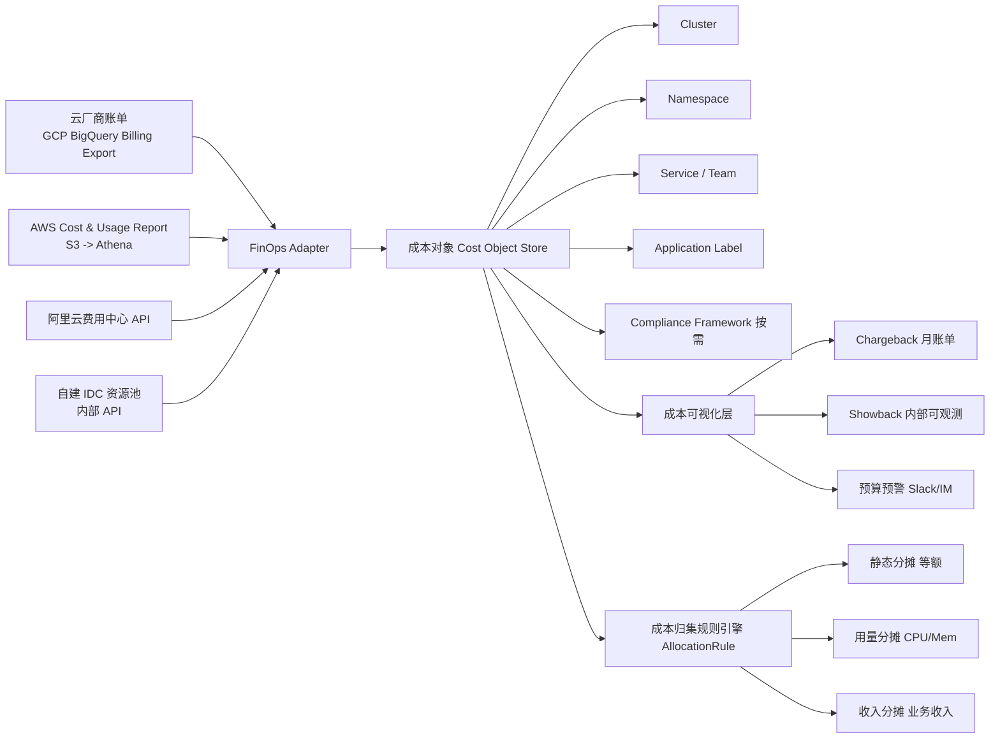
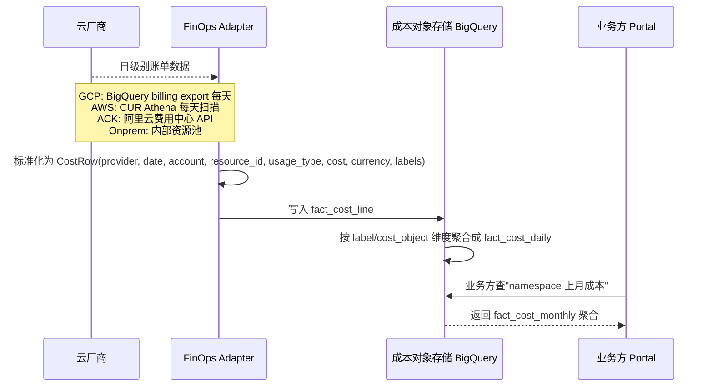
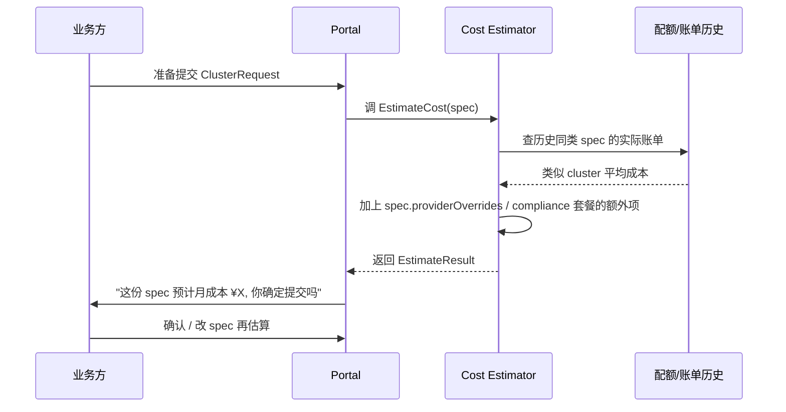

# FinOps & 成本归集:让业务方"看得见、算得清、付得起"

# 问题分析

`gke-caas.md` 里 `costLabel` 字段只解决了一个最小问题:**"资源上打个标签"**——但离真正的 FinOps 还差得远。

四朵云的计费模型是**天差地别**的:

| 云       | 主要按什么计费                            | 第二维度                  | 第三维度            |
| -------- | ----------------------------------- | --------------------- | ---------------- |
| **GCP** | Pod 资源(Autopilot)+ 节点组(Standard)    | 静态 IP / LB / CDN     | 网络 egress 流量    |
| **AWS**  | EC2 实例(按时按规格)+ EBS 卷                  | ALB/NLB 时费 + LCU     | NAT gateway + 数据传输 |
| **阿里云** | ECS 实例规格                               | SLB 实例费 + 公网带宽(包年/按量) | 快照 + NAT 网关 |
| **自建**   | IDC 机柜折算 + 共享存储                        | IP/带宽配额分配             | 间接运维人力成本     |

如果业务方拿着这些账单直接"对比哪个云便宜",**结论几乎一定错误**——因为它们计费维度不同。

CaaS 要做的,不是把账单"统一",而是把**成本对象**(Cost Object)抽象出来,让业务方看到的是"这个集群/这个 namespace/这个服务的真实月成本",而不是一堆"实例规格 × 时长 × 单价"的明细。

本文聚焦五块:

1. **成本对象 & 拆分维度**
2. **账单数据回流链路**
3. **分摊规则(Recharge / Showback)**
4. **成本可视化与告警**
5. **CaaS 的成本预演**(创建前 → 模拟成本)

---

# 解决方案

## 一、 成本对象的统一抽象



**Cost Object 层级**(从粗到细):

| 层    | 例                                  | 谁关注        |
| ---- | ---------------------------------- | ---------- |
| L0 云 | `provider=gcp, region=asia-east1` | FinOps 团队  |
| L1 集群 | `cluster=bbuk-team-a-prod`         | 平台团队       |
| L2 命名空间 | `namespace=team-a/checkout`        | 租户管理员      |
| L3 服务  | `service=checkout-api`              | 应用 owner   |
| L4 工作负载 | `deployment=checkout-api-v123`      | 研发         |

**关键设计**:**L1 的成本拆分规则在 CaaS 创建时确定**,可以批量调整但不能临时改;L2-L4 通过标签自动跟。业务方看到的是"我这个 namespace 上个月花了多少钱",**CaaS 负责把 L0 + L1 的明细算出"namespace 维度"**。

## 二、账单数据回流链路



**标准化 CostRow schema**:

```json
{
  "provider": "gcp",
  "account": "gcp-prod-1234",
  "region": "asia-east1",
  "service": "compute.googleapis.com",
  "resource_id": "projects/prod/zones/asia-east1-a/instances/gke-bbuk-pool-1-abc",
  "usage_start": "2026-09-27T00:00:00Z",
  "usage_end": "2026-09-28T00:00:00Z",
  "usage_qty": 24.0,
  "usage_unit": "hour",
  "unblended_cost": 0.756,
  "currency": "USD",
  "labels": {
    "cluster": "bbuk-team-a-prod",
    "namespace": "checkout",
    "team": "team-a",
    "managed-by": "caas",
    "cost-center": "cc-789"
  }
}
```

> **关键纪律**:GCP BigQuery Billing Export / AWS CUR 都会带原生 label,但**CaaS 必须有 second-pass 重新打标**——因为有些云"原生 label 不允许修改"或"某些附加产品(如 EBS)不会带 label",而**业务方按业务维度(团队/squad)看的成本,必须二次归集**。

## 三、分摊规则(AllocationRule)

| 规则        | 公式                            | 适合场景                |
| --------- | ----------------------------- | ------------------- |
| **static**    | L1 → L2 等分                  | 小规模团队,成本近似均匀       |
| **usage-based** | 按 namespace 的 `metrics-server` 报告的 CPU/Mem 用量加权  | 大多数场景默认            |
| **revenue-based** | 按业务方季度营收比例分摊             | 中台平台,业务线不同营收量     |
| **custom**    | 业务方在上报成本时声明公式              | 特殊场景(共享中间件、数据湖) |

**AllocationRule 在 CaaS 的位置**:**`ClusterSpec.costAllocation`**,创建时确定,后续如需变更要走 `spec.costAllocationPatch` 临时 patch(双签审批)。

```yaml
spec:
  costAllocation:
    rule: usage-based
    source:
      metricsServerEnabled: true   # CaaS 默认开启,以便能采集到 vCPU/Mem
      timeBucket: monthly          # 也可以 weekly / daily
    rebillTargets:
      - kind: namespace
        selector: "team-a/*"      # 受影响的 namespace
        invoicingEmail: "team-a-finance@company.com"
    overrides:
      - namespace: "shared-platform"
        rule: revenue-based        # 中间件平台按业务方营收比例分摊
```

> **简化的口径**:"为什么 8 月底成本突然翻倍了" —— 用 **usage-based** 时,业务方自助排查;用 **static** 时,必须重新检查 bill 上的 label 应用过程,排查口径不一致。

## 四、成本可视化与告警

**三档告警阈值**(CaaS 默认):

| 阈值       | 行为                | 触发时通知          |
| ------- | ----------------- | ------------- |
| **80% 预算**  | 仅 Slack 通知(软提醒)  | 业务方 owner    |
| **100% 预算** | IM 通知 + 月底冻结新资源部署 | 业务方 owner + 财务 |
| **130% 预算** | 自动 Anomaly Detection 推送 + 暂停超额创建 | 业务方 owner + FinOps 团队 |

> **预算粒度** = `CostBudget` CRD,可以针对 Cluster / Namespace / Team / Compliance Framework 四个层级分别设置,实现"我这个集群本月 5 万美元"。**硬性限制 vs 软性提醒** 默认是软,需要业务方主动切到 hard limit(同样双签审批)。

## 五、CaaS 的成本预演(**创建前的月成本估算**)



**估算的输入和输出**:

```yaml
# EstimateResult
{
  "estimated_monthly_cost": 1234.56,
  "currency": "USD",
  "breakdown": [
    { "category": "compute", "amount": 800, "basis": "autopilot 3 replicas × 2 vCPU × 4GB"},
    { "category": "lb",      "amount":  20, "basis": "1 L7 LB + TLS 终止" },
    { "category": "logging", "amount": 380, "basis": "预计日志量 5GB/day" },
    { "category": "compliance_overhead", "amount": 34.56, "basis": "pci-dss 套餐附加" }
  ],
  "confidence": "medium",
  "based_on": "from_3_similar_clusters"
}
```

> **设计纪律**:**预演必须是 Portal 上的默认体验,不是"高级功能"**——业务方不动手估算,就给云上"开了才知贵",这一步严重挫伤 CaaS 信任度。

---

# 代码示例

## 1. CaaS Controller 在 Provisioning 后启动 CostReporter

```go
// 在 reconcileProvisioning 完成 Terraform Apply 后调用
func (r *ClusterRequestReconciler) applyFinOpsHooks(ctx context.Context, cr *caasv1.ClusterRequest) error {
    // 1. 部署 cost-reporter(集群内部的 DaemonSet / Sidecar,收集 vCPU/Mem 用量上报)
    //    选 DaemonSet 还是单 Pod:DaemonSet 拿节点级 metrics 更准确
    if err := r.costReporter.Deploy(ctx, cr); err != nil {
        return fmt.Errorf("部署 cost-reporter 失败: %w", err)
    }
    // 2. 注册账单路由规则:告诉 FinOps Adapter 这个集群的 AllocationRule
    if err := r.allocationRule.Publish(ctx, &caasv1.AllocationRule{
        ClusterID:     cr.Status.ClusterID,
        Provider:      cr.Spec.CloudProvider,
        Rule:          cr.Spec.CostAllocation.Rule,
        Team:          cr.Spec.MultiTenancy.Teams,
        RebillTargets: cr.Spec.CostAllocation.RebillTargets,
    }); err != nil {
        return fmt.Errorf("发布 allocation rule 失败: %w", err)
    }
    // 3. 注册预算告警阈值
    if err := r.budgetWatch.Create(ctx, &caasv1.CostBudget{
        Name:           cr.Name,
        MonthlyBudget:  cr.Spec.CostAllocation.MonthlyBudget,
        Thresholds:     []int{80, 100, 130},   // 三档
        Hold:           cr.Spec.CostAllocation.HardLimit,
    }); err != nil {
        return fmt.Errorf("创建 budget 失败: %w", err)
    }
    return nil
}
```

## 2. FinOps Adapter 标准化账单提取(GCP BigQuery 例子)

```sql
-- finops-views/fact_cost_line.sql
-- 以 GCP 为例,其它云类比改写
SELECT
  -- 标准化字段
  'gcp'                                              AS provider,
  project.name                                       AS account,
  location.region                                    AS region,
  service.description                                AS service,
  resource.name                                      AS resource_id,
  usage_start_time                                   AS usage_start,
  usage_end_time                                     AS usage_end,
  usage.amount                                       AS usage_qty,
  usage.unit                                         AS usage_unit,
  cost                                               AS unblended_cost,
  'USD'                                              AS currency,
  -- label 是 string->keyvalue 的 KV 数组,要 flatten
  STRUCT(
    (SELECT value FROM UNNEST(labels) WHERE key = 'cluster')    AS cluster,
    (SELECT value FROM UNNEST(labels) WHERE key = 'namespace')  AS namespace,
    (SELECT value FROM UNNEST(labels) WHERE key = 'team')       AS team,
    (SELECT value FROM UNNEST(labels) WHERE key = 'managed-by') AS managed_by,
    (SELECT value FROM UNNEST(labels) WHERE key = 'cost-center') AS cost_center
  ) AS labels
FROM
  `billing-export.gcp_billing_export_v1_xxxx.BQYYYYYYMMYYYYMMDD`
WHERE
  -- 过滤掉原生 label 不全的资源(GKE Pod billing 通常没有 namespace label)
  -- 业务标签"必须存在 managed-by=caas"才归入我们的成本对象
  EXISTS(SELECT 1 FROM UNNEST(labels) WHERE key = 'managed-by' AND value = 'caas')
```

> **关键点**:**所有被 CaaS 管理的资源必须有 `managed-by=caas` 标签**,这是 FinOps 识别"应该纳入统一视图"的资源唯一标识。**Controller 在创建 GKE/EKS/ACK 时**就要保证这个标签被带上——Terraform 模板 `labels = { managed-by = "caas" }`。

## 3. CostBudget CRD 定义

```yaml
apiVersion: apiextensions.k8s.io/v1
kind: CustomResourceDefinition
metadata:
  name: costbudgets.caas.internal
spec:
  group: caas.internal
  scope: Cluster
  names:
    plural: costbudgets
    kind: CostBudget
    shortNames: ["cb"]
  versions:
    - name: v1
      served: true
      storage: true
      subresources:
        status: {}
      schema:
        openAPIV3Schema:
          type: object
          required: ["spec"]
          properties:
            spec:
              type: object
              required: ["scope", "monthlyBudget", "currency"]
              properties:
                scope:
                  type: object
                  oneOf:
                    - required: ["clusterRef"]     # 或必填 teamRef / namespaceSelector
                      properties:
                        clusterRef: { type: string }
                        teamRef:    { type: string }
                        namespaceSelector: { type: string }
                monthlyBudget: { type: number, minimum: 0 }
                currency:
                  type: string
                  enum: ["USD", "CNY", "EUR"]
                thresholds:
                  type: array
                  items:
                    type: integer
                    minimum: 1
                    maximum: 200
                  default: [80, 100, 130]
                hold:
                  type: boolean
                  description: "硬性:超 100% 是否冻结该 scope 内的新资源创建"
                  default: false
                notification:
                  type: object
                  properties:
                    slackChannel:  { type: string }
                    email:         { type: string, pattern: "^.+@.+$" }
            status:
              type: object
              properties:
                currentSpend: { type: number }
                firedThresholds:
                  type: array
                  items: { type: integer }
                lastUpdated: { type: string, format: date-time }
```

## 4. Portal 的成本预演 API

```typescript
// cost-estimator.ts
interface EstimateRequest {
  spec: ClusterRequestSpec  // 同 ClusterSpec
}

interface EstimateResult {
  monthlyCost: number
  currency: string
  confidence: 'high' | 'medium' | 'low'
  breakdown: CostLine[]
  rationale: string  // 为什么这么估
}

async function estimate(req: EstimateRequest): Promise<EstimateResult> {
  // 1. 找历史上相似的集群:同 provider + region + tier + 团队规模
  const similarClusters = await finopsStore.findSimilar(req.spec, limit: 5)

  // 2. 取它们最近 30 天的实际账单作为 baseline
  const baseline = similarClusters.length > 0
    ? avg(similarClusters.map(c => c.monthlyCost))
    : defaultEstimateFor(req.spec.cloudProvider, req.spec.tier)

  // 3. 在 baseline 上叠加 spec 特有项:compliance 套餐/网络/LB
  const items: CostLine[] = [
    ...breakdownBaseline(baseline, similarClusters),
    ...complianceOverhead(req.spec.compliance),
    ...networkOverhead(req.spec.network),
    ...gatewayShardOverhead(req.spec.gatewayStrategy),
  ]

  return {
    monthlyCost: sum(items),
    currency: req.spec.currencyHint || 'USD',
    confidence: similarClusters.length >= 3 ? 'high' : (similarClusters.length >= 1 ? 'medium' : 'low'),
    breakdown: items,
    rationale: similarClusters.length >= 3
      ? `基于 ${similarClusters.length} 个相似集群近 30 天均值`
      : '无相似历史,采用云厂商公开单价估算',
  }
}
```

---

# 注意事项

1. **成本归集的最大盲区是"未带标签的资源"**:GCP 原生 label 不能用于所有资源类型(EBS、Cloud SQL 数据传输常常没有 namespace label),**CaaS 必须有 daily reconciliation job**,发现"managed-by=caas 但缺少 namespace label"的资源,**自动找回并重新打标**。
2. **不要相信云厂商的"成本估算器"直接给出的报价**:它不知道你的合规策略、不知道你的 PV 备份策略、不知道你的日志量。**CaaS 自建的 Estimator 才能给业务方"接近真实的月成本"**。
3. **硬性 hold(Hard Limit)慎开**:开了就意味着超预算时新 Deployment 被 reject,**建议和 80% 软提醒 + 100% 通知并行,先用半年软提醒再决定是否 hard hold**。
4. **跨币种归集要明确汇率基准日**:今日 1 USD = 7.2 CNY,明日 1 USD = 7.1 CNY,**统一用月初汇率 baseline**,避免汇率波动导致业务方月底对账争议。
5. **自建 K8S 的成本数据往往是"近似值"**:IDC 折算按"整机柜月租金 ÷ 64 核"得出,**业务方看到自建 cluster 便宜 30% 是幻觉**,CaaS 需要披露"折算假设"避免误解。
6. **Showback 优先,Chargeback 谨慎**:先做"看得到"("这是你这个团队的成本"),再考虑"真扣钱"(chargeback 涉及跨部门结算、合规、税务,每一步都是组织/流程问题而非技术问题)。
