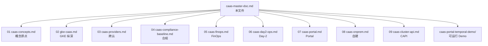

# CaaS Master Doc — TL;DR + 决策树

> **面向读者**:想把 CaaS 一句话讲清楚的领导 / 客户 / 合作方 / 一个月后想回顾架构决策的自己
>
> **读完这篇你能得到的三件事**:
> 1. CaaS 是什么、不是什么(2 句话)
> 2. 我们 8 个核心决策点上选了"什么"+"为什么"
> 3. 想深入任何一个点,从哪条目录切进去

---

## 1. 一句话定义

**CaaS(Cluster-as-a-Service)** = 把"创建一个生产级 Kubernetes 集群"沉淀为**自助式产品能力**,让业务方不再手工对接 GCP Console / 阿里云控制台 / 内部运维流程,而是通过统一 Portal 提交申请 → 自动经过合规/成本/技术校验 → 自动跨云创建 → 自动注入合规/可观测/FinOps 基线。

**不是什么**:

- ❌ 不是"K8S 的更高级 kubectl"(它是产品层,不是调度层)
- ❌ 不是"Terraform 套壳"(它在 Terraform 之上加了产品/治理/财务三个层)
- ❌ 不替代 Kubernetes / Cluster API(它建在它们之上)

---

## 2. 8 个核心决策点(读完这一节就够了)

| # | 决策点                                                | 选择                                                                                       | 替代方案(及为什么不选)                                                                                          |
| -- | ----------------------------------------------------------- | -------------------------------------------------------------------------------------------- | ----------------------------------------------------------------------------------------------------------------- |
| 1  | 多云策略                                                 | **80% 统一 + 20% 逃逸舱口**(`providerOverrides`)                                          | (a) 全量统一抽象 — 阿里云与 GCP/AWS 差异过大,会变四不像; (b) 不统一 — 业务方找错人就领错账单                          |
| 2  | 主要开发/部署模式                               | **自研 CaaS Controller + Cluster API 作为底层**(路径 X)                                | (a) 纯自研 — 把"每个云 Provider 的脏活"自己维护; (b) 直接采用 Rancher/OpenShift — 不能承载你们的业务字段,等于锁死       |
| 3  | 集群基线(multiTenancy)                              | **团队级共享 + Namespace 隔离为主,Standard 逃逸舱口用于强隔离**                                  | (a) 全独立集群 — 你刚处理的 ~1000 API 迁移告诉你这是成本黑洞; (b) 全共享 + 软隔离 — 出问题时找不出责任方            |
| 4  | 网关配额治理                                          | **Day-0 强制分片**:`gatewayStrategy.initialShards` 是 ClusterRequest 必填字段                          | (a) 遇到再扩 — 你已有的 URL Map size limit 阻塞,已经证明"事后补" 失败                                              |
| 5  | 合规基线                                              | **Day-0 强制注入 + Kyverno 模板库分版本,豁免走双签而非 Ad-hoc 关掉策略**               | (a) 业务上线后插控 — 会被业务方"先上线再说合规"绑架; (b) 用 OPA Gatekeeper 全覆盖 — 没必要的复杂度                  |
| 6  | FinOps 模型                                         | **创建前预演 + 创建后 Showback + 先软提醒后硬 Hold**(不要一上来 hard limit)                       | (a) Chargeback 直接扣钱 — 跨部门结算会拖垮 CaaS; (b) 不做 — 没人控制成本,平台被嫌弃                                          |
| 7  | 自助门户 / 审批引擎                              | **Schema 驱动表单 + Temporal 工作流引擎**(`caas-portal.md`)                                       | (a) K8S Controller 写审批流 — 写 Workflow saga 会很别扭; (b) 用现有 OA — 业务字段表达力不够                         |
| 8  | 自建 K8S 接入                                              | **治理层而非交付层**:`ClusterRegistration` 而非 `ClusterRequest`,Kyverno Audit 而非 Enforce            | (a) 强行套 `ClusterRequest` — 会写出"空白缺字段"的资源; (b) 等着整改 — 自建集群改一遍要一年                                      |

---

## 3. 能力地图(自上而下,9 份文档的结构)

```
产品层(07 caas-portal.md)                  ← 业务方看到的第一面
   │
   ├── 决策编排层(本文件 §2 8 个决策点)
   │
业务逻辑层(03/04/05/06/07/08)              ← 跨云适配、合规、FinOps、Day-2、Portal、自建治理
   │
基础设施层(02 gke-caas.md + 09 caas-cluster-api.md)  ← CRD/Controller + Cluster API
   │
外部依赖(Velero / cert-manager / Kyverno / Kyverno 策略库 / FinOps Adapter)
```

| 层        | 文档                                                       | 它解决什么                                                                  |
| --------- | ---------------------------------------------------------- | ------------------------------------------------------------------------- |
| 产品层     | `caas-portal.md`                                           | "申请一个集群要花多少时间" / "我现在的工单到哪一步了"                        |
| 决策层     | 本文件                                                      | "我们要走哪条路"                                                              |
| 业务逻辑层 | `caas-providers.md` / `caas-compliance-baseline.md` / `caas-finops.md` / `caas-day2-ops.md` / `caas-onprem.md` | "每个能力维度怎么统一 + 怎么留逃逸舱口"                                    |
| 基础设施层 | `gke-caas.md` / `caas-cluster-api.md`                       | "技术怎么落地,谁替代什么"                                                  |
| 概念原点   | `caas-concepts.md`                                          | "CaaS 一开始是什么"                                                          |

---

## 4. 阅读路径(4 种典型读者)

### 给领导 / 合作方(2 分钟)

> 只看本文件的 §1 + §2。你拿走的是 8 个决策点 + 一个推荐路径,不带走任何概念负担。

### 给架构师 / 平台 SRE Lead(15 分钟)

> 本文件 §2 → `caas-concepts.md` → `caas-providers.md` → `caas-cluster-api.md`。
> 重点卡在"我同意哪些决策、不同意哪些"。

### 给业务方 Owner(5 分钟)

> 本文件 §1 → `caas-portal.md`(了解 Portal 长什么样)。
> 不需要看其他。

### 给接手 CaaS 实现的研发(半天)

> 全部 9 份顺序读完:`00-index.md` → `01/02/03/04/05/06/07/08/09`。
> 然后 `caas-portal-temporal-demo/`(可运行 demo,见 §5)。

---

## 5. 可运行 Demo

| Demo                              | 位置                                       | 它能跑什么                                                   |
| --------------------------------- | ------------------------------------------ | ------------------------------------------------------------ |
| **ClusterRequest / Controller / 自动分片迁移** | 暂未提供(纯设计阶段)                                  | —                                                            |
| **Portal 审批流(Temporal + FastAPI)** | [`caas-portal-temporal-demo/`](./caas-portal-temporal-demo/)                | 提交申请 → leader 审批 → SRE 终审 → K8S API 触发 → 状态可视化 |

Portal 那个 Demo 是今天能跑的最小可执行件:提交申请 → 走 Temporal workflow → 通过审批后模拟 K8S 端 Controller 接收,展示完整状态流转。一条命令起:`cd caas-portal-temporal-demo && docker compose up -d --build`,然后 `http://localhost:8080`。具体步骤见 [`caas-portal-temporal-demo/docs/walkthrough.md`](./caas-portal-temporal-demo/docs/walkthrough.md)。

---

## 6. 三条绝对不要做的事

| ❌ 不要做                                                   | 后果                                                |
| ----------------------------------------------------------- | ------------------------------------------------- |
| **不要做"四朵云完全统一的适配层"**                                | 自研 80% 时间写 eviter/转换器,业务方"对哪个云的封装都不满意"        |
| **不要"自研审批流不进 Temporal/K8S Controller 之外的工具"**             | 写审批流+ retry+ 超时 + 跨子系统持久化,半年内必崩             |
| **不要相信云厂商计费页数字**                                  | 不知你合规、不知你日志量、不知你备份,**CaaS 自建的 estimator 才能给出"接近真实"的月成本** |

---

## 7. 9 份文档与本文件的引用关系



---

## 8. 修订记录

| 日期         | 修改内容                                                            |
| ---------- | --------------------------------------------------------------- |
| 2026-09-28 | 初版,基于前 9 份文档提炼                                              |
