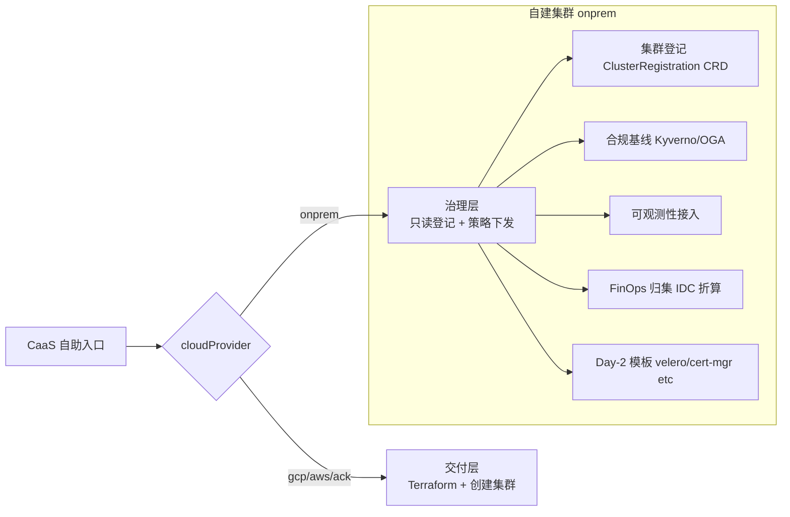
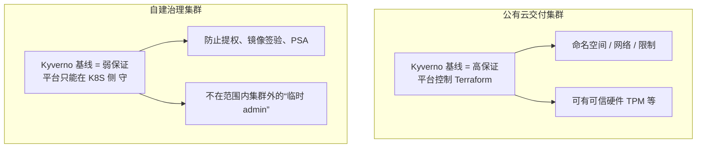
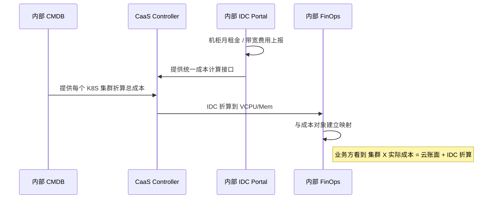

# 自建 K8S 的"轻量治理模式":不是交付,是治理

# 问题分析

`caas-providers.md` 的 §四 提到过一句:"CaaS 在自建场景下基本退化为'准入 + 模板下发'";`gke-caas.md` 的 CRD 用 `enum: ["gcp", "aws", "aliyun", "onprem"]` 把自建也当成一种云——但**真正落地时,自建 K8S 的"集群生命周期"和公有云完全不同**,强行套同一个抽象层会出问题。

自建 K8S 在企业内部往往是**"早已存在"** 的集群——它不是按需申请、不是几小时交付完的,而是:

- 早已经由"基础设施团队"用 `kubeadm` /  Rancher / 火山引擎 K8s / KubeSphere 部署好了
- 业务方在使用它,但**没有任何"申请"流程**(直接给 namespace / kubeconfig)
- 集群的存活周期常常 3-5 年甚至更长

——这意味着:CaaS 的"Day-0 创建"在自建场景里**基本无意义**,但"治理"反而更有价值。

本文聚焦自建 K8S 的几件事:

1. **"登记" 而不是 "创建"**:把已经存在的集群登记进 CaaS 治理范围
2. **治理基线与公有云不同**:自建集群无法约束"按云 API 创建"——业务方可以在你不知情时另开一份 YAML
3. **合规基线是核心交付物**:`(成本 + 合规 + 可观测性)` 三件套的自建版
4. **Day-2 的特殊性**:etcd 备份、网络、镜像仓库全都要业务方自己接,CaaS 必须有"接入模板"

---

# 解决方案

## 一、 自建 K8S 的定位:CaaS 治理层而非交付层



**关键架构差异**:云厂商的 controller 写"创建集群",自建的 controller 写"承认 + 治理"集群。`ClusterRequest` 在自建场景下其实是个 **"ClusterRegistration"**(登记),不是"创建请求"。

**两种模式在同一 CaaS 内的共存**:

| 模式        | 触发                           | 用户流程                                  | Controller 动作                              |
| --------- | ---------------------------- | ------------------------------------- | ------------------------------------------- |
| **交付模式** | `cloudProvider ∈ {gcp,aws,ack}` | 填 spec → 审批 → Terraform 创建             | 驱动云 API 创建,然后注入基线                          |
| **治理模式** | `cloudProvider = onprem`       | 选已有集群 + 提交登记 → 治理               | 调外部登记 API(如果基础设施有)+ 注入合规/可观测/FinOps     |

## 二、 ClusterRegistration 与 ClusterRequest 的差异

```yaml
# 与 caas-providers.md / gke-caas.md 里的 ClusterRequest 主要差异在 spec
# 1. 必填字段大幅减少(没有 region/tier/网络模式等)
# 2. 加 "现有集群信息" 一栏
# 3. status 多一个 onboarding 阶段

apiVersion: caas.internal/v1
kind: ClusterRegistration
metadata:
  name: corp-idc-bj-cluster-a
spec:
  cloudProvider: onprem
  # 没有 region/tier/network,是自建场景下的硬约束
  existingCluster:
    apiEndpoint: "https://10.20.30.40:6443"
    caBundleSecretRef: "corp-idc-bj-cluster-a-ca"
    nodeCount: 120
    kubeletVersion: "v1.28.5"
    cni: "cilium"
    authProvider: "oidc-keycloak"   # 身份提供方
  onPremDetails:
    dataCenterLocation: "cn-bj"
    tenant: "internal-platform-team"
    upstream:
      bootstrappedBy: "kubeadm-1.28-internal"
      infrastructureRef: "corp-k8s-platform/v1.2"
  # --- 以下是 CaaS 治理基线,与云场景对齐 ---
  compliance:
    frameworks: ["baseline"]   # 自建默认只给 baseline,pci/pip 需另审
  costAllocation:
    rule: usage-based
    # 没有 Hourly/Monthly 单价(自建没有云厂商账单)
    # 用"折算公式": vCPU-hour = self-host-unit-cost / 64(由 IDC 给出)
    idcRechargeFormula:
      type: "ratio-per-vcpu"
      denominator: 64
      currency: "CNY"
  observability:
    monitoringEnabled: true
    # 推到哪里,与云不同
    sinks:
      logs:   "self-hosted-loki-cluster-bj"
      metrics: "self-hosted-prometheus-bj"
      traces: "self-hosted-tempo-bj"
  sla:
    target: "99.95"
    drStrategy: "warm-standby-bj-sh"
status:
  phase: "Onboarding"   # Onboarding -> Established -> Retiring
  observedGeneration: 1
  onboarding:
    baselineApplied: true
    monitoringConnected: true
    costIngestionReady: false   # 还有 IDC 折算表未拉
  conditions:
    - type: "ProviderAdapterReachable"
      status: "True"
      reason: "ClusterEndpointVerified"
    - type: "FinOpsReady"
      status: "False"
      reason: "WaitingForIDCFormulaUpload"
```

**Phase enum 自建场景下的扩展**:

| Phase          | 含义                              |
| -------------- | ------------------------------- |
| `Onboarding`   | 申请登记中,基线 / 可观测 / 成本接入可能未完成   |
| `Established`  | 已全部接入,纳入 CaaS 治理视图                |
| `Retiring`     | 业务逐步迁出,集群保留为只读,接受销毁              |
| `Decommissioned` | 已经销毁 / 完全退出治理                 |

## 三、 治理基线 vs 交付基线:差异在哪?



**自建 K8S 的几条客观限制**(决定 CaaS 治理基线的强度上限):

1. **平台无法阻止业务方拿 kubeconfig 提权**:CaaS Controller 没有集群外硬件根,而平台上的人**是外部用户,他们拥有集群 admin 密钥**,Kyverno 只能挡 P99,挡不了 P100
2. **网络控制不能"在 LB 上统一"**:自建没有统一 LB 层,业务方各自决定 LB / Ingress,只能在 NetworkPolicy 层兜底
3. **镜像仓库零控制**:业务方可以拉任意公开镜像(如果 admission webhook 没强制 imageRegistry 限制)
4. **集群版本漂移严重**:集群升级完全看运维习惯,**几乎不能保证基线版本一致**

→ **CaaS 在自建场景下能做到的是"善意合规"而非"强制合规"。文中起名:`advisory-hardening`(建议性加固)**

## 四、 IDC 成本折算与归集



**IDC 折算三大必备**:

1. **资源池基准价**(由 IDC 给出): 每核 CPU/月、每 GB 内存/月、每 TB 存储/月、每 Gbps 带宽/月
2. **集群资源池配额**:`cluster.name -> quota.vCPU, quota.mem, quota.bandwidth`
3. **成本归集映射**: 业务方在自己 namespace 部署了多少 vCPU → 月成本 = `vCPU × 单价 × 24 × 30`

**FinOps 必须披露"折算假设"**:`monthlyCost: ¥21500 (含 IDC 折算 vCPU=¥45/月/核,EBS=¥0.8/GB/月,IDC 折算公式 v1.2)`

## 五、 与 Cluster API 的协同(治理模式的自建 = CAPI 友好的入口)

自建场景下,**Cluster API 本来就是为了"用 K8S 表达 K8S"** 而生——但你提到的不是 CAPI"创建集群",而是 CAPI **"被 CaaS 用来登记、治理、Day-2"**:

- 每个自建集群在 CAPI 模型下变成了 `Cluster` CRD(已经有 K8S 官方/社区资源)
- CaaS 可以"用 CAPI 的 `Cluster` 资源"作为 "已登记" 的来源,**而不是自己再发明一个 `ClusterRegistration` CRD**
- Day-2 操作(升级、备份)在 CAPI 生态里都有现成的 `MachineDeployment`、Strimzi/Kubedb 之类可以套

但**Rancher / KubeSphere / 火山 K8s 这种基于 UI/Operator 的"自建" 派系**,通常不能直接被 CAPI 表达,**这时候仍需要 `ClusterRegistration`** 把这件事"桥接"出去。

见 [caas-cluster-api.md](./caas-cluster-api.md),本文不展开 CAPI。

---

# 代码示例

## 1. ClusterRegistration CRD(节选)

```yaml
apiVersion: apiextensions.k8s.io/v1
kind: CustomResourceDefinition
metadata:
  name: clusterregistrations.caas.internal
spec:
  group: caas.internal
  scope: Cluster
  names:
    plural: clusterregistrations
    kind: ClusterRegistration
    shortNames: ["crreg"]
  versions:
    - name: v1
      served: true
      storage: true
      subresources:
        status: {}
      additionalPrinterColumns:
        - name: Provider
          type: string
          jsonPath: .spec.cloudProvider
        - name: Phase
          type: string
          jsonPath: .status.phase
        - name: Cluster
          type: string
          jsonPath: .spec.existingCluster.apiEndpoint
        - name: Age
          type: date
          jsonPath: .metadata.creationTimestamp
      schema:
        openAPIV3Schema:
          type: object
          required: ["spec"]
          properties:
            spec:
              type: object
              required: ["cloudProvider", "existingCluster", "onPremDetails"]
              properties:
                cloudProvider:
                  type: string
                  enum: ["onprem"]   # 只允许这个值
                existingCluster:
                  type: object
                  required: ["apiEndpoint", "kubeletVersion", "cni", "nodeCount"]
                  properties:
                    apiEndpoint: { type: string, format: uri }
                    caBundleSecretRef: { type: string }
                    nodeCount: { type: integer, minimum: 1 }
                    kubeletVersion: { type: string }
                    cni:
                      type: string
                      enum: ["cilium", "calico", "flannel", "other"]
                    authProvider:
                      type: string
                      enum: ["oidc-keycloak", "oidc-okta", "x509"]
                # 合规/成本/可观测/SLA 字段同 ClusterRequest(spec.compliance 等)
                compliance: { /* 同 ClusterRequest */ }
                costAllocation: { /* 同 ClusterRequest */ }
                observability: { /* 同 ClusterRequest */ }
                sla: { /* 同 ClusterRequest */ }
```

## 2. Controller 入口差异(自建场景)

```go
// onpremAdapter 实现的入口 — 与 GCP/AWS/ACK 适配不同
// "Provision" 不是创建,而是 Onboard
func (a *onpremAdapter) Provision(ctx context.Context, spec *caasv1.ClusterSpec) (*ClusterStatus, error) {
    // 1. 校验可达性:是否能拿到这个集群的认证信息
    if err := a.authProvider.Verify(ctx, spec.ExistingCluster); err != nil {
        return nil, fmt.Errorf("认证失败,不能登记: %w", err)
    }

    // 2. 把这个集群登记进 CaaS 治理视图(k8s 中创建 ClusterRegistration,
    //    以及在内部 FinOps / CMDB 中建账)
    clusterID, err := a.cmdb.Register(ctx, spec)
    if err != nil {
        return nil, fmt.Errorf("CMDB 登记失败: %w", err)
    }

    // 3. "baseline injection" 含义不同:不是注入 Kyverno,
    //    而是把 Kyverno 部署进这个集群里(如果还没部署)
    if err := a.baselineInjector.InstallKyverno(ctx, clusterID, spec); err != nil {
        return nil, fmt.Errorf("基线安装失败: %w", err)
    }

    return &ClusterStatus{
        ClusterID:      clusterID,
        OnboardingPlan: []OnboardingStep{
            {Name: "auth_verified", Done: true},
            {Name: "cmdb_registered", Done: true},
            {Name: "kyverno_installed", Done: true},
            {Name: "monitoring_connected", Done: spec.Observability.MonitoringEnabled},
        },
    }, nil
}
```

> **关键**:云厂商的 `Provision` 是一气呵成 (云 API 创建 + 配置注入 + 验收),自建的 `Onboarding` **是 list of steps**——可能某天 step 4 失败,你需要 platform team 介入。这意味着 controller 必然要支持 **"逐步重试" + "半状态" 感知**。

## 3. 自建 Kyverno 策略(弱保证版)

```yaml
# policies/onprem/advisory-privileged-pod-warning.yaml
apiVersion: kyverno.io/v1
kind: ClusterPolicy
metadata:
  name: onprem-advisory-privileged-pod-warn
  annotations:
    policies.kyverno.io/title: "特权 Pod 警告(自建场景:审计模式)"
    compliance.company.io/frameworks: "baseline-onprem"
spec:
  validationFailureAction: Audit     # ⚠️ 注意:不是 Enforce,只是审计
  rules:
    - name: warn-privileged
      match:
        any:
          - resources:
              kinds: ["Pod"]
      validate:
        message: "[ADVISORY] 特权 Pod 应当走 break-glass 流程(见 portal://break-glass)"
        pattern:
          spec:
            =(securityContext):
              =(privileged): "true"
              X(privileged): "false"  # 强制 privileged: false 才"通过"
        anyPattern:
          - spec:
              containers:
                - securityContext:
                    privileged: "false"   # 期望的
```

> **审计 vs 阻断**:自建场景下 Kyverno 只能审计不能阻断。原因:基础设施 team 可能临时需要 privileged pod 做维护,**硬阻断会导致核心运维动作做不了**。这是自建 K8S 与公有云的"硬差异"——该妥协的地方妥协。

## 4. IDC 折算 FinOps View

```sql
-- finops-views/onprem_cluster_cost.sql
-- 输入:CMDB 给的集群总成本 + 集群内 namespace 资源用量
SELECT
  cluster.name,
  namespace.name,
  -- 该 namespace 在该集群该月使用的 vCPU-hours
  SUM(namespace_usage.vcpu_hours) AS cluster_nm_vcpu_hours,
  cluster_total.vcpu_hours AS cluster_total_vcpu_hours,
  cluster_total.monthly_cost_cny,
  -- 按比例分摊
  cluster_nm_vcpu_hours / cluster_total.vcpu_hours *
    cluster_total.monthly_cost_cny              AS namespace_allocated_cost,
  -- 单位成本
  cluster_nm_vcpu_hours / NULLIF(cluster_total.vcpu_hours, 0) *
    cluster_total.monthly_cost_cny /
    NULLIF(cluster_total.cost_center_unweighted, 0) AS per_namespace_share
FROM
  fact_namespace_resource_usage AS namespace_usage
JOIN
  dim_namespace AS namespace USING(namespace_id)
JOIN
  dim_cluster AS cluster ON namespace_usage.cluster_id = cluster.cluster_id
JOIN
  -- 这是 CMDB 上报的 IDC 折算总成本
  fact_idc_monthly_cluster_cost AS cluster_total
  ON cluster.cluster_id = cluster_total.cluster_id
  AND namespace_usage.month = cluster_total.month
WHERE
  cluster.cloud_provider = 'onprem'
  AND cluster_total.month = DATE_TRUNC('month', CURRENT_DATE)
ORDER BY namespace_allocated_cost DESC
LIMIT 100;
```

## 5. break-glass 流程(自建场景特别)

```yaml
# caas-portal-and-onprem/break-glass.yaml
# 自建 K8S 没有"平台强凭证",break-glass 只能是"业务 owner+infra 双签后临时提权"
spec:
  breakGlass:
    requester: "engineer@company.com"
    justification: "DEBUG-PROD-12345 namespace X Pod Y 频繁 OOM,kubelet exec 进容器排查"
    requestedWindow:
      startAt: "2026-09-28T15:00:00Z"
      endAt:   "2026-09-28T18:00:00Z"   # 最长 3h,超时自动回收
    approversRequired:
      - role: "platform_sre_lead"
      - role: "security_on_call"
    actionsAllowed:
      - "kubectl-exec"                # 只允许 exec,不允许 apply
      - "kubectl-logs"
      - "kubectl-debug"
    autoRollback: true                # 时间窗到自动改回只读
    auditTrail:
      forwardToSIEM: true
      siemSystem: "splunk-on-prem"
```

---

# 注意事项

1. **不要硬套 ClusterRequest 的 "Day-0"**:自建场景下"集群已经存在",**硬套会让 controller 写一份无法执行的 Terraform, 字段全空**,Portal 体验差。
2. **Kyverno Audit 模式 与 Enforce 模式的临界**:Kyverno policy 的 `validationFailureAction` 在自建集群**大多用 Audit,而不是 Enforce**。这个**不丢的合规性**靠的是"事后审计 + 严重违规被发现后处理",不是"事前阻断"。
3. **IDC 折算要有"披露义务"**:业务方看到自己集群成本"比 GCP 便宜 30%"是错觉,**CaaS Portal 必须明显标记"该数字包含 IDC 折算 vCPU=¥X/月/核,假设条件见 ... "**。
4. **自建 K8S 的 Day-2 升级完全看"运维组织能力"**:CaaS 不能"强制"自建集群升级,只能在 Kyverno 里"提醒" + 在告警里"提示"。**这是物理上做不到的事,坦率告诉业务方即可**。
5. **平台团队与基础设施团队职责别混**:CaaS 平台 SRE 管 ClusterRequest、ClusterRegistration、策略下发;基础设施团队管 etcher、镜像仓库、备份存储;职责切分不清会导致互相推诿。
6. **自建集群的"未接管 namespace" 也是治理对象**:即使业务方没申请 CaaS,他们的 K8s 仍在那里跑。**CaaS 在自建场景下的 Open Question 是:要不要在 Kyverno 用 ClusterPolicy 对全局生效?** 回答应该是"对一部分基础 base 生效,比如 PSA/PVC 默认值 / 镜像白名单",其余留给业务方主动登记。
7. **共享存储 / 镜像仓库是自建 K8S Day-2 的最大坑**:CaaS 必须配套给出"内部 Harbor 申请流程",否则业务方都要拉 public image 到 registry,被 Kyverno `imageRegistry` 策略卡死。
