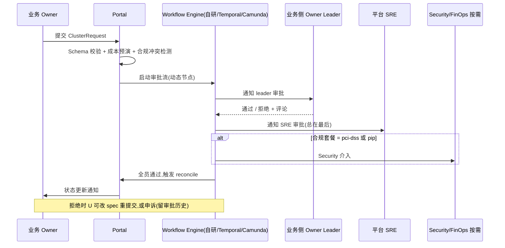
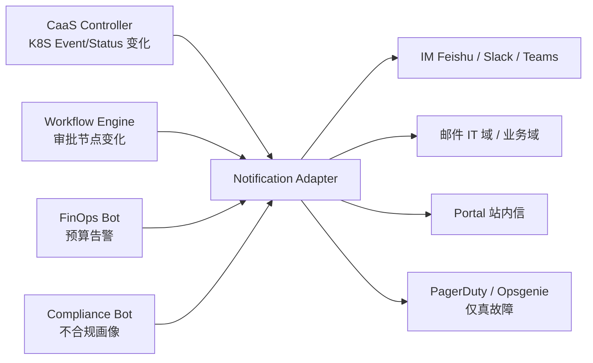
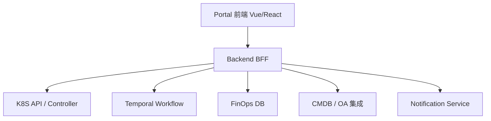

# CaaS 自助门户:把 CaaS 从"技术平台"做成"产品"

# 问题分析

`gke-caas.md` 把"提交 ClusterRequest YAML"作为入口——技术上看无可厚非,但**真正的业务方 owner 可能根本不会写 YAML**,也不愿意学 CRD 长什么样:

- 业务 owner 想要的是"页面填字段 + 点按钮"
- 业务 owner 关心的是"我的集群现在能不能用 / 什么时候能用 / 钱算到多少了"
- 业务方看不到 / 看不懂 status.conditions,只看到"等了 1 小时还没好,找谁?"

**CaaS 想要被采用,必须有一个"产品"层**。它和 K8S API / Controller 是上下层级关系:

- K8S API / Controller:面向"机器/平台工程师"——CRD 字段、`kubectl`、GitOps
- CaaS Portal:面向"业务 owner / 财务 / Security"——Web UI、审批流、IM 通知

如果不做这个产品层:

- CaaS 还是一种"内部工具",业务方继续找平台团队代申请集群,**降本增效的承诺无法兑现**
- 治理基线无法稳定生效——人工申请漏填字段就过关
- 跨团队沟通成本飙高——"我申请的集群到了没"成为 IM 高频问题

本文聚焦五个维度:Portal 的能力分层、审批流、通知体系、用户体验原则、以及 CaaS Portal 与 K8S API 的边界。

---

# 解决方案

## 一、 Portal 的能力分层

```mermaid
graph TD
    A[CaaS Portal Web UI] --> B[ClusterRequest 提交层]
    A --> C[Cluster 工单层 Day-0]
    A --> D[Cluster 工单层 Day-2]
    A --> E[FinOps & 资产层]
    A --> F[合规 & 治理层]
    A --> G[Admin / Config 层]
    B --> B1[YAML 表单生成]
    B --> B2[模板选择 多选卡]
    B --> B3[预演成本月估]
    B --> B4[合规套餐菜单]
    C --> C1[状态机可视化 Pending→Ready]
    C --> C2[创建过程可拖动查看]
    C --> C3[交付后巡检报告]
    D --> D1[升级申请 + canary]
    D --> D2[扩容审批]
    D --> D3[手动触发备份恢复]
    D --> D4[证书 / DR / 密钥轮换可观测]
    E --> E1[月账单图表]
    E --> E2[预算预警]
    E --> E3[费用拆分按 namespace]
    F --> F1[不合规告警画像]
    F --> F2[豁免工单列表]
    F --> F3[审计日志可查询]
    G --> G1[模板库版本发布]
    G --> G2[Adapter 状态监控]
    G --> G3[RBAC / 用户管理]
```



**对应四个角色**(同你在 `caas-day2-ops.md` §五 的组织分工):

| 角色          | Portal 看到的首页                                       | 关键操作                                              |
| ----------- | ------------------------------------------------- | ------------------------------------------------- |
| **业务 Owner** | "我的集群"+"成本钱包"+ 申请按钮                          | 申请集群、查状态、看月成本、申请变更                              |
| **平台 SRE**  | 待审批工单 + SLO 告警 + 全集群概览                       | 批核 / 执行 / 维护 runbook / break-glass              |
| **Security** | 全局合规画像 + 豁免工单 + 审计日志                          | 配置基线、审批豁免、追溯审计                                   |
| **FinOps**   | 全局成本告警 + 月账单复核 + 异常申请                          | 设置预算、追踪 Top-N 成本、复核成本归集规则                        |

## 二、 审批流(这是 Portal 的灵魂)



**审批流必须可配置**(每类申请、每种 spec 的审批路径不同):

| 申请类型                   | 必审批人                                                       | SLA         |
| ---------------------- | --------------------------------------------------------- | ----------- |
| 标准 dev 集群              | 团队 leader → 平台 SRE                                          | 4 工作小时      |
| 标准 prod 集群             | 团队 leader → 业务方 PM → 平台 SRE                                | 1 工作日       |
| 高 compliance (PCI)    | 团队 leader → 业务方 PM → Security lead → 平台 SRE(lead)         | 2 工作日       |
| 跨境 / 数据驻留约束变更         | 团队 leader → **法务** → DPO → Security lead → 平台 SRE             | 5 工作日 + 现场评审 |
| Provider 逃逸舱口启用       | 团队 leader → 平台架构师 → Security → 平台 SRE(lead)                | 3 工作日       |
| Day-2 升级 prod          | 团队 owner → 平台 SRE                                          | 24h + canary  |
| Day-2 DR 演练            | Security lead + 业务方 owner 双签                                | 1 工作日       |
| Break-glass 应急操作      | 平台 SRE 值守 + Security 24h 事后审计(预先设计无需事前批准,但事后必追查) | N/A(postmortem 必填) |

**实现方案选择**:

| 方案                      | 优点                                       | 缺点                                        | 适合                                  |
| ----------------------- | ---------------------------------------- | ----------------------------------------- | ----------------------------------- |
| **自研** (K8S CRD + Controller) | 与 CaaS Controller 高度集成;yaml 原生 | 写审批流、催办、超时、SLA 这些业务逻辑量大     | 小规模 / 简单流程(<10 节点)               |
| **Temporal**(workflow 引擎)   | 强一致性、retry、timeout 全自动支持;语言无关       | 自运维复杂度                                  | 中等规模 + 复杂审批流              |
| **Camunda / Flowable**     | BPMN 标准,非工程师也能改流程                    | 与 K8S 生态割裂;难统一身份                          | 企业级、跨部门审批                           |
| **对接现有 OA / 工单系统**(内部 OA)  | 用户已经在用,免培训;统一审计/留痕                   | 表达力可能不够;不能精准表达 K8S 状态机   | 已经有 OA、且审批流相对固定              |

**我的推荐**: **Temporal**。理由:

- 业务方提交-审批-回滚是天然 workflow
- 与 K8S Controller 解耦,SRE 改流程不动 K8S
- 长期可审计性强(saga 状态全留)

## 三、 通知体系(IM / 邮件 / 站内信)



**通知频次控制原则**:

- **事件触发型**(集群 Ready、合规违规、DR 漏做):实时推一次
- **状态摘要型**(今日新申请、本周 Day-2 进度):每日 / 每周聚合推送,**不每状态变化都通知**
- **故障告警型**(集群不可达、备份连续 3 天失败):推 PagerDuty,**不推 IM**(避免 IM 被刷屏导致真告警被淹没)

**典型通知模板**(举集群 Ready 为例):

```text
[集群交付完成] ✅ {clusterName} 已就绪
────────────────────────────────────
集群 ID:     caas://{provider}/{region}/{clusterName}
控制面地址:    {clusterEndpoint}
合规套餐:    {compliance.frameworks}
预计月成本:    ~¥{estimatedMonthlyCostCNY} (置信度 {confidence})
创建耗时:    {elapsedMinutes} 分钟(平均: {p50Minutes} 分钟)
────────────────────────────────────
点此进入 Portal: {portalUrl}
跳到 Runbook: {runbookUrl}
```

> **细节**:**通知中必带深度链接**(包括 Portal URL、Runbook URL、日志 query URL),业务方点开就能自助查到,**减少"找谁问"**。

## 四、 UX 原则(经验型,非定式)

1. **首屏必须看到"现在到哪一步"**:类似 SaaS 订单追踪"提交 → 审核 → 部署 → 完成"的可视化状态条,**业务方不需要懂 K8S 状态机**
2. **失败必须有"下一步动作"提示**:不要只说"QuataBlocked",说"配额不足,点击 [申请扩容] 或联系平台 SRE"
3. **成本永远是预演 → 确认 → 上线闭环**:不允许业务方"先创建后惊讶于账单"
4. **变更总是先"申请"后"执行"**:即使是平台 SRE 改 prod,也要 portal 上挂"变更单"(事后审计来源)
5. **不允许"工单漂在外面"**:每个工单都必须有 SLA / owner / 倒计时,超时自动升级到上一层审批人
6. **可观测性嵌入**:每个 Portal 页脚都有"出问题了?看这里"链接到 Status Page

## 五、 Portal 与 K8S API 的边界



**边界守则**:

- Portal **写操作** 唯一来源仍是 K8S API(CRD 写入),防止 portal 缓存与真状态脱节
- Portal **查询** 可以走 cached DB + K8S informer,**优先 DB 查询**(列表渲染快)
- Portal **身份** 走 OIDC(对接公司 SSO),与 K8S RBAC 解耦
- Portal 后端用 RBAC Proxy 把 K8S 凭证下放到"按租户"范围

---

# 代码示例

## 1. ClusterRequest 提交页面(Schema 驱动表单)

```typescript
// 注意:Schema 直接从 CRD 的 OpenAPI v3 Schema 生成,不是手写表单
// 优势:CRD 改了字段、Portal 自动跟随,无 schema 同步成本

// 用 react-jsonschema-form 风格示意
const clusterRequestForm = {
  schema: ClusterRequestCRD.spec,  // 从 K8S API 拉 CRD 自动生成
  uiSchema: {
    cloudProvider: {
      "ui:widget": "radio",       // 卡片式选择,4 朵云图标
    },
    region: {
      "ui:options": {
        // 选了 provider 之后,只显示合规套餐允许的 region
        enumOptions: dynamicRegionsFrom(selectedProvider, dataResidency)
      }
    },
    tier: {
      # ⚠️ C3 修复(2026-10-05):原为 "ui:widget": "select" +
      #   "ui:help": "默认 Autopilot,GPU/特殊节点选 Standard"。
      # tier 已 enum 锁死 ["standard"](./gke-caas.md),表单不再暴露该字段的选择权 ——
      # 让用户在 UI 里选一个后端会拒绝的值,是设计缺陷,不是灵活性。
      # 如需 Autopilot,走"新画像"申请路径,而非在现有下拉框里加选项。
      "ui:widget": "readonly",
      "ui:help": "集群模式由平台画像决定(DC 当前画像:Standard)"
    },
    compliance: {
      "ui:widget": "multiCheckbox",
      "ui:options": {
        // 按用户当前选择动态显示合规套餐
      }
    },
    costAllocation: {
      "ui:options": { "ui:order": ["rule", "monthlyBudget", "rebillTargets"] },
      "ui:hidden": false  // 默认显示,业务 owner 决定
    }
  },
  formData: { /* ... */ }
}
```

## 2. 审批流 Temporal workflow(Python 示意)

```python
# workflows/cluster_request_approval.py
from temporalio import workflow
from datetime import timedelta

@workflow.defn
class ClusterRequestApproval:
    @workflow.run
    async def run(self, request: ClusterRequestSpec) -> ApprovalResult:
        # 1. 自动合规 + 成本校验(零人工)
        await workflow.execute_activity(
            validate_compliance_and_cost,
            request,
            start_to_close_timeout=timedelta(minutes=2),
        )

        # 2. 团队 leader 审批
        leader_decision = await workflow.execute_activity(
            request_human_approval,
            ApprovalTask(
                request=request,
                approver_role="team_leader",
                sla_hours=2,
                channels=[Channel.feishu(channel_id=team_channel)],
            ),
            start_to_close_timeout=timedelta(hours=2),
        )
        if leader_decision != "approve":
            return ApprovalResult(rejected_by="team_leader")

        # 3. 业务 PM(只有 prod 才需要)
        if request.tier == "prod":
            pm_decision = await workflow.execute_activity(
                request_human_approval,
                ApprovalTask(
                    approver_role="pm",
                    sla_hours=8,
                ),
            )
            if pm_decision != "approve":
                return ApprovalResult(rejected_by="pm")

        # 4. Security 介入(条件分支)
        if request.compliance.frameworks.contains("pci-dss"):
            sec_decision = await workflow.execute_activity(
                request_human_approval,
                ApprovalTask(approver_role="security_lead", sla_hours=24),
            )
            if sec_decision != "approve":
                return ApprovalResult(rejected_by="security_lead")

        # 5. 平台 SRE 终审(总会这一步)
        await workflow.execute_activity(
            request_human_approval,
            ApprovalTask(approver_role="platform_sre", sla_hours=4),
        )

        # 6. 通过后,触发 K8S 端 apply
        await workflow.execute_activity(
            trigger_k8s_apply,
            request,
        )

        return ApprovalResult(approved=True)

    @workflow.query
    def current_state(self) -> dict:
        return {
            "stage": self.current_stage,
            "elapsed": workflow.now() - self.start_time,
            "approvers_seen": [a for a in self.approvers if a.decided]
        }
```

## 3. Status Page 实时状态机可视化(API 返回 schema)

```yaml
# /api/v1/clusterrequests/{name}/status-visualization
# 这是 Portal 渲染"创建进度条"的核心数据
{
  "requestName": "bbuk-team-a-prod",
  "currentPhase": "Provisioning",
  "phaseStartedAt": "2026-09-28T14:23:11Z",
  "elapsedMinutes": 14,
  "expectedTotalMinutes": 35,
  "stages": [
    {
      "key": "approval",
      "label": "审批流程",
      "state": "succeeded",
      "startedAt": "...", "endedAt": "...",
      "actors": ["team-leader@", "platform-sre@"]
    },
    {
      "key": "terraform",
      "label": "基础设施创建(Terraform)",
      "state": "running",
      "progress": 0.65,
      "subSteps": [
        { "key": "vpc-peering", "label": "VPC Peering", "state": "succeeded" },
        { "key": "gke-cluster", "label": "GKE 集群创建", "state": "running" },
        { "key": "private-endpoint", "label": "Private Endpoint 分配", "state": "pending" }
      ]
    },
    {
      "key": "policy-injection",
      "label": "合规基线注入",
      "state": "pending"
    },
    {
      "key": "ready",
      "label": "交付完成",
      "state": "pending"
    }
  ],
  "blockedReason": null,   # 若 state == blocked,这里显示原因
  "nextAction": "等待 GKE 集群就绪 (预计还需 18 分钟)"
}
```

## 4. CostBudget 通知(FinOps 角度)

```yaml
# /api/v1/costbudgets/{name}/firing-history?cluster=bbuk-team-a-prod
{
  "budget": "monthly-budget-team-a",
  "currentSpend": 4320,
  "monthlyBudget": 5000,
  "percent": 86.4,
  "history": [
    {
      "level": 80,
      "firedAt": "2026-09-25T10:00:00Z",
      "channel": "feishu://team-a-channel",
      "acknowledgedBy": "owner@company.com",
      "acknowledgedAt": "..."
    },
    {
      "level": 100,
      "firedAt": null,   # 未触发
      "projectedAt": "2026-09-29T08:00:00Z",
      "action": "hold_new_resources"  # 硬性 hold 已开启
    }
  ]
}
```

## 5. RBAC(Portal 与 K8S 双层)

```yaml
# Portal 端 RBAC(面向用户的角色)
- role: cluster-business-owner
  permissions:
    - create:clusterrequest       # 提交申请
    - read:clusterrequest         # 自己 namespace 下的
    - read:costbudget             # 自己团队名下
    - create:clusterrequest:appeal # 申诉被拒
  scope: team-scoped             # 通过 team label 限定

# K8S 端 RBAC(面向 controller 与 tooling 的细粒度)
- apiGroup: caas.internal
  resources: ["clusterrequests"]
  verbs: ["get", "list", "watch"]
  # 仅 platform-sre 才有写权限
```

---

# 注意事项

1. **Portal 不是 K8S Dashboard 的克隆**:业务方不关心 Pod / Deployment / HPA,关心"集群能用了吗 / 钱花了多少 / 出问题找谁"。**问错问题、答错对象** 是 Portal 最大的失败模式。
2. **Schema 驱动 > 手写表单**:让表单跟随 CRD 自动演化,**不要让 Portal 团队成为 CRD 字段的瓶颈**。一个字段改了,Portal 不动就让用户发现"这字段不显示"——是典型反模式。
3. **审批流不要试图"自动化全部"**:涉及合规 / 数据驻留 / Break-glass 这些,**必须有真人批**。自动化的目的是减少不必要的人工,**不是消灭人工**。
4. **通知体系不要"全面通知"**:每天 50 条通知 → 业务方 mute 频道 → 真告警也看不到。**有限条目 + 频次控制 + 关键紧急 push** 才是正道。
5. **Portal 与 K8S API 必须双写一致**:Portal UI 显示的状态必须来自 K8S 真状态(controller)或 K8S 派生的 DB,**不允许 Portal 自己维护一份"认为集群是 Ready"的缓存**。
6. **移动端先轻后重**:不要一上来就做移动端 PWA / 小程序,先 Web 完整,移动端给"看监控 + 审批关键工单"两条能力即可。
7. **审计日志是最容易被偷工减料的,但合规检查时最被重视**:Portal 每个写操作、每条审批理由、每个 break-glass 操作,**必须写不可变审计**(append-only),这条比 IM 通知重要得多。
