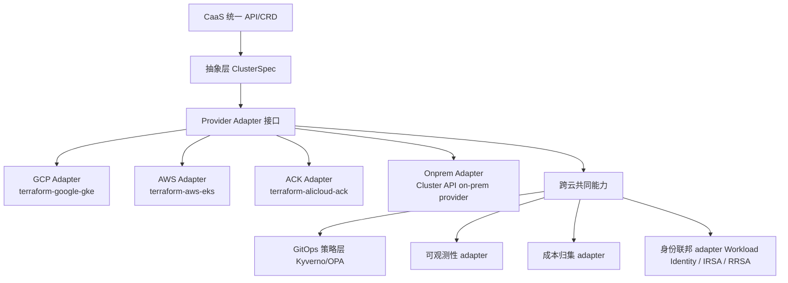

# 跨云 Provider Adapter 横向对比:四朵云的真实差异点

# 问题分析

`gke-caas.md` 里把 CRD 的 `cloudProvider` 字段用 `enum` 列成了 `gcp/aws/aliyun/onprem`,看起来"四朵云平等接入"已经声明完了。但**真正要落地 CaaS,你必须知道每个 `enum` 背后的"做不到点"和"半截子做到点"**——这些差异决定了适配层能不能写、Provider Adapter 要不要单独一支团队、长期会不会变成"四套各管各的半成品"。

本文聚焦六个维度对比:GCP GKE / AWS EKS / Aliyun ACK / 内部自建 K8S——前三个是公有云托管/半托管,第四个是自建(对应你们内部 K8S 场景)。

---

# 解决方案

## 一、 六维度横向差异矩阵

> 标注规则:✅ 平台原生支持 / 🔶 需要适配 / ❌ 需要自建或转人工

| 维度             | GCP GKE                                  | AWS EKS                                  | 阿里云 ACK                              | 内部自建 K8S                          |
| ---------------- | ---------------------------------------- | ---------------------------------------- | --------------------------------------- | ------------------------------------- |
| **网络(集群内)** | VPC-native Pod IP,GKE Autopilot 完全自管 | AWS VPC CNI(Pod 拿 ENI IP),配置门槛高   | 专有网络 VPC + Terway CNI(ENI 多 IP)   | 看 CNI(Flannel/Calico/Cilium 可选) |
| **网络(对外)**   | GCP LB + NEG + mTLS Policy 一等公民       | ALB/NLB + ACM 证书 + WAFv2               | SLB + 证书托管 + WAF 单独购买          | 自建(HAProxy/Envoy/Ingress)         |
| **身份/IAM**     | Workload Identity(KSA ↔ GSA)一等公民      | IRSA(IAM Role for Service Accounts)      | RRSA(RAM Roles for Service Accounts) 阿里云 1.22+ 支持 | 自建(OIDC + Dex/Keycloak,可对接) |
| **节点模型**     | Autopilot(无节点概念)+ Standard         | Managed Node Group + Fargate             | 节点池 + 弹性节点(类似 Karpenter)    | 自管 kubelet + 操作系统镜像           |
| **可观测性**     | Cloud Logging/Monitoring/Trace **默认接入** | CloudWatch + Container Insights(需装) | ARMS + 日志服务(需装)                 | 自建(Prometheus + Loki + Tempo)   |
| **成本模型**     | vCPU/h 内存/小时 + Autopilot 按 Pod 计费 | EC2/EBS/ELB **分别计费** + Fargate 按 vCPU/内存 | ECS 实例 + SLB + NAT + 公网带宽分项     | IDC 折算 / 资源池配额                  |

> **简化的结论**(严格说):
> - GKE 是 **"最少心智负担"** 的 Provider:Workload Identity + Autopilot + 内建可观测性让 CaaS 适配层最薄
> - EKS 是 **"最接近传统 IaaS 心智"** 的 Provider:每件事都能做但要配 5 个地方
> - ACK 是 **"中文运维友好 + 厂商绑定深"** 的 Provider:操作控制台体验好但 API/资源模型和 GCP/AWS 差很大
> - 自建 K8S 是 **"完全可控 + 完全要自己兜底"** 的 Provider:不在 CaaS 抽象里强行"对齐云厂商"

---

## 二、 四朵云的 "必须逃逸" 能力(CaaS 不要硬包的)

| 云       | 逃逸点                                                                                                | 为什么 CaaS 不能硬包                                                                              |
| -------- | ----------------------------------------------------------------------------------------------------- | ----------------------------------------------------------------------------------------------- |
| GCP      | Autopilot 特有的 **无节点 + 反亲和 + 沙箱化 Pod 隔离**;**Config Connector** 直管 GCP 资源;**Confidential GKE Nodes** | 这些是 GKE 独有的产品形态,抽象层如果强行"对齐"会失去它的最大卖点                                          |
| AWS      | **Karpenter** 节点弹性;**Pod Identity**(IRSA 继任者);**EKS Hybrid Nodes** 接 IDC 节点                       | Karpenter 已经比 AWS 自己的 Managed Node Group 更先进,适配层跟的话只能"二选一"而不是"自动适配"        |
| ACK      | **阿里云 ServiceMesh(ASM)** 集成;**容器镜像服务 ACR** 私仓首选;**KubeVela** 阿里云系应用交付                  | ASM 和 ACR 在阿里云生态里地位近似"事实标准",CaaS 抽象里要求"业务团队自己选"会频繁踩坑                  |
| 自建 K8S | **集群外的网络/存储/镜像仓库** 全部需要业务团队自己协调;**etcd 备份策略** 各团队各自实现                          | CaaS 在自建场景下基本退化为"准入 + 模板下发",生命周期大部分由现有运维流程负责,CaaS 做"治理层"而非"交付层" |

---

## 三、 CaaS 适配层的分层建议



**设计纪律**:四朵云的 Adapter 只暴露 `ClusterSpec` 里的字段,**不暴露云特有字段**。云特有能力走 `spec.providerOverrides` 逃生舱口(JSON 透传,无 schema 约束),明确标注"超出 CaaS 治理边界"。

---

# 代码示例

## 1. ClusterSpec 扩展:加 providerOverrides 逃逸舱口

```yaml
# 在 gke-caas.md 的 ClusterRequest CRD 基础上扩展
spec:
  cloudProvider: aws
  region: ap-northeast-1
  tier: standard
  # ... 原有公共字段 ...
  providerOverrides:                  # 🔶 逃逸舱口:仅在标准字段表达不了时使用
    enabled: true
    justification: "需要 Karpenter 节点弹性"
    rawSpec:                           # provider-specific 直接透传给该云的 adapter
      karpenter:
        enabled: true
        nodePools:
          - name: general
            instanceType: m6i.2xlarge
      addon:
        podIdentity: true              # AWS 新版 Pod Identity,IRSA 之后继任者
```

CRD 校验侧的对应规则(`x-kubernetes-validations`):

```yaml
providerOverrides:
  type: object
  properties:
    enabled: { type: boolean }
    justification:
      type: string
      minLength: 20
      description: "必须人工填写足够长的理由,后续审计追溯"
    rawSpec:
      type: object
      x-kubernetes-preserve-unknown-fields: true  # 透传字段不做 schema 校验
  x-kubernetes-validations:
    - rule: "self.enabled != true || (has(self.justification) && size(self.justification) >= 20)"
      message: "启用 providerOverrides 时 justification 至少 20 字符"
```

## 2. Provider Adapter 接口设计(Go)

```go
// ProviderAdapter 是所有云适配器必须实现的契约
type ProviderAdapter interface {
    // 名称对应 CRD enum: "gcp" | "aws" | "aliyun" | "onprem"
    Name() string

    // Day-0: 把 ClusterSpec 转成该云的实际资源并创建
    Provision(ctx context.Context, spec *caasv1.ClusterSpec) (*ClusterStatus, error)

    // Day-1: 更新(集群升级/规模调整/网络变更)
    Update(ctx context.Context, spec *caasv1.ClusterSpec) error

    // Day-2: 销毁(清理云资源 + 成本核销)
    Destroy(ctx context.Context, clusterID string) error

    // 配额预检查(对接各云自己的 quota API)
    CheckQuota(ctx context.Context, spec *caasv1.ClusterSpec) ([]QuotaWarning, error)

    // 列举该云提供方"特有的"能力,供 GUI/审批流推荐
    SupportedFeatures() FeatureCatalog
}

// FeatureCatalog 是统一的"该云有什么"清单,前端 Portal 用
// 比如:AWS 的 "Karpenter",GCP 的 "Autopilot",ACK 的 "ASM 集成"
type FeatureCatalog struct {
    Autoscaler   []string   // ["cluster-autoscaler", "karpenter", ...]
    Networking   []string   // ["cilium", "aws-vpc-cni", "terway", ...]
    Identity     []string   // ["irsa", "pod-identity", "workload-identity", ...]
    Mesh         []string   // ["asm", "istio", ...]
    Database     []string   // ["cloud-sql", "rds", "rds", ...]  // RDS 重复只为占位示意
    Exclusivity  []string   // 选了 A 就不能选 B 的互斥关系
}
```

> **重点**:**`SupportedFeatures()` 是"统一抽象 + 保留差异"的关键设计**。Portal 展示时,该云提供的能力以 `FeatureCatalog` 形式动态生成 UI,**不要求各云对齐到同一套字面值**——这是避免抽象层失控的核心机制。

## 3. 四朵云在配额 API 上的差异(Quota 预检查怎么写)

```go
func (a *gcpAdapter) CheckQuota(ctx context.Context, spec *caasv1.ClusterSpec) ([]QuotaWarning, error) {
    // GCP:用 Service Usage API 查 region quota (CPUs, In-use IP addresses)
    client, _ := serviceusage.NewService(ctx)
    resp, _ := client.Services.GetQuota(ctx, ...).Context(ctx).Do()
    return mapGCPQuotaToWarnings(resp), nil
}

func (a *awsAdapter) CheckQuota(ctx context.Context, spec *caasv1.ClusterSpec) ([]QuotaWarning, error) {
    // AWS:用 Service Quotas API + EC2 On-Demand Instance Limits
    // 还要手动检查 VPC IP 池,因为 EKS 用 VPC CNI 时 IP 是稀缺资源
    ec2Client, _ := ec2.NewSession(...)
    vpcUsage, _ := ec2Client.DescribeVpcEndpointConnections(...)  // 仅示意
    quotas, _ := servicequotas.New(...).GetServiceQuota(...)
    return mergeAWSQuotas(vpcUsage, quotas), nil
}

func (a *ackAdapter) CheckQuota(context.Context, *caasv1.ClusterSpec) ([]QuotaWarning, error) {
    // 阿里云: 用 QuotaAPI,但字段名 / endpoint 都不同,经常需要 RAM 授权
    cli, _ := quota.NewClientWithAccessKey("cn-shanghai", ak, sk)
    return cli.ListQuotas(...)
}

func (a *onpremAdapter) CheckQuota(...) ([]QuotaWarning, error) {
    // 自建:对接你们内部的"资源池配额服务"(可能是 ConfigMap/RPC/内部 HTTP API)
    // 这是 CaaS 唯一必须为内部场景"自定义"的地方
    return a.internalClient.GetTenantQuota(...)
}
```

> **设计纪律**:**配额检查结果要写到 CRD `status.conditions` 而不是只 console log**,这样前端 Portal 可以直接展示"为什么这台集群还没交付"。

---

# 注意事项

1. **"Provider Adapter 写一套"是 CaaS 最大陷阱**:四朵云差异大到每个都需要专属维护团队,GCP 和 AWS 单独写是合理的,但**阿里云和自建如果复用同一个 adapter 写,99% 会变成长期负债**。
2. **ProviderOverrides 逃逸舱口要"开但严"**:开启它意味着 CaaS 对该集群的"治理保证"降级——审计/合规/FinOps 都需要在 enable 时自动加标签,后续巡检能识别出"这批集群不受 CaaS 全量治理"。
3. **自建 K8S 别硬塞进 CaaS 抽象**:内部 K8S 通常已经有自己的"集群生命周期流程",CaaS 在这里应该是"治理层"(配额/合规/可观测性统一接入),而不是"交付层"(替代原有创建流程)。
4. **不建议做 Adapter 的"通用 helper"层**:Terraform 适配层 `terraform-provider-*` 各家都用,看似可以抽 `pkg/terraform/render` 出来,但**半年内一定会有 Provider-specific 字段需要透传**,通用 helper 反而变成障碍。
5. **FeatureCatalog 是治理留痕的关键**:`SupportedFeatures()` 不仅给前端用,也用于**审计**——"为什么这个集群开了 Karpenter"能在 ClusterRequest spec 里找到对应 justification(见代码示例 1)。
