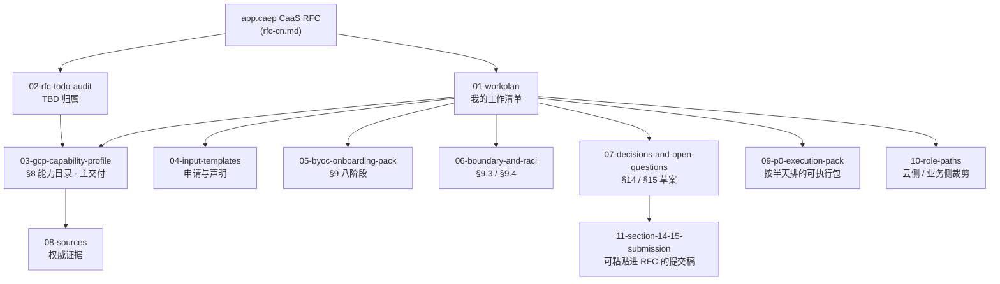

# DC Owner 视角 —— 入口索引

> **这是什么.** `CaaS/` 下的 9 份文档全部是**建-side**(CaaS 怎么实现).本目录是**喂-side**:
> 站在 DC/GCP owner 的角度,盘清楚"要往这份 RFC 里交什么东西、交到什么程度才算数"。
>
> **它不是什么.** 不是 RFC 复述,不是实现方案,是我把 RFC 逐行对照后,挑出**属于你的那部分**
> 整理成可执行的工作包。

---

## 一分钟背景:你在这份 RFC 里的位置

RFC §6.1 写了一条几乎是为这个目录而设的职责:

> **CTOi 云工程师** —— 提供云厂商能力、约束、API、配额、区域、网络与身份集成、维护要求、
> 支持边界与升级路径;并与 app.caep Compute 合作实现与验证云厂商适配器及画像。

RFC §8 又补了一刀,明确点出这个角色的产出物:

> 能力项包括 —— 地理支持、IAM、服务网格等。**[待补充]** —— 完整的能力目录在原文档中并未列举,
> 需定义为一个版本化的 schema,由 app.caep Compute 拥有,**CTOi 云工程师参与贡献**。

**结论:§8 的能力目录,你就是共同作者。** 这是整份 RFC 里唯一把你的名字写进交付物的地方。

---

## 唯一一件必须先确认的事

你可能同时或只戴其中一顶帽子,**两顶的交付物差别很大**:

| 帽子 | RFC §6.1 原名 | 你要交的核心东西 | 交付压力 |
| --- | --- | --- | --- |
| **A. 云侧** | CTOi 云工程师 | GCP 能力目录、配额/区域包络、API 契约、维护与支持边界、验证适配器 | **重**,但你有信息优势,不可替代 |
| **B. 业务侧** | 应用归属方(Application Owner) | 集群申请输入项、数据分级与驻留、维护窗口、非功能需求、存量集群登记 | 中,模板化,可以较快交 |

我的判断:**优先按 A 交付,顺手把 B 里跟 DC 相关的部分一起交。**
理由是 A 的产出物(app.caep Compute 拥有、但内容你写)卡住的是整条 RFC 的主线;
B 部分如果 DC 已有存量集群,那就是 BYOC 路径的入口条件,不交会让 RFC §9 整章悬空。

> 详见 [`01-workplan.md`](./01-workplan.md) §1。

---

## 目录

| #   | 文件                                                          | 你要拿它做什么                                                        |
| --- | ------------------------------------------------------------- | --------------------------------------------------------------------- |
| 00  | 本文件                                                        | 入口                                                                  |
| 01  | [**01-workplan.md**](./01-workplan.md)                       | **核心交付物** —— 我列给你的工作清单(P0/P1/P2,带完成判据)            |
| 02  | [02-rfc-todo-audit.md](./02-rfc-todo-audit.md)               | RFC 全文 TBD 归属审计 —— 每一条 `[待补充]` 该谁填、你能填哪几条      |
| 03  | [03-gcp-capability-profile.md](./03-gcp-capability-profile.md) | §8 能力目录 schema + **GCP 侧草案**—— 我已按 20 个维度预填,你审校  |
| 04  | [04-input-templates.md](./04-input-templates.md)             | 申请/声明类模板(新建路径 + BYOC 路径),可直接填                        |
| 05  | [05-byoc-onboarding-pack.md](./05-byoc-onboarding-pack.md)   | 存量集群纳管交付物包 —— 对齐 RFC §9.2 八阶段                           |
| 06  | [06-boundary-and-raci.md](./06-boundary-and-raci.md)         | 管理边界 + R&R + RACI 草案 —— 填 RFC §9.3 / §9.4 那个空缺             |
| 07  | [07-decisions-and-open-questions.md](./07-decisions-and-open-questions.md) | §14 决策记录 + §15 开放问题(含"未解决时的影响"那一列)草案  |
| 08  | [08-sources.md](./08-sources.md)                             | 权威证据清单 —— 我引用的每条 GCP 事实的出处                            |
| 09  | [**09-p0-execution-pack.md**](./09-p0-execution-pack.md)   | **今天就开始** —— 三个 P0 展开成按半天排的可执行包(约 1.5 天)          |
| 10  | [10-role-paths.md](./10-role-paths.md)                     | 按角色裁剪 —— 云侧 / 业务侧各只读该读的那几页                          |
| 11  | [**11-section-14-15-submission.md**](./11-section-14-15-submission.md) | **可直接粘贴进 RFC** —— §14 / §15 提交稿,无旁白                 |
| 12  | 🆕 [**12-byoc-scaleup-playbook.md**](./12-byoc-scaleup-playbook.md) | **批量 BYOC 纳管** —— A/B/C 分类、批次节奏、三条新反馈(N1/N2/N3) |
| 13  | 🆕 [**13-gap-review.md**](./13-gap-review.md) | **缺口盘点** —— 还有什么没考虑到的:交付物第二层 / 规模化陷阱 / RFC 漏网 |
| 14  | 🆕 [**14-doc-conflict-review.md**](./14-doc-conflict-review.md) | **9 份文档 × RFC 反向校验** —— 9 条冲突(2 阻断 / 4 重要 / 3 提示) |
| 15  | 🆕 [**15-cross-cloud-framework.md**](./15-cross-cloud-framework.md) | **跨云框架** —— 能力 schema + 20 维提问集 + 跨云共性分析(多云复用) |
| 16  | 🆕 [**16-backfill-from-dc-experience.md**](./16-backfill-from-dc-experience.md) | **DC 实战回填 ①** —— 用你的 GCP 知识库把 `03` 的 `🔶` 变成实证                  |
| 17  | 🆕 [**17-backfill-round2.md**](./17-backfill-round2.md) | **DC 实战回填 ②** —— 服务两分类 / 跨区 PSC / WI 边界 / 镜像实践(10 条)         |
| 18  | 🆕 [**18-gpu-ai-assessment.md**](./18-gpu-ai-assessment.md) | **GPU / AI 架构评估** —— DC 不支持;为什么;扩展位模板;N10–N12(缺失者视角) |
| 19  | 🆕 [**19-observability-backfill.md**](./19-observability-backfill.md) | **可观测性回填** —— logs/ 28 篇实证;Log Scopes 选型;N13–N15                |

---

## 你的确认(2026-09-29)

> **云侧 + 业务侧两顶都戴,且存量 GKE 集群较多、确定要交 CaaS。**

**这改变了两件事:**

1. **WP-6(BYOC)升为 P0** —— 有存量集群,它就不是"以后再说"
2. **必须先 A 后 B** —— 业务侧申请单会被云侧能力目录校验,反了返工

**额外产出一份** [`12-byoc-scaleup-playbook.md`](./12-byoc-scaleup-playbook.md):
批量纳管的 A/B/C 分类、批次节奏,以及**三条原 RFC 没提的反馈**(N1/N2/N3)。

**建议的下一步**:先花半天跑 [`12`](./12-byoc-scaleup-playbook.md) §1.2 的存量集群分类自查 ——
A/B/C 的分布会改变后面所有工作的优先级判断。

---

## 🚀 如果你只想做一件事

**你要对接多云 → 打开 [`15-cross-cloud-framework.md`](./15-cross-cloud-framework.md)。**
它是 `03`(GCP 专篇)抽出来的**跨云框架**:能力 schema + 20 维提问集 + 跨云共性分析。
AWS / 阿里云 / IKP 都照着它填,不用重新想该问什么。

**你要盘点还有什么没考虑到 → 打开 [`13-gap-review.md`](./13-gap-review.md)。**

要真正动手做事时,再打开 [`09-p0-execution-pack.md`](./09-p0-execution-pack.md)。
它把三个 P0 展开成按半天排的可执行清单(约 1.5 天),四个时段**全部可独立完成**,
不需要等 app.caep Compute 配合。

先花 5 分钟做 [`01-workplan.md`](./01-workplan.md) §1 的帽子判断;
若你只有业务侧一顶帽子,改走 [`10-role-paths.md`](./10-role-paths.md) 的路径 B。

**要往 RFC 里直接粘贴内容**,用 [`11-section-14-15-submission.md`](./11-section-14-15-submission.md)。

---

## 目录关系

> **阅读顺序建议**:判定帽子([`10`](./10-role-paths.md) §1)→ [`09` 执行包](./09-p0-execution-pack.md)
> → 需要展开时回到 [`01`](./01-workplan.md) 对应 WP → 交付物在 [`03`](./03-gcp-capability-profile.md)/[`04`](./04-input-templates.md)/[`05`](./05-byoc-onboarding-pack.md)/[`06`](./06-boundary-and-raci.md)
> → 提交评审用 [`11`](./11-section-14-15-submission.md)。

---

## 三条纪律

1. **每个能力标记都必须带证据与日期.** RFC §8 明确写"**'尚未评估'不得被解读为'已支持'**"。
   我在 §3 加了一条**正交的第五维:证据新鲜度** —— 这是我对你这个角色的一条实质建议,
   理由见 [`07-decisions-and-open-questions.md`](./07-decisions-and-open-questions.md) 的 D2。
2. **"不支持"比"尚未评估"更值钱.** 一份全是 ✅ 的能力目录对 CaaS 没有任何用;
   能让 CaaS 提前知道"这条走不通"的目录,能省掉它一整个季度的适配工作。
3. **不要替 CaaS 承诺你没承诺过的东西.** RFC §3 明确列了非目标,包括
   "**在各责任方验证之前,就先行确定云厂商产品选型、区域允许清单、服务等级或数值化的 SLO**"。
   你给的是**能力和约束**,SLO 与服务等级的数值承诺留给 SRE。

---

**修订记录**

| 日期         | 内容                     |
| ------------ | ------------------------ |
| 2026-09-29   | 初版,基于 rfc-cn.md 逐行对照 |
