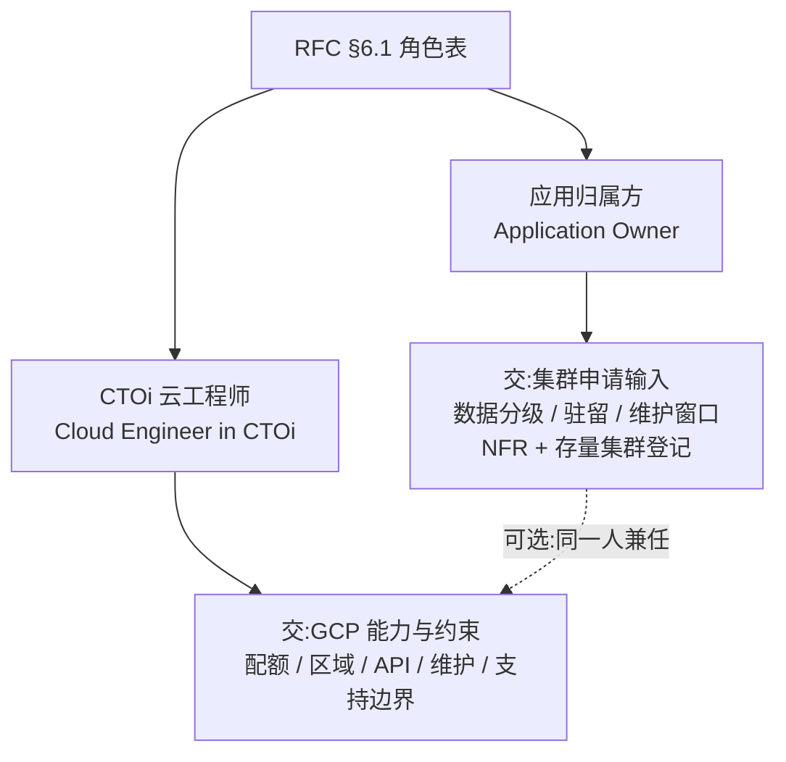
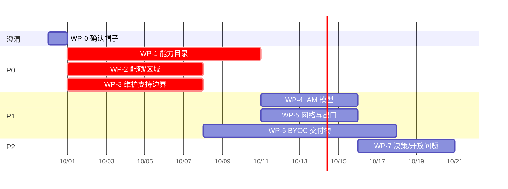

# 01 · 我的工作清单

> **读者**:DC/GCP owner(CTOi 云工程师口径),要往 `app.caep` CaaS RFC 交东西的人。
>
> **本文的定位**:RFC 说"CTOi 云工程师提供云厂商能力、约束、API、配额、区域、网络与身份集成、
> 维护要求、支持边界与升级路径"。这句话没有展开成可交付物。**这份文件就是把它展开。**
>
> **不在本文范围**:CaaS 怎么实现、CRD 怎么设计、Portal 怎么做。那些归 app.caep Compute。

---

## 0. 先说结论

**你的工作可以切成 8 个工作包。其中 4 个是 P0 —— 不交, RFC 走不下去或签不了字。**

> **⚠️ 优先级已按 2026-09-29 确认的头像调整。** 你是**云侧 + 业务侧两顶都戴**,
> 且**存量 GKE 集群较多、确定要交 CaaS**。因此:
> - **WP-6(BYOC)从 P1 升为 P0** —— 有存量集群,它就不是"以后再说"的事
> - **必须先交云侧(A)再交业务侧(B)** —— 业务侧的申请单会被云侧能力目录校验,反了返工
> - 新增 [`12-byoc-scaleup-playbook.md`](./12-byoc-scaleup-playbook.md) —— 批量纳管的排序与节奏

| 优先级 | 工作包                                  | 对应 RFC 章节              | 阻塞什么                                            |
| ------ | --------------------------------------- | -------------------------- | --------------------------------------------------- |
| **P0** | WP-1 GCP 能力目录(schema + GCP 侧)     | §8                         | §7 工作负载放置校验;§10 配置与策略                  |
| **P0** | WP-2 配额 / 容量 / 区域包络              | §8 §10                     | §10 容量与配额自动化 —— 无法在置备前检测上限          |
| **P0** | WP-3 维护与支持边界(升级窗口)           | §8 §10 §12                 | §10 升级管理;§6.3 契约项 5(备份恢复 DR)             |
| **P0** | 🆕 **WP-6 存量集群 BYOC**              | §9                         | §9 整章;且**规模决定 CaaS 要不要支持批量纳管**     |
| **P1** | WP-4 IAM / 身份模型                      | §8 §10                     | §10 三独立身份;Workload Identity Federation          |
| **P1** | WP-5 网络与出口能力                     | §8 §7                       | §7 AI 工作负载的网络出口;数据类工作负载的跨区流动     |
| **P1** | 🆕 **WP-8 业务侧申请输入**              | §7 §9.1                    | 存量集群登记;新建集群申请                            |
| **P2** | WP-7 决策记录与开放问题                 | §14 §15                    | 评审会签字;消除"未解决时的影响"缺列                 |

---

## 1. WP-0 · 先确认你戴哪顶帽子(5 分钟,不用产出)

RFC §6.1 给了你**两个可能的身份**,它们交付物完全不同:



**判断方法 —— 三选一:**

1. 你的组织里 **DC/DC 基础架构团队**要向 CaaS 提要求 → **帽子 A(云侧)**。这是本文主要假设。
2. 你是某个 **DC 业务/应用**的 owner,要申请集群 → **帽子 B(业务侧)**,直接用
   [`04-input-templates.md`](./04-input-templates.md),别读 WP-1~WP-5。
3. DC 既是**平台提供方**又是**消费方** → 两顶都戴,按顺序交:A 先交(B 会被 A 的能力目录卡住),
   B 部分可并行。

> **我的建议**:无论哪顶帽子,**WP-7(§14/§15)都要你参与**。RFC §15 那一列"未解决时的影响"是空的,
> 而"某个开放问题不解决会怎样"恰恰是云侧最有发言权的东西。

---

## 2. WP-1 · GCP 能力目录(P0 · 核心交付物)

**RFC 原文**:§8 —— "完整的能力目录在原文档中并未列举,需定义为一个版本化的 schema,由
app.caep Compute 拥有,**CTOi 云工程师参与贡献**。"

### 你要做的两件事

**(a) 和 app.caep Compute 一起定 schema。** schema 属于 CaaS 侧,但它必须能装下 GCP 的现实。
关键设计问题(这些是你带进去的约束,不是你要写代码):

| schema 设计问题                        | 为什么 GCP 侧有话语权                                               |
| -------------------------------------- | ------------------------------------------------------------------ |
| 是否区分 Standard / Autopilot 两个 mode | Autopilot 的能力矩阵与 Standard **显著不同**,压成一行会丢信息  |
| 是否需要"限制/坑"字段(不只 yes/no)     | Autopilot 禁 privileged container、禁 hostPath 写、禁 hostNetwork —— 需要能表达"支持但有约束" |
| 是否需要证据新鲜度字段                  | 见 [`07-decisions-and-open-questions.md`](./07-decisions-and-open-questions.md) D2 |
| 加速器能力如何建模                      | GPU / TPU / A3 高内存在配额、机型、隔离上是三套东西              |
| 一个集群能否混合能力                    | Standard 里 Autopilot 的"逃逸点"只能做部分 —— 需要 partial 档   |

**(b) 填 GCP 侧内容。** 我已经按 20 个维度预填了一版草案在
[`03-gcp-capability-profile.md`](./03-gcp-capability-profile.md)。

> ⚠️ **这份草案的性质**:它是我基于公开 GCP 文档做的**推演**,不是从你的 DC 实际环境取的数。
> 里面的 GCP 项目/区域/配额/机型信息**必须由你逐条核对或替换成 DC 真实值**。
> 标了 `🔶 需 DC 填` 的地方是留给你的空格。详见该文件 §0。

### 完成判据

- [ ] schema 草案与 app.caep Compute 达成一致(至少字段名与四态取值)
- [ ] GCP 侧 20 个维度全部有取值,**没有留空**(空的必须显式写 `尚未评估`)
- [ ] 每条非 `已支持` 的结论都有出处(文档 URL + 查阅日期)
- [ ] 至少有一条 `不支持` 被明确写出 —— 详见下面"一条硬建议"

### 💡 一条硬建议:主动交一份"GCP 做不到清单"

一份全是 ✅ 的能力目录对 CaaS 开发者**没有任何价值**,它只会让 CaaS 排期时误判工作量。
反过来,一份诚实的:

```
GPU 独占拓扑            → 不支持(无 per-cluster GPU 隔离保证,只有 quota 隔离)
Windows 节点 + Confidential Nodes  → 不支持
Autopilot + DaemonSet 采集类 agent  → 有限支持(需 AllowlistSynchronizer + 官方 allowlist)
```

能让 CaaS 提前砍掉一整个季度的适配。**这对你个人也是保护** ——
你在评审会上说的每一句"我们做不到",都会成为别人排期时的既定事实。

---

## 3. WP-2 · 配额 / 容量 / 区域包络(P0)

**RFC 原文**:§10 自动化能力表 —— "**容量与配额** | 在置备前检测配额或容量上限;对饱和状态告警…"
§8 能力目录里也含"地理支持"。

### 你要交的

| 交付项                         | 内容                                                                     | 格式建议                             |
| ------------------------------ | ------------------------------------------------------------------------ | ------------------------------------ |
| **区域允许清单**               | DC 认可的 region/zone 列表 + 各自承载什么                                 | YAML,版本化                          |
| **配额现状**                   | 当前 GKE 配额值(每 zone 集群数、每 region 集群数)、是否已提额            | YAML                                 |
| **配额申请路径与时长**         | 提额找谁、SLA 多久、**有没有预留 buffer**                                   | 一页说明                             |
| **单机容量包络**               | 一台 DC 服务器/一个 project 最多支撑多少集群、多少节点                      | 一页说明                             |
| **饱和信号**                   | 什么指标到什么阈值算饱和,CaaS 该在哪一刻告警                               | 指标名 + 阈值                        |
| **区域能力差异**               | 哪些能力只在部分区域可用(加速器、Confidential Nodes、特定 VPC 特性)       | 接入 §8 能力目录                     |

### 你需要自己确认的关键数字

GKE 的**硬限制**(不可调整,来自 [GKE 配额文档](https://docs.cloud.google.com/kubernetes-engine/quotas)):

- 每 zone 50 个集群 + 每 region 50 个 regional 集群(**默认配额,可申请调整**)
- Standard 集群每节点池每 zone 1,000 节点
- Pods per node:Standard 256 / Autopilot 动态 8–256
- **GKE 对 <100 节点的集群,自动对每个 namespace 施加不可删除的资源配额 `gke-resource-quotas`**
  — 这条极易踩坑:业务方"申请不到资源"时往往不是 CaaS 配额,是 GKE 自己在限你。

### 完成判据

- [ ] 区域允许清单是**带版本号的 YAML**,不是散落在邮件里的截图
- [ ] 每一条配额有"当前值 / 已申请值 / 提额时长 / 负责人"四元组
- [ ] `gke-resource-quotas` 这个坑在 CaaS 的申请校验里被显式考虑(见 WP-4 输入模板)

---

## 4. WP-3 · 维护与支持边界(P0)

**RFC 原文**:§10 "**升级管理** | 跟踪支持窗口,测试受支持的版本跃迁,排期升级,通报影响,并上报被阻塞或逾期的集群";
§6.3 纳管契约项 5(备份、恢复与 DR)。

**这一条对 CaaS 意义重大**:RFC 的整个安全叙事建立在"持续评估"上。
如果版本支持窗口是硬约束,那么**任何一个被拖过窗口的集群,都是安全发现项的来源** ——
CaaS 的 §10 升级管理自动化直接由你这条输入驱动。

### 你要交的

| 交付项               | 内容                                                                                   |
| -------------------- | -------------------------------------------------------------------------------------- |
| **版本支持窗口**     | DC 认可哪些 GKE release channel(Rapid/Regular/Stable/Extended),为什么                 |
| **升级节奏**         | 多久升一次 minor、是否接受自动升级、maintenance window 是什么                          |
| **升级风险偏好**     | 能不能用 rollout sequencing(需要 clusters 归入 fleet),谁有 `roles/gkehub.editor`     |
| **控制面升级底线**   | GKE 强制控制面每 90 天至少升一次 patch — **这一条 CaaS 必须知道**,否则它会以为可以拖 |
| **维护窗口冲突规则** | 业务方维护窗口与 GKE 自动升级窗口冲突时谁让谁                                           |
| **EOL 处置**         | 集群过了 EOL 会怎样(注意:GKE 会**强制**升级,不管你的策略),怎么提前通知               |
| **扩展组件维护责任** | GKE 附加组件(add-on)谁升、多久、谁批准                                                |

### 你需要自己确认的关键事实

- GKE minor 版本:**标准支持 14 个月 + 扩展支持 10 个月(需 Extended channel,额外收费)= 最长 24 个月**。
  **不是你想要 24 个月 —— 是 GKE 只给你 24 个月。**
- minor 升级从 GKE 1.33 起采用**两步升级**(可 soak、可回滚)。1.33 之前不是。
- Rapid channel **明确排除在 GKE SLA 之外**。给业务方的集群挂 Rapid,等于你签了单但没签 SLA。
- 到了 EOL,GKE 会**强制**自动升级,且**不能**用 maintenance exclusion 阻止(除紧急情况)。
  → 这直接产生"业务方毫无预警就被升级"的事件。CaaS 应该在 EOL 前主动通告,
  这是一个 CaaS **必须实现**的自动化点,你要把它标为强制要求。

### 完成判据

- [ ] release channel 选择有书面依据(不是"默认 Regular")
- [ ] 明确写出:**哪些情况下 CaaS 必须通知业务方、提前多久**
- [ ] 90 天控制面升级底线被 CaaS 侧接受为硬约束

---

## 5. WP-4 · IAM / 身份模型(P1)

**RFC 原文**:§8 能力项举例"IAM";§10 —— "自动化必须在可行范围内为**发现**、**常规对账**与
**特权整改**使用**彼此独立的身份**。凭据必须通过已批准的密钥管理系统存储与轮换,**绝不可**内嵌在源码、清单或日志中。"

### 你要交的

| 交付项                 | 内容                                                                                  |
| ---------------------- | ------------------------------------------------------------------------------------- |
| **三种 CaaS 身份**     | discovery(只读) / reconciler(常规) / privileged-remediation(特权)。每个的 GCP 角色清单 |
| **Workload Identity Federation** | CaaS 管控面跑在哪(K8s?GKE?GCE?),KSA → GSA 怎么映射               |
| **Secret 管理**        | 凭据从 Secret Manager / KMS 来?轮换策略?                                            |
| **组织策略**           | 哪些 org policy 要强制(例如禁 `container.autopilotPrivilegedAdmission`)                 |
| **审计**               | 哪些操作必须落 Cloud Audit Logs,留存多久                                             |
| **GKE 端权限**         | CaaS 对被纳管集群需要什么 RBAC(注意:云厂商权限与 K8s RBAC 是**两套**)                 |

#### 💡 用 Workload Identity 当"三身份划分"的实例证据

WP-4 抽象上很好,但说服力来自具体边界。Workload Identity 恰好给了一个干净的切分:

| 操作                                    | 归属哪一档          | 理由                                       |
| --------------------------------------- | ------------------- | ------------------------------------------ |
| 改 KSA 注解                             | **常规对账**        | 纯 API,秒级,无工作负载影响                 |
| 增删 GSA 上的 `workloadIdentityUser`     | **常规对账**        | 纯 API;但需**容忍约 60 秒传播延迟**再验证 |
| 切换节点池 `workload-metadata`          | **特权整改**        | 触发**滚动节点升级**,有工作负载影响         |
| 收敛节点 SA 权限                        | **特权整改**        | 同上,需更新节点池                          |

> **把上面这张表交给 CaaS,它比任何关于"为什么需要三身份"的论述都有效。**
> 这张表同时说明:**"可自动对账"不等于"任何漂移都能自动修"**。
> 建议在 §8 能力目录里把它作为 caveat 附在 Workload Identity 条目上。

### 💡 一条要重点提醒的:两套身份要分清

RFC §9.4 结尾留了个空:**"IAM 模型与 R&R(角色与职责)需要达成一致"**。

CaaS 纳管一个 GKE 集群需要**两套完全不同的权限**:

1. **云厂商侧** — 改 VPC / 防火墙 / IAM / 配额(高危,爆炸半径大)
2. **集群内** — 部署 operator、下发策略、读 workload(影响面是租户)

这两套的**授权人、审批流程、审计要求应该不同**。如果你在能力目录里只写了一行 "IAM: 支持",
CaaS 会以为它需要一套权限就够了 —— 然后在生产上发现补权限要停机。
把这一条写进 §8,是我认为你这次给 RFC **最有价值的一条反馈**。

### 完成判据

- [ ] 三个身份的 GCP 角色清单给出(可直接给 CaaS 落成 IAM binding)
- [ ] 明确区分"云厂商权限"与"集群内 RBAC",并给出各自的审批人

---

## 6. WP-5 · 网络与出口能力(P1)

**RFC 原文**:§7 AI 与 Agent 工作负载 —— "网络出口、身份、密钥、隔离";数据类工作负载 ——
"使跨区域或跨云厂商的数据流动显式化并受治理"。

| 交付项               | 内容                                                                    |
| -------------------- | ----------------------------------------------------------------------- |
| **集群网络模型**     | VPC-native?Private cluster?Cloud NAT 出网?                            |
| **跨项目网络**       | Shared VPC?PSC?跨项目 LB 绑定规则?                                     |
| **公网出口**         | AI 工作负载要调外部 API(GitHub/OpenAI 等)时的出口形态与是否需要审批  |
| **Private Service Connect** | AI 推理要访问其他项目的模型服务时,PSC 的支持与限制                |
| **数据驻留**         | 哪些 region 允许承载哪一级数据分级(**这条与合规强耦合**)                 |
| **Service Mesh**     | RFC §8 举例了"服务网格"。DC 侧是 Cloud Service Mesh / 自建 ASM / 不做?  |

**我特别要你回答的**:§8 把"服务网格"和"地理支持、IAM"并列,说明 CaaS 预期会有需要它。
**DC 侧要给出的是明确答案,不是"到时再说"** —— CaaS 的工作负载准入画像(§7)要靠这个做校验。

### 完成判据

- [ ] region → 允许承载的数据分级,一张表,可机器读
- [ ] 服务网格立场明确(选 / 不选 / 分场景),并说明对 CaaS 画像的影响

---

## 7. WP-6 · 存量集群 BYOC 交付物(P1 · 如果 DC 有存量集群)

**RFC 原文**:§9.1 准入条件、§9.2 八阶段。

> **前置判断**:如果 DC **没有**存量 GKE 集群要交给 CaaS,WP-6 降级为 P2,
> 只交"未来若有,准入条件是这些"即可。

### 八阶段 → 你要交的东西

| 阶段                                  | 你要交什么                                                             |
| ------------------------------------- | ---------------------------------------------------------------------- |
| 1 Register                            | 集群台账:项目 / 集群名 / region / 版本 / 业务方 / 用途 / 责任人         |
| 2 Discover                            | 只读发现授权。**明确:授权谁、什么范围、什么时候撤销**                 |
| 3 Assess                              | DC 侧已知的能力差距(如 cluster 太大、无 release channel、缺 Workload Identity) |
| 4 Remediate                           | 整改计划:做什么、谁做、影响面、回滚                                   |
| 5 Integrate                           | 集成就绪:GKE 端权限、遥测出口、备份、云 API                          |
| 6 Authorize handover                   | **管理层授权**。这是最容易卡住的一步 —— 见下方提醒                    |
| 7 Transfer control                    | 权限交接:交哪些、保留哪些(你要保留 break-glass)                       |
| 8 Operate                             | 持续运营:怎么接受 CaaS 的变更、变更窗口                              |

### ⚠️ 第 6 步的阻塞风险

RFC §9.2 阶段 6 的退出条件是"**同时**留有现归属方与被授权的 CaaS 服务 Owner 的记录化批准"。

**这意味着 BYOC 不是技术问题,是授权问题。** 很多 BYOC 项目死在这里:
集群技术上完全符合,但没人有权签字把运维权交出去。

**你要提前做的**:确认 DC 侧**谁有这个签字权**(按金额/风险分级的授权矩阵),
以及如果 DC 坚持保留 break-glass(强烈建议保留),**它必须以书面形式写进 §9.3 移交契约**,
而不是口头保留 —— 否则移交后原运维方"临时改一下"就构成了契约违反,
CaaS 会进入 §9.4 的 `Suspended or management withdrawn` 状态。

### 完成判据

- [ ] 存量集群台账一份(可机器读)
- [ ] 第 6 步的签字人确认到人,不是到部门
- [ ] break-glass 权利以书面形式保留,且写进移交契约

---

## 8. WP-7 · 决策记录与开放问题(P2 · 但强烈建议参与)

**RFC 原文**:§14 决策记录(整表是 `example`)、§15 开放问题(整表是 `Example`)。

这两张表**目前完全是空的**。我已经按 RFC 的问题域预填了草案:

- [`07-decisions-and-open-questions.md`](./07-decisions-and-open-questions.md)
  - **决策记录** 9 条(D1–D9),每条带"提案责任人"建议
  - **开放问题** 12 条(O1–O12),**含"未解决时的影响"一列** —— 这是 RFC 原文丢掉的列

### 为什么"未解决时的影响"这一列你该写

因为它把一个模糊的开放问题变成一个**可升级的风险**。
例:"O3:GKE 版本支持窗口未确认"——影响不写清楚,就是个待办;
写成"**若延后 6 周,W3 试点将在生产 EOL 风险中运行**",它就是一次必须现在决策的事。

---

## 9. 给你的时间线建议



**关键路径是 WP-1。** 它是 §7 工作负载放置校验的前置 —— CaaS 没法在没有能力目录的
情况下决定"这个工作负载能不能放"。

---

## 10. 一页纸自查

打印出来,逐条打勾:

| #  | 问题                                                                     | 关联 WP | 状态 |
| -- | ------------------------------------------------------------------------ | ------- | ---- |
| 1  | 我确认了自己是云侧 / 业务侧 / 兼任                                | WP-0    | ☐    |
| 2  | 我知道 §8 能力目录 schema 的关键设计问题有哪些                       | WP-1    | ☐    |
| 3  | 我交出了一份完整的 GCP 能力目录,且每条有出处和日期                   | WP-1    | ☐    |
| 4  | 我的目录里**至少有一条**"不支持"                                   | WP-1    | ☐    |
| 5  | 我有一份带版本号的区域允许清单                                     | WP-2    | ☐    |
| 6  | 我知道配额提额要多久、找谁、有没有 buffer                          | WP-2    | ☐    |
| 7  | 我知道 `gke-resource-quotas` 这个坑                                 | WP-2    | ☐    |
| 8  | 我确认了 DC 用哪个 release channel,并有书面依据                     | WP-3    | ☐    |
| 9  | 我明确了 CaaS 必须在 EOL 前通知业务方                               | WP-3    | ☐    |
| 10 | 我区分了"云厂商权限"与"集群内 RBAC",各有审批人                     | WP-4    | ☐    |
| 11 | 我给了 region → 数据分级的映射表                                  | WP-5    | ☐    |
| 12 | 我对服务网格给了明确立场                                           | WP-5    | ☐    |
| 13 | 我知道 BYOC 第 6 步谁签字                                         | WP-6    | ☐    |
| 14 | DC 保留的 break-glass 写进了移交契约(书面)                        | WP-6    | ☐    |
| 15 | 我为 §15 每条开放问题写了"未解决时的影响"                           | WP-7    | ☐    |

---

## 11. 权威依据

本清单不是凭印象写的。关键约束的出处:

- RFC 角色职责:[/Users/lex/git/gcp/CaaS/rfc-cn.md §6.1、§8、§9、§10、§14、§15](file:///Users/lex/git/gcp/CaaS/rfc-cn.md)
- GKE 配额与硬限制:<https://docs.cloud.google.com/kubernetes-engine/quotas>
- GKE 版本支持(14/24 个月):<https://docs.cloud.google.com/kubernetes-engine/versioning>
- GKE release channel(SLA 排除、Extended 收费):<https://docs.cloud.google.com/kubernetes-engine/docs/concepts/release-channels>
- GKE 升级(两步升级、90 天底线、rollout sequencing):<https://docs.cloud.google.com/kubernetes-engine/upgrades>
- Autopilot 安全限制(禁 privileged / hostPath 写 / hostNetwork):<https://docs.cloud.google.com/kubernetes-engine/docs/concepts/autopilot-security>
- 完整清单见 [`08-sources.md`](./08-sources.md)

---

**修订记录**

| 日期       | 内容                                       |
| ---------- | ------------------------------------------ |
| 2026-09-29 | 初版                                       |
