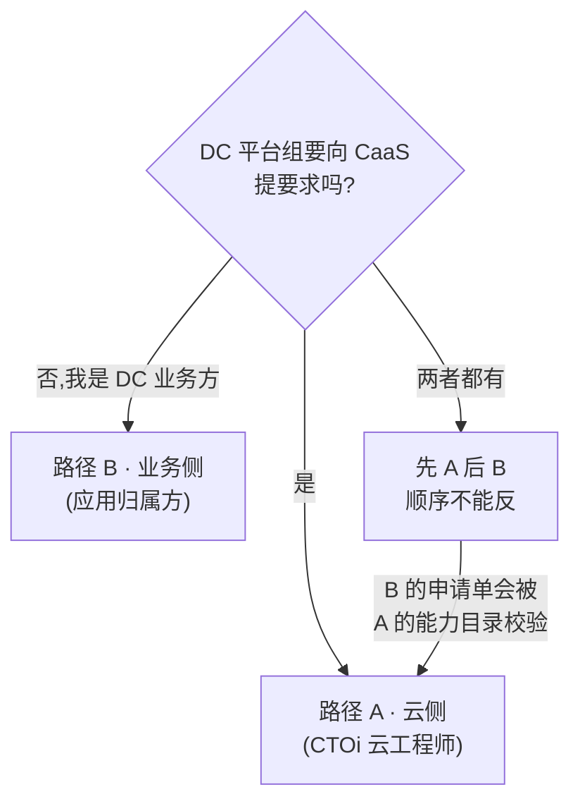

# 10 · 按角色裁剪的两条路径

> **为什么有这个文件**:`01-workplan.md` 覆盖了云侧 + 业务侧的全部工作包。
> 如果你只有其中一顶帽子,读全量是负担 —— 而且**读错方向比不读更贵**。
> 本文件把两条路径裁出来,告诉你每条只读哪几页。

---

## 判定

> **DC/DC 基础架构团队要向 CaaS 提要求吗?**

> **⚠️ 顺序说明**:如果两顶帽子都戴,**必须先交 A 再交 B**。
> 因为业务方的申请单要经过云侧能力目录的放置校验 ——
> 反了的话,业务方填完表才发现某些诉求(比如 GPU 独占)根本不支持,要返工两次。

> **✅ 你的情况(2026-09-29 确认):两顶都戴 + 存量 GKE 集群较多、确定要交 CaaS。**
>
> **所以你的路径是 A → B,不是二选一。** 详见
> [`12-byoc-scaleup-playbook.md`](./12-byoc-scaleup-playbook.md) §6 的执行顺序。
>
> **额外动作**:存量集群"不少"这个量级,新增了一份 [`12`](./12-byoc-scaleup-playbook.md) ——
> 批量纳管的 A/B/C 分类、批次节奏,以及三条原 RFC 没提的反馈(N1/N2/N3)。

---

## 路径 A · 云侧(CTOi 云工程师)

> **你在这里的角色**:向 CaaS 提供 GCP 的**能力、约束、边界**。
> 你的产出是**输入**,不是实现。

### 只读这四份

| 文件                        | 读它的哪个部分                    | 为什么                            |
| --------------------------- | --------------------------------- | --------------------------------- |
| [01-workplan.md](./01-workplan.md) | §2–§9 全部(WP-1~WP-7)     | 你的工作清单主体                  |
| [03-gcp-capability-profile.md](./03-gcp-capability-profile.md) | 全部                    | **主交付物**                      |
| [06-boundary-and-raci.md](./06-boundary-and-raci.md) | §1–§4(WP-4 边界部分)     | 你只出边界与 RACI,SLO 不归你      |
| [09-p0-execution-pack.md](./09-p0-execution-pack.md) | 全部                | **今天就开始**                    |

### 跳过

| 文件                                  | 理由                                          |
| ------------------------------------- | --------------------------------------------- |
| [04-input-templates.md](./04-input-templates.md) | 那是**业务方**填的,你只审边界字段是否越界 |
| [05-byoc-onboarding-pack.md](./05-byoc-onboarding-pack.md) | 除非 DC 有存量集群要交                   |
| [02-rfc-todo-audit.md](./02-rfc-todo-audit.md) | 快速扫一眼 T5/T8/T10/T12 四行即可        |

### 你的三个 P0

1. **WP-1** §8 能力目录(schema + GCP 侧)—— 关键路径
2. **WP-2** 配额 / 容量 / 区域包络 —— 一天半可交
3. **WP-3** 维护与支持边界(release channel + EOL 通告义务)

### 你**不要**做的三件事

| ❌ 不要做                                   | 为什么                                                       |
| ------------------------------------------ | ------------------------------------------------------------ |
| 承诺数值化 SLO / 服务等级                  | RFC §3 列为非目标;SLO 是 SRE 的 A。你签了兑现不了         |
| 替业务方设计申请单字段                     | RFC §5 原则是"声明意图,细节从画像解析"—— 你定的是**画像** |
| 同意"网络底座交给 CaaS 变更"              | 爆炸半径超出单集群。见 `06-boundary-and-raci.md` §3        |

### 你最有说服力的三句话

评审会上,这三句比任何抽象论述都有用 —— 因为**它们都带具体的坑**:

1. "`gke-resource-quotas` 会静默限制业务方,而 CaaS 查不到它设过任何配额。"
2. "GKE 没有 per-cluster GPU 独占拓扑,只有 quota 隔离。"
3. "Cloud NAT 出口 IP 一改,依赖白名单的工作负载静默失败 —— 而那些集群不在 CaaS 管辖内。"

---

## 路径 B · 业务侧(应用归属方)

> **你在这里的角色**:申请集群 / 把存量集群交给 CaaS 纳管。
> 你的产出是**意图与授权**,不是配置。

### 只读这三份

| 文件                                | 读它的哪个部分                          | 为什么要紧                                              |
| ----------------------------------- | --------------------------------------- | ------------------------------------------------------- |
| [04-input-templates.md](./04-input-templates.md) | **§一 + §三** 全部                | **这就是你要交的东西**                                  |
| [05-byoc-onboarding-pack.md](./05-byoc-onboarding-pack.md) | §2 准入条件 + §4 混用集群 + §6 签字 | 有存量集群才需要                                        |
| [01-workplan.md](./01-workplan.md) | §1 的**帽子 B**那一行 + §10 自查       | 了解全貌,不用读 WP-1~WP-5                              |

### 跳过

| 文件                                  | 理由                              |
| ------------------------------------- | --------------------------------- |
| [03-gcp-capability-profile.md](./03-gcp-capability-profile.md) | 云侧的事。**但 §3.5 GPU 独占要扫一眼** |
| [06-boundary-and-raci.md](./06-boundary-and-raci.md) | 技术边界。**§4 break-glass 条款要读** |
| [02 / 07 / 08 / 09](./02-rfc-todo-audit.md) | 评审会材料,不是你的交付物      |

### 你的四个 P0

| #  | 交付物                          | 出自                                    | 难度 |
| -- | ------------------------------- | -------------------------------------- | ---- |
| 1  | 集群申请输入(用途/能力/规模/数据分级) | `04` §一 | 中     |
| 2  | **非生产与生产分成独立集群**      | `04` §一 environments + `05` §4       | ⛔ 高 |
| 3  | 存量集群台账 + 只读发现授权      | `04` §二 + `05` §5                     | 中     |
| 4  | 确认**谁有权签字**交出运维权     | `05` §6.1                              | ⚠️ 组织问题 |

> #### 第 2 项和第 4 项是你真正的难点,技术不是
>
> **第 2 项**:RFC §9.1 硬要求非生产与生产是独立集群。
> 如果 DC 现状是"一套集群跑 dev 也跑 prod",你要么拆,要么走例外。
> **我的建议是拆或放弃纳管,不要走例外** ——
> 例外一旦开了口子,后续所有 DC 都会来要。
> 详见 `05-byoc-onboarding-pack.md` §4。
>
> **第 4 项**:很多人 BYOC 项目死在这里 ——
> 集群技术上完全符合,但**没有人有权签字把运维权交出去**。
> **你现在就去确认这个人是谁,不要等到阶段 6。**

### 你的三个必答问题

| 问题                                        | 为什么它会卡住你                                                |
| ------------------------------------------- | --------------------------------------------------------------- |
| **谁有权签字交出运维权?**                   | 没有这个人,BYOC 走不到阶段 7                                    |
| **你的数据有驻留要求吗?**                    | 决定集群能放哪个 region。**填错会在放置阶段被拒,那时你已经改了很多** |
| **维护窗口是什么?**                          | GKE 升级会自动发生。你有权知道发生的时间                        |

### 业务方最常犯的三个错

| ❌ 错误                                              | 后果                                        |
| --------------------------------------------------- | ------------------------------------------- |
| 在申请单里选 VPC / 机器型号 / 节点数                  | **被忽略**,且可能误导你自己对排期的预期     |
| 把 "dev" 和 "prod" 都填在同一个环境实例里            | §9.1 硬要求,直接被打回                      |
| AI 工作负载填 "GPU 独占拓扑"                       | GCP 给不了,放置阶段被拒。改成"配额隔离 + 专用节点池" |

### 你要争取的一件事

**在移交契约里书面保留 break-glass。**

`06-boundary-and-raci.md` §4 有条款稿。**为什么要争这个** ——
移交之后你会失去对集群的直接控制,遇到紧急故障时本能反应是直接上去改。
如果这个权利没有书面保留,后果是:

1. CaaS 看到漂移 → 自动对账修复 → **把你刚做的紧急修复覆盖掉**
2. 或者 CaaS 判定这是契约违反 → 集群进入 §9.4 的 `Suspended` 状态

**两种结果都很糟。** 越早提出越好 —— 越晚越像是"不信任"。

---

## 一页对照表

|                              | 路径 A(云侧)            | 路径 B(业务侧)          |
| ---------------------------- | ----------------------- | ----------------------- |
| RFC §6.1 原名               | CTOi 云工程师           | 应用归属方              |
| 核心交付                    | §8 能力目录             | 申请输入 + 纳管授权     |
| 关键路径                    | 能力目录 schema         | 签字权确认              |
| 最难的部分                  | 让 Compute 接受三条 schema 决策 | 组织授权,不是技术     |
| 最低成本的高杠杆动作        | 交两条 `❌` + 隐式配额说明 | 确认签字人              |
| **不要碰**                  | SLO 数值、申请单字段设计 | 能力目录、区域清单      |

---

**修订记录**

| 日期       | 内容                              |
| ---------- | --------------------------------- |
| 2026-09-29 | 初版                              |
