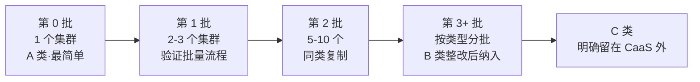
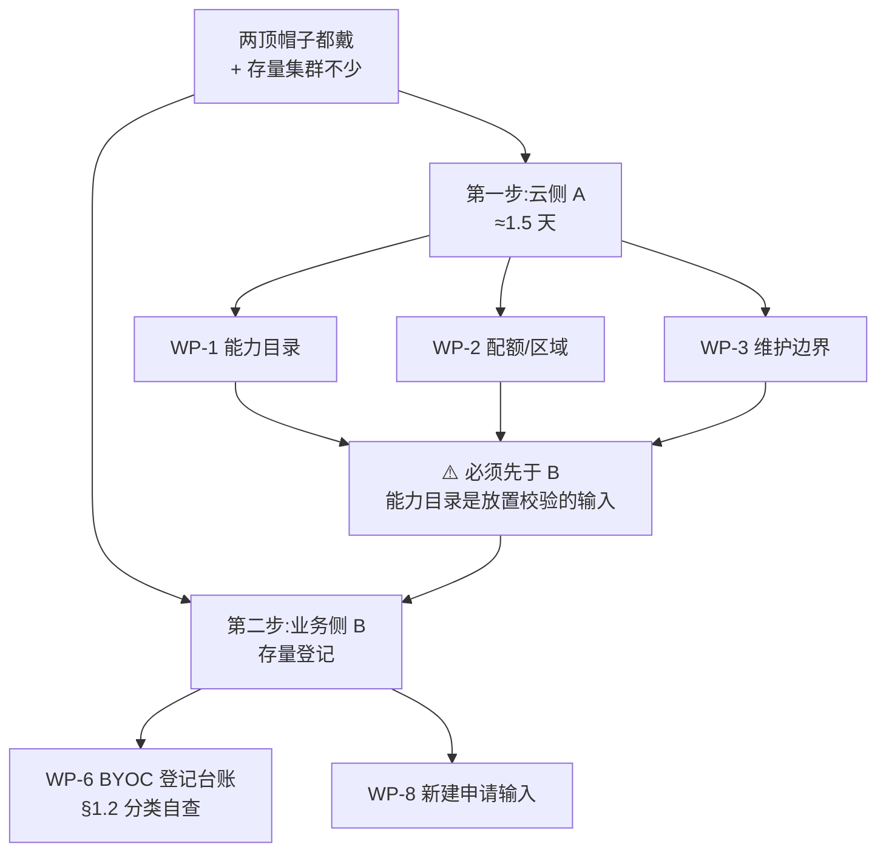

# 12 · 批量 BYOC 纳管手册

> **触发条件**(2026-09-29 确认):你是**云侧 + 业务侧两顶都戴**,且 **DC 存量 GKE 集群较多,
> 确定要交 CaaS**。因此 WP-6 从 P1 升为 P0。
>
> **本文件解决一个 RFC 没问、但你必然会遇到的问题**:
> **N 个集群,不是 1 个。** RFC §9.2 描述的是**单个集群的**八阶段流程。
> 当你有几十个集群要走同一条路时,真正的难点不是流程本身,而是:
>
> 1. **排序** —— 先纳管哪个?(答案不是"最重要的那个")
> 2. **节奏** —— 一次纳几个?失败了怎么办?
> 3. **差异化处理** —— 大概率只有一部分集群够格,另一部分永远不能纳管
>
> **这三条,正是你必须写进 RFC §9 的东西。** 它们不是 CaaS 的实现细节,是**服务契约**。

---

## 1. 最重要的一个判断:不是所有集群都能纳管

在讨论"怎么批量纳管"之前,先接受一个事实:

> **你现有的集群里,有一部分永远不应该交给 CaaS。**
> 这不是失败,是 §9.4 明确列出的正常结局:`Not supportable`。

如果你的存量集群"不少",那么**很可能相当一部分过不了 §9.1 的准入条件**。
在启动任何流程之前,先把它们分好类 —— 否则你会用一个平均速度,实际面对一个高度分化的组合。

### 1.1 三类存量集群

| 类别                          | 定义                          | 处理方式                                   |
| ----------------------------- | ----------------------------- | ------------------------------------------ |
| **A 类 · 直接可纳**           | 版本在窗口内、有 release channel、独立 prod/non-prod、有责任人 | 快速通过,优先纳                          |
| **B 类 · 可整改后纳**         | 差距是**可修的**(版本、channel、备份、退出计划) | 排整改,整改完走 A                        |
| **C 类 · 永不纳管**           | 差距是**结构性的**(dev/prod 混用、归属不清、已 EOL 且长期不升) | **明确划出 CaaS 范围,写进台账**          |

> #### 💡 C 类是这一节的重点
>
> **主动划出 C 类,是你对 CaaS 最大的善意。**
>
> - 对 CaaS:它不用为一批永远不合格的集群反复做评估,评估报告不会变成一份永远清不掉的待办
> - 对你:C 类集群的运维责任清晰,不会出现"到底谁在管"的模糊状态
> - 对 RFC:**C 类的存在证明 §9.4 的四种结局是必要的**,而不是理论上的完整性要求
>
> **"不是所有东西都能纳管"是这条路径的正常状态,不是失败。**
> 如果你的 RFC 读起来像"所有集群最终都会归 CaaS",那它是不现实的。

### 1.2 一次性分类自查(半天)

对**每个**存量集群填一行:

| 集群 | 模式=Standard? | channel=Stable? | 版本 ≤ Stable 上限? | 版本在窗口? | prod/non-prod 独立? | 责任人到人? | 备份验证过? | 有退出计划? | **分类** |
| ---- | :-----------: | :------------: | :----------------: | :---------: | :----------------: | :---------: | :--------: | :---------: | -------- |
|      |               |                |                    |             |                    |             |            |             | A/B/C    |

> **⚠️ 「版本 ≤ Stable 上限」这一列是 2026-09-29 新增的。**
> 因为 DC 确认使用 **Stable** channel,而 Stable 的可用 minor 区间比 Rapid 窄 ——
> **一个跑在较新 minor 版本上的集群可能加不进 Stable。**
> 这类集群要么降级,要么暂留 `No channel`,**不能在纳管时"以后再说"**。

**采集命令**:
```bash
gcloud container clusters list --format="table(name,currentMasterVersion,location)"
gcloud container clusters describe <name> \
  --format="value(releaseChannel.channel,currentMasterVersion)"

# 对照 Stable 当前支持区间(逐月更新,勿缓存)
# https://docs.cloud.google.com/kubernetes-engine/docs/release-schedule
```

**分类规则:**

| 条件                                     | 分类  |
| ---------------------------------------- | ----- |
| 版本过 EOL                               | **B**(先升版本,不能直接纳管) |
| **版本高于 Stable 上限**                  | **B**(降版本或加不进 channel) |
| channel = `No channel`                  | **B**(先加入 Stable)         |
| prod/non-prod 混用                       | **C**(除非愿意拆)            |
| 责任人只到部门不到人                      | **B**                        |
| 三项以上为否                              | **C**                        |
| 以上全过                                 | **A**                        |

> **预期分布**(我的经验判断,不是承诺):健康组织里通常是 A 类 30–50%、B 类 30–40%、C 类 20–30%。
> **C 类占比高不是 DC 的问题,是 Kubernetes 的现实** —— 很多集群从建立起就没被认真管过。

---

## 2. 排序:先纳管哪个?

### 2.1 ⛔ 不要按"重要性"排序

最直觉的做法 —— "先纳管最重要的那个" —— **在工程上是最差的选择**。

原因:最重要的集群风险最高(改错了影响最大),而你在 CaaS 上还没有任何经验。
**第一次交权就交最重要的集群,是在用生产赌一个你还没验证过的流程。**

### 2.2 正确的排序维度

| 排序维度                  | 为什么                                                      |
| ------------------------- | ----------------------------------------------------------- |
| **① 整改成本最低**         | 最快拿到第一个成功案例,建立内部信心                         |
| **② 依赖最少**             | 不连着别的集群,不共享数据库,出事不会连环                   |
| **③ 业务容忍度最高**       | 短时中断可接受,不会因为你实验就触发客户投诉                 |
| **④ 有人愿意配合**         | ⛔ 现实中这一条常常决定一切 —— 选那个最愿意配合的团队       |

### 2.3 推荐的批次节奏



| 批次   | 集群数      | 目的                          | 通过标准                            |
| ------ | ----------- | ----------------------------- | ----------------------------------- |
| **第 0 批** | 1 个      | **验证流程本身**              | 全程无意外;break-glass 未被使用    |
| **第 1 批** | 2–3 个    | 验证流程可复制                | 三份移交契约,差异只在业务背景      |
| **第 2 批** | 5–10 个   | 同类复制,发现规模化问题        | 评估报告无需逐份手写                 |
| **第 3+ 批** | 按类型    | B 类整改后纳入                 | 整改动作本身已被 CaaS 编排          |
| **C 类**   | 全部      | **明确划出范围**              | 台账里有记录,责任清晰               |

> #### ⛔ 第 0 批的集群选择,是这份手册里最重要的一个决定
>
> 选错了会怎样:你在一个复杂集群上踩了坑,团队内部开始质疑整个 CaaS 方向,
> **而你可能还没意识到是选错了参照物** —— 因为你们会把失败归因于"CaaS 不行"。
>
> 选对了:第 0 批顺利通过,你有了第一个可讲的案例,后面每一批都顺一点。
>
> **判据(全满足)**:
> - [ ] 版本在支持窗口内,**且不在 Extended channel**(Extended 意味着你在为延长付费争取时间,不适合做首个案例)
> - [ ] prod 与 non-prod 已分开
> - [ ] 无跨集群强依赖
> - [ ] 业务方明确知情,且愿意配合
> - [ ] 有完整的责任人(到人)
> - [ ] **业务方能接受一次"演练式"的中断**

---

## 3. 三个只有规模化才会暴露的坑

### 3.1 评估报告不能靠人写

**一个集群的评估可以手工做,十个不行。**

如果 CaaS 的 BYOC 评估是**人工填表**,那么 20 个集群的纳管周期会被评估工作量拖死。

> **要向 RFC 提的要求**:BYOC 阶段 3(Assess)的检查项必须是**可自动执行的检查**,
> 输出结构化结果(pass / fail / N/A / unknown)。
> RFC §9.2 已经要求区分这四态 —— ✅ 这很好,**但四态要能自动得出,不是人工判断。**
>
> **这一条对你影响最大**:你有几十个集群,而 CaaS 的实现方是 app.caep Compute。
> 他们的排期里,"BYOC 评估"大概率按"一个流程"估算,不会按"几十份报告"估算。
> **你现在提出要自动化,是在替他们避免一次三倍的排期返工。**

### 3.2 权限是一次性还是逐步放权?

几十个集群,不可能一天全授完。那么:

| 方案              | 优点                        | 缺点                              |
| ----------------- | --------------------------- | --------------------------------- |
| **A. 逐个走完整八阶段** | 每步都可控                  | 慢;几十个集群要很久               |
| **B. 批量授只读,再批量移交** | 快                           | 一次出错影响面大                  |
| **C. 按成熟度分档授权**      | 平衡                         | 需要先定义"成熟度"              |

> **我的建议:选 C,并在 RFC 里把"分档授权"写进去。**
> 建议的分档:
> - **档 1 · 发现** —— 只读,可批量授予
> - **档 2 · 对账** —— 可读可写策略配置,**仅对已纳管集群**
> - **档 3 · 特权整改** —— 逐集群授予,需单独审批,**不批量**
>
> **档 3 坚决不批量。** 它是有工作负载影响的操作(比如切换节点池会触发滚动升级),
> 批量执行等于批量制造故障。

### 3.3 授权范围会失控

一个集群授权时,谁会看第 N 个?

**现实:到第十个就没人看了。** 于是会出现:

- 授权给了 `roles/owner`(图省事)
- 有效期被写成"永久"(忘了填过期时间)
- 纳管中止后权限没人撤销

> **对应的三条硬要求(已在 `04-input-templates.md` §二 埋好,这里重申)**:
>
> 1. **有效期必填**,不许"永久"
> 2. **禁止授予过宽角色**,只读发现阶段给具体的只读角色
> 3. **纳管中止时自动撤销** —— 这条目前 **RFC 没有覆盖**,见 `07-decisions-and-open-questions.md` O9
>
> **几十个集群的规模,把"授权管理"从一个操作问题变成了一个制度问题。**
> 一个集群时你可以靠记性,几十个时必须靠机制。

---

## 4. 对 RFC 的三条新反馈

基于"两顶帽子 + 存量集群不少"这个确认,你要在评审会上补三条。**这三条原 RFC 都没提:**

| #  | 反馈                                                        | 为什么必须写进 RFC                                              |
| -- | ----------------------------------------------------------- | -------------------------------------------------------------- |
| **N1** | **BYOC 需要支持"批量/分档"模式**,而非仅单集群流程          | §9.2 只描述单集群八阶段。几十个集群走同一条路,没有批量抽象会拖死  |
| **N2** | **BYOC 阶段 3(Assess)必须是自动化检查**,输出结构化四态      | 人工评估无法规模化;且 §9.2 已定四态,应顺势要求自动产出         |
| **N3** | **明确"C 类集群"是预期内的正常结局**,并要求清单记录其归属   | 否则 CaaS 会为永远不合格的集群反复评估;而 DC 侧责任也会模糊      |

> 这三条**不冲突于 RFC 的任何现有条款** —— 它们是把 §9 从"单集群理想流程"扩展到
> "DC 真实规模"的必要补充。
> **主动提出它们,比让 CaaS 团队在实现阶段撞上更有价值。**
> 因为 CaaS 团队是按"一个流程"做排期的,你的输入会直接改变他们的估算。

---

## 5. 立即可做的两件事

### 5.1 今天:跑一次分类自查

用 §1.2 那张表,把**所有**存量集群过一遍。**不需要填得很准,先分出 A/B/C。**

**产出**:一个数字。`A 类 X 个 / B 类 Y 个 / C 类 Z 个`。

这个数字本身就是给 RFC 的强输入:

- 若 A 类只有 1–2 个 → 告诉 CaaS "BYOC 在 DC 侧是低频路径,别为它过度设计"
- 若 A 类 >10 个 → 告诉 CaaS "BYOC 是 DC 侧的主路径,必须支持批量"(对应 N1)

### 5.2 本周:定第 0 批的集群

用 §2.3 的六条判据,选出**一个**集群。

**然后立刻去问它的业务方一句话**:

> "CaaS 要纳管这个集群,期间会有一波流程变化和可能的配置变更,你们能接受吗?谁签字?"

**这个问题问得越早越好。** 因为答案如果是"我们不太确定",你就该在第 0 批换下一个,
而不是走到阶段 6 才发现没人点头。

---

## 6. 你的路径确认

基于 2026-09-29 的确认,你的执行路径是:



| 顺序            | 做什么                                    | 出自                                    | 耗时     |
| --------------- | ----------------------------------------- | --------------------------------------- | -------- |
| **第 1 步**     | 帽子判断 ✅ **已完成**                     | —                                       | 5 分钟  |
| **第 2 步**     | 跑存量集群分类自查(§1.2)                 | 本文件                                 | 半天    |
| **第 3 步**     | 云侧 P0 执行包(能力目录/配额/维护)        | [`09-p0-execution-pack.md`](./09-p0-execution-pack.md) | 1.5 天 |
| **第 4 步**     | 定第 0 批集群,约业务方                     | 本文件 §2.3 / §5.2                      | 1 天    |
| **第 5 步**     | 填 §14/§15 两张表(顺手带 N1/N2/N3)         | [`11-section-14-15-submission.md`](./11-section-14-15-submission.md) | 2 小时 |
| **第 6 步**     | 边界表 + break-glass 条款(与 SRE/安全)     | [`06-boundary-and-raci.md`](./06-boundary-and-raci.md) | 1 天   |

> **第 2 步我放在了第 3 步之前**,虽然它属于业务侧。
> 理由:**A/B/C 的分布会改变你对云侧交付的判断** ——
> 如果发现 A 类几乎为零,那 WP-1 能力目录的紧迫性会下降(因为短期没有东西要纳管),
> 而 §14/§15 的紧迫性会上升(因为需要先说清楚"BYOC 是个长尾路径")。
> **先花半天拿到这个判断,再决定后面怎么排。**

---

**修订记录**

| 日期       | 内容                                                    |
| ---------- | ------------------------------------------------------- |
| 2026-09-29 | 初版。基于"两顶帽子 + 存量集群较多"的头像新增            |
