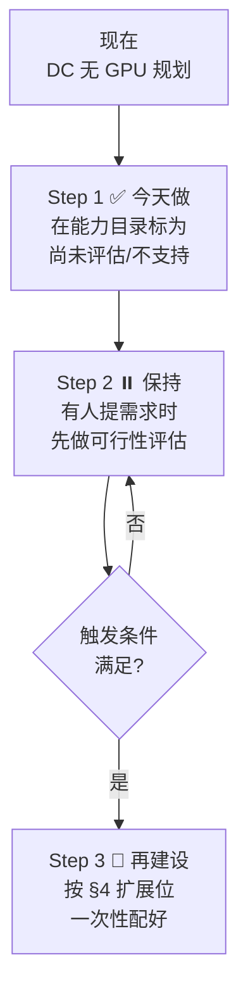

# 18 · GPU / AI 工作负载 —— 架构评估与扩展选项

> **触发**(2026-09-29):DC 平台目前**不支持** GPU / AI 场景,也没有相关规划。
> 本文件是**架构师视角的评估**,不是补文档任务。
>
> **我的结论先说**:不建,但要立刻在能力目录里标为 `尚未评估` + 备好扩展位。
> 理由在 §1,扩展模板在 §4,启动条件在 §5。

---

## 1. 核心判断:不建是对的,而且理由比"没需求"更硬

### 1.1 "还没人用"不是最有力的理由

如果只说"目前没需求",那半年后有人提需求时你还得重新论证一遍。
**下面这三条是结构性的,不随需求变化。**

| # | 理由                                              | 为什么难                                                                 |
| - | ------------------------------------------------- | ------------------------------------------------------------------------ |
| 1 | **GPU 是另一种运维物种**                          | 配额周期以周计、成本以小时计、驱动/版本要管、共享集群里 GPU 一卡多 Pod 就废 |
| 2 | **GCP 没有 per-cluster GPU 独占**                  | 只能做配额隔离 —— 而"隔离性"正是 §7 对 AI 工作负载的硬要求            |
| 3 | **管不好会变成成本黑洞**                            | 空闲 GPU 照样计费;没有 checkpoint/resume 机制时抢占实例会丢训练进度    |

### 1.2 第 3 点要展开,因为它最隐蔽

`vertex-ai/byoc-training.md` 记录了你自己的实证:

> Vertex AI 用 **preemptible GPU** 时(成本降 **60-80%**),节点会被回收。需要 checkpoint + resume。

**这句话的架构含义**:

```
抢占式 GPU(省 60-80% 钱)
   ↕
训练任务随时可能被回收
   ↕
必须实现 checkpoint + resume   ← 这是 Day-2 编排责任
   ↕
而 checkpoint 存在哪?多久存一次?谁负责触发?
```

> **这不是"加个参数"的事,是一整套编排责任。**
> 如果 CaaS 声明支持 GPU,它就必须回答:抢占发生后,是谁负责重调度、
> checkpoint 节奏由谁定、训练状态存 GCS 的哪个桶。

**做 GKE + GPU 集群,意味着你要在自建集群上实现这一整套 —— 而 Vertex AI 已经给你了。**

### 1.3 所以真正的问题不是"要不要做 GPU",是"AI 工作负载归谁"

**这是我在这次评估里最重要的发现。**

RFC §7 把「AI 与 Agent 工作负载」列为四类工作负载场景之一:

> **AI 与 Agent 工作负载** | 加速器 / GPU 需求、模型与数据访问、推理或训练模式…
> | 在放置前验证云厂商与集群的加速器能力、容量、隔离性…

**但这段话隐含了一个前提:AI 工作负载跑在 CaaS 纳管的 K8s 集群上。**

**而你的实际情况是:**

| 你有什么                            | 它说明什么                                   |
| ----------------------------------- | -------------------------------------------- |
| ✅ `vertex-ai/` 4 篇(BYOC 训练/预测、IAM/CI-CD) | **AI 已经在跑,走 Vertex AI 托管服务**        |
| ✅ Vertex AI 有完整 SA 体系(trainer/predictor/pipeline) | **身份体系已建,不是空白**                    |
| ❌ GKE 侧无 GPU 规划                 | **AI 不跑在自建集群上**                        |

> ### 🔴 这意味着 RFC §7 的「AI 与 Agent 工作负载」这一类,在 DC 侧没有对应实体
>
> 如果评审会照 §7 讨论"AI 工作负载如何放置",会发现:
> - CaaS 侧:要设计 AI 准入画像
> - DC 侧:**"我们的 AI 跑在 Vertex AI,不占 CaaS 集群"**
>
> **这是一个必须在 RFC 里说清楚的边界,否则 CaaS 会为一个 DC 不用场景投入设计。**
>
> **建议新增开放问题**:`§7 的 AI 工作负载是否指"跑在 CaaS 纳管集群上的 AI"还是"平台托管的 AI 服务"?`

---

## 2. 我的建议:分三步走



| 步骤         | 动作                                  | 成本   | 什么时候 |
| ------------ | ------------------------------------- | ------ | -------- |
| **Step 1**  | 能力目录里 GPU 相关**明确标 `尚未评估`** + 写明"DC 当前无此场景" | 几分钟 | **今天** |
| **Step 2**  | 保持现状。有人提需求时先做评估,**不要直接承诺**            | 0      | 持续     |
| **Step 3**  | 按 §4 模板建设                          | 数周   | 触发条件满足 |

### 2.1 Step 1 为什么必须今天做

**这不是"填表",是防事故。**

> **如果能力目录里 GPU 那几行是空的,会发生什么?**
>
> CaaS 的放置校验(§7)会看到"加速器需求 = true",去查能力目录,
> **找不到明确的不支持结论 → 放行 → 置备阶段才失败**。
>
> 而按 RFC §8 自己的规矩:"**'尚未评估'不得被解读为'已支持'**" ——
> 这句话保护了 CaaS,但**没有保护业务方**:业务方会在申请阶段被告知"可以",
> 然后在几周后收到失败。
>
> **一条明确的 `不支持`,比一片空白对业务方友好得多。**

---

## 3. 一个必须说清的反面:不做的代价

我不认为只讲"不做的风险"会显得像在推销,所以先讲清楚。

| 不做的代价                                | 严重度 | 缓解方式                                          |
| ----------------------------------------- | ------ | ------------------------------------------------- |
| 有人提需求时你只能"不支持"                | 中     | Step 1 已声明,预期一致                            |
| 竞品/兄弟团队在别的云做了,你落后          | 低     | AI 工作负载本来就不该跑在自建集群上                |
| 未来补建时历史集群不合规                    | **高** | Step 3 的模板里含准入条件,**存量集群不适用**       |
| 能力目录留白被误读为"待办"                | 中     | Step 1 明确写"DC 主动不支持"而非"没填"            |

> **第 3 行是唯一真正重要的。** 如果将来要建,
> **必须现在就决定存量集群怎么处理** —— 和你 BYOC 遇到的 `prod/non-prod 混用`是同一类问题。
> GPU 集群更极端:**存量集群几乎不可能符合 GPU 准入条件**,所以默认它们进不了 CaaS。

---

## 4. 扩展位模板(现在不建,但先定好形状)

> **这是你要的"云平台标准配置应该是什么样"。**
> **它的价值是:将来建设时不用重新设计架构,只需要填参数。**

### 4.1 GPU 集群画像(参考)

```yaml
# gpu-cluster-profile.yaml
# ⚠️ 尚未启用。以下是"如果将来要建"时的标准形状。
apiVersion: caas.internal/gpu/v1
kind: AcceleratorProfile
metadata:
  name: gke-gpu-standard
spec:
  # ── 1. 隔离等级(⛔ 最重要的一栏)────────────────
  isolation:
    level: quota            # 明确:只有配额隔离
    # 可选:dedicated_node_pool(专用节点池)+ 污点/亲和
    # 不可选:per_cluster_exclusive  ← GCP 给不了,写了就是空承诺
    rationale: "GKE 不提供 per-cluster GPU 独占拓扑"

  # ── 2. 机型选择 ──────────────────────────────
  machine:
    #   ⚠️ 必须按 region 分别确认可得性
    families: [nvidia-l4, nvidia-t4, nvidia-a100, nvidia-h100]
    region_availability: "🔶 逐 region 查 gcloud compute machine-types list"

  # ── 3. 配额(⛔ GPU 的真正瓶颈)────────────────
  quota:
    #   提额周期通常以周计 → 必须在申请阶段就检查
    check_before_provision: true
    lead_time_days: "🔶 DC 实测填写"
    #   配额不足时:拒绝放置,而不是置备失败

  # ── 4. 抢占式(⚠️ 需配套 checkpoint)────────────
  preemptible:
    enabled: false          # 默认关闭
    requires: checkpoint_resume
    #   开启即需要 CaaS 编排:checkpoint 周期 + 重调度 + 状态持久化

  # ── 5. 加速器 Pod 密度(硬限制)────────────────
  density:
    pods_per_accelerator_node: 1   # 硬限制,非可调

  # ── 6. 数据与模型 ────────────────────────────
  storage:
    model_bucket: ""         # 模型 GCS 桶(前缀策略,见 cross-project 经验)
    training_data_bucket: ""
  network:
    #   推理访问其他项目的模型服务 → PSC
    #   出网调外部 API → Cloud NAT + 出口白名单

  # ── 7. 身份(可直接复用 Vertex AI 的 SA 设计)────
  identity:
    #   ✅ DC 已有实证(vertex-ai/byoc-iam-cicd.md)
    #   trainer / predictor / pipeline 三 SA 分离
    #   永远不用 default Compute Engine SA,永远不给 roles/owner
    pattern: workload_identity   # WI,不落密钥
```

### 4.2 配套必须一起建的东西(别只建集群)

| 组件                    | 为什么不能少                                                   |
| ----------------------- | -------------------------------------------------------------- |
| **准入校验**            | GPU 需求必须**在放置阶段**校验配额和机型,不能等置备              |
| **checkpoint/resume 编排** | 抢占式 GPU 的前提。**不做这个就不能开抢占式**                    |
| **GPU 配额看板**        | 配额是周级瓶颈,需要有预警而不是申请失败                        |
| **成本归集到 Pod**      | GPU 按秒计费且单价高,不归集就看不到谁在花                       |
| **节点池收敛**          | GPU 节点池闲置 = 持续烧钱(Standard 模式下最容易漏)             |

> **最容易被漏掉的是第 3 和第 5 条。**
> 前者:配额提额要等,等你发现时业务方已经等了一周。
> 后者:Standard 模式下 GPU 节点池没人管,半年后账单会告诉你答案。

### 4.3 准入条件(如果将来建,存量集群怎么处理)

| 条件                        | 存量集群策略                                       |
| --------------------------- | -------------------------------------------------- |
| GPU 节点池机型明确            | 不满足 → **不纳管**(几乎所有存量集群都不满足)     |
| Accelerator Pod ≤1/节点      | 不满足 → 不纳管                                    |
| checkpoint/resume 能力就位    | 不满足 → 不纳管(除非明确不用抢占式)               |
| 配额已覆盖该集群             | 不满足 → **排队,不纳管**                          |

> **建议**:GPU 集群**不参与 BYOC**。
> **理由**:存量集群不可能同时满足"机型明确 + 密度合适 + 配额覆盖"三条件。
> 逐个整改的成本高于新建。**这条写进 RFC 能省掉后面很多扯皮。**

---

## 5. 启动条件(什么时候该建)

**给这四条一个明确的触发线,而不是"看情况"。**

| # | 触发条件                                                    | 为什么是这个阈值                                    |
| - | ----------------------------------------------------------- | --------------------------------------------------- |
| 1 | **有 ≥2 个业务方提出明确的 GPU 需求**                        | 1 个可能是尝鲜,2 个才是真需求                     |
| 2 | **这些需求愿意跑在 K8s 上,而不是 Vertex AI**                 | **最关键的一条** —— 说不清就不该建                  |
| 3 | **GPU 配额已到位**                                          | 没有配额,建了也跑不起来                            |
| 4 | **有人明确承担 checkpoint/resume 的编排责任**                | 无人负责 = 开了抢占式就等于丢训练                   |

> **第 2 条是决定性的。** 如果业务方的 AI 需求是"我要跑训练/推理",
> **Vertex AI 已经满足了,自建 GPU 集群是多余的一层。**
>
> 只有当业务方有 Vertex AI 满足不了的需求时(比如
> 自定义推理框架、特殊依赖、与现有 K8s 工作流强耦合),自建 GPU 集群才成立。
>
> **"说不清为什么不能用 Vertex AI"的时候,就是不该建的时候。**

---

## 6. 给 RFC 的建议(可直接用)

### 6.1 能力目录怎么写

| 能力                | 状态         | caveat                                                   |
| ------------------- | ------------ | -------------------------------------------------------- |
| NVIDIA GPU 节点池   | **尚未评估** | **DC 当前无此场景,主动不支持。** 非技术限制,是范围决策  |
| TPU                 | **尚未评估** | 同上                                                       |
| GPU 独占拓扑        | **不支持**   | GCP 只有配额隔离;**且 DC 当前不提供 GPU 场景**           |
| 每 Pod 独占 GPU     | **不支持**   | 随主项一并声明;Accelerator 类 Pod 每节点限 1 个         |

> **关键是 `尚未评估` 那行要写"DC 主动不支持",而不是留空。**
> 留空 = 别人以为你忘了填;写清楚 = 别人知道这是有意的。

### 6.2 新增开放问题(建议加进 §15)

| ID  | 问题                                                                              | 未解决时的影响                                                              |
| --- | --------------------------------------------------------------------------------- | --------------------------------------------------------------------------- |
| **N10** | **§7 的「AI 与 Agent 工作负载」是否指"跑在 CaaS 纳管集群上的 AI"?**             | **DC 的 AI 走 Vertex AI 托管服务,不占 CaaS 集群。**若不澄清,CaaS 会为一个 DC 不用场景设计准入画像 |
| **N11** | **GPU 场景是否纳入 CaaS 范围?若纳入,存量集群如何处理?**                         | 若纳入且要求存量合规,数十个集群将无法纳管;**建议 GPU 不参与 BYOC**          |
| **N12** | **Vertex AI 等托管 AI 服务是否与 CaaS 共用身份/密钥/网络底座?谁治理?**            | DC 已有 Vertex AI 流水线投产。**共用资源无归属方**                          |

> **N10 是这三条里最重要的。** 它不是关于 GPU 的技术问题,
> 而是关于 **RFC §7 的一个工作负载类别在 DC 侧到底存不存在**。
>
> **这一条你提出来,是在帮 CaaS 避免为不存在的需求做设计。**

---

## 7. 一句话总结

> **不建 GPU 能力是对的决策,不做的风险在可接受范围。**
>
> **但"不建"必须以"明确声明不支持"的形式落地,而不是"留白"。**
>
> **而且真正该向 RFC 提的不是"我们要不要做 GPU",而是:**
> **"§7 的 AI 工作负载类别,在 DC 侧由 Vertex AI 承载,不在 CaaS 集群上 —— 这个边界请写清楚。"**

---

**修订记录**

| 日期       | 内容                                                            |
| ---------- | --------------------------------------------------------------- |
| 2026-09-29 | 初版。架构评估 + 扩展位模板 + 启动条件 + N10/N11/N12            |
