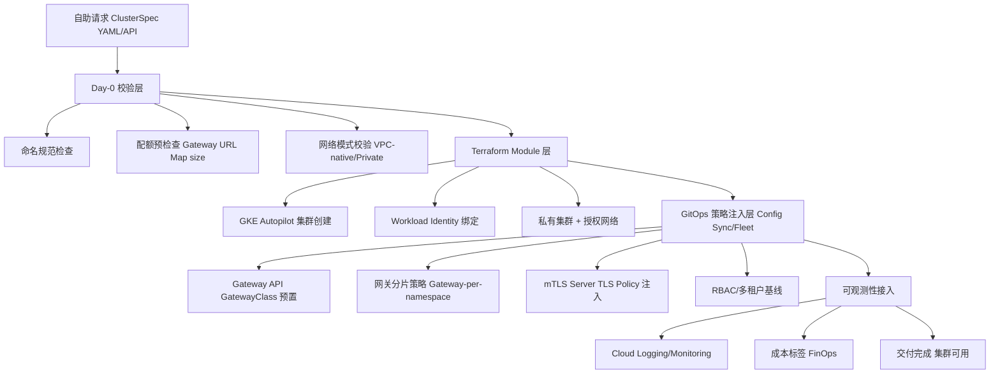
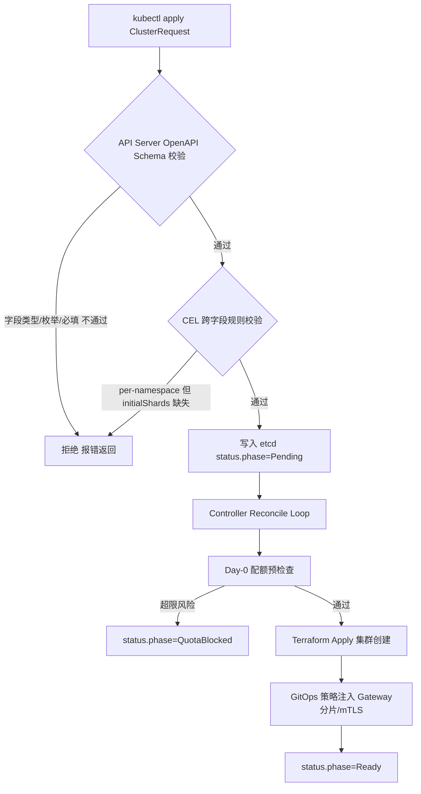
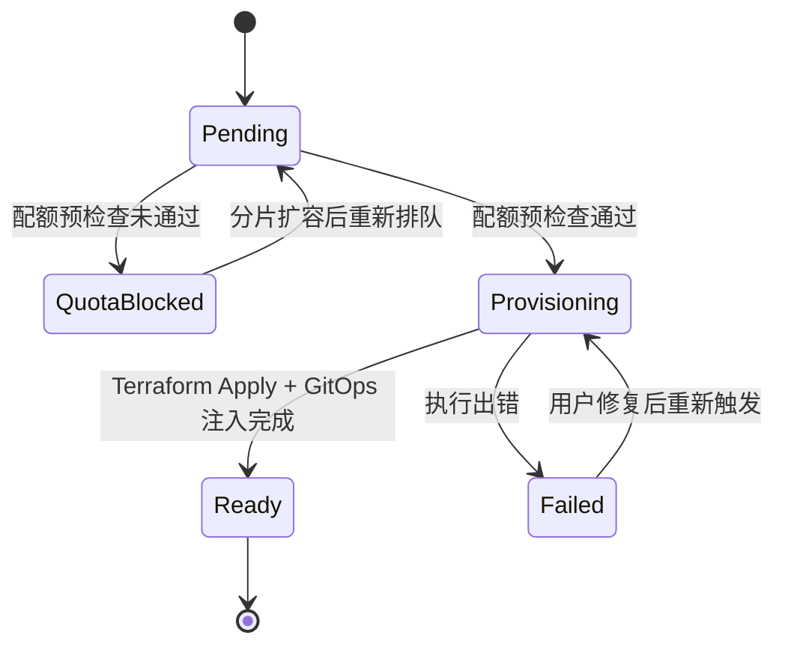
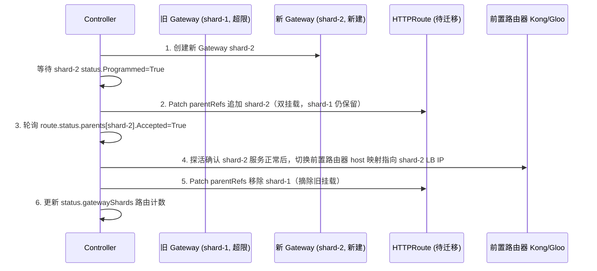
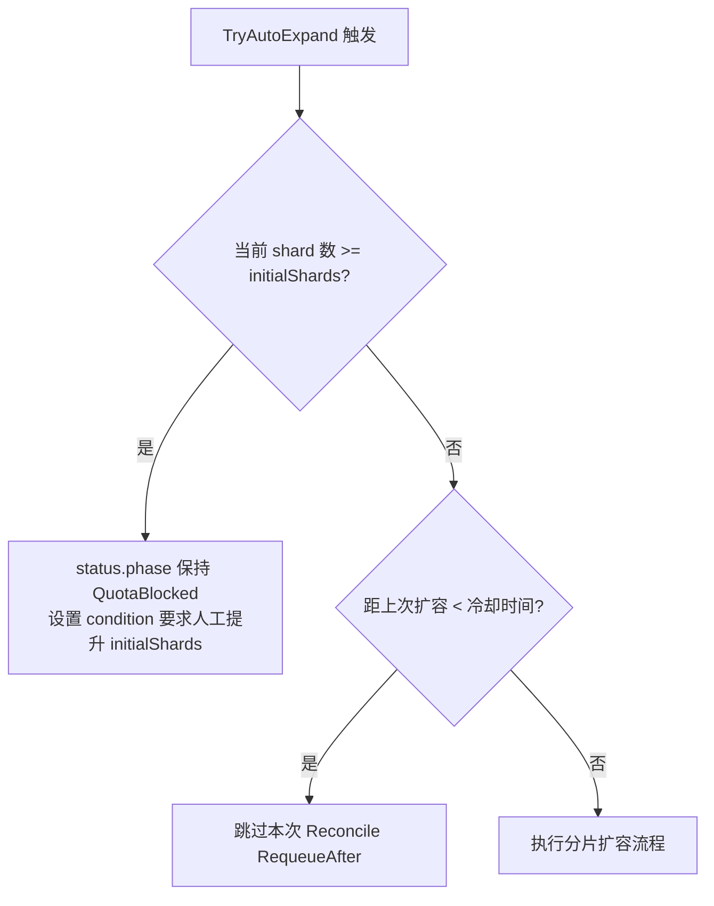

# 问题分析

落地 GKE 这条线，本质是把"创建一个符合生产标准的 GKE 集群"这个动作，沉淀成一套**可复用的自助式交付流水线**，而不是每次手动 `gcloud container clusters create`。

结合你已有的技术栈，这条线要解决四个层面的问题：

1. **集群本身怎么标准化创建**（Autopilot golden path、私有集群、VPC-native）
2. **网络基线怎么自动注入**（Gateway API、mTLS、Ingress 接入你现有的 Gloo/Istio Ambient 体系）
3. **多租户模型怎么定义**（Namespace 隔离 vs 独立集群，这直接关系到你正在处理的 **Gateway API URL Map 配额瓶颈** —— 如果 CaaS 从一开始就按 Gateway-per-namespace 分片设计，可以规避未来大规模迁移再踩同一个坑）
4. **怎么用 GitOps 交付而不是脚本裸跑**（Config Sync / Fleet 统一策略下发）

---

# 解决方案

## 分层架构



## 关键设计决策

| 决策点                | 选择                                                                             | 理由                                                                   |
| --------------------- | -------------------------------------------------------------------------------- | ---------------------------------------------------------------------- |
| Autopilot vs Standard | 默认 Autopilot（golden path）                                                    | 免节点运维，符合"自助式服务"定位；有特殊 GPU/合规需求才逃逸到 Standard |
| 集群粒度              | 团队级共享集群 + Namespace 隔离为主，Autopilot Standard 版逃逸舱口用于强隔离需求 | 结合你正处理的 ~1000 API 迁移，独立集群成本过高                        |
| 网关配额治理          | **CaaS 交付集群时强制预置 Gateway-per-namespace 分片模板**，不等到超限再补       | 直接对应你已知的 URL Map size limit 阻塞项，从设计上前置规避           |
| 策略下发方式          | GKE Fleet + Config Sync（GitOps），不用裸 kubectl apply                          | 保证多集群策略一致性、可审计                                           |
| 网络接入              | 集群创建时即挂载到统一 GatewayClass / Gloo Gateway 数据面                        | 避免"集群交付了但网络没打通"的割裂                                     |

---

# 代码示例

## 1. ClusterSpec 抽象（自助请求的输入 Schema）

```yaml
# clusterspec-example.yaml
apiVersion: caas.internal/v1
kind: ClusterRequest
metadata:
  name: bbuk-team-a-prod
spec:
  cloudProvider: gcp
  region: asia-east1
  tier: autopilot # autopilot | standard
  network:
    mode: private # private | public
    vpc: shared-vpc-prod
    subnet: bbuk-prod-subnet
  gatewayStrategy:
    mode: per-namespace # per-namespace | shared | per-cluster
    initialShards: 3 # 提前规划分片数，避免单 Gateway URL Map 超限
  multiTenancy:
    isolationLevel: namespace
    teams:
      - team-a
      - team-b
  observability:
    monitoringEnabled: true
    costLabel: "bbuk-team-a"
```

## 2. Terraform Module 骨架（Autopilot Golden Path）

```hcl
# modules/gke-autopilot/main.tf
resource "google_container_cluster" "this" {
  name             = var.cluster_name
  location         = var.region
  enable_autopilot = true

  network    = var.vpc_self_link
  subnetwork = var.subnet_self_link

  private_cluster_config {
    enable_private_nodes    = true
    enable_private_endpoint = false
    master_ipv4_cidr_block  = var.master_cidr
  }

  release_channel {
    channel = "REGULAR"
  }

  workload_identity_config {
    workload_pool = "${var.project_id}.svc.id.goog"
  }

  resource_labels = {
    cost-center = var.cost_label
    managed-by  = "caas"
  }
}
```

## 3. 配额预检查脚本（jq 风格，接你现有工具习惯）

```bash
#!/usr/bin/env bash
# precheck-gateway-quota.sh
# 交付前检查目标命名空间下 HTTPRoute 数量，预估 URL Map 是否会逼近限额

NAMESPACE=$1
LIMIT_WARN=800   # 提前预警阈值，避开已知的 URL Map size limit 硬上限

ROUTE_COUNT=$(kubectl get httproute -n "$NAMESPACE" -o json \
  | jq '[.items[].spec.rules[]] | length')

echo "命名空间 [$NAMESPACE] 当前 HTTPRoute 规则数: $ROUTE_COUNT"

if [ "$ROUTE_COUNT" -gt "$LIMIT_WARN" ]; then
  echo "⚠️ 接近 URL Map 配额上限，建议触发 Gateway 分片（新增 shard）"
  exit 1
fi
```

---

# 注意事项

1. **配额问题要设计前置，不是事后补救**：你已经在处理的 ~1000 API 迁移遇到的 Gateway API URL Map size limit，说明"网关分片策略"必须是 CaaS 交付集群时的**默认能力**，而不是后期补丁——建议在 ClusterSpec 里把 `gatewayStrategy.initialShards` 设为必填项。
2. **Preview 配额扩容是临时解**：GCP 的配置大小限制 Preview 程序能缓解但不是长期方案，CaaS 的分片能力才是根本解法，两者可以并行推进。
3. **Autopilot 逃逸舱口要预留**：并非所有场景都适合 Autopilot（比如需要 DaemonSet 特殊调度、GPU 精细控制的场景），CaaS Schema 里 `tier: standard` 分支要留好。
4. **执行 Terraform apply 前务必 `terraform plan` 并检查 IAM 权限**，尤其是 Shared VPC 场景下的跨项目网络管理员权限。
5. **部署 GatewayClass/Fleet 策略前用 `kubectl apply --dry-run=server` 校验 YAML**，避免 Config Sync 同步失败导致集群交付中断。

需要我把 ClusterSpec 进一步细化成完整 CRD（带 OpenAPI Schema 校验），还是先把 Gateway-per-namespace 分片策略的具体 HTTPRoute/Gateway 拆分方案画出来？

# 问题分析

要让 `ClusterRequest` 从"一份人读的 YAML 约定"升级成"K8S 原生可校验的资源"，需要用 **CustomResourceDefinition + OpenAPI v3 Schema**（K8S 1.25+ 还可以加 CEL 表达式做跨字段校验），这样无效请求在 `kubectl apply` 阶段就会被 API Server 拒绝，而不用等到 Terraform/Controller 执行到一半才报错——这对你的 Gateway 分片策略这种"必须提前规划、不能事后补"的字段尤其重要。

---

# 解决方案

## 设计要点

1. **枚举约束**：`cloudProvider`、`tier`、`gatewayStrategy.mode` 等用 `enum` 锁死取值范围
2. **跨字段校验**：用 `x-kubernetes-validations`（CEL）确保 "`gatewayStrategy.mode: per-namespace` 时 `initialShards` 必须 ≥1"，"`isolationLevel: namespace` 时 `teams` 不能为空"
3. **Status 子资源**：区分 spec（用户期望态）和 status（Controller 实际交付态），Controller 只能改 status，权限隔离更清晰
4. **打印列**：`kubectl get clusterrequest` 直接看到 phase、shard 数、region，不用每次 `-o yaml`

## 校验流程



---

# 代码示例

## 1. 完整 CRD 定义（含 OpenAPI Schema + CEL 校验）

```yaml
# crd-clusterrequest.yaml
apiVersion: apiextensions.k8s.io/v1
kind: CustomResourceDefinition
metadata:
  name: clusterrequests.caas.internal
spec:
  group: caas.internal
  scope: Namespaced
  names:
    plural: clusterrequests
    singular: clusterrequest
    kind: ClusterRequest
    shortNames: ["cr", "clreq"]
    categories: ["caas"]
  versions:
    - name: v1
      served: true
      storage: true
      subresources:
        status: {}
      additionalPrinterColumns:
        - name: Provider
          type: string
          jsonPath: .spec.cloudProvider
        - name: Tier
          type: string
          jsonPath: .spec.tier
        - name: GatewayShards
          type: integer
          jsonPath: .spec.gatewayStrategy.initialShards
        - name: Phase
          type: string
          jsonPath: .status.phase
        - name: Age
          type: date
          jsonPath: .metadata.creationTimestamp
      schema:
        openAPIV3Schema:
          type: object
          required: ["spec"]
          properties:
            spec:
              type: object
              required:
                [
                  "cloudProvider",
                  "region",
                  "tier",
                  "network",
                  "gatewayStrategy",
                  "multiTenancy",
                ]
              properties:
                cloudProvider:
                  type: string
                  enum: ["gcp", "aws", "aliyun", "onprem"]
                  description: "目标云厂商，决定使用哪个 Terraform Provider Adapter"
                region:
                  type: string
                  minLength: 1
                  pattern: "^[a-z0-9-]+$"
                tier:
                  type: string
                  enum: ["autopilot", "standard"]
                  default: "autopilot"
                network:
                  type: object
                  required: ["mode", "vpc", "subnet"]
                  properties:
                    mode:
                      type: string
                      enum: ["private", "public"]
                      default: "private"
                    vpc:
                      type: string
                      minLength: 1
                    subnet:
                      type: string
                      minLength: 1
                    masterCidr:
                      type: string
                      pattern: '^([0-9]{1,3}\.){3}[0-9]{1,3}/[0-9]{1,2}$'
                gatewayStrategy:
                  type: object
                  required: ["mode"]
                  properties:
                    mode:
                      type: string
                      enum: ["per-namespace", "shared", "per-cluster"]
                    initialShards:
                      type: integer
                      minimum: 1
                      maximum: 20
                    quotaWarnThresholdRoutes:
                      type: integer
                      minimum: 1
                      default: 800
                      description: "单 Gateway 下 HTTPRoute 规则数预警阈值，避开 URL Map size limit"
                  x-kubernetes-validations:
                    - rule: "self.mode != 'per-namespace' || has(self.initialShards)"
                      message: "gatewayStrategy.mode 为 per-namespace 时必须设置 initialShards"
                multiTenancy:
                  type: object
                  required: ["isolationLevel"]
                  properties:
                    isolationLevel:
                      type: string
                      enum: ["namespace", "cluster"]
                    teams:
                      type: array
                      items:
                        type: string
                      minItems: 0
                  x-kubernetes-validations:
                    - rule: "self.isolationLevel != 'namespace' || (has(self.teams) && size(self.teams) > 0)"
                      message: "isolationLevel 为 namespace 时 teams 至少填一个团队"
                observability:
                  type: object
                  properties:
                    monitoringEnabled:
                      type: boolean
                      default: true
                    costLabel:
                      type: string
                      pattern: "^[a-z0-9-]+$"
              x-kubernetes-validations:
                - rule: "self.tier != 'autopilot' || self.network.mode == 'private'"
                  message: "Autopilot 集群按 golden path 要求必须使用 private 网络模式"
            status:
              type: object
              properties:
                phase:
                  type: string
                  enum:
                    [
                      "Pending",
                      "QuotaBlocked",
                      "Provisioning",
                      "Ready",
                      "Failed",
                    ]
                assignedGatewayShards:
                  type: integer
                clusterEndpoint:
                  type: string
                conditions:
                  type: array
                  items:
                    type: object
                    properties:
                      type: { type: string }
                      status: { type: string }
                      reason: { type: string }
                      lastTransitionTime: { type: string, format: date-time }
```

## 2. 应用与校验效果

```bash
kubectl apply -f crd-clusterrequest.yaml
kubectl apply -f clusterspec-example.yaml
```

若提交的实例违反 CEL 规则（比如 `mode: per-namespace` 但漏填 `initialShards`），API Server 会在准入阶段直接拒绝：

```text
error: ClusterRequest.caas.internal "bbuk-team-a-prod" is invalid:
spec.gatewayStrategy: Invalid value: "object":
gatewayStrategy.mode 为 per-namespace 时必须设置 initialShards
```

## 3. 查看资源状态（用到新增的打印列）

```bash
kubectl get clusterrequest -A
```

```text
NAMESPACE   NAME                PROVIDER   TIER        GATEWAYSHARDS   PHASE     AGE
bbuk        bbuk-team-a-prod    gcp        autopilot   3               Ready     2h
```

---

# 注意事项

1. **CEL 校验（`x-kubernetes-validations`）要求 K8S 1.25+**（1.25 beta，1.29 GA），先确认你的 GKE 集群管理这套 CRD 的控制面版本满足要求，低版本需要退化成 Admission Webhook 做跨字段校验。
2. **`additionalPrinterColumns` 修改后需要重新 `kubectl apply` CRD 本身**，已存在的实例不受影响，但列展示需要 CRD 生效后才刷新。
3. **CRD 校验只能挡住"格式错误"，挡不住"业务超限"**：比如 `initialShards: 3` 格式合法，但实际 HTTPRoute 数已经逼近 URL Map 限额，这类判断仍需 Controller 在 Reconcile 阶段做运行时检查（对应前面 `precheck-gateway-quota.sh` 的逻辑），建议把结果写回 `status.conditions`。
4. **部署前用 `kubectl apply --dry-run=server -f crd-clusterrequest.yaml` 先做服务端校验**，避免 Schema 本身有语法错误导致 CRD 安装失败。

需要我接着把这个 CRD 对应的 **Controller Reconcile 逻辑（伪代码/Go controller-runtime 骨架）** 写出来，还是先把 `QuotaBlocked` 这个 phase 触发后的自动分片（自动创建新 Gateway shard）流程细化

# 搭建 ClusterRequest 控制器的协调循环骨架

# 问题分析

Controller 要做的事情，本质是一个标准的 **Reconcile Loop**：监听 `ClusterRequest` 的增删改，根据 `spec` 与当前 `status.phase` 的差异，驱动状态机往前推进（Pending → QuotaBlocked/Provisioning → Ready），并且要处理**幂等性**（Reconcile 可能被重复触发）和**外部长耗时操作**（Terraform Apply 集群创建不是秒级完成的，不能同步阻塞 Reconcile）。

---

# 解决方案

## 状态机设计



## Reconcile 核心逻辑分层

1. **Fetch + Finalizer 处理**：先判断是否为删除请求，走清理逻辑
2. **幂等性校验**：根据 `status.observedGeneration` 判断 spec 是否有实际变更，避免重复执行 Terraform
3. **状态机分发**：按 `status.phase` 分支处理，而不是每次都从头跑一遍全流程
4. **长耗时操作异步化**：Terraform Apply 通过 Job/外部 Provisioner 触发，Controller 只负责状态流转和轮询结果
5. **RequeueAfter**：而不是 busy-loop，配额检查/Terraform 状态查询都用退避重试

---

# 代码示例

## 1. Controller 骨架（controller-runtime）

```go
package controllers

import (
 "context"
 "fmt"
 "time"

 corev1 "k8s.io/api/core/v1"
 apierrors "k8s.io/apimachinery/pkg/api/errors"
 metav1 "k8s.io/apimachinery/pkg/apis/meta/v1"
 ctrl "sigs.k8s.io/controller-runtime"
 "sigs.k8s.io/controller-runtime/pkg/client"
 "sigs.k8s.io/controller-runtime/pkg/log"

 caasv1 "internal/caas/api/v1"
)

const (
 finalizerName = "caas.internal/cluster-cleanup"
)

// ClusterRequestReconciler 依赖的外部客户端，全部走接口，方便单测 mock
type ClusterRequestReconciler struct {
 client.Client
 QuotaChecker      QuotaChecker      // 对应 precheck-gateway-quota.sh 逻辑的 Go 化
 TerraformRunner   TerraformRunner   // 触发/查询 Terraform Apply Job
 GatewayShardMgr   GatewayShardManager
 GitOpsPolicyApplier GitOpsPolicyApplier
}

func (r *ClusterRequestReconciler) Reconcile(ctx context.Context, req ctrl.Request) (ctrl.Result, error) {
 logger := log.FromContext(ctx)

 // 1. Fetch 当前实例
 var cr caasv1.ClusterRequest
 if err := r.Get(ctx, req.NamespacedName, &cr); err != nil {
  if apierrors.IsNotFound(err) {
   return ctrl.Result{}, nil // 对象已删除，无需处理
  }
  return ctrl.Result{}, err
 }

 // 2. 删除逻辑：Finalizer 处理
 if !cr.ObjectMeta.DeletionTimestamp.IsZero() {
  return r.handleDeletion(ctx, &cr)
 }
 if !containsString(cr.Finalizers, finalizerName) {
  cr.Finalizers = append(cr.Finalizers, finalizerName)
  if err := r.Update(ctx, &cr); err != nil {
   return ctrl.Result{}, err
  }
 }

 // 3. 幂等性检查：spec 未变更且已是终态，直接跳过
 if cr.Status.ObservedGeneration == cr.Generation &&
  (cr.Status.Phase == caasv1.PhaseReady || cr.Status.Phase == caasv1.PhaseFailed) {
  return ctrl.Result{}, nil
 }

 // 4. 按状态机分发处理
 switch cr.Status.Phase {
 case "", caasv1.PhasePending:
  return r.reconcilePending(ctx, &cr)
 case caasv1.PhaseQuotaBlocked:
  return r.reconcileQuotaBlocked(ctx, &cr)
 case caasv1.PhaseProvisioning:
  return r.reconcileProvisioning(ctx, &cr)
 case caasv1.PhaseFailed:
  logger.Info("等待用户修复 spec 后重新触发", "name", cr.Name)
  return ctrl.Result{}, nil
 default:
  return ctrl.Result{}, fmt.Errorf("未知 phase: %s", cr.Status.Phase)
 }
}

// ---- Pending: 配额预检查 ----
func (r *ClusterRequestReconciler) reconcilePending(ctx context.Context, cr *caasv1.ClusterRequest) (ctrl.Result, error) {
 if cr.Spec.GatewayStrategy.Mode == "per-namespace" {
  ok, currentRoutes, err := r.QuotaChecker.CheckGatewayQuota(ctx, cr)
  if err != nil {
   return ctrl.Result{}, err
  }
  if !ok {
   cr.Status.Phase = caasv1.PhaseQuotaBlocked
   setCondition(cr, "QuotaCheck", metav1.ConditionFalse,
    "RouteCountNearLimit",
    fmt.Sprintf("当前路由数 %d 接近 URL Map 限额，需先扩容分片", currentRoutes))
   return r.updateStatus(ctx, cr, ctrl.Result{RequeueAfter: 5 * time.Minute})
  }
 }

 cr.Status.Phase = caasv1.PhaseProvisioning
 setCondition(cr, "QuotaCheck", metav1.ConditionTrue, "Passed", "配额预检查通过")
 return r.updateStatus(ctx, cr, ctrl.Result{Requeue: true})
}

// ---- QuotaBlocked: 等待分片扩容 ----
func (r *ClusterRequestReconciler) reconcileQuotaBlocked(ctx context.Context, cr *caasv1.ClusterRequest) (ctrl.Result, error) {
 shardAdded, err := r.GatewayShardMgr.TryAutoExpand(ctx, cr)
 if err != nil {
  return ctrl.Result{}, err
 }
 if shardAdded {
  cr.Status.Phase = caasv1.PhasePending // 回到 Pending 重新走一遍配额检查
  return r.updateStatus(ctx, cr, ctrl.Result{Requeue: true})
 }
 // 未能自动扩容（比如已达 initialShards 上限），保持 QuotaBlocked，退避轮询
 return ctrl.Result{RequeueAfter: 10 * time.Minute}, nil
}

// ---- Provisioning: 触发 Terraform + GitOps 注入 ----
func (r *ClusterRequestReconciler) reconcileProvisioning(ctx context.Context, cr *caasv1.ClusterRequest) (ctrl.Result, error) {
 status, err := r.TerraformRunner.EnsureApplied(ctx, cr) // 幂等：已存在则查询状态，不存在则触发
 if err != nil {
  cr.Status.Phase = caasv1.PhaseFailed
  setCondition(cr, "TerraformApply", metav1.ConditionFalse, "ApplyError", err.Error())
  return r.updateStatus(ctx, cr, ctrl.Result{})
 }

 switch status {
 case TerraformRunning:
  return ctrl.Result{RequeueAfter: 30 * time.Second}, nil // 轮询，不阻塞
 case TerraformSucceeded:
  if err := r.GitOpsPolicyApplier.ApplyBaseline(ctx, cr); err != nil {
   return ctrl.Result{}, err // 网络基线注入失败，下次 Reconcile 重试
  }
  cr.Status.Phase = caasv1.PhaseReady
  cr.Status.ObservedGeneration = cr.Generation
  setCondition(cr, "Ready", metav1.ConditionTrue, "ClusterProvisioned", "集群创建与策略注入完成")
  return r.updateStatus(ctx, cr, ctrl.Result{})
 default:
  cr.Status.Phase = caasv1.PhaseFailed
  return r.updateStatus(ctx, cr, ctrl.Result{})
 }
}

// ---- 删除：清理云上资源 ----
func (r *ClusterRequestReconciler) handleDeletion(ctx context.Context, cr *caasv1.ClusterRequest) (ctrl.Result, error) {
 if containsString(cr.Finalizers, finalizerName) {
  if err := r.TerraformRunner.EnsureDestroyed(ctx, cr); err != nil {
   return ctrl.Result{RequeueAfter: time.Minute}, err // 销毁失败，重试而不是丢弃 Finalizer
  }
  cr.Finalizers = removeString(cr.Finalizers, finalizerName)
  if err := r.Update(ctx, cr); err != nil {
   return ctrl.Result{}, err
  }
 }
 return ctrl.Result{}, nil
}

func (r *ClusterRequestReconciler) updateStatus(ctx context.Context, cr *caasv1.ClusterRequest, result ctrl.Result) (ctrl.Result, error) {
 if err := r.Status().Update(ctx, cr); err != nil {
  return ctrl.Result{}, err
 }
 return result, nil
}

func (r *ClusterRequestReconciler) SetupWithManager(mgr ctrl.Manager) error {
 return ctrl.NewControllerManagedBy(mgr).
  For(&caasv1.ClusterRequest{}).
  Complete(r)
}
```

## 2. 关键接口定义（便于 mock 单测）

```go
type QuotaChecker interface {
 // 对应 shell 脚本 precheck-gateway-quota.sh 的逻辑
 CheckGatewayQuota(ctx context.Context, cr *caasv1.ClusterRequest) (ok bool, currentRoutes int, err error)
}

type TerraformRunner interface {
 EnsureApplied(ctx context.Context, cr *caasv1.ClusterRequest) (TerraformStatus, error)
 EnsureDestroyed(ctx context.Context, cr *caasv1.ClusterRequest) error
}

type TerraformStatus string

const (
 TerraformRunning   TerraformStatus = "Running"
 TerraformSucceeded TerraformStatus = "Succeeded"
 TerraformFailed    TerraformStatus = "Failed"
)

type GatewayShardManager interface {
 TryAutoExpand(ctx context.Context, cr *caasv1.ClusterRequest) (expanded bool, err error)
}

type GitOpsPolicyApplier interface {
 // 通过 Config Sync/Fleet 下发 GatewayClass、mTLS Policy、RBAC 基线
 ApplyBaseline(ctx context.Context, cr *caasv1.ClusterRequest) error
}
```

---

# 注意事项

1. **`Reconcile` 必须是幂等的**：controller-runtime 的 WorkQueue 可能因为 Watch 事件重放、Leader 切换等原因重复触发同一个 Reconcile，上面用 `status.observedGeneration` 做了基本防重，实际生产建议再结合 Terraform 状态查询（`EnsureApplied` 内部应该先查是否已存在再决定是否 Apply）。
2. **长耗时操作（Terraform Apply）不要同步阻塞 Reconcile**：建议用 Kubernetes Job 或者外部 Provisioner（比如 Crossplane / Config Connector）异步执行，Controller 只负责查询状态和轮询，`RequeueAfter` 用退避策略（30s → 1min → 5min）避免打爆 API。
3. **`Status().Update` 和 `Update` 要分开调用**：如果 CRD 开启了 `subresources.status`（前一步 CRD 定义里已经加了），修改 `status` 字段必须用 `r.Status().Update()`，用普通 `Update()` 不会生效。
4. **Finalizer 逻辑要考虑销毁失败重试**：如果 Terraform Destroy 失败就直接移除 Finalizer，会导致云上资源孤儿（集群还在但 K8S 对象已经没了），上面示例里销毁失败会保留 Finalizer 并 `RequeueAfter` 重试。
5. **建议引入 `client-go` 的 `event recorder`**（`r.Recorder.Event(...)`），把关键状态变化同时写成 K8S Event，方便 `kubectl describe clusterrequest` 直接看到历史，而不用只看 status。

需要我接着把 `GatewayShardManager.TryAutoExpand` 的具体分片扩容逻辑（比如自动创建新 Gateway + 迁移部分 HTTPRoute）细化出来，还是先补充这个 Controller 对应的单元测试骨架（用 `envtest`/`fake client`）？

# 问题分析

`TryAutoExpand` 要解决的核心问题不是"建一个新 Gateway"这么简单，而是：

1. **往哪个新 Gateway 迁移哪些 HTTPRoute**（选择策略要按租户边界，不能把同一个团队的路由拆散到两个 shard）
2. **迁移过程不能中断流量**——因为在 GKE Gateway API 里，一个 Gateway 对应一个独立的 GCP 外部 LB（独立 IP），把 HTTPRoute 从 Gateway A 挪到 Gateway B，意味着**流量入口地址变了**，必须做"双挂载 + 确认健康 + 切流 + 摘除旧挂载"的安全下线流程，而不是一步 `kubectl apply` 切过去
3. **要有扩容边界**：不能无限自动建 shard，超出 `ClusterRequest` 声明的 `initialShards` 预算时要停下来要求人工介入（改 spec），否则会有失控的 LB 成本和治理黑洞

---

# 解决方案

## 迁移流程（双挂载安全切流）



## 扩容边界控制



---

# 代码示例

## 1. Shard 状态数据模型（扩展 CRD status）

```go
type GatewayShardStatus struct {
 Name            string   `json:"name"`
 RouteCount      int      `json:"routeCount"`
 Namespaces      []string `json:"namespaces"`
 LBAddress       string   `json:"lbAddress,omitempty"`
 CreatedAt       metav1.Time `json:"createdAt"`
}

// 追加到之前定义的 ClusterRequestStatus
type ClusterRequestStatus struct {
 Phase                 string                `json:"phase"`
 ObservedGeneration    int64                 `json:"observedGeneration,omitempty"`
 GatewayShards         []GatewayShardStatus  `json:"gatewayShards,omitempty"`
 LastShardExpansionAt  *metav1.Time          `json:"lastShardExpansionAt,omitempty"`
 Conditions            []metav1.Condition    `json:"conditions,omitempty"`
}
```

## 2. `TryAutoExpand` 主逻辑

```go
const shardExpansionCooldown = 10 * time.Minute

func (m *gatewayShardManager) TryAutoExpand(ctx context.Context, cr *caasv1.ClusterRequest) (bool, error) {
 logger := log.FromContext(ctx)

 // 1. 冷却时间检查，避免短时间内反复扩容抖动
 if cr.Status.LastShardExpansionAt != nil &&
  time.Since(cr.Status.LastShardExpansionAt.Time) < shardExpansionCooldown {
  logger.Info("处于扩容冷却期，跳过本次", "name", cr.Name)
  return false, nil
 }

 // 2. 找出超限的 shard
 overloaded := filterOverloaded(cr.Status.GatewayShards, cr.Spec.GatewayStrategy.QuotaWarnThresholdRoutes)
 if len(overloaded) == 0 {
  return false, nil
 }

 // 3. 扩容预算边界检查——不能悄悄超出 spec 声明的 initialShards
 currentShardCount := len(cr.Status.GatewayShards)
 if currentShardCount >= cr.Spec.GatewayStrategy.InitialShards {
  setCondition(cr, "ShardBudgetExceeded", metav1.ConditionTrue,
   "ManualInterventionRequired",
   fmt.Sprintf("当前 shard 数 %d 已达 initialShards 预算，需人工提升该值后才能继续扩容", currentShardCount))
  return false, nil // 不 error，交给上层保持 QuotaBlocked 状态并退避重试
 }

 // 4. 对每个超限 shard 执行扩容
 for _, shard := range overloaded {
  newShardName := nextShardName(cr, currentShardCount)

  newGW, err := m.createShardGateway(ctx, cr, newShardName)
  if err != nil {
   return false, fmt.Errorf("创建新 shard %s 失败: %w", newShardName, err)
  }
  if err := m.waitForGatewayProgrammed(ctx, newGW, 2*time.Minute); err != nil {
   return false, fmt.Errorf("新 shard %s 未就绪: %w", newShardName, err)
  }

  // 5. 按租户边界挑选待迁移路由（不拆散同一团队）
  reduceTarget := shard.RouteCount - cr.Spec.GatewayStrategy.QuotaWarnThresholdRoutes/2 // 迁移到安全水位以下
  candidates, err := m.selectMigrationCandidatesByTenant(ctx, shard, reduceTarget)
  if err != nil {
   return false, err
  }

  // 6. 执行安全切流迁移
  if err := m.migrateRoutes(ctx, candidates, shard.Name, newShardName); err != nil {
   return false, fmt.Errorf("迁移路由到 %s 失败: %w", newShardName, err)
  }

  m.recordShardExpansion(cr, newShardName, candidates)
 }

 now := metav1.Now()
 cr.Status.LastShardExpansionAt = &now
 return true, nil
}
```

## 3. 按租户边界选择迁移候选（避免拆散团队）

```go
// selectMigrationCandidatesByTenant 按 namespace 为最小迁移单元，
// 累加到达到 reduceTarget 路由数即停止，保证同一租户的路由始终在同一个 shard
func (m *gatewayShardManager) selectMigrationCandidatesByTenant(
 ctx context.Context, shard GatewayShardStatus, reduceTarget int,
) ([]HTTPRouteRef, error) {

 nsRouteMap, err := m.groupRoutesByNamespace(ctx, shard.Name)
 if err != nil {
  return nil, err
 }

 // 按 namespace 路由数升序排序，优先迁小的 namespace，减少影响面
 sortedNS := sortNamespacesByRouteCountAsc(nsRouteMap)

 var candidates []HTTPRouteRef
 migrated := 0
 for _, ns := range sortedNS {
  if migrated >= reduceTarget {
   break
  }
  candidates = append(candidates, nsRouteMap[ns]...)
  migrated += len(nsRouteMap[ns])
 }
 return candidates, nil
}
```

## 4. 安全切流迁移（双挂载 → 探活 → 切前置路由 → 摘旧挂载）

```go
func (m *gatewayShardManager) migrateRoutes(
 ctx context.Context, routes []HTTPRouteRef, oldShard, newShard string,
) error {
 logger := log.FromContext(ctx)

 // Step 1: 双挂载——追加新 Gateway 为 parentRef，旧的先保留
 for _, r := range routes {
  if err := m.patchAddParentRef(ctx, r, newShard); err != nil {
   return fmt.Errorf("route %s 双挂载失败: %w", r.Name, err)
  }
 }

 // Step 2: 轮询确认所有路由在新 shard 上 Accepted
 if err := m.waitForRoutesAccepted(ctx, routes, newShard, 3*time.Minute); err != nil {
  // 回滚：移除刚追加的 parentRef，避免留下悬挂状态
  for _, r := range routes {
   _ = m.patchRemoveParentRef(ctx, r, newShard)
  }
  return fmt.Errorf("新 shard 上路由未能全部 Accepted，已回滚: %w", err)
 }

 // Step 3: 探活确认新 shard 实际可服务流量（非仅 API 状态）
 if err := m.probeShardHealth(ctx, newShard, routes); err != nil {
  for _, r := range routes {
   _ = m.patchRemoveParentRef(ctx, r, newShard)
  }
  return fmt.Errorf("新 shard 探活失败，已回滚: %w", err)
 }

 // Step 4: 切换前置路由器（Kong/Gloo）host 映射到新 shard LB 地址
 if err := m.frontRouterUpdater.SwitchHostMapping(ctx, routes, newShard); err != nil {
  return fmt.Errorf("前置路由切流失败，保留双挂载状态待人工介入: %w", err)
 }

 logger.Info("前置路由已切换到新 shard，开始摘除旧 shard 挂载", "newShard", newShard)

 // Step 5: 摘除旧 Gateway 挂载，真正释放旧 URL Map 空间
 for _, r := range routes {
  if err := m.patchRemoveParentRef(ctx, r, oldShard); err != nil {
   // 旧挂载摘除失败不回滚新流量（流量已在新 shard 正常），只记录告警待人工清理
   logger.Error(err, "摘除旧 shard 挂载失败，需人工清理", "route", r.Name)
  }
 }
 return nil
}
```

---

# 注意事项

1. **跨 Gateway 迁移会改变外部 IP，必须有前置路由器兜底**：这也是为什么设计里假设你的架构里有 Kong/Gloo 这类前置层做 host 级路由——如果没有这一层，直接让 DNS 指向单个 Gateway IP，那么分片迁移会导致该 host 的对外地址变化，需要走 DNS TTL 生效周期，风险和延迟都大得多。
2. **双挂载期间两个 Gateway 都在消耗各自的 URL Map 配额**：这是临时状态，Step 5 摘除旧挂载不能省略，否则旧 shard 的配额并没有真正释放，等于没解决问题。
3. **`reduceTarget` 取阈值的一半而不是刚好压线**：给后续新增路由留缓冲，避免刚扩容完就立刻又逼近限额触发新一轮扩容抖动。
4. **`probeShardHealth` 的具体实现要真实发流量验证**（比如带 Host header 的 curl 探测，可以复用你现有的 `k8s-gateway-fqdn-claude.sh` 思路做 E2E 验证），只看 K8S status 的 `Accepted=True` 不代表 GCP LB 侧真的把流量转发通了。
5. **Step 5 失败要走告警而不是回滚**：因为此时新 shard 已经在服务流量了，回滚会造成二次风险，正确做法是记录告警、人工介入清理旧挂载，控制器不做自动回滚。
6. **`initialShards` 触顶后的人工介入路径要打通**：建议对接告警系统（比如 PagerDuty/企业内部 IM），`ShardBudgetExceeded` condition 一旦出现就主动通知负责人去评估是否提升 `spec.gatewayStrategy.initialShards`。

需要我接着把 `probeShardHealth` 的具体探活实现（结合你现有的 FQDN 追踪脚本思路）细化出来，还是先把 `frontRouterUpdater.SwitchHostMapping` 对接 Kong/Gloo 的具体配置方式写出来？
