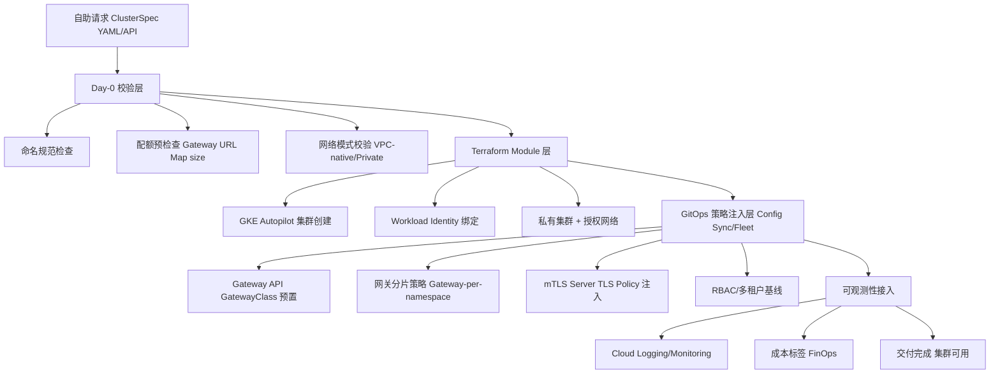
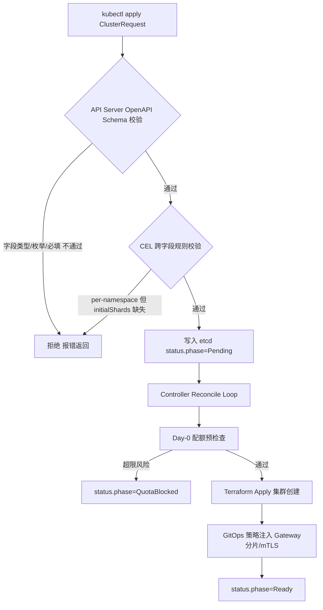

# 问题分析

落地 GKE 这条线，本质是把"创建一个符合生产标准的 GKE 集群"这个动作，沉淀成一套**可复用的自助式交付流水线**，而不是每次手动 `gcloud container clusters create`。

结合你已有的技术栈，这条线要解决四个层面的问题：

1. **集群本身怎么标准化创建**（Autopilot golden path、私有集群、VPC-native）
2. **网络基线怎么自动注入**（Gateway API、mTLS、Ingress 接入你现有的 Gloo/Istio Ambient 体系）
3. **多租户模型怎么定义**（Namespace 隔离 vs 独立集群，这直接关系到你正在处理的 **Gateway API URL Map 配额瓶颈** —— 如果 CaaS 从一开始就按 Gateway-per-namespace 分片设计，可以规避未来大规模迁移再踩同一个坑）
4. **怎么用 GitOps 交付而不是脚本裸跑**（Config Sync / Fleet 统一策略下发）

---

# 解决方案

## 分层架构



## 关键设计决策

| 决策点                | 选择                                                                             | 理由                                                                   |
| --------------------- | -------------------------------------------------------------------------------- | ---------------------------------------------------------------------- |
| Autopilot vs Standard | 默认 Autopilot（golden path）                                                    | 免节点运维，符合"自助式服务"定位；有特殊 GPU/合规需求才逃逸到 Standard |
| 集群粒度              | 团队级共享集群 + Namespace 隔离为主，Autopilot Standard 版逃逸舱口用于强隔离需求 | 结合你正处理的 ~1000 API 迁移，独立集群成本过高                        |
| 网关配额治理          | **CaaS 交付集群时强制预置 Gateway-per-namespace 分片模板**，不等到超限再补       | 直接对应你已知的 URL Map size limit 阻塞项，从设计上前置规避           |
| 策略下发方式          | GKE Fleet + Config Sync（GitOps），不用裸 kubectl apply                          | 保证多集群策略一致性、可审计                                           |
| 网络接入              | 集群创建时即挂载到统一 GatewayClass / Gloo Gateway 数据面                        | 避免"集群交付了但网络没打通"的割裂                                     |

---

# 代码示例

## 1. ClusterSpec 抽象（自助请求的输入 Schema）

```yaml
# clusterspec-example.yaml
apiVersion: caas.internal/v1
kind: ClusterRequest
metadata:
  name: bbuk-team-a-prod
spec:
  cloudProvider: gcp
  region: asia-east1
  tier: autopilot # autopilot | standard
  network:
    mode: private # private | public
    vpc: shared-vpc-prod
    subnet: bbuk-prod-subnet
  gatewayStrategy:
    mode: per-namespace # per-namespace | shared | per-cluster
    initialShards: 3 # 提前规划分片数，避免单 Gateway URL Map 超限
  multiTenancy:
    isolationLevel: namespace
    teams:
      - team-a
      - team-b
  observability:
    monitoringEnabled: true
    costLabel: "bbuk-team-a"
```

## 2. Terraform Module 骨架（Autopilot Golden Path）

```hcl
# modules/gke-autopilot/main.tf
resource "google_container_cluster" "this" {
  name             = var.cluster_name
  location         = var.region
  enable_autopilot = true

  network    = var.vpc_self_link
  subnetwork = var.subnet_self_link

  private_cluster_config {
    enable_private_nodes    = true
    enable_private_endpoint = false
    master_ipv4_cidr_block  = var.master_cidr
  }

  release_channel {
    channel = "REGULAR"
  }

  workload_identity_config {
    workload_pool = "${var.project_id}.svc.id.goog"
  }

  resource_labels = {
    cost-center = var.cost_label
    managed-by  = "caas"
  }
}
```

## 3. 配额预检查脚本（jq 风格，接你现有工具习惯）

```bash
#!/usr/bin/env bash
# precheck-gateway-quota.sh
# 交付前检查目标命名空间下 HTTPRoute 数量，预估 URL Map 是否会逼近限额

NAMESPACE=$1
LIMIT_WARN=800   # 提前预警阈值，避开已知的 URL Map size limit 硬上限

ROUTE_COUNT=$(kubectl get httproute -n "$NAMESPACE" -o json \
  | jq '[.items[].spec.rules[]] | length')

echo "命名空间 [$NAMESPACE] 当前 HTTPRoute 规则数: $ROUTE_COUNT"

if [ "$ROUTE_COUNT" -gt "$LIMIT_WARN" ]; then
  echo "⚠️ 接近 URL Map 配额上限，建议触发 Gateway 分片（新增 shard）"
  exit 1
fi
```

---

# 注意事项

1. **配额问题要设计前置，不是事后补救**：你已经在处理的 ~1000 API 迁移遇到的 Gateway API URL Map size limit，说明"网关分片策略"必须是 CaaS 交付集群时的**默认能力**，而不是后期补丁——建议在 ClusterSpec 里把 `gatewayStrategy.initialShards` 设为必填项。
2. **Preview 配额扩容是临时解**：GCP 的配置大小限制 Preview 程序能缓解但不是长期方案，CaaS 的分片能力才是根本解法，两者可以并行推进。
3. **Autopilot 逃逸舱口要预留**：并非所有场景都适合 Autopilot（比如需要 DaemonSet 特殊调度、GPU 精细控制的场景），CaaS Schema 里 `tier: standard` 分支要留好。
4. **执行 Terraform apply 前务必 `terraform plan` 并检查 IAM 权限**，尤其是 Shared VPC 场景下的跨项目网络管理员权限。
5. **部署 GatewayClass/Fleet 策略前用 `kubectl apply --dry-run=server` 校验 YAML**，避免 Config Sync 同步失败导致集群交付中断。

需要我把 ClusterSpec 进一步细化成完整 CRD（带 OpenAPI Schema 校验），还是先把 Gateway-per-namespace 分片策略的具体 HTTPRoute/Gateway 拆分方案画出来？

# 问题分析

要让 `ClusterRequest` 从"一份人读的 YAML 约定"升级成"K8S 原生可校验的资源"，需要用 **CustomResourceDefinition + OpenAPI v3 Schema**（K8S 1.25+ 还可以加 CEL 表达式做跨字段校验），这样无效请求在 `kubectl apply` 阶段就会被 API Server 拒绝，而不用等到 Terraform/Controller 执行到一半才报错——这对你的 Gateway 分片策略这种"必须提前规划、不能事后补"的字段尤其重要。

---

# 解决方案

## 设计要点

1. **枚举约束**：`cloudProvider`、`tier`、`gatewayStrategy.mode` 等用 `enum` 锁死取值范围
2. **跨字段校验**：用 `x-kubernetes-validations`（CEL）确保 "`gatewayStrategy.mode: per-namespace` 时 `initialShards` 必须 ≥1"，"`isolationLevel: namespace` 时 `teams` 不能为空"
3. **Status 子资源**：区分 spec（用户期望态）和 status（Controller 实际交付态），Controller 只能改 status，权限隔离更清晰
4. **打印列**：`kubectl get clusterrequest` 直接看到 phase、shard 数、region，不用每次 `-o yaml`

## 校验流程



---

# 代码示例

## 1. 完整 CRD 定义（含 OpenAPI Schema + CEL 校验）

```yaml
# crd-clusterrequest.yaml
apiVersion: apiextensions.k8s.io/v1
kind: CustomResourceDefinition
metadata:
  name: clusterrequests.caas.internal
spec:
  group: caas.internal
  scope: Namespaced
  names:
    plural: clusterrequests
    singular: clusterrequest
    kind: ClusterRequest
    shortNames: ["cr", "clreq"]
    categories: ["caas"]
  versions:
    - name: v1
      served: true
      storage: true
      subresources:
        status: {}
      additionalPrinterColumns:
        - name: Provider
          type: string
          jsonPath: .spec.cloudProvider
        - name: Tier
          type: string
          jsonPath: .spec.tier
        - name: GatewayShards
          type: integer
          jsonPath: .spec.gatewayStrategy.initialShards
        - name: Phase
          type: string
          jsonPath: .status.phase
        - name: Age
          type: date
          jsonPath: .metadata.creationTimestamp
      schema:
        openAPIV3Schema:
          type: object
          required: ["spec"]
          properties:
            spec:
              type: object
              required:
                [
                  "cloudProvider",
                  "region",
                  "tier",
                  "network",
                  "gatewayStrategy",
                  "multiTenancy",
                ]
              properties:
                cloudProvider:
                  type: string
                  enum: ["gcp", "aws", "aliyun", "onprem"]
                  description: "目标云厂商，决定使用哪个 Terraform Provider Adapter"
                region:
                  type: string
                  minLength: 1
                  pattern: "^[a-z0-9-]+$"
                tier:
                  type: string
                  enum: ["autopilot", "standard"]
                  default: "autopilot"
                network:
                  type: object
                  required: ["mode", "vpc", "subnet"]
                  properties:
                    mode:
                      type: string
                      enum: ["private", "public"]
                      default: "private"
                    vpc:
                      type: string
                      minLength: 1
                    subnet:
                      type: string
                      minLength: 1
                    masterCidr:
                      type: string
                      pattern: '^([0-9]{1,3}\.){3}[0-9]{1,3}/[0-9]{1,2}$'
                gatewayStrategy:
                  type: object
                  required: ["mode"]
                  properties:
                    mode:
                      type: string
                      enum: ["per-namespace", "shared", "per-cluster"]
                    initialShards:
                      type: integer
                      minimum: 1
                      maximum: 20
                    quotaWarnThresholdRoutes:
                      type: integer
                      minimum: 1
                      default: 800
                      description: "单 Gateway 下 HTTPRoute 规则数预警阈值，避开 URL Map size limit"
                  x-kubernetes-validations:
                    - rule: "self.mode != 'per-namespace' || has(self.initialShards)"
                      message: "gatewayStrategy.mode 为 per-namespace 时必须设置 initialShards"
                multiTenancy:
                  type: object
                  required: ["isolationLevel"]
                  properties:
                    isolationLevel:
                      type: string
                      enum: ["namespace", "cluster"]
                    teams:
                      type: array
                      items:
                        type: string
                      minItems: 0
                  x-kubernetes-validations:
                    - rule: "self.isolationLevel != 'namespace' || (has(self.teams) && size(self.teams) > 0)"
                      message: "isolationLevel 为 namespace 时 teams 至少填一个团队"
                observability:
                  type: object
                  properties:
                    monitoringEnabled:
                      type: boolean
                      default: true
                    costLabel:
                      type: string
                      pattern: "^[a-z0-9-]+$"
              x-kubernetes-validations:
                - rule: "self.tier != 'autopilot' || self.network.mode == 'private'"
                  message: "Autopilot 集群按 golden path 要求必须使用 private 网络模式"
            status:
              type: object
              properties:
                phase:
                  type: string
                  enum:
                    [
                      "Pending",
                      "QuotaBlocked",
                      "Provisioning",
                      "Ready",
                      "Failed",
                    ]
                assignedGatewayShards:
                  type: integer
                clusterEndpoint:
                  type: string
                conditions:
                  type: array
                  items:
                    type: object
                    properties:
                      type: { type: string }
                      status: { type: string }
                      reason: { type: string }
                      lastTransitionTime: { type: string, format: date-time }
```

## 2. 应用与校验效果

```bash
kubectl apply -f crd-clusterrequest.yaml
kubectl apply -f clusterspec-example.yaml
```

若提交的实例违反 CEL 规则（比如 `mode: per-namespace` 但漏填 `initialShards`），API Server 会在准入阶段直接拒绝：

```text
error: ClusterRequest.caas.internal "bbuk-team-a-prod" is invalid:
spec.gatewayStrategy: Invalid value: "object":
gatewayStrategy.mode 为 per-namespace 时必须设置 initialShards
```

## 3. 查看资源状态（用到新增的打印列）

```bash
kubectl get clusterrequest -A
```

```text
NAMESPACE   NAME                PROVIDER   TIER        GATEWAYSHARDS   PHASE     AGE
bbuk        bbuk-team-a-prod    gcp        autopilot   3               Ready     2h
```

---

# 注意事项

1. **CEL 校验（`x-kubernetes-validations`）要求 K8S 1.25+**（1.25 beta，1.29 GA），先确认你的 GKE 集群管理这套 CRD 的控制面版本满足要求，低版本需要退化成 Admission Webhook 做跨字段校验。
2. **`additionalPrinterColumns` 修改后需要重新 `kubectl apply` CRD 本身**，已存在的实例不受影响，但列展示需要 CRD 生效后才刷新。
3. **CRD 校验只能挡住"格式错误"，挡不住"业务超限"**：比如 `initialShards: 3` 格式合法，但实际 HTTPRoute 数已经逼近 URL Map 限额，这类判断仍需 Controller 在 Reconcile 阶段做运行时检查（对应前面 `precheck-gateway-quota.sh` 的逻辑），建议把结果写回 `status.conditions`。
4. **部署前用 `kubectl apply --dry-run=server -f crd-clusterrequest.yaml` 先做服务端校验**，避免 Schema 本身有语法错误导致 CRD 安装失败。

需要我接着把这个 CRD 对应的 **Controller Reconcile 逻辑（伪代码/Go controller-runtime 骨架）** 写出来，还是先把 `QuotaBlocked` 这个 phase 触发后的自动分片（自动创建新 Gateway shard）流程细化
