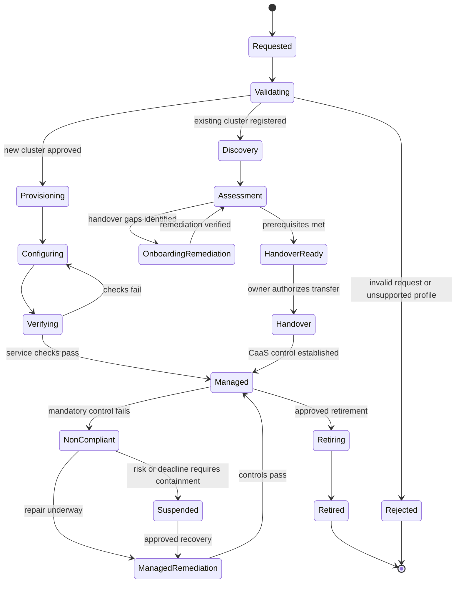

# RFC：app.caep 的 Cluster-as-a-Service（CaaS）能力

| 字段 | 内容 |
| --- | --- |
| State | prediscussion |
| Scope | _**[待补充]** —— 原文档中该字段缺失，需由作者回填。_ |
| Labels | platform, kubernetes, infrastructure, security, multi-cloud platform, cluster, cloud |
| Author | _**[待补充]** —— 原文档中无此信息。_ |
| Last updated | _**[待补充]** —— 原文档中无此信息。_ |

> **阅读说明.** 本文件由原 RFC 的 OCR 结果重建。结构性损坏（全部 Markdown 表格、Mermaid
> 状态图、章节编号、若干列表项）已修复。内容层面的不确定之处以 `**[待补充]**` 或 `**[存疑]**`
> 原地标注，**不做臆造**。每一处修复均登记在
> [附录 A —— OCR 修复日志](#附录-a--ocr-修复日志) 与
> [附录 B —— 章节编号对照](#附录-b--章节编号对照)。未改动的 OCR 原始输出保留在
> `rfc-ocr-original.md` 中以供比对。

---

## 摘要

本 RFC 定义了 app.caep 中 Cluster-as-a-Service（CaaS）能力的整体框架。范围涵盖通过平台新建的
集群，以及一条 Bring Your Own Cluster（BYOC，即"自带集群"）路径，用于将既有 Kubernetes
集群纳管至 app.caep CaaS。该服务必须通过面向特定云厂商的适配器支持 AWS、GCP、阿里云
（Ali）以及 caep 内部云（IKP），并在其后提供一致的生命周期、治理与开发者接口。

CaaS 拥有集群的生命周期及其运维契约：声明、置备或 BYOC 纳管、配置、升级、策略执行、可观测性、
恢复与退役。一旦 BYOC 集群完成移交，app.caep CaaS 即成为其运维方与权威管控平面，采用与新建
集群相同的持续管控与服务流程。管控平面必须自动完成期望状态对账，并能检测或修复漂移。安全管控
必须在技术可行的范围内自动化，并针对 caep Kubernetes Security Standard 产出可追溯的证据。该
标准是权威来源；本 RFC 不替代、也不重新解释其中的具体控制项条款。

本提案的目标是为工作负载提供一个可预测的 Kubernetes 目标环境，同时允许实现细节随云厂商与
区域而变化。只有当集群的云厂商画像、安全态势、归属关系与运维证据均满足已发布的服务要求时，
该集群才具备承载 app.caep 工作负载的资格。

---

## 1. 背景

app.caep 在公有云与内部云环境中都需要 Kubernetes 容量。新集群需要一条可重复、且受策略治理的
创建路径；既有集群同样需要一条务实的进入平台的路径——若要求每个团队都替换掉正在正常运行的
基础设施，将拖慢采纳速度并引入本可避免的迁移风险。反之，若在缺乏严格基线的前提下就接收既有
集群，则平台级的安全与支持承诺将无法被强制执行。

因此，本服务需要两条最终收敛到同一份纳管集群契约的进入路径：

1. **Create（新建）：** app.caep 基于已批准的云厂商与区域画像，使用平台自有的、版本化的配置
   置备集群。
2. **Bring Your Own Cluster（自带集群）：** 集群归属方登记既有集群、同意管理权移交、解决纳管
   缺口，并在与新建集群完全相同的持续契约下，将集群的日常运维职责移交给 app.caep CaaS。

两条路径最终必须收敛到同一套清单、策略、身份、可观测性、支持与生命周期系统。云厂商之间的差异
应作为能力与约束被显式记录，而不是用"所有云功能完全一致"这种错误说法掩盖起来。

---

## 2. 目标

1. 为 AWS、GCP、Ali 与 IKP 定义一致的、云厂商中立的 CaaS 契约，涵盖版本化的云厂商与区域能力、
   集群生命周期、清单、工作负载访问方式与支持预期。
2. 在同一份纳管集群契约下支持两条集群进入路径：自动完成新集群的创建，并为既有集群提供一条
   可审计的 BYOC 纳管与经营权移交路径，包括发现、评估、整改、例外处理、持续运营、暂停与退役。
3. 在整个生命周期内实现安全、可观测的集群自动化运维：完成期望状态对账，管理配置与升级，
   检测并处置漂移，将 Kubernetes Security Standard 映射为管控措施与证据，并跟踪归属、数据分级、
   位置、成本与合规状态。

---

## 3. 非目标

- 定义新的应用部署模型，或替换现有的统一清单（unified manifest）。
- 管理应用容器镜像的构建与制品要求——这些仍由相应的平台标准约束。
- 不顾工作负载影响而自动修复每一条安全发现项。整改必须采用受控的灰度发布与恢复流程。
- 将纳管检查视作持续合规与运维健康管理的替代品。
- 在各责任方验证之前，就先行确定云厂商产品选型、区域允许清单、服务等级或数值化的 SLO。

---

## 4. 术语

| 术语 | 含义 |
| --- | --- |
| CaaS | 平台用于申请、置备或接管、治理、运维及退役 Kubernetes 集群的能力。 |
| 纳管集群（Managed cluster） | 已登记进 CaaS 清单、并受 app.caep 服务的生命周期、安全、支持与证据要求约束的集群。 |
| 云厂商（Provider） | 由 CTOi 云工程团队提供的底层基础设施云厂商。 |
| 管控画像（Control profile） | 依据集群的环境、数据分级与暴露面所应用的、一组版本化的平台配置与策略要求。 |
| BYOC 纳管（BYOC onboarding） | 将一个既有集群纳管到 CaaS 之下的受控流程，涵盖发现、评估、整改、集成与移交。 |

---

## 5. 服务原则

**声明意图；云厂商细节从已批准的画像中解析。** 消费方在申请集群时声明用途、环境数量、位置、
容量区间与所需能力；他们**不**通过一个未经校验的申请单去自行挑选管控平面配置或申请安全例外。

**一份契约，多种实现。** 每个云厂商适配器都实现同一套生命周期与证据接口。云厂商特有功能以
**已声明的能力**形式对外暴露，绝不默认假定其具备可移植性。

**对账即运维模型。** 已批准的期望状态与实际观测状态持续比对。漂移被上报；安全的变更自动对账
修复；可能影响工作负载或可用性的变更走既定的灰度发布与审批路径。

**安全是持续过程，而非仅在准入时的一次关卡。** 管控措施在置备或 BYOC 纳管阶段被评估，此后持续
被评估。一个纳管集群可能从合规变为不合规，因此必须定义明确的收敛（containment）与恢复状态。

**纳管是经营权移交，而不只是贴个标签。** 既有集群在满足移交前置条件、且 CaaS 具备运维它所需的
权限与集成能力之前，不算 CaaS 纳管。完成移交后，它被按与 CaaS 新建集群相同的基线进行纳管。
任何被允许的安全例外，都必须保持显式、已审批且有时限，并作为持续合规的一部分被跟踪。

---

## 6. 服务模型

### 6.1 角色与职责

| 角色 | 职责 |
| --- | --- |
| 应用归属方（Application Owner） | CaaS 的消费方，对提供该集群的功能性与非功能性需求负责。功能性需求包括工作负载用途、所需的 Kubernetes 能力、集成关系与部署约束；非功能性需求包括可用性、性能、容量与扩缩容、恢复、数据分级与数据驻留、安全，以及维护窗口约束。应用归属方审批纳管与经营权移交，提供工作负载上下文，并协调应用层面的变更与整改。app.caep 自身也是 CaaS 的消费方。 |
| app.caep Compute | CaaS 的服务提供方与服务 Owner。定义服务契约、支撑能力与服务边界；拥有 CaaS 实现、管控平面、云厂商适配器、申请与清单接口、生命周期自动化与服务路线图；并与安全架构、SRE 及云工程师共同建立平台策略与治理机制。 |
| app.caep SRE | 在服务边界内负责 CaaS 与纳管集群的生产可运维性与可靠性，涵盖服务健康、监控、值班、事件响应、维护与升级执行、恢复、运维就绪度，以及向 app.caep Compute 反馈可靠性问题。 |
| 网络安全 / 安全架构师（Cyber / Security Architect） | 解释 Kubernetes Security Standard 及其他适用的安全要求；定义并审批安全管控与证据要求；就风险、例外与补偿性管控提供建议；并为云厂商画像与 CaaS 策略提供安全保证。 |
| CTOi 云工程师（Cloud Engineer in CTOi） | 提供云厂商能力、约束、API、配额、区域、网络与身份集成、维护要求、支持边界与升级路径；并与 app.caep Compute 合作实现与验证云厂商适配器及画像。 |

详细的 RACI（包括服务策略、安全例外与运维变更的审批权限）必须在生产上线前达成一致。app.caep
Compute 拥有 CaaS 服务及其实现；app.caep SRE 负责运维；应用归属方消费该服务并定义工作负载需求；
网络安全 / 安全架构师治理安全要求；CTOi 云工程师提供并验证云厂商特有能力。

### 6.2 集群生命周期

> 17 个状态、24 条迁移，其中 16 条带标签。状态名称与迁移标签均为原文照录。请注意，两条进入
> 路径虽最终都汇入 `Managed`，但走向不同：Create 路径为
> `Provisioning → Configuring → Verifying`，BYOC 路径为
> `Assessment → HandoverReady → Handover`。二者自 `Validating` 之后不再共用任何状态，直至在
> `Managed` 汇合。详见[附录 A.2](#a2-集群生命周期图--先重建后核实)。

管控平面记录每一次状态迁移，包含时间戳、执行者或自动化身份、画像版本、决策以及证据引用。移交
事件需记录：归属方的授权、CaaS 接受的管理范围、所授予的权限、尚未关闭的已批准例外，以及 CaaS
成为权威运维方的时间点。状态名称与确切的迁移策略均为待评审提案。

### 6.3 纳管集群契约

每一个 CaaS 纳管集群必须满足以下最小契约：

1. **一份 CaaS 集群资源（CRD）。** 一份版本化的 Kubernetes 自定义资源定义，描述该集群的身份、
   元数据与置备配置。新集群应基于 CRD 中的声明自动置备。所有 app.caep 集群都应具备该定义，
   BYOC 集群亦然。
2. **一套被强制执行的安全基线。** 集群运行其安全画像所要求的、已批准的安全策略与强制执行组件。
   CaaS 持续检查这些策略是否已安装、处于启用状态、配置正确，并在产出状态 / 证据；各类发现项、
   例外与整改状态均可归因到具体集群，并留存以备审计。
3. **一份工作负载准入画像。** 所引用的画像定义了哪些工作负载可以被接入该集群：所需的工作负载
   属性与能力、适用的功能性与非功能性约束，以及排除项或放置限制。工作负载的准入与放置必须
   在部署前评估这些准入条件；该画像及其版本可从集群 CRD 中被发现。
4. **一份退出计划。** 集群拥有一份经归属方批准的、用于退出 CaaS 或退役的书面计划。该计划识别
   工作负载与服务依赖、迁移或过渡职责、数据导出与处置、访问权限回收、基础设施清理、审计 / 证据
   留存，以及执行该计划所需的条件与审批。
5. **经过实测的备份、恢复与灾难恢复。** 集群的备份范围、恢复流程、恢复目标与灾难恢复态势
   须满足所分配的服务等级与数据要求。恢复与灾备演练按约定周期执行，其带日期的结果、差距、
   责任人与整改措施记录在 CaaS 清单中。
6. **一份自动的工作负载清单。** CaaS 针对实时的 Kubernetes 与平台数据源，发现并持续对账运行在
   集群上的工作负载。该清单记录工作负载身份、命名空间、归属的应用 / 团队、环境、相关画像或
   策略状态以及生命周期状态；它能识别未知、孤立或不合策略的工作负载，并将其关联至整改流程。
   该清单不得仅依赖于人工维护的声明。

BYOC 移交之后，CaaS 在约定的管理边界内拥有集群的常规配置、安全策略强制执行、升级、漂移整改、
监控与运维响应。应用归属方保留应用与数据的所有权，并遵循 CaaS 的变更流程与应急访问流程。画像
与管控要求均为版本化，并映射至相应标准；CaaS 纳管状态是持续性的，其合规状态、例外与证据新鲜度
需持续可见。

---

## 7. 工作负载承载场景

CaaS 必须支持托管在纳管集群上的不同工作负载类别，而不只是通用的应用服务。每个工作负载通过
集群申请单与工作负载准入画像声明自身需求。CaaS 依据这些需求来选定兼容的云厂商、集群与管控
画像，并由准入 / 放置管控强制执行由此产生的准入规则。

所有工作负载类别都继承集群的强制安全基线、归属、清单、可观测性、恢复与生命周期要求。专用画像
可以追加约束或管控措施，但**不得**在无声中削弱共享基线。当某项要求无法被满足时，CaaS 必须
拒绝放置该工作负载，或要求在适用的治理流程下取得一项显式批准的例外。

| 工作负载场景 | 需在工作负载画像中记录的要求 | CaaS 放置与运维考量 |
| --- | --- | --- |
| 通用应用 | 运行时与 Kubernetes 能力、可用性与性能目标、扩缩容、网络依赖、数据分级、数据驻留，以及维护窗口约束。 | 仅可放置于那些云厂商、区域、安全、网络与服务等级画像均满足所声明要求的集群上。 |
| 大型或专业客户工作负载 | 客户专属的规模、隔离性、连通性、韧性、运维与合规要求，包含任何区别于标准服务画像的约束。 | 评估是否需要专属集群、专属容量或额外管控措施；记录双方商定的画像与归属关系。客户专属需求是评估需求的起点。 |
| AI 与 Agent 工作负载 | 加速器 / GPU 需求、模型与数据访问、推理或训练模式、资源上限、网络出口、身份、密钥、隔离，以及任何 Agent 工具访问要求。 | 在放置前验证云厂商与集群的加速器能力、容量、隔离性、数据位置约束与策略兼容性。与 Agent Substrate 协调集成与支持要求。 |
| 数据类工作负载 | 数据体量与位置、存储类型与吞吐 / 时延、保留期、备份与恢复、数据流动、数据驻留、处理规模与访问模式。 | 选定满足数据驻留与恢复要求的集群及存储 / 网络画像；使跨区域或跨云厂商的数据流动显式化并受治理。 |

以上场景是一份初始目录，并非详尽清单。app.caep Compute 拥有版本化的工作负载画像模型；应用
归属方声明工作负载需求；CTOi 云工程师发布云厂商能力；app.caep SRE 验证运维要求；网络安全 /
安全架构师审批安全管控与例外。画像归属、schema 以及首批支撑的工作负载类别，必须在生产上线前
达成一致。

---

## 8. 云厂商覆盖与能力画像

**[进行中]**

CaaS 必须通过各自独立版本化的云厂商适配器支持 AWS、GCP、Ali 与 IKP。服务契约是统一的；每个
云厂商画像记录其实现方式以及它**无法**提供什么。

画像必须以**已支持**、**有限支持**、**不支持**或**尚未评估**这四种状态来声明能力。**"尚未评估"
不得被解读为"已支持"。** 工作负载放置必须在置备或 BYOC 纳管之前，将所申请的能力与选定画像做
校验。

能力项包括 —— 地理支持、IAM、服务网格等。**[待补充]** —— 完整的能力目录在原文档中并未列举，
需定义为一个版本化的 schema，由 app.caep Compute 拥有，CTOi 云工程师参与贡献。

置备失败与检查失败必须保持可见，且可归因到具体申请单。部分置备不得产生无人追踪的集群。任何
清理动作都必须先校验归属，并保留审计与事件证据。

> **编者注.** 原文档中此段落以略有差异的措辞出现了两次。上文保留了第一个版本；第二个版本
> 收录在[附录 A](#附录-a--ocr-修复日志)中，供作者二选一。

---

## 9. 自带集群（BYOC）

**[进行中 —— 由 Chris 补充]**

BYOC 是一条让既有 Kubernetes 集群进入 app.caep CaaS 并由其运维的路径。就绪检查用于确认该集群
可以安全移交并被安全纳管。在移交完成之前，既有归属方仍负责运维该集群。

移交完成之后，app.caep CaaS 在约定的服务边界内拥有集群的日常管理权，并对新置备的集群应用相同
的管控、支持与生命周期流程。

### 9.1 准入条件

应用归属方必须提供云厂商、位置、租户 / 应用清单、Kubernetes 版本、数据分级、工作负载与依赖
关系、维护窗口约束，以及当前运维模式。归属方必须**先**授权只读发现，然后才授予 CaaS 在移交后
纳管该集群所需的云厂商与集群权限。

该集群必须运行在 CaaS 支持的云厂商之上：AWS、GCP、Ali 或 IKP。该云厂商与位置必须具备已评估的
画像，且该画像支持该集群的各项要求。

应用必须提供**相互独立**的非生产与生产集群实例。每个实例都独立登记、独立纳管，并且必须先满足
相应的 CaaS 要求，之后才能被纳管或用于该环境下的工作负载。

**[待补充]**

### 9.2 纳管与移交阶段

| 阶段 | 活动 | 退出条件（Exit condition） |
| --- | --- | --- |
| 1. Register（登记） | 建立清单记录，识别责任明确的归属方，界定集群与工作负载范围，并商定发现访问权限。 | 形成完整且可归因的应用与集群记录。 |
| 2. Discover（发现） | 在不改动集群的前提下，采集版本化配置、云厂商元数据、访问路径、网络、扩展组件、工作负载与可用遥测数据。 | 证据足以支撑评估，且采集时间与来源均已记录。 |
| 3. Assess（评估） | 评估适用的安全、能力与运维要求；区分通过（pass）、失败（fail）、不适用（N/A）与未知（unknown）。 | 发现项、归属与所需变更已达成一致；**"未知"不被当作"通过"**。 |
| 4. Remediate（整改） | 规划并实施所需变更，包含依赖、责任人、目标日期、影响面、回滚方案，以及任何风险例外。 | 所有移交前置条件均通过，仅剩策略明确允许且经被授权审批方批准的例外。 |
| 5. Integrate（集成） | 打通 CaaS 清单、身份、策略评估、遥测、漂移监控、支持路由、备份与云厂商 API。 | CaaS 具备履行其全部管理职责所需的访问权限与集成能力。 |
| 6. Authorize handover（授权移交） | 归属方接受管理边界与变更流程；CaaS 确认权限、基线、支持就绪度与恢复计划。 | 同时留有现归属方与被授权的 CaaS 服务 Owner 的记录化批准。 |
| 7. Transfer control（移交控制权） | CaaS 接管期望状态与集群日常运维；管理凭据与管控平面集成被启用并接受审计。 | 清单状态变更为 Managed；CaaS 对账具备权威性。 |
| 8. Operate（运营） | 按标准 CaaS 运维模型管理该集群，持续评估管控措施与服务健康度。 | 持续的 CaaS 纳管，发现项与例外通过正常服务流程与审计轨迹跟踪。**[存疑]** —— 原句在此处被截断。 |

### 9.3 移交契约

移交时，集群归属方保留业务应用、工作负载与数据的所有权。app.caep CaaS 承担其已发布服务边界
内的集群层配置与运维职责，涵盖期望状态管理、已批准的安全管控措施、升级、漂移整改、平台集成、
监控与运维响应。

云厂商层的基础设施职责，仍按各云厂商画像的定义，由相应云厂商或内部云运维方承担。

移交之后，CaaS 成为期望集群状态的权威来源。原集群运维方**不得**再进行常规的带外（out-of-band）
集群变更；确需变更时须走 CaaS 流程。应急变更使用书面约定的 break-glass（打破常规）路径，事后需
被对账并接受审计。管理边界必须写明：云厂商账号 / 网络底座、工作负载层运维、备份与恢复、事件
响应，以及可能中断工作负载的变更，分别由谁负责。

### 9.4 纳管结果与保护措施

- **Managed（已纳管）：** 移交已完成，CaaS 具备所需的权限与集成，该集群按纳管集群契约被运维。
  合规发现项与任何经策略批准的例外保持可见并被持续评估。
- **Remediation required（需整改）：** 在商定的纳管缺口被解决期间，该集群仍由其原归属方运维；
  不得对外宣称为 CaaS 已纳管，也不得按此提供支持。
- **Not supportable（无法支持）：** 云厂商、配置或归属模式无法满足 CaaS 前置条件。除非该阻断性
  条件发生变化，该集群保持在 CaaS 管理范围之外。
- **Suspended or management withdrawn（已暂停或管理权收回）：** 一个已被纳管的集群，可能因 CaaS
  失去所需访问权限、触及关键风险阈值，或管理契约被违反，而通过经批准的流程被收敛（contain）或
  移出 CaaS 管理。工作负载的连续性，以及运维责任的回归，必须事先规划并记录在案。

发现阶段从只读开始。提权仅针对已批准的集成、整改或管理步骤授予，且可独立审计。管控变更须与
归属方共同规划与测试；具破坏性的变更需要约定的变更窗口与回滚计划。**不会**仅仅为了纳管该集群
就迁移、重启或删除既有工作负载与数据，除非有已批准的变更单。管控画像的持续变更与证据刷新，按
正常的 CaaS 运维流程处理；纳管不会被周期性重复地当作一次独立的审批活动。

**[待补充]** —— 同一账号下集群与其他资源之间的边界需要评估。IAM 模型与 R&R（角色与职责）需要
达成一致。

---

## 10. 管控平面自动化

管控平面是期望状态与证据的权威自动化通道。它应暴露一个版本化的 API，并在可用的情况下，与平台
既有的申请、身份、变更、清单与审计系统集成。

| 自动化能力 | 必需行为 |
| --- | --- |
| 申请校验（Request validation） | 在产生副作用之前，校验 schema、授权、归属、云厂商能力、位置、配额、数据分级与策略。 |
| 置备与接管（Provisioning and adoption） | 通过适配器创建资源，或发现既有资源；使用幂等操作，并记录部分失败。 |
| 对账（Reconciliation） | 比对已批准的期望状态与观测状态；按严重性与可逆性对漂移分类；自动修复安全漂点，并将高风险变更路由至变更管控流程。 |
| 配置与策略（Configuration and policy） | 应用版本化的管控画像与已批准的插件；防止未获批准的配置成为期望状态。 |
| 升级管理（Upgrade management） | 跟踪支持窗口，测试受支持的版本跃迁，排期升级，通报影响，并上报被阻塞或逾期的集群。 |
| 容量与配额（Capacity and quota） | 在置备前检测配额或容量上限；对饱和状态告警，并确保自动扩缩容边界始终处于已批准策略之内。 |
| BYOC 纳管与接管（BYOC onboarding and adoption） | 发现并评估既有集群，跟踪整改，核验纳管权限与集成，记录归属方授权，并将权威的期望状态控制权移交给 CaaS。 |
| 清单与成本（Inventory and cost） | 持续将云厂商资源与清单对账；施加强制标签或等效记录；上报孤立资源与未打标资源。 |
| 备份与恢复（Backup and recovery） | 对照所分配的服务等级核验配置与数据备份状态；留存恢复演练结果与恢复责任人。 |
| 退役（Retirement） | 校验归属方批准与依赖关系，回收访问权限，通过受控自动化移除云厂商资源，并保留必要的审计记录。 |
| 审计与证据（Audit and evidence） | 为申请、评估、变更、访问、例外与生命周期迁移产出防篡改事件，附带来源与时间戳。 |

自动化必须在可行范围内为**发现**、**常规对账**与**特权整改**使用彼此独立的身份。凭据必须通过
已批准的密钥管理系统存储与轮换，**绝不可**内嵌在源码、清单或日志中。所有变更型操作必须是幂等的，
或具备书面说明的恢复行为。

---

## 11. 安全标准自动化与保证

caep Kubernetes Security Standard 是 Kubernetes 安全要求的规范性来源。起草本稿期间该标准内容
无法获取，因为其页面需要通过 Confluence 进行认证访问。因此，下文所描述的是一个自动化与证据
**框架**，而非对该标准控制项的经核验转录。在本 RFC 获批之前，安全架构团队必须确认该标准的当前
版本，并完成权威的控制项映射。

### 11.1 控制项映射

每一条适用的标准控制项，都必须在 app.caep 策略库中以一条版本化的**编码策略**（coded policy）
来表示——它与 Compute / Policy Fabric 产品之间的集成。**[存疑]** 原文中"该编码策略对应标准中的
哪一条具体策略或要求"这句已损坏，其意图无法恢复，需由作者重写。

### 11.2 证据与报告

该服务应提供一个集群级的合规视图，以及可导出的证据包，其中包含：集群身份与范围、云厂商 / 画像与
管控目录的版本、各管控项的执行结果、时间戳与证据来源、例外与审批、发现项与整改历史，以及纳管
状态与移交记录。对详细证据的访问权限，必须按其敏感程度加以限制。**仪表盘不能替代**源证据与
审计事件的留存。

证据留存周期、审计系统集成，以及监管或鉴证报告的格式，是留待安全架构团队与审计相关方决策的
开放问题。

---

## 12. 运维与服务管理

**[待补充]** —— 该服务设计必须在生产上线前定义以下内容，**其明细未能在原文档中保留下来**。整体
应与 app.caep SRE 战略保持一致。

---

## 13. 已考虑的备选方案

**[待补充]** —— 原文档中无任何内容。

---

## 14. 决策记录

| ID | 决策 | 提案责任人 |
| --- | --- | --- |
| D1 | example | example |

---

## 15. 开放问题

| ID | 问题 | 未解决时的影响 |
| --- | --- | --- |
| O1 | Example | **[待补充]** —— 该列在 OCR 中丢失，需填写。 |

---

## 附录 A —— OCR 修复日志

以下列出对 OCR 输出所做的全部结构性修改及其判断依据。逐条列出，以便作者逐项接受或回退。

### A.1 从塌陷的纯文本中重建的表格

| # | 位置 | 修复内容 |
| --- | --- | --- |
| T1 | §4 术语 | 单元格值重新拼装。`BYOC` + `onboarding` 合并为单个术语 **BYOC 纳管**。 |
| T2 | §6.1 角色 | 被换行拆散的角色名重新拼装：`Application` + `Owner` → **应用归属方**；`Cyber l` + `Security` + `Architect` → **网络安全 / 安全架构师**；`Cloud` + `Engineer in` + `CTOi` → **CTOi 云工程师**。 |
| T3 | §7 工作负载场景 | 重建 3 列 × 4 行。`Al and agent workload` 修正为 **AI 与 Agent 工作负载**（小写 l → 大写 I）。 |
| T4 | §9.2 BYOC 阶段 | 重建 3 列 × 8 行。阶段序号修复：OCR 将第 6 阶段渲染为 `.6`、第 8 阶段渲染为 `6.Operate`。正确序列为 1–8。 |
| T5 | §10 管控平面自动化 | 重建 2 列 × 11 行。`BYOC onboarding and` 被截断 → **BYOC onboarding and adoption（纳管与接管）**，与 §6.3 中"置备或接管"的用词保持一致。 |
| T6 | §14 / §15 | 表头行已找回：`ID` / `Decision` / `Proposed owner` 与 `ID` / `Issue` / `Impact if unresolved`。 |

### A.2 集群生命周期图 —— 先重建、后核实

该图最初塌陷为 18 个状态名与 13 个条件标签的平铺列表。状态与条件由该列表找回，**但边（迁移
关系）没有找回**——OCR 未留下任何痕迹，因此第一次重建是依据正文推断出一张 24 条边的图。
这张推断图**有 10 条迁移是错的**（详见下表）。

随后拿到了源平台的集群生命周期图（`rfc-source-cluster-lifecycle.png`）并完成转录：**17 个状态、
24 条迁移、其中 16 条带标签**。§6.2 中的图现已与之完全一致。将推断图与源图做机器化逐边比对，
结果如下：

**推断错误的 10 条边 —— 其中数条影响重大：**

| 推断（错误） | 源图（正确） | 为何要紧 |
| --- | --- | --- |
| `Managed → ManagedRemediation` | `Managed → NonCompliant` | **`NonCompliant` 成了孤立状态**——没有任何边能进入它，整条"强制管控项失败"的路径在图中是死路。 |
| `NonCompliant → …`（无入边） | `Managed → NonCompliant : mandatory control fails` | 同上 |
| `OnboardingRemediation → HandoverReady` | `OnboardingRemediation → Assessment` | 整改完成后必须回到 **Assessment** 重新评估，而非直接推进到移交。推断的那条边会让集群在**尚未完成评估**的情况下进入移交。 |
| ——（缺失） | `Assessment → HandoverReady : prerequisites met` | 这是进入 `HandoverReady` 的**唯一**通路。缺了它，BYOC 分支就终止在 `Assessment`。 |
| `HandoverReady → Configuring` | `HandoverReady → Handover` | **两条进入路径被串错了**——BYOC 集群被路由进了**新建集群**路径的 `Configuring` 状态。 |
| `Configuring → Handover` | `Provisioning → Configuring` | 在 Create 路径上 `Configuring` 不可达。 |
| `Handover → Verifying` | `Configuring → Verifying` | `Verifying` 只能从错误的一侧到达。 |
| `Verifying → OnboardingRemediation` | `Verifying → Configuring : checks fail` | Create 路径的检查失败被错误地路由进了 **BYOC** 的整改状态。 |
| ——（缺失） | `Handover → Managed : CaaS control established` | **BYOC 路径根本没有通往 `Managed` 的任何路线。** |
| `Managed → Managed : controls pass`（自环） | `ManagedRemediation → Managed : controls pass` | 该自环是凭空捏造的；真实的那条边属于整改出口。 |

**边数巧合，值得记一笔。** 推断图同样是 24 条边——与源图总数完全一致，但其中只有 14 条正确。
**只数边数会完全掩盖这个错误。** 这正是本次采用逐边机器比对、而非人工目视核对的原因。

**标签.** 16 条迁移标签在第一次重建时全部正确——OCR 残留的标签碎片是可靠的。错的只有边。

**结构性发现.** 两条进入路径的独立性比正文所暗示的更强。Create 路径
（`Provisioning → Configuring → Verifying`）与 BYOC 路径
（`Discovery → Assessment → HandoverReady → Handover`）自 `Validating` 之后**不共用任何状态**，
仅在 `Managed` 汇合。推断版错误地把 BYOC 穿行进了 Create 路径的状态。

### A.3 词级修正

| OCR 原文 | 修正为 | 判断依据 |
| --- | --- | --- |
| `Al and agent workload` | `AI and agent workload` | 上下文为加速器 / GPU 工作负载。 |
| `underlining infra provider` | `underlying infra provider` | 原文笔误。 |
| `epair underway` | `repair underway` | 损坏的条件标签。 |
| `identific ation` / `identific ed` | `identification` / `identified` | 换行产生的伪影。 |
| `he exact policy or requirement` | *（不可恢复 —— 未作修正）* | 该句语义仍不完整，标注 `**[存疑]**` 而非猜测。 |
| `Cyber l` | `Cyber /` | 表格单元格损坏。 |
| `A6` / `Authorize handover` | `6. Authorize handover` | 阶段序号损坏。 |
| `6. Operate` | `8. Operate` | 与第 6 阶段重复；序列实际终止于 8。 |
| `Caas` | `CaaS` | 统一为 §4 术语表中定义的拼写。**若 `Caas` 与 `CaaS` 实为两个刻意区分的名称，请回退此项。** |
| `R&R` | `R&R（角色与职责）` | 展开形式仅为辅助；缩写本身出自作者。 |
| `large-client requirements is a starting point` | `Large-client requirements are a starting point` | 表格单元格内的语法修复。 |
| `all app.caep cluster` | `all app.caep clusters` | 语法修复。 |
| `# of environments` | `number of environments` | 符号被 OCR 破坏。 |

### A.4 被重排的段落碎片

OCR 把若干段落以错乱顺序输出。每一段都已按上下文句法所要求的位置重新插入：

- "Both paths must converge on the same inventory, policy, identity, observability, support, and
  lifecycle systems." —— 原被穿插进 §1 的列表第 2 项中；已移出，作为列表后的独立段落。
- "Workload admission and placement must evaluate these entry criteria before deployment…" ——
  原从 §6.3 第 3 项脱落；已重新归位。
- "After BYOC handover, CaaS owns routine cluster configuration…" —— 原从 §6.3 脱落；已移至
  六项契约条目之后的段落中，其位置应在此处。
- "app.caep SRE validates operational requirements" —— §7 的收尾句被拆成三段不相邻的文本，且
  句尾先于句首出现；已重新接合。

### A.5 重复的内容

§8 中有两个措辞略有重叠的"置备失败"段落。保留了第一个；第二个转载于此，供作者取舍：

> *"Failures must leave the request in a visible state with retry or cleanup behavior. Partial
> provisioning must not create untracked clusters. Destructive cleanup requires ownership checks and
> must preserve audit and incident evidence."*

### A.6 **刻意不予臆造**的内容

以下内容在原文中为空或被截断，均保留为 `**[待补充]**` 交由作者填写：

1. RFC 的 `Scope` 取值。
2. RFC 作者与最后更新日期。
3. §8 中的完整云厂商能力目录（"geographic support, IAM, mesh, etc."）。
4. §9.2 第 8 阶段的退出条件。
5. §9.4 中 R&R 的定义。
6. §11.1 的控制项映射论断。
7. §12 运维的枚举明细 —— 仅"需要定义它"这一要求保留下来。
8. §13 已考虑的备选方案 —— 完全缺失。
9. §15 "未解决时的影响"一列的取值。

### A.7 已与源平台核对

本重建完成后，作者提供了两张源平台截图用于核对：

| 截图 | 对应章节 | 核对结果 |
| --- | --- | --- |
| `rfc-source-service-model.png` | §6.1 | **逐字核实通过**——五个角色名、两列表头、每一个单元格，以及表格下方的 RACI 段落全部相符。 |
| `rfc-source-cluster-lifecycle.png` | §6.2 | **核实通过**——17 个状态、24 条迁移、16 个标签；在修正 10 处错误后与源图完全一致。详见 A.2。 |

**除 §6.1 与 §6.2 之外，没有任何内容与源平台进行过核对。** 其余全部章节目前仍然只依赖 OCR 文本。

> **命名说明.** 本文档中的组织名称已做归一化处理。若某名称在源平台中以其他形式出现，正文一律
> 使用归一化后的形式。请勿从源平台反推名称并重新引入原始写法。

---

## 附录 B —— 章节编号对照

OCR 过程摧毁了文档原有的章节编号。仅有极少数编号残留，且彼此矛盾——同一个数字被用于不同的
章节，另有若干章节完全没有编号。下表记录了残留片段，以便与原文交叉核对。

| OCR 片段 | 原文上下文 | OCR 误读为 | 判定 |
| --- | --- | --- | --- |
| `• Background` | "app.caep needs Kubernetes capacity…" | `1` | 项目符号——全文中唯一可信的 `1`。 |
| `3. Define a consistent, provider-neutral CaaS contract…` | 目标一 | `3` | 目标列表被渲染为 3/4/5；详见下方说明。 |
| `4. Support both cluster entry paths…` | 目标二 | `4` | — |
| `5. Automate secure, observable cluster operations…` | 目标三 | `5` | — |
| `2 Provider Coverage and Capability Profiles` | "CaaS must support AWS, GCP, Ali, and IKP…" | `2` | 与顺序编号方案矛盾。 |
| `2 Onboarding outcomes and safeguards` | "Managed: handover is complete…" | `2` | 自相矛盾；且被误判为顶级章节。 |
| `c Entry criteria` | "The Application Owner must provide provider…" | `9.1` | `c` ≈ `9.`。 |
| `e Operations and Service Management` | "The service design must define…" | `12` | `e` ≈ `12`。 |
| `11`（开放问题表中） | "Example" | `O1` / `I1` | 字母开头的 ID 被误读为数字。 |

**目标编号.** 三条目标被 OCR 识别为第 3、4、5 项。由于 §1 中的编号列表（`1. Create` /
`2. Bring Your Own Cluster`）属于正文内部结构，而目标章节理应独立从 1 开始，因此该 +2 的偏移
判定为 OCR 错误，已重编号为 1–3。**若原文确实编为 3–5，请回退**——两种情况下文字本身均未改动。

**编号决策.** 章节已按顺序重编为 1–15，子章节编号也统一处理（6.1–6.3、9.1–9.4、11.1–11.2）。
§9 下的子章节在源 OCR 中原本是一个**平铺**列表——"Handover contract"与"Onboarding outcomes and
safeguards"完全没有编号——现依据"二者应归属于 BYOC 标题之下"的假设，被提升为 9.3 与 9.4。
**若作者本意是让"Handover contract"作为顶级章节存在，请将其提升为顶级并重编 §10 及之后的编号。**
