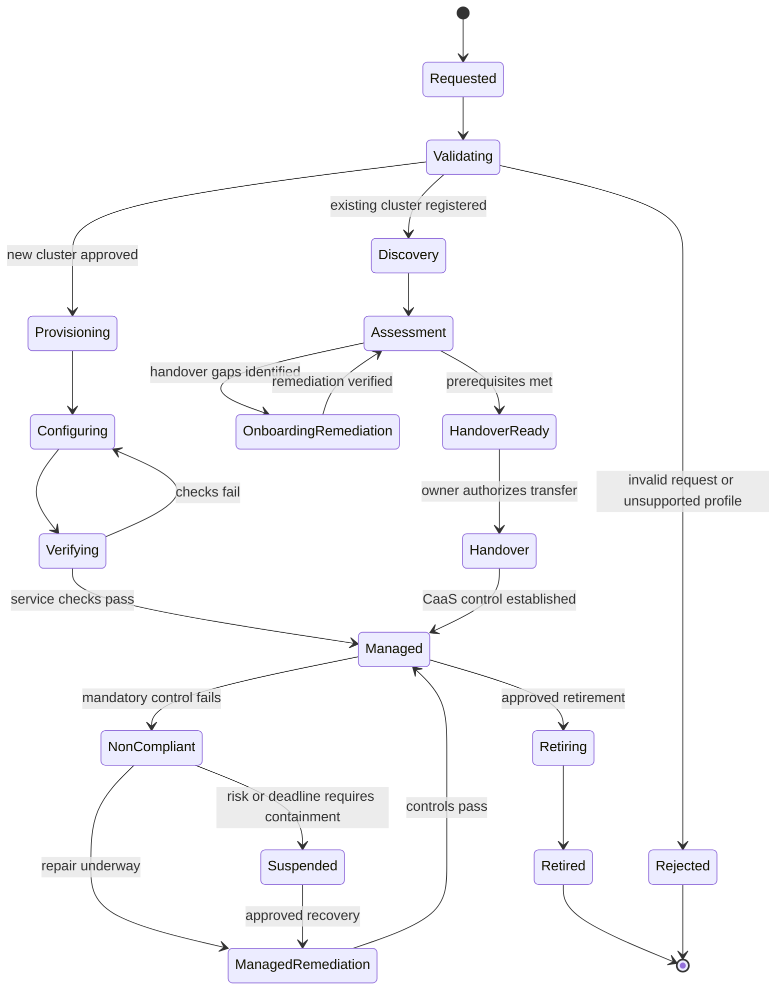

# RFC: Cluster-as-a-Service (CaaS) for app.caep

| Field | Value |
| --- | --- |
| State | prediscussion |
| Scope | _**[TBD]** — value missing from the source document; must be restored by the author._ |
| Labels | platform, kubernetes, infrastructure, security, multi-cloud platform, cluster, cloud |
| Author | _**[TBD]** — not present in the source document._ |
| Last updated | _**[TBD]** — not present in the source document._ |

> **Reading note.** This file was reconstructed from an OCR pass over the original RFC. Structural
> damage (all Markdown tables, the Mermaid state diagram, section numbering, and several list
> items) has been repaired. Content-level uncertainty is marked inline as `**[TBD]**` or `**[?]**`
> rather than invented. Every repair is itemised in
> [Appendix A — OCR Repair Log](#appendix-a--ocr-repair-log) and
> [Appendix B — Section Numbering Reconciliation](#appendix-b--section-numbering-reconciliation).
> The untouched OCR output is kept at `rfc-ocr-original.md` for diffing.

---

## Abstract

This RFC defines the framework for a Cluster-as-a-Service (CaaS) capability in app.caep. It covers
clusters newly created through the platform and a Bring Your Own Cluster (BYOC) path for bringing
existing Kubernetes clusters under app.caep CaaS management. The service must support AWS, GCP,
Alibaba Cloud (Ali), and caep internal cloud (IKP) through provider-specific adapters behind a
consistent lifecycle, governance, and developer interface.

CaaS owns the cluster lifecycle and its operational contract: declaration, provisioning or BYOC
onboarding, configuration, upgrades, policy enforcement, observability, recovery, and retirement.
Once a BYOC cluster is handed over, app.caep CaaS becomes its operator and authoritative management
plane, using the same ongoing controls and service processes as for a newly created cluster. The
control plane must automate desired-state reconciliation and detect or remediate drift. Security
controls must be automated where technically possible, with traceable evidence against the caep
Kubernetes Security Standard. The standard is authoritative; this RFC does not replace or
reinterpret its detailed control statements.

The proposal aims to give workloads a predictable Kubernetes target while allowing implementation
details to vary by provider and region. A cluster is eligible to serve app.caep workloads only
when its provider profile, security posture, ownership, and operational evidence meet the published
service requirements.

---

## 1. Background

app.caep needs Kubernetes capacity across public cloud and internal cloud environments. New
clusters need a repeatable, policy-governed creation path. Existing clusters also need a practical
route into the platform; requiring every team to replace functioning infrastructure would slow
adoption and create avoidable migration risk. Conversely, accepting existing clusters without a
rigorous baseline would make platform-wide security and support guarantees unenforceable.

The service therefore needs two entry paths that converge on one managed-cluster contract:

1. **Create:** app.caep provisions a cluster from an approved provider and region profile using
   versioned, platform-owned configuration.
2. **Bring Your Own Cluster:** an owner registers an existing cluster, agrees to the management
   handover, resolves onboarding gaps, and transfers day-to-day cluster operations to app.caep CaaS
   under the same ongoing contract as a newly created cluster.

Both paths must converge on the same inventory, policy, identity, observability, support, and
lifecycle systems. Provider differences are captured as capabilities and constraints, not hidden
behind a false claim that every cloud has identical features.

---

## 2. Goals

1. Define a consistent, provider-neutral CaaS contract for AWS, GCP, Ali, and IKP, including
   versioned provider and region capabilities, cluster lifecycle, inventory, workload access, and
   support expectations.
2. Support both cluster entry paths under the same managed-cluster contract: automate creation of
   new clusters and provide an auditable BYOC onboarding and management-handover path for existing
   clusters, including discovery, assessment, remediation, exception handling, ongoing operation,
   suspension, and retirement.
3. Automate secure, observable cluster operations throughout the lifecycle by reconciling desired
   state, managing configuration and upgrades, detecting and addressing drift, mapping the
   Kubernetes Security Standard to controls and evidence, and tracking ownership, classification,
   location, cost, and compliance status.

---

## 3. Non-Goals

- Defining a new application deployment model or replacing the unified manifest.
- Managing application container build and image requirements, which remain governed by the
  relevant platform standards.
- Automatically remediating every security finding without regard to workload impact. Remediation
  must use controlled rollout and recovery procedures.
- Treating onboarding checks as a substitute for continuous compliance and operational health
  management.
- Defining provider product selections, region allow-lists, service tiers, or numerical SLOs before
  their owners validate those values.

---

## 4. Terminology

| Term | Meaning |
| --- | --- |
| CaaS | The platform capability for requesting, provisioning or adopting, governing, operating, and retiring Kubernetes clusters. |
| Managed cluster | A cluster enrolled in CaaS inventory and subject to the app.caep service's lifecycle, security, support, and evidence requirements. |
| Provider | The underlying infra provider provided by the CTOi Cloud Engineering Team. |
| Control profile | A versioned set of platform configuration and policy requirements applied to a cluster based on its environment, classification, and exposure. |
| BYOC onboarding | The controlled discovery, assessment, remediation, integration, and handover process that brings an existing cluster under CaaS management. |

---

## 5. Service Principles

**Declare intent; resolve provider details from approved profiles.** Consumers request a cluster
with a purpose, number of environments, location, capacity envelope, and required capabilities. They
do not choose arbitrary control-plane settings or security exceptions through an unchecked request.

**One contract, multiple implementations.** Every provider adapter implements the same lifecycle and
evidence interfaces. Provider-specific functionality is exposed as declared capabilities, not
silently assumed to be portable.

**Reconciliation is the operating model.** Approved desired state is continuously compared with
observed state. Drift is reported, and safe changes are automatically reconciled. Changes with
workload or availability impact use the defined rollout and approval path.

**Security is continuous, not a launch gate only.** Controls are evaluated during provisioning or
BYOC onboarding and continuously thereafter. A managed cluster can move from compliant to
non-compliant and must have defined containment and recovery states.

**Onboarding is a management handover, not a label.** An existing cluster is not CaaS-managed until
it meets handover prerequisites and CaaS has the permissions and integrations needed to operate it.
Once handed over, it is managed to the same baseline as a CaaS-created cluster. Any permitted
security exceptions remain explicit, approved, and time-bound, and are tracked as part of
continuous compliance.

---

## 6. Service Model

### 6.1 Actors and Ownership

| Actor | Responsibility |
| --- | --- |
| Application Owner | Consumer of CaaS and accountable for providing the cluster's functional and non-functional requirements. Functional requirements include workload purpose, required Kubernetes capabilities, integrations, and deployment constraints. Non-functional requirements include availability, performance, capacity and scaling, recovery, data classification and residency, security, and maintenance constraints. The Application Owner approves onboarding and management handover, supplies workload context, and coordinates application-level changes and remediation. app.caep itself is a consumer of CaaS. |
| app.caep Compute | CaaS service provider and service owner. Defines the service contract, supported capabilities and service boundaries; owns the CaaS implementation, control plane, provider adapters, request and inventory interfaces, lifecycle automation, and service roadmap; and establishes platform policy and governance in collaboration with Security Architecture, SRE, and Cloud Engineers. |
| app.caep SRE | Owns production operability and reliability of CaaS and managed clusters within the service boundary, including service health, monitoring, on-call, incident response, maintenance and upgrade execution, recovery, operational readiness, and reliability feedback to app.caep Compute. |
| Cyber / Security Architect | Interprets the Kubernetes Security Standard and other applicable security requirements; defines and approves security controls and evidence expectations; advises on risk, exceptions, and compensating controls; and provides security assurance for provider profiles and CaaS policy. |
| Cloud Engineer in CTOi | Provides provider capabilities, constraints, APIs, quotas, regions, network and identity integrations, maintenance requirements, support boundaries, and escalation paths; partners with app.caep Compute to implement and validate provider adapters and profiles. |

The detailed RACI, including approval authority for service policy, security exceptions, and
operational changes, must be agreed before production rollout. app.caep Compute owns the CaaS
service and its implementation; app.caep SRE operates it; Application Owners consume it and define
workload requirements; Cyber / Security Architects govern security requirements; and Cloud
Engineers provide and validate provider-specific capabilities.

### 6.2 Cluster Lifecycle

> **Verified.** This graph was transcribed from the source platform's lifecycle diagram
> (`rfc-source-cluster-lifecycle.png`) — 17 states, 24 transitions, 16 of them labelled. The
> state names and the transition labels are verbatim. Note that both entry paths converge on
> `Managed` but by different routes: the create path goes `Provisioning → Configuring → Verifying`,
> while the BYOC path goes `Assessment → HandoverReady → Handover`. They share no state after
> `Validating` until they meet at `Managed`. See [Appendix A.2](#a2-lifecycle-diagram--reconstructed-then-verified).

The control plane records every state transition with timestamp, actor or automation identity,
profile version, decision, and evidence references. The handover event records the owner's
authorization, the management scope accepted by CaaS, granted access, outstanding approved
exceptions, and the point at which CaaS becomes the authoritative operator. State names and exact
transition policy are proposed for review.

### 6.3 Managed-Cluster Contract

Every CaaS-managed cluster must have the following minimum contract:

1. **A CaaS cluster resource (CRD).** A versioned Kubernetes custom resource definition describes
   the cluster's identity, metadata, and provision configurations. A new cluster should be provided
   automatically based on declaration in CRD. All app.caep clusters should have that definition,
   even the BYOC ones.
2. **An enforced security baseline.** The cluster runs the approved set of security policies and
   enforcement components required by its security profile. CaaS continuously checks that these
   policies are installed, active, correctly configured, and producing status/evidence. Findings,
   exceptions, and remediation state are attributable to the cluster and retained for audit.
3. **A workload eligibility profile.** The referenced profile defines which workloads may be admitted
   to the cluster: required workload attributes and capabilities, applicable functional and
   non-functional constraints, and exclusions or placement restrictions. Workload admission and
   placement must evaluate these entry criteria before deployment; the profile and its version are
   discoverable from the cluster CRD.
4. **An exit plan.** The cluster has a documented, owner-approved plan for leaving CaaS or being
   retired. It identifies workload and service dependencies, migration or transition
   responsibilities, data export and disposition, access revocation, infrastructure cleanup,
   audit/evidence retention, and the conditions and approvals required to execute the plan.
5. **Tested backup, restore, and disaster recovery.** The cluster's backup scope, restore procedure,
   recovery objectives, and disaster-recovery posture meet the assigned service tier and data
   requirements. Restore and recovery tests are run at an agreed cadence, with dated results, gaps,
   owners, and remediation recorded in CaaS inventory.
6. **An automatic workload inventory.** CaaS discovers and continuously reconciles workloads running
   on the cluster against the live Kubernetes and platform sources. The inventory records workload
   identity, namespace, owning application/team, environment, relevant profile or policy status, and
   lifecycle state; it identifies unknown, orphaned, or out-of-policy workloads and links them to
   remediation. The inventory must not depend solely on a manually maintained declaration.

After BYOC handover, CaaS owns routine cluster configuration, security-policy enforcement,
upgrades, drift remediation, monitoring, and operational response within the agreed management
boundary. The Application Owner retains application and data ownership and follows CaaS change and
emergency-access processes. Profile and control requirements are versioned and mapped to applicable
standards; CaaS-managed status is ongoing, with compliance, exceptions, and evidence freshness
continuously visible.

---

## 7. Workload Hosting Scenarios

CaaS must support different workload classes hosted on managed clusters, not just general-purpose
application services. Each workload declares its requirements through the cluster request and
workload eligibility profile. CaaS uses those requirements to select a compatible provider, cluster,
and control profile, and admission/placement controls enforce the resulting eligibility rules.

All workload classes inherit the cluster's mandatory security baseline, ownership, inventory,
observability, recovery, and lifecycle requirements. A specialized profile may add constraints or
controls, but must not silently weaken the shared baseline. Where a requirement cannot be met, CaaS
must reject placement or require an explicitly approved exception under the applicable governance
process.

| Workload scenario | Requirements to capture in the workload profile | CaaS placement and operation considerations |
| --- | --- | --- |
| General-purpose application | Runtime and Kubernetes capabilities, availability and performance objectives, scaling, network dependencies, data classification, residency, and maintenance constraints. | Place only on clusters whose provider, region, security, network, and service-tier profiles satisfy the declared requirements. |
| Large or specialist client workload | Client-specific scale, isolation, connectivity, resilience, operational, and compliance requirements, including any constraints that differ from the standard service profile. | Assess whether a dedicated cluster, dedicated capacity, or additional controls are needed; record the agreed profile and ownership. Large-client requirements are a starting point for evaluating the requirement. |
| AI and agent workload | Accelerator/GPU needs, model and data access, inference or training patterns, resource limits, network egress, identity, secrets, isolation, and any agent tool-access requirements. | Verify provider and cluster accelerator capability, capacity, isolation, data-location constraints, and policy compatibility before placement. Coordinate integration and support requirements with Agent Substrate. |
| Data workload | Data volume and locality, storage class and throughput/latency, retention, backup and restore, data movement, residency, processing scale, and access patterns. | Select clusters and storage/network profiles that meet data-residency and recovery requirements; make cross-region or cross-provider movement explicit and governed. |

These scenarios are an initial catalogue, not an exhaustive list. app.caep Compute owns the
versioned workload-profile model; Application Owners declare workload needs; Cloud Engineers publish
provider capabilities; app.caep SRE validates operational requirements; and Cyber / Security
Architects approve security controls and exceptions. Profile ownership, schema, and the initial
supported workload classes must be agreed before production rollout.

---

## 8. Provider Coverage and Capability Profiles

**[in progress]**

CaaS must support AWS, GCP, Ali, and IKP through independently versioned provider adapters. The
service contract is common; each provider profile records how it is implemented and what it cannot
provide.

Profiles must state capability as **supported**, **supported with constraints**, **not supported**,
or **not yet assessed**. Not yet assessed must not be interpreted as supported. Workload placement
must validate requested capabilities against the selected profile before provisioning or BYOC
onboarding.

The capabilities include — geographic support, IAM, mesh, etc. **[TBD]** — the full capability
catalogue is not enumerated in the source document and must be defined as a versioned schema owned
by app.caep Compute with contributions from Cloud Engineers in CTOi.

Provisioning failures and failed checks must remain visible and attributable to the request. Partial
provisioning must not create untracked clusters. Any cleanup must verify ownership and preserve
audit and incident evidence.

> **Editorial note.** The source document carried this paragraph twice with slightly different
> wording. The first wording is retained above; the second is preserved in
> [Appendix A](#appendix-a--ocr-repair-log) for the author to choose from.

---

## 9. Bring Your Own Cluster (BYOC)

**[Work in Progress — Chris to supplement]**

BYOC is the path for an existing Kubernetes cluster to enter app.caep CaaS and be operated by it.
Readiness checks establish that the cluster can be handed over and managed safely. Before handover,
the existing owner remains responsible for operating the cluster.

After handover, app.caep CaaS owns day-to-day cluster management within the agreed service boundary
and applies the same control, support, and lifecycle processes used for newly provisioned clusters.

### 9.1 Entry Criteria

The Application Owner must provide provider, location, tenant/application inventory, Kubernetes
version, data classification, workloads and dependencies, maintenance constraints, and current
operating model. The owner must first authorize read-only discovery, then grant the provider and
cluster permissions CaaS needs to manage the cluster after handover.

The cluster must run on a CaaS-supported provider: AWS, GCP, Ali, or IKP. The provider and location
must have an assessed profile that supports the cluster's requirements.

The application must provide separate non-production and production cluster instances. Each instance
is registered and onboarded independently and must meet the applicable CaaS requirements before it
is managed or used for workloads in that environment.

**[More to be added]**

### 9.2 Onboarding and Handover Stages

| Stage | Activity | Exit condition |
| --- | --- | --- |
| 1. Register | Create an inventory record, identify accountable owners, define cluster and workload scope, and agree discovery access. | Complete, attributable application and cluster record. |
| 2. Discover | Collect versioned configuration, provider metadata, access paths, network, extensions, workloads, and available telemetry without changing the cluster. | Evidence is sufficient for assessment, with collection time and source recorded. |
| 3. Assess | Evaluate applicable security, capability, and operational requirements; distinguish pass, fail, not applicable, and unknown. | Findings, ownership, and required changes are agreed; unknown is not treated as pass. |
| 4. Remediate | Plan and implement required changes with dependencies, owner, target date, impact, rollback, and any risk exception. | All handover prerequisites pass, subject only to exceptions explicitly permitted by policy and approved by the delegated authority. |
| 5. Integrate | Connect CaaS inventory, identity, policy evaluation, telemetry, drift monitoring, support routing, backups, and provider APIs. | CaaS has the access and integrations needed to perform its complete management responsibilities. |
| 6. Authorize handover | The owner accepts the management boundary and change process; CaaS confirms permissions, baseline, support readiness, and recovery plan. | Recorded approval from both the current owner and the authorized CaaS service owner. |
| 7. Transfer control | CaaS takes ownership of desired state and day-to-day cluster operations; management credentials and control-plane integrations are enabled and audited. | Inventory state changes to Managed; CaaS reconciliation is authoritative. |
| 8. Operate | Manage the cluster through the standard CaaS operating model, continuously evaluating controls and service health. | Ongoing CaaS management, with findings and exceptions tracked through normal service processes and audit trail. **[?]** — the source sentence is truncated here. |

### 9.3 Handover Contract

At handover, the cluster owner retains ownership of the business application, workloads, and data.
app.caep CaaS assumes responsibility for cluster-level configuration and operations within its
published service boundary, including desired-state management, approved security controls,
upgrades, drift remediation, platform integrations, monitoring, and operational response.

Provider-level infrastructure responsibilities remain with the relevant provider or internal-cloud
operator as defined by the provider profile.

After handover, CaaS is the authoritative source of desired cluster state. The former cluster
operator must not make routine out-of-band cluster changes; required changes go through CaaS.
Emergency changes use a documented break-glass path and are reconciled and audited afterward. The
management boundary must state who handles provider account/network foundations, workload-level
operations, backup and restore, incident response, and changes that can disrupt workloads.

### 9.4 Onboarding Outcomes and Safeguards

- **Managed:** handover is complete, CaaS has the required authority and integrations, and the
  cluster is operated under the managed-cluster contract. Compliance findings and any
  policy-approved exceptions remain visible and continuously evaluated.
- **Remediation required:** the cluster remains under its existing owner's operation while agreed
  onboarding gaps are addressed; it is not presented as CaaS-managed or supported as such.
- **Not supportable:** the provider, configuration, or ownership model cannot meet CaaS
  prerequisites. The cluster remains outside CaaS management unless the blocking condition changes.
- **Suspended or management withdrawn:** a previously managed cluster may be contained or removed
  from CaaS management through an approved process if CaaS loses required access, a critical risk
  threshold is reached, or the management contract is breached. Workload continuity and return of
  operational responsibility must be planned and recorded.

Discovery begins read-only. Elevated permissions are granted only for approved integration,
remediation, or management steps and are independently auditable. Control changes are planned and
tested with the owner; disruptive changes require an agreed change window and rollback plan.
Existing workloads and data are not migrated, restarted, or removed solely to onboard the cluster
without an approved change. Ongoing control-profile changes and evidence refresh are handled
through normal CaaS operations; onboarding is not periodically repeated as a separate approval
exercise.

**[TBD]** — Boundary between a cluster and other resources sitting in the same account needs to be
evaluated. The IAM model and the R&R (roles and responsibilities) need to be agreed on.

---

## 10. Control-Plane Automation

The control plane is the authoritative automation path for desired state and evidence. It should
expose a versioned API and integrate with the platform's existing request, identity, change,
inventory, and audit systems where available.

| Automation capability | Required behavior |
| --- | --- |
| Request validation | Validate schema, authorization, ownership, provider capabilities, location, quotas, classification, and policy before side effects. |
| Provisioning and adoption | Create resources through adapters or discover existing resources; use idempotent operations and record partial failures. |
| Reconciliation | Compare approved desired state with observed state; classify drift by severity and reversibility; remediate safe drift automatically and route risky changes through change control. |
| Configuration and policy | Apply versioned control profiles and approved add-ons; prevent unapproved configuration from becoming the desired state. |
| Upgrade management | Track support windows, test supported version transitions, schedule upgrades, communicate impact, and report blocked or overdue clusters. |
| Capacity and quota | Detect quota or capacity limits before provisioning; alert on saturation and ensure autoscaling boundaries remain within approved policy. |
| BYOC onboarding and adoption | Discover and assess an existing cluster, track remediation, verify management permissions and integrations, record owner authorization, and transfer authoritative desired-state control to CaaS. |
| Inventory and cost | Continuously reconcile provider resources to inventory; apply mandatory tags or equivalent records; report orphaned and untagged resources. |
| Backup and recovery | Verify configuration and data backup status against the assigned service tier; retain restore-test results and recovery ownership. |
| Retirement | Validate owner approval and dependencies, revoke access, remove provider resources through controlled automation, and retain required audit records. |
| Audit and evidence | Emit tamper-evident events for requests, evaluations, changes, access, exceptions, and lifecycle transitions with provenance and timestamps. |

Automation must use separate identities for discovery, routine reconciliation, and privileged
remediation where feasible. Credentials must be stored and rotated through approved secret-management
systems and must never be embedded in source, manifests, or logs. All mutating operations must be
idempotent or have documented recovery behavior.

---

## 11. Security Standard Automation and Assurance

The caep Kubernetes Security Standard is the normative source for Kubernetes security requirements.
The standard content could not be retrieved while preparing this draft because the page requires
authenticated Confluence access. Therefore, the examples below describe an automation and evidence
framework, not a verified transcription of standard controls. Before this RFC is approved, Security
Architecture must confirm the current version and complete the authoritative control mapping.

### 11.1 Control Mapping

Each applicable standard control must be represented in a versioned coded policy managed by the
app.caep policy repository — the integration is with the Compute / Policy Fabric product. **[?]**
The source sentence relating the coded policy to the exact policy or requirement in the standard is
garbled and its intent is not recoverable; the author must restate it.

### 11.2 Evidence and Reporting

The service should provide a cluster-level compliance view and exportable evidence package containing
the cluster identity and scope, provider/profile and control-catalogue versions, control outcomes,
timestamps and evidence sources, exceptions and approvals, findings and remediation history, and
management state and handover record. Access to detailed evidence must be restricted according to its
sensitivity. A dashboard is not a substitute for retaining source evidence and audit events.

Evidence retention periods, audit-system integration, and regulator or assurance reporting formats
are open decisions for Security Architecture and audit stakeholders.

---

## 12. Operations and Service Management

**[TBD]** — The service design must define the following before production rollout. It should align
with the app.caep SRE strategy. The source document lists the requirement but the enumeration of
what must be defined was not captured; it must be restored by the author.

---

## 13. Alternatives Considered

**[TBD]** — No content present in the source document.

---

## 14. Decisions

| ID | Decision | Proposed owner |
| --- | --- | --- |
| D1 | example | example |

---

## 15. Open Issues

| ID | Issue | Impact if unresolved |
| --- | --- | --- |
| O1 | Example | **[TBD]** — the third column was lost in OCR and must be filled in. |

---

## Appendix A — OCR Repair Log

Every structural change made to the OCR output, and the evidence for it. Changes are listed so the
author can accept or revert each one individually.

### A.1 Tables reconstructed from collapsed plain text

| # | Location | Repair |
| --- | --- | --- |
| T1 | §4 Terminology | Cell values reassembled. `BYOC` + `onboarding` merged into one term, **BYOC onboarding**. |
| T2 | §6.1 Actors | Actor names reassembled from wrapped lines: `Application` + `Owner` → **Application Owner**; `Cyber l` + `Security` + `Architect` → **Cyber / Security Architect**; `Cloud` + `Engineer in` + `CTOi` → **Cloud Engineer in CTOi**. |
| T3 | §7 Workload Scenarios | 3 columns × 4 rows rebuilt. `Al and agent workload` corrected to **AI and agent workload** (lowercase L → capital I). |
| T4 | §9.2 BYOC Stages | 3 columns × 8 rows rebuilt. Stage numbers repaired: OCR rendered stage 6 as `.6` and stage 8 as `6.Operate`. Correct sequence is 1–8. |
| T5 | §10 Control-Plane Automation | 2 columns × 11 rows rebuilt. Row `BYOC onboarding and` truncated → **BYOC onboarding and adoption**, matching the §6.3 "provisioning or adoption" vocabulary. |
| T6 | §14 / §15 | Header rows recovered. `ID` / `Decision` / `Proposed owner` and `ID` / `Issue` / `Impact if unresolved`. |

### A.2 Lifecycle diagram — reconstructed, then verified

The diagram initially collapsed to a flat list of 18 state names and 13 condition labels. States and
conditions were recovered from that list; **the edges were not** — OCR left no trace of them, so the
first reconstruction inferred a 24-edge graph from the section prose. That inferred graph was
**wrong in 10 transitions** (tabulated below).

The source platform's lifecycle diagram (`rfc-source-cluster-lifecycle.png`) was subsequently
supplied and transcribed: **17 states, 24 transitions, 16 labelled**. The graph in §6.2 now
reproduces it. A machine diff of the inferred graph against the source found:

**Edges I had wrong (10) — several materially:**

| Inferred (wrong) | Source (correct) | Why it mattered |
| --- | --- | --- |
| `Managed → ManagedRemediation` | `Managed → NonCompliant` | **`NonCompliant` was an orphan state** — nothing could ever enter it, so the entire "mandatory control fails" path was dead in the diagram. |
| `NonCompliant → …` (no inbound) | `Managed → NonCompliant : mandatory control fails` | as above |
| `OnboardingRemediation → HandoverReady` | `OnboardingRemediation → Assessment` | Remediation must return to **Assessment** for re-evaluation, not advance to handover. The inferred edge let a cluster reach handover while still unassessed. |
| — (absent) | `Assessment → HandoverReady : prerequisites met` | The only path into `HandoverReady`. Without it the BYOC branch terminated at `Assessment`. |
| `HandoverReady → Configuring` | `HandoverReady → Handover` | Crossed the two entry paths — a BYOC cluster was routed into the **new-cluster** `Configuring` state. |
| `Configuring → Handover` | `Provisioning → Configuring` | `Configuring` was unreachable on the create path. |
| `Handover → Verifying` | `Configuring → Verifying` | `Verifying` was only reachable from the wrong side. |
| `Verifying → OnboardingRemediation` | `Verifying → Configuring : checks fail` | Failed *create-path* checks were routed into the **BYOC** remediation state. |
| — (absent) | `Handover → Managed : CaaS control established` | The BYOC path had no route into `Managed` at all. |
| `Managed → Managed : controls pass` (self-loop) | `ManagedRemediation → Managed : controls pass` | The self-loop was invented; the real edge belongs to the remediation exit. |

**Edge-count coincidence worth noting.** The inferred graph also had 24 edges — the same total as
the source, with only 14 of them correct. Counting edges would have hidden the error entirely. This
is why the diff was done edge-by-edge rather than by inspection.

**Labels.** All 16 transition labels were correct in the first pass; the OCR label fragments were
reliable. Only the edges were wrong.

**Structural note.** The two entry paths are more independent than the prose implies. The create
path (`Provisioning → Configuring → Verifying`) and the BYOC path
(`Discovery → Assessment → HandoverReady → Handover`) share no state after `Validating` and meet
only at `Managed`. The inferred version wrongly threaded BYOC through create-path states.

### A.3 Word-level corrections

| OCR text | Corrected to | Basis |
| --- | --- | --- |
| `Al and agent workload` | `AI and agent workload` | Context: accelerator/GPU workloads. |
| `underlining infra provider` | `underlying infra provider` | Typo in source prose. |
| `epair underway` | `repair underway` | Mangled condition label. |
| `identific ation` / `identific ed` | `identification` / `identified` | Line-wrap artifact. |
| `he exact policy or requirement` | *(unrecoverable — not corrected)* | Sentence remains semantically incomplete; marked `**[?]**` rather than guessed. |
| `Cyber l` | `Cyber /` | Table cell corruption. |
| `A6` / `Authorize handover` | `6. Authorize handover` | Stage number corrupted. |
| `6. Operate` | `8. Operate` | Duplicate of stage 6; sequence ends at 8. |
| `Caas` | `CaaS` | Normalised to the casing defined in the §4 Terminology table. **Revert if `Caas` and `CaaS` are deliberately distinct names.** |
| `R&R` | `R&R (roles and responsibilities)` | Expansion offered as an aid; the abbreviation itself is the author's. |
| `large-client requirements is a starting point` | `Large-client requirements are a starting point` | Grammatical repair in a table cell. |
| `all app.caep cluster` | `all app.caep clusters` | Grammatical repair. |
| `# of environments` | `number of environments` | Symbol mangled by OCR. |

### A.4 Reordered fragments

OCR emitted several paragraphs out of order. Each was reinserted at the position its surrounding
sentence requires:

- "Both paths must converge on the same inventory, policy, identity, observability, support, and
  lifecycle systems." — was interleaved into list item 2 of §1; moved to a standalone paragraph
  after the list.
- "Workload admission and placement must evaluate these entry criteria before deployment…" — was
  detached from §6.3 item 3; reattached.
- "After BYOC handover, CaaS owns routine cluster configuration…" — was detached from §6.3; moved
  to the paragraph following the six contract items, where it belongs.
- "app.caep SRE validates operational requirements" — the §7 closing sentence was split across three
  non-adjacent lines with the tail appearing first; rejoined.

### A.5 Duplicated content

§8 contained two overlapping versions of the provisioning-failure paragraph. The first is retained;
the second is reproduced here for the author to choose between:

> *"Failures must leave the request in a visible state with retry or cleanup behavior. Partial
> provisioning must not create untracked clusters. Destructive cleanup requires ownership checks and
> must preserve audit and incident evidence."*

### A.6 Content deliberately NOT invented

The following were empty or truncated in the source and are left as `**[TBD]**` for the author:

1. RFC `Scope` value.
2. RFC author and last-updated date.
3. The full provider capability catalogue in §8 ("geographic support, IAM, mesh, etc.").
4. Stage 8 exit condition, §9.2.
5. The R&R definition, §9.4.
6. The control-mapping statement, §11.1.
7. The §12 Operations enumeration — only the requirement to define it survived.
8. §13 Alternatives Considered — entirely absent.
9. §15 impact-if-unresolved column values.

### A.7 Verified against the source platform

Two screenshots from the source platform were supplied after this reconstruction and used to check
it:

| Screenshot | Section | Result |
| --- | --- | --- |
| `rfc-source-service-model.png` | §6.1 | **Verified verbatim** — all five actor names, both column headers, every cell, and the RACI paragraph below the table. |
| `rfc-source-cluster-lifecycle.png` | §6.2 | **Verified** — 17 states, 24 transitions, 16 labels, reproduced exactly after correcting 10 errors. See A.2. |

**Nothing beyond §6.1 and §6.2 has been checked against the source platform.** Every other section
still rests on OCR text alone.

> **Naming note.** Organisation names in this document are normalised. Where a name appears in the
> source platform under a different form, the normalised form is used consistently throughout. Do not
> re-derive names from the source platform and reintroduce the originals.

---

## Appendix B — Section Numbering Reconciliation

The OCR pass destroyed the document's section numbers. Only a handful survived, and they are
mutually inconsistent — the same numeral was emitted for different sections, and several
sections carry no numeral at all. The surviving fragments are recorded below for cross-checking
against the original.

| OCR fragment | Original text around it | Digit OCR read | Assessment |
| --- | --- | --- | --- |
| `• Background` | "app.caep needs Kubernetes capacity…" | `1` | Bullet glyph — the only reliable `1` in the document. |
| `3. Define a consistent, provider-neutral CaaS contract…` | first Goal | `3` | Goal list rendered as 3/4/5; see note below. |
| `4. Support both cluster entry paths…` | second Goal | `4` | — |
| `5. Automate secure, observable cluster operations…` | third Goal | `5` | — |
| `2 Provider Coverage and Capability Profiles` | "CaaS must support AWS, GCP, Ali, and IKP…" | `2` | Inconsistent with a sequential scheme. |
| `2 Onboarding outcomes and safeguards` | "Managed: handover is complete…" | `2` | Inconsistent; also mis-attributed as a top-level section. |
| `c Entry criteria` | "The Application Owner must provide provider…" | `9.1` | `c` ≈ `9.`. |
| `e Operations and Service Management` | "The service design must define…" | `12` | `e` ≈ `12`. |
| `11` (in the Open Issues table) | "Example" | `O1` / `I1` | Letter-initial ID misread as a digit. |

**Goal numbering.** The three goals were OCR'd as items 3, 4, and 5. Since the numbered list in
§1 (`1. Create` / `2. Bring Your Own Cluster`) is prose-internal and a Goals section would
independently start at 1, the +2 offset is read as an OCR error. They are renumbered 1–3. If the
original really did number them 3–5, revert — the text is unchanged either way.

**Decision taken.** Sections are renumbered sequentially 1–15, with subsection numbering applied
consistently (6.1–6.3, 9.1–9.4, 11.1–11.2). Sub-sections in §9 were a *flat* list in the source
OCR — "Handover contract" and "Onboarding outcomes and safeguards" carried no number at all — and
have been promoted to 9.3 and 9.4 on the assumption that they belong under the BYOC heading.
**If the author intended "Handover contract" as a top-level section, promote §9.3 and §9.4 and
renumber §10 onward.**
