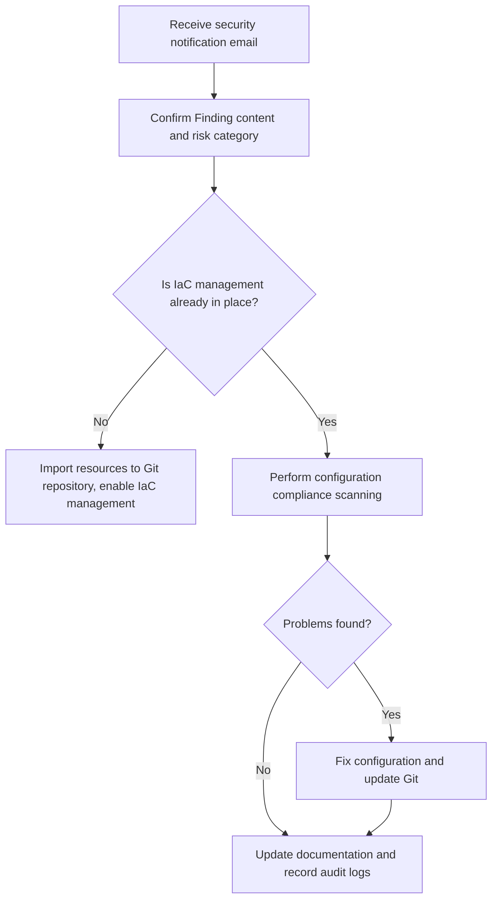

# Outstanding findings summary

Without appropriate configuration management and documentation kubernetes will be at increased risk of a breach

The threat mentioned in your security team's email is:

> **"Without appropriate configuration management and documentation Kubernetes will be at increased risk of a breach."**

Although you are using **GKE**, and Google Cloud has hosted many components for you (such as control plane, security patches, etc.), in the Shared Responsibility Model, **workload layer and configuration management** are still your responsibility. Therefore, you do need to take some measures to respond to this Finding.

---

## **✅ Recommended Checklist for Addressing This Issue (Applicable to GKE)**

### **1.** 

### **Configuration Management**

| **Category**              | **Recommendations**                                                                            |
| --------------------- | ----------------------------------------------------------------------------------- |
| Infrastructure as Code (IaC) | Use Terraform, Pulumi, or Config Connector to manage GKE configurations and network policies, avoiding manual changes. |
| Kubernetes Objects       | Use Helm/Kustomize/ArgoCD to manage YAML files, maintaining version control, audit, and rollback capabilities.           |
| GitOps Practices           | Place all YAML configurations in Git repositories, use ArgoCD/Flux for continuous deployment and implement Drift Detection.      |

---

### **2.** 

### **Configuration Compliance Checks and Policy Management**

| **Category**           | **Recommendations**                                                                                                                                                                                         |
| ------------------ | ------------------------------------------------------------------------------------------------------------------------------------------------------------------------------------------------ |
| Policy Enforcement | Deploy [**OPA Gatekeeper**](https://github.com/open-policy-agent/gatekeeper) or [**GKE Policy Controller**](https://cloud.google.com/kubernetes-engine/docs/concepts/policy-controller) on GKE. |
| Security Baseline           | Execute [CIS GKE Benchmark](https://cloud.google.com/kubernetes-engine/docs/concepts/cis-benchmark) to identify configuration deficiencies.                                                                                 |
| Image Scanning           | Use Container Analysis or automatic scanning features of GCR/GAR (or integrate with Cloud Build).                                                                                                                     |
| Automatic Auditing           | Use **Config Sync + Policy Controller** with periodic scanning to generate compliance reports.                                                                                                                          |

---

### **3.** 

### **Key Configuration Recommendations (in GKE Environment)**

| **Configuration Item**                            | **Recommended Practices**                                                                  |
| ------------------------------------- | --------------------------------------------------------------------------------------------- |
| Network Policy                              | Enable Kubernetes NetworkPolicy to restrict traffic between Pods.                                              |
| Pod Security Policy (PSP)/Pod Security Standards | Use PodSecurity admission controller to strengthen container running restrictions (such as prohibiting privileged mode, root, hostNetwork). |
| Node Auto-repair                          | Enable auto-upgrade and auto-repair to ensure security patches are applied in a timely manner.                                      |
| Logging and Monitoring                            | Enable Cloud Logging, Cloud Monitoring, Audit Logs to monitor configuration changes.                              |
| RBAC Permission Minimization                       | Regularly audit RBAC permissions to avoid cluster role abuse.                                                        |
| Encryption                                  | Use Customer Managed Encryption Key (CMEK) to encrypt etcd data and persistent storage.                        |

---

### **4.** 

### **Documentation Management**

| **Category**     | **Content**                                                                    |
| ------------ | --------------------------------------------------------------------------- |
| Architecture Diagrams       | Include GKE topology, VPC, network policies, service dependency diagrams, etc.                                |
| Operation Documents     | Include regular change processes, troubleshooting steps, CI/CD release processes, etc.                          |
| Security Baseline Documentation | Record compliance requirements and implementation status for various policies (can export reports from OPA/GKE Policy Controller). |
| Change Audit     | Audit all configuration changes using Git or Config Sync.                                  |

---

### **5.** 

### **Mermaid Flow Chart: Compliance Configuration Management and Response Process**

