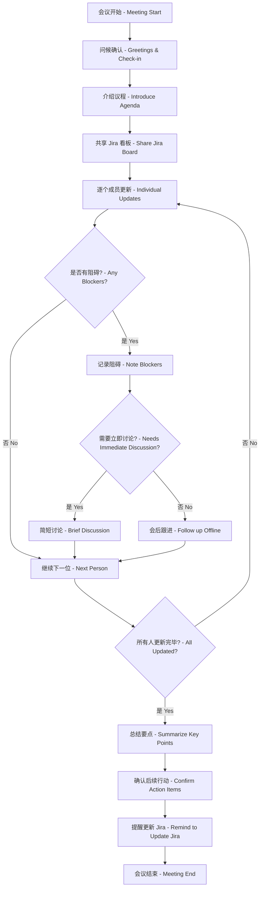

# Zoom 英文早会常用语句 - 中英文对照

## 1. 会议开场

### 1.1 问候与确认

|中文|English|
|---|---|
|大家早上好！欢迎参加今天的站会。|Good morning everyone! Welcome to today's standup meeting.|
|能听到我说话吗？大家都在吗?|Can everyone hear me? Is everyone here?|
|我们等一下其他人,还有2分钟就开始。|Let's wait for a couple more minutes for others to join.|
|好的,人都到齐了,我们开始吧。|Alright, everyone's here. Let's get started.|
|今天会议预计15-20分钟。|Today's meeting should take about 15-20 minutes.|

### 1.2 会议目的说明

|中文|English|
|---|---|
|今天我们会快速过一下每个人的工作进展。|Today we'll do a quick round of everyone's progress updates.|
|我们会根据 Jira 看板来更新各自的任务状态。|We'll go through our task updates based on the Jira board.|
|如果有任何阻碍或需要帮助的地方,请随时提出来。|If you have any blockers or need help, please feel free to speak up.|

## 2. 会议议程介绍

### 2.1 标准议程

|中文|English|
|---|---|
|今天的议程很简单,每个人分享三点:|Today's agenda is straightforward. Each person will share three things:|
|1. 昨天完成了什么|1. What you completed yesterday|
|2. 今天计划做什么|2. What you're planning to do today|
|3. 是否有任何阻碍|3. Any blockers or issues|
|让我们按照 Jira 看板的顺序来更新。|Let's go through updates following the Jira board order.|
|我会共享屏幕,大家可以看到 Jira 看板。|I'll share my screen so everyone can see the Jira board.|

## 3. 逐个更新工作进展

### 3.1 开始更新

|中文|English|
|---|---|
|好的,让我们从 [Name] 开始。|Alright, let's start with [Name].|
|[Name],能分享一下你的进展吗?|[Name], could you share your updates?|
|下一位是 [Name]。|Next up is [Name].|
|[Name],你那边怎么样了?|[Name], how are things on your end?|

### 3.2 自己作为主持人的更新

|中文|English|
|---|---|
|让我先快速更新一下我这边的情况。|Let me quickly update on my side first.|
|昨天我完成了...|Yesterday I completed...|
|我关闭了 Jira ticket CLOUD-123...|I closed Jira ticket CLOUD-123...|
|今天我会继续处理...|Today I'll continue working on...|
|我会开始做...|I'll start working on...|
|目前没有阻碍。|No blockers at the moment.|
|我需要 [Name] 帮忙review一下...|I need [Name] to help review...|

## 4. 询问详情与跟进

### 4.1 询问进度

|中文|English|
|---|---|
|这个 ticket 进展如何?|How's this ticket coming along?|
|预计什么时候能完成?|When do you expect to finish this?|
|还在进行中吗?|Is this still in progress?|
|这个任务已经完成了吗?|Has this task been completed?|
|能更新一下这个 issue 的状态吗?|Can you update the status of this issue?|

### 4.2 询问是否需要帮助

|中文|English|
|---|---|
|需要任何帮助吗?|Do you need any help with that?|
|有什么阻碍吗?|Any blockers?|
|遇到什么困难了吗?|Are you facing any challenges?|
|有什么我们可以帮忙的吗?|Is there anything we can help you with?|
|需要其他团队成员支持吗?|Do you need support from other team members?|
|这个问题我们可以会后讨论一下。|We can discuss this issue after the meeting.|

### 4.3 提供帮助

|中文|English|
|---|---|
|[Name] 能帮忙看一下这个吗?|[Name], could you help take a look at this?|
|我可以会后和你一起看看这个问题。|I can look into this issue with you after the meeting.|
|让我们会后单独讨论这个。|Let's discuss this offline after the standup.|
|我会把相关文档发给你。|I'll send you the relevant documentation.|

## 5. API 平台相关专业术语

### 5.1 任务类型

|中文|English|
|---|---|
|我在处理一个 API 端点的问题。|I'm working on an API endpoint issue.|
|我在优化 API 响应时间。|I'm optimizing API response times.|
|我在调查一个 rate limiting 的问题。|I'm investigating a rate limiting issue.|
|我在更新 API 文档。|I'm updating the API documentation.|
|我在做 API 版本升级。|I'm working on API version upgrade.|
|我在处理客户的 API 集成问题。|I'm handling a customer API integration issue.|

### 5.2 GCP 相关

|中文|English|
|---|---|
|我在配置 GKE 集群。|I'm configuring the GKE cluster.|
|我在优化 Cloud Run 服务。|I'm optimizing the Cloud Run service.|
|我在检查 Cloud Logging 日志。|I'm checking Cloud Logging logs.|
|我在更新 Kong 网关配置。|I'm updating Kong gateway configuration.|
|我在处理负载均衡器的问题。|I'm working on load balancer issues.|
|我在监控 API 的性能指标。|I'm monitoring API performance metrics.|

### 5.3 问题与解决

|中文|English|
|---|---|
|我遇到了一个认证问题。|I'm facing an authentication issue.|
|API 网关出现了一些错误。|The API gateway is throwing some errors.|
|我需要做一些性能调优。|I need to do some performance tuning.|
|客户报告了一个 5xx 错误。|A customer reported a 5xx error.|
|我在等待另一个团队的 PR review。|I'm waiting for PR review from another team.|
|这个需要基础架构团队的支持。|This requires support from the infrastructure team.|

## 6. Jira 状态相关

### 6.1 状态更新

|中文|English|
|---|---|
|我会把这个 ticket 移到 "In Progress"。|I'll move this ticket to "In Progress".|
|这个任务已经完成,我会更新到 "Done"。|This task is completed, I'll update it to "Done".|
|我需要把这个重新分配给...|I need to reassign this to...|
|这个 ticket 可以关闭了。|This ticket can be closed now.|
|我会更新 Jira 上的备注。|I'll update the comments in Jira.|
|这个 ticket 优先级需要提高。|This ticket needs to be reprioritized.|

### 6.2 提醒更新 Jira

|中文|English|
|---|---|
|记得更新 Jira 状态。|Remember to update the Jira status.|
|请在 Jira 上添加进度更新。|Please add progress updates in Jira.|
|如果完成了,请关闭对应的 ticket。|If you've finished, please close the corresponding ticket.|
|确保 Jira 反映了最新的状态。|Make sure Jira reflects the latest status.|

## 7. 会议总结与结束

### 7.1 总结要点

|中文|English|
|---|---|
|好的,让我快速总结一下。|Alright, let me quickly summarize.|
|今天的主要重点是...|Today's main focus is...|
|需要注意的关键事项:|Key items to note:|
|有几个阻碍需要解决:|We have a few blockers to resolve:|
|[Name] 需要在...方面得到帮助。|[Name] needs help with...|

### 7.2 后续行动

|中文|English|
|---|---|
|会后我会和 [Name] 单独讨论...|I'll discuss ... with [Name] offline.|
|我会发送相关链接到群组。|I'll send the relevant links to the group.|
|请大家更新 Jira 状态。|Please everyone update your Jira status.|
|如果有紧急问题,随时在 Slack 联系。|If anything urgent comes up, ping on Slack.|

### 7.3 结束语

|中文|English|
|---|---|
|好的,今天就到这里。|Alright, that's all for today.|
|大家今天工作顺利!|Have a productive day everyone!|
|如果有问题随时联系。|Feel free to reach out if you have any questions.|
|感谢大家的更新!|Thanks everyone for the updates!|
|下次会议是明天同一时间。|Next meeting is tomorrow at the same time.|
|祝大家工作愉快,再见!|Have a great day, bye everyone!|

## 8. 常见场景完整对话示例

### 8.1 标准站会流程

```markdown
主持人: Good morning everyone! Welcome to today's standup. 
       Can everyone hear me? Alright, looks like we're all here.
       (大家早上好!能听到我说话吗?好的,看起来人都到齐了。)

主持人: Today we'll do a quick round based on our Jira board. 
       Let me share my screen.
       (今天我们根据 Jira 看板快速过一遍。让我共享一下屏幕。)

主持人: Let's start with [Name]. Could you share your updates?
       ([Name],能分享一下你的进展吗?)

成员: Sure. Yesterday I completed the API authentication fix for CLOUD-456.
     Today I'll work on optimizing the rate limiting logic.
     No blockers at the moment.
     (好的。昨天我完成了 CLOUD-456 的 API 认证修复。
      今天我会优化限流逻辑。目前没有阻碍。)

主持人: Great! When do you expect to finish the rate limiting work?
       (很好!预计什么时候能完成限流的工作?)

成员: I think I can finish it by end of day.
     (我觉得今天下班前能完成。)

主持人: Perfect. Let's move to [Name]. How are things on your end?
       (完美。我们继续,[Name] 你那边怎么样?)
```

### 8.2 处理阻碍场景

```markdown
成员: I'm working on the Kong plugin upgrade, but I'm blocked by 
     the infrastructure team's approval.
     (我在做 Kong 插件升级,但被基础架构团队的审批阻塞了。)

主持人: I see. Do you know when you can get their approval?
       (明白了。你知道什么时候能得到他们的审批吗?)

成员: Not sure, I sent the request yesterday.
     (不确定,我昨天发送的请求。)

主持人: Okay, I'll follow up with the infrastructure team after this meeting.
       In the meantime, is there anything else you can work on?
       (好的,会后我会跟基础架构团队跟进。
        与此同时,有其他事情可以做吗?)

成员: Yes, I can start documenting the new API endpoints.
     (有的,我可以开始写新 API 端点的文档。)

主持人: Sounds good. Let me know if you need any help.
       (听起来不错。如果需要帮助随时告诉我。)
```

## 9. 会议流程图



## 10. 快速参考表

### 10.1 时间管理提醒

|中文|English|
|---|---|
|我们还有5分钟。|We have 5 minutes left.|
|让我们保持简洁。|Let's keep it brief.|
|这个可以会后详细讨论。|We can discuss this in detail after the meeting.|
|我们需要加快一点进度。|We need to move a bit faster.|

### 10.2 技术问题快速响应

|中文|English|
|---|---|
|听起来是一个配置问题。|Sounds like a configuration issue.|
|我们需要查看日志。|We need to check the logs.|
|这可能是权限问题。|This might be a permissions issue.|
|让我们重启服务试试。|Let's try restarting the service.|
|需要提交一个 bug ticket。|We need to create a bug ticket.|

---

**使用建议:**

1. 会前准备好 Jira 看板
2. 控制会议时间在15-20分钟内
3. 记录重要的阻碍和后续行动
4. 会后及时跟进需要帮助的事项
5. 鼓励团队成员简洁明了地表达