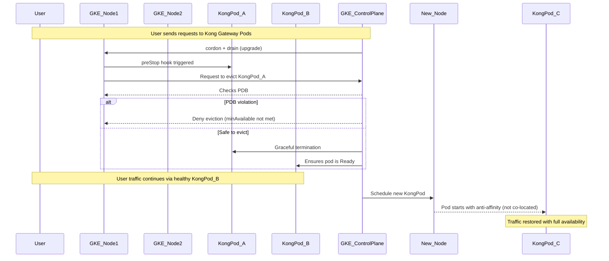
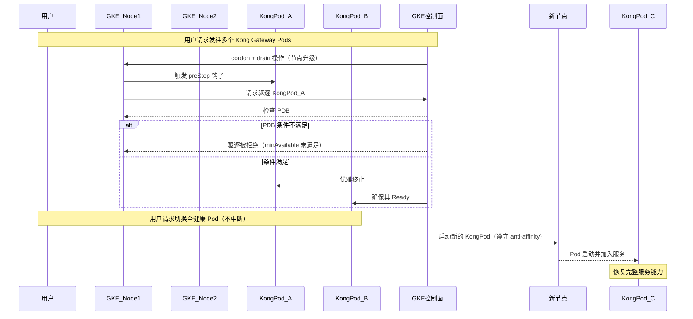

## ☸️ GKE Resilience Uplift – Scheduling & Disruption Protection

### 📌 Background

As part of our platform-wide resilience uplift in 2025, we focused on improving the **availability and failure tolerance** of GKE workloads during **rolling updates**, **node maintenance**, and **unexpected disruptions**.

Historically, we faced:

- Pods being drained too aggressively during cluster upgrades.
- Key components being scheduled on the same node/zone, risking single point failures.
- Disruption of traffic during high-pressure scaling or eviction scenarios.

To address these, we implemented **Affinity Rules** and **PodDisruptionBudgets (PDBs)** to enhance scheduling stability and graceful recovery.

---

### 🔧 Technical Improvements

#### 1. 🎯 Affinity & Anti-Affinity Rules

We applied custom `affinity` settings to control where our critical Pods are scheduled:

- **Zone-level spread**: Ensures multi-zone redundancy.
- **Anti-affinity per component**: Avoid colocating same component Pods (e.g., all Kong DPs).
- **Service-level affinity**: Co-locate dependent services when latency is critical.

```yaml
affinity:
  podAntiAffinity:
    requiredDuringSchedulingIgnoredDuringExecution:
      - labelSelector:
          matchExpressions:
            - key: app
              operator: In
              values:
                - kong-gateway
        topologyKey: "kubernetes.io/hostname"
```

This ensures that workloads like gateways or runtimes **do not all land on the same node**, preventing simultaneous failure.

---

#### **2. 🛡️ PodDisruptionBudgets (PDB)**

We defined PodDisruptionBudgets to limit voluntary disruptions (like GKE upgrades or drain operations):

```
apiVersion: policy/v1
kind: PodDisruptionBudget
metadata:
  name: kong-pdb
spec:
  minAvailable: 1
  selector:
    matchLabels:
      app: kong-gateway
```

This configuration **guarantees at least one Pod remains available**, preventing total service interruption during:

- **Cluster maintenance**
- **Rolling upgrades**
- **Node autoscaling**

---

### **📊 How It Works – Sequence Diagram**

The following diagram illustrates how Affinity and PDB collaborate to protect the system during GKE node upgrades or drain operations:



---

### **✅ Result**

| **Feature**        | **Before**                   | **After (With Affinity + PDB)**   |
| ------------------ | ---------------------------- | --------------------------------- |
| Upgrade resilience | Partial downtime             | Zero-downtime                     |
| Zonal spread       | Random scheduling            | Zone-aware with affinity          |
| Eviction control   | Aggressive evictions allowed | Eviction gated by PDB constraints |
| Fault isolation    | Risk of co-location          | Pods distributed across nodes     |

---

### **🧭 Lessons Learned**

- Affinity rules must balance **resilience** and **resource availability**—overconstraining may cause scheduling failures.
- PDBs protect uptime but require **proper readinessProbes** and **HPA behavior** to avoid false availability.
- When upgrading GKE node pools, PDB + readiness + anti-affinity together provide strong guardrails for **graceful service transition**.

---

### **📌 What’s Next?**

- Automate validation of Affinity/PDB configs via CI checks.
- Integrate resilience testing in pre-release workflows (e.g., kube-monkey / chaos tests).
- Extend same pattern to other critical workloads beyond gateways and runtimes.

---

# Chinese

## ☸️ GKE Resilience Uplift – 调度与中断保护机制提升

### 📌 背景说明

在我们 2025 年平台弹性增强计划中，重点之一是提升 GKE 工作负载在 **滚动升级、节点维护、自动伸缩** 期间的可用性与容错能力。

过往我们遇到的一些问题包括：

- GKE 升级时 Pod 被同时驱逐，服务中断；
- 多个关键组件被调度到同一个节点/区域，形成单点故障风险；
- 扩容或维护时没有保护机制，导致服务瞬时不可用。

为了解决这些问题，我们引入了 **Affinity 调度规则** 与 **PodDisruptionBudget (PDB)** 来提升调度稳定性与服务不中断能力。

---

### 🔧 技术改进细节

#### 1. 🎯 Affinity / Anti-Affinity 调度规则

我们通过配置 `affinity` 来控制关键 Pod 的调度位置：

- **区域级别分布**：实现多 zone 高可用；
- **组件级 anti-affinity**：避免同类 Pod 被调度到同一节点；
- **关键服务 affinity**：减少服务之间的跨节点延迟。

示例配置：

```yaml
affinity:
  podAntiAffinity:
    requiredDuringSchedulingIgnoredDuringExecution:
      - labelSelector:
          matchExpressions:
            - key: app
              operator: In
              values:
                - kong-gateway
        topologyKey: "kubernetes.io/hostname"
```

---

通过上述配置，我们确保如 kong-gateway 等核心服务不会集中部署在同一个节点，从而避免单点失效。

---

#### **2. 🛡️ PodDisruptionBudget (PDB) 配置**

我们为关键服务配置了 PDB，以限制自愿性驱逐（如升级或节点维护）导致的 Pod 同时不可用问题：

```
apiVersion: policy/v1
kind: PodDisruptionBudget
metadata:
  name: kong-pdb
spec:
  minAvailable: 1
  selector:
    matchLabels:
      app: kong-gateway
```

这个配置保障在 drain 或升级时，**至少有一个 Pod 保持运行状态**，防止因全部驱逐而导致服务中断。

适用场景包括：

- GKE 节点池滚动升级；
- kubectl drain 操作；
- 自动扩缩容带来的节点替换。

---

### **📊 工作机制流程图（Mermaid 时序图）**

以下图示展示了 GKE 节点升级或驱逐场景中，Affinity 与 PDB 如何协同保护系统：



---

### **✅ 效果对比总结**

| **功能项**       | **优化前**         | **优化后（引入 Affinity + PDB）** |
| ---------------- | ------------------ | --------------------------------- |
| 升级时服务可用性 | 容易出现中断       | 保证服务不中断                    |
| 区域分布容错     | Pod 集中调度       | 合理分布到多个 zone               |
| 节点驱逐控制     | 可被一次性全部驱逐 | 遵循 PDB 保护策略                 |
| 故障隔离能力     | 存在单点故障风险   | 支持跨节点/区域的故障切割         |

---

### **🧭 实践经验总结**

- Affinity 使用需注意资源压力：配置过严可能导致 Pod 无法调度；
- PDB 生效前需保证应用有正确的 **readinessProbe** 与 **replica 配置**；
- 在实际升级过程中，Affinity + PDB + readinessProbe 的组合能显著降低失败风险，是实现 **高可用滚动升级** 的关键要素。

---

### **📌 后续计划**

- 在 CI 流程中加入 Affinity/PDB 配置的自动检测与验证；
- 建立 chaos 实验机制（如 kube-monkey）验证容错策略；
- 将该模式推广至更多关键服务模块（不仅限 gateway 和 runtime）。

---

```
---

这个版本适用于公司内中文分享、报告撰写或 Confluence 页面发布。如果你需要我再生成一个 Mermaid 的 `graph TD` 图，来直观表示节点升级和 PDB 的整体逻辑，也可以提出，我可额外补充。是否需要？
```
