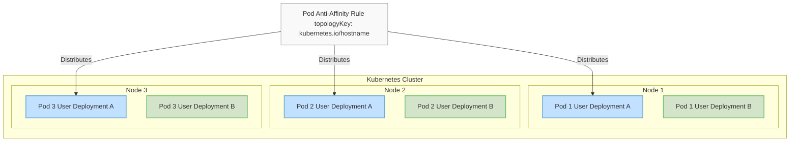
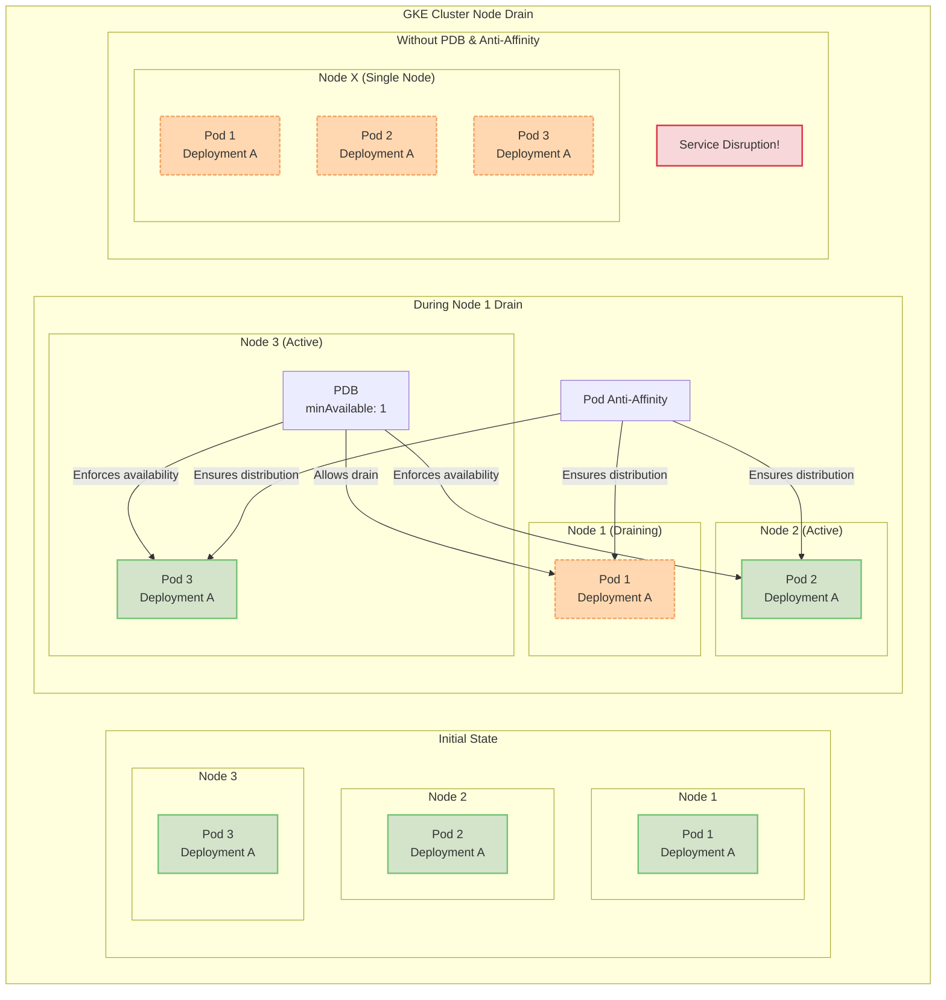
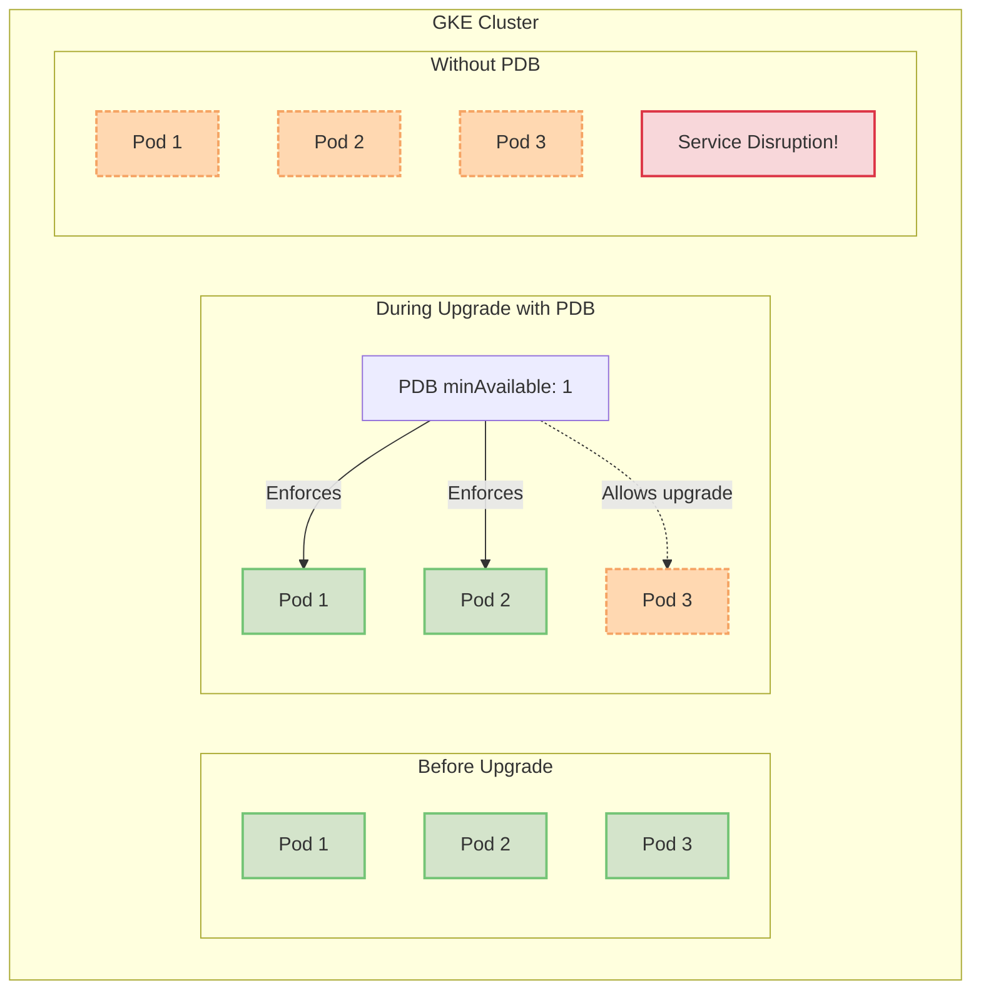
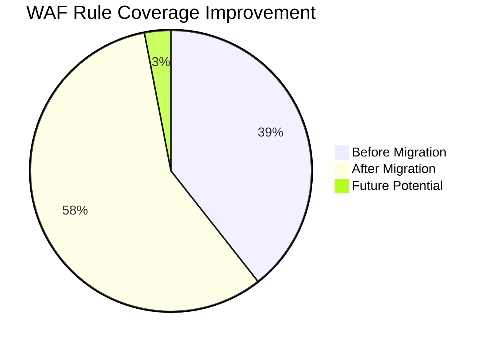

# summary 
Here are some of the work cases we have completed recently.  
resilience
We have added affinity features for user deployments in the environment. This ensures that the container groups (Pods) under the same user deployment are distributed across different nodes, thereby ensuring high availability during rolling updates of the deployment.  
In addition, we have currently configured Pod Disruption Budget (PDB) resources for core components. This ensures service high availability during Google Kubernetes Engine (GKE) upgrade processes.  
Security 
Regarding aibang requirements for internal Web Application Firewall (WAF) rules, we have migrated from the GKE ingress to the GKE gateway. In the long term, the gateway is Google's direction for long-term support and also a trend for future development.
# Recent Technical Work
## Resilience Enhancements

### Affinity Features for User Deployments
![Node Distribution Diagram]

- **Implementation**: Added affinity features for user deployments
- **Technical Principles**:
  - Utilized `podAntiAffinity` to ensure container groups within the same deployment are distributed across different nodes
  - Implemented using `topologyKey: "kubernetes.io/hostname"` for node-level distribution
  
- **Benefits**:
  - ✅ High availability during rolling updates
  - ✅ Prevention of service disruptions due to single point of failure
  - ✅ Improved overall system stability

    ```yaml
    spec:
      affinity:
        podAntiAffinity:
          requiredDuringSchedulingIgnoredDuringExecution:
            - labelSelector:
                matchExpressions:
                  - key: app
                    operator: In
                    values:
                      - nginx
              topologyKey: kubernetes.io/hostname
          preferredDuringSchedulingIgnoredDuringExecution:
            - weight: 1
              podAffinityTerm:
                labelSelector:
                  matchExpressions:
                    - key: app
                      operator: In
                      values:
                        - nginx
                topologyKey: topology.kubernetes.io/zone
      automountServiceAccountToken: false
    ```


### Pod Disruption Budget (PDB) for Core Components
![PDB Working Mechanism]

- **Implementation**: Configured Pod Disruption Budget for core components
- **Technical Details**:
  ```yaml
  apiVersion: policy/v1
  kind: PodDisruptionBudget
  metadata:
    name: core-component-pdb
  spec:
    minAvailable: 1  # or maxUnavailable: 1
    selector:
      matchLabels:
        app: core-component
  ```
  
- **Benefits**:
  - ✅ Service high availability during GKE upgrade processes
  - ✅ Ensuring critical services are not completely interrupted
  - ✅ More robust and secure automated operations




## Security Enhancements

### Migration from GKE Ingress to Gateway
![Gateway Architecture]

- **Background**:  Aibang requirements for internal Web Application Firewall (WAF) rules

- **Technical Upgrade Path**:
  ```
  GKE Ingress ──────────► GKE Gateway
       ▼                      ▼
  Limited WAF rule config     Enhanced WAF integration
       ▼                      ▼
  Traditional HTTP(S) LB      More flexible traffic management
  ```

- **Gateway Advantages**:
  - ✅ Google's direction for long-term support
  - ✅ Richer traffic routing and management capabilities
  - ✅ Stronger security policy integration
  - ✅ Industry development trend

### Security Enhancement Outcomes
![Security Metrics]

- **Quantifiable Results**:
  - Increased WAF rule coverage
  - Reduced potential security vulnerability exposure
  - Implemented more granular security controls

## Summary and Future Outlook

- **Completed Work**: Enhanced resilience, improved security
- **Technical Direction**: Following cloud-native best practices
- **Future Plans**: Continuous infrastructure optimization, strengthening automation and security


# 最近完成的技术工作成果
## 韧性强化 (Resilience)

### 用户部署的亲和性特性
![节点分布示意图]

- **实现内容**：为用户部署添加亲和性(Affinity)功能
- **技术原理**：
  - 利用 `podAntiAffinity` 确保同一部署的容器组分布在不同节点
  - 使用 `topologyKey: "kubernetes.io/hostname"` 实现节点级别的分散部署
  
- **具体收益**：
  - ✅ 滚动更新期间的高可用性
  - ✅ 防止单点故障导致的服务中断
  - ✅ 提高系统整体稳定性

### 核心组件中断预算 (PDB)
![PDB工作原理]

- **实现内容**：为核心组件配置 Pod Disruption Budget
- **技术细节**：
  ```yaml
  apiVersion: policy/v1
  kind: PodDisruptionBudget
  metadata:
    name: core-component-pdb
  spec:
    minAvailable: 2  # 或 maxUnavailable: 1
    selector:
      matchLabels:
        app: core-component
  ```
  
- **收益**：
  - ✅ GKE升级过程中的服务高可用
  - ✅ 确保关键服务不会全部中断
  - ✅ 自动化运维更加稳健安全

## 安全增强 (Security)

### GKE Ingress 到 Gateway 的迁移
![Gateway架构]

- **背景**：满足aibang的内部Web应用防火墙(WAF)规则要求

- **技术升级路径**：
  ```
  GKE Ingress ──────────► GKE Gateway
       ▼                      ▼
  有限的WAF规则配置      强大的WAF集成能力
       ▼                      ▼
  传统HTTP(S)负载均衡    更灵活的流量管理
  ```

- **Gateway优势**：
  - ✅ Google长期支持方向
  - ✅ 更丰富的流量路由和管理功能
  - ✅ 更强大的安全策略集成能力
  - ✅ 行业发展趋势

### 安全增强成效
![安全指标]

- **可量化成果**：
  - 提高了WAF规则覆盖率
  - 减少了潜在安全漏洞暴露面
  - 实现了更精细的安全控制

## 总结与展望

- **已完成工作**：增强韧性、提升安全性
- **技术方向**：遵循云原生最佳实践
- **未来计划**：持续优化基础设施，加强自动化与安全


我可以帮你将这些内容可视化为Mermaid图表，这样可以直接在支持Markdown的PPT工具中使用，或者转换为SVG。下面是三个关键部分的Mermaid图表：
- affinity

---
- PDB


在节点逐个排水和升级的场景下，反亲和性与PDB如何协同工作。


1. **反亲和性与PDB的协同工作**：
   - 反亲和性确保同一部署的Pod分布在不同节点上
   - PDB确保在节点排水过程中至少有一个Pod保持可用

2. **节点逐个排水场景**：
   - 展示了节点1正在排水时的情况
   - 由于反亲和性策略，其他Pod已经分布在不同节点上
   - PDB设置为minAvailable: 1，确保即使一个节点完全下线，服务仍然可用

3. **对比场景**：
   - 展示了如果没有PDB和反亲和性设置，所有Pod可能集中在同一节点上
   - 当该节点排水时，会导致服务完全中断

这种配置组合在GKE升级过程中特别有价值，因为它允许集群进行安全的滚动升级，每次处理一个节点，同时保持服务的可用性。反亲和性确保Pod分布合理，而PDB提供了额外的保护层，防止过多Pod同时变得不可用。

这样的修改是否更符合你的实际部署场景？


---






```mermaid
flowchart TB
    subgraph "Before: GKE Ingress"
        Client1[Client] --> Internet1[Internet]
        Internet1 --> GCLB1[Google Cloud Load Balancer]
        GCLB1 --> BasicWAF[Basic WAF Limited Rules]
        BasicWAF --> Ingress[GKE Ingress]
        Ingress --> Service1[Service 1]
        Ingress --> Service2[Service 2]
    end
    
    subgraph "After: GKE Gateway"
        Client2[Client] --> Internet2[Internet]
        Internet2 --> GCLB2[Google Cloud Load Balancer]
        GCLB2 --> AdvancedWAF[Advanced WAF ECB Compliant Rules]
        AdvancedWAF --> Gateway[GKE Gateway]
        Gateway --> HTTPRoute1[HTTPRoute 1]
        Gateway --> HTTPRoute2[HTTPRoute 2]
        HTTPRoute1 --> ServiceA[Service 1]
        HTTPRoute2 --> ServiceB[Service 2]
    end
    
    classDef client fill:#f5f5f5,stroke:#333,stroke-width:1px;
    classDef internet fill:#dce9f6,stroke:#7da9d8,stroke-width:2px;
    classDef gcp fill:#e1f5fe,stroke:#03a9f4,stroke-width:2px;
    classDef waf fill:#e8f5e9,stroke:#4caf50,stroke-width:2px;
    classDef route fill:#fff8e1,stroke:#ffc107,stroke-width:2px;
    classDef service fill:#f3e5f5,stroke:#9c27b0,stroke-width:2px;
    
    class Client1,Client2 client;
    class Internet1,Internet2 internet;
    class GCLB1,GCLB2,Ingress,Gateway gcp;
    class BasicWAF,AdvancedWAF waf;
    class HTTPRoute1,HTTPRoute2 route;
    class Service1,Service2,ServiceA,ServiceB service;

```

这些Mermaid图表涵盖了你演示中的主要技术点：

1. **节点分布示意图**：展示了如何使用Pod Anti-Affinity将同一部署的Pod分布在不同节点上，以提高可用性。

2. **PDB工作原理**：说明了PDB如何在集群升级过程中保证服务可用性，通过对比有PDB和无PDB的情况。

3. **Gateway迁移架构**：详细展示了从GKE Ingress到Gateway的迁移过程，以及这种迁移如何提高了WAF规则的覆盖率和合规性。

4. **安全增强指标**：使用饼图直观地显示WAF规则覆盖率的提升。

你可以将这些图表与之前的英文PPT内容结合，创建一个既技术详实又视觉清晰的演示。对于支持Markdown/Mermaid的平台（如某些在线PPT工具），你可以直接使用这些代码；对于不支持的平台，你可以将这些Mermaid图表转换为PNG或SVG后导入。

你觉得这些可视化效果如何？是否符合你的演示需求？