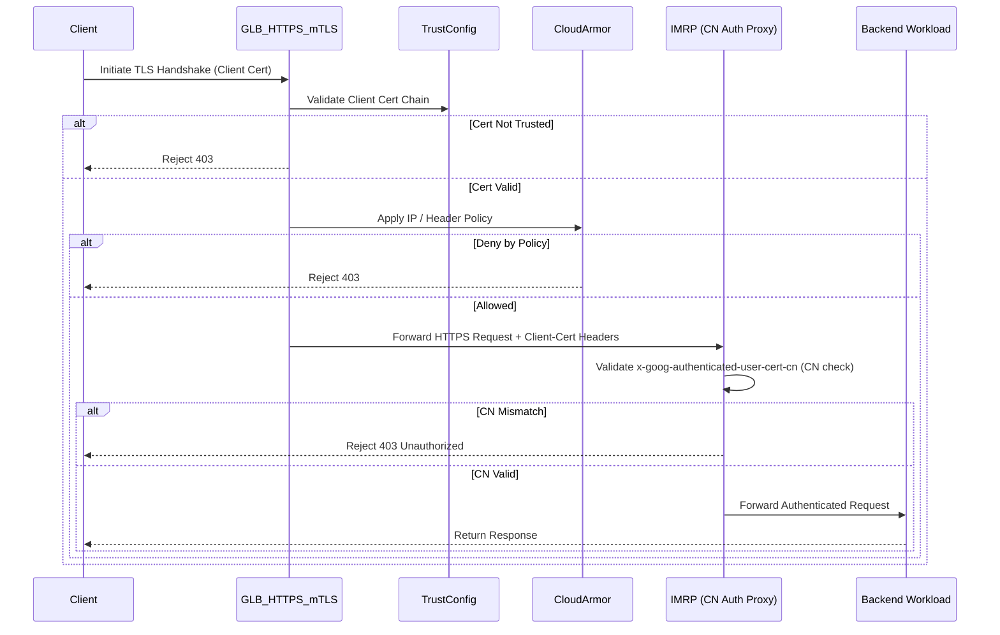
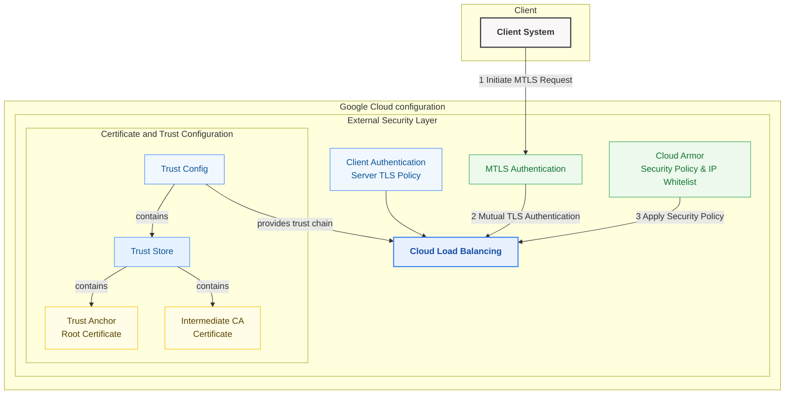

# summary
- change - The backend (IMRP) only needs to read the x-goog-authenticated-user-cert-cn header and verify it — no TLS logic required
- x-goog-authenticated-user-cert-cn (CN check)

## **🔐 GCP HTTPS mTLS with CN Validation – Platform Security Architecture Evolution Story**

### **📌 Background**

In the past, our platform adopted a traditional **TCP-layer mTLS architecture**:

- Clients connected to the GCP Global TCP Load Balancer
- The mTLS handshake was completed at the **backend NGINX services**
- Backend handled CA loading, certificate validation, and custom CN checking manually

**Challenges with this approach:**

- Heavy backend burden and complex configurations
- Difficult to manage multiple client certificates (especially across different CAs)
- Couldn’t block unauthorized traffic at the edge, impacting both performance and security

To address these issues, we evolved to a modern architecture leveraging **Google Cloud HTTPS Load Balancer + Certificate Manager TrustConfig**, enabling true **edge mTLS termination** and **centralized identity validation**.

---

### **🔧 Technical Implementation**

#### **✅ Core Capabilities**

| **Feature**                                    | **Status** |
| ---------------------------------------------- | ---------- |
| HTTPS traffic fully terminated at GLB          | ✅         |
| Full mTLS with client certificate validation   | ✅         |
| Multiple client CAs managed via TrustConfig    | ✅         |
| CN field validation from client certificates   | ✅         |
| No TLS validation needed at backend services   | ✅         |
| IP allowlist & security policy via Cloud Armor | ✅         |

---

#### **📁 TrustConfig Example**

```yaml
trustConfig:
  name: client-mtls-trust
  trustStores:
    - trustAnchors:
        - pemCertificate: root-ca.pem
        - pemCertificate: intermediate-ca.pem
      description: "Client CA Chain for B2B Access"
```

We manage and update these CA certificates through a CI/CD pipeline, using automation to generate fingerprints and push updates to GCS.

---

#### **🚪 Request Entry Logic**

- All traffic enters through **Google HTTPS Load Balancer**
- GLB performs mTLS handshake and is bound to a TrustConfig
- The backend (IMRP) only needs to read the x-goog-authenticated-user-cert-cn header and verify it — no TLS logic required

---

### **📊 Request Flow Sequence Diagram (Mermaid)**

```mermaid
flowchart LR

    classDef loadBalancerStyle fill:#e8f0fe,stroke:#4285f4,stroke-width:2px,color:#174ea6,font-weight:bold
    classDef dmzStyle fill:#fff8e1,stroke:#fbbc04,stroke-width:1px,color:#594300
    classDef internalStyle fill:#e6f4ea,stroke:#34a853,stroke-width:1px,color:#137333
    classDef serviceStyle fill:#f1f3f4,stroke:#5f6368,stroke-width:1px,color:#202124
    lb[Cloud Load Balancing]  --> |4 Forward Verified Request| nginx

    subgraph "gce or physical network"
        subgraph "ciDMZ Network"
            nginx[Nginx Reverse Proxy<br>Client Certificate Subject Verification]
        end

        subgraph "cInternal Network"
            squid[Squid Forward Proxy]

            subgraph "Service Layer"
                direction TB
                kong[External Kong<br>Gateway Namespace]
                api[External Runtime API<br>Namespace]
            end
        end
    end
    nginx --> |5 Certificate Subject Verification Passed| squid
    squid --> |6 Forward to Service Gateway| kong
    kong --> |7 Forward to API Service| api

    %% Apply styles
    class lb loadBalancerStyle
    class nginx dmzStyle
    class squid,kong,api internalStyle
```







---

### **🔄 Architecture Comparison**

| **Item**                    | **Legacy (TCP mTLS)** | **Modern (HTTPS + GLB mTLS)**               |
| --------------------------- | --------------------- | ------------------------------------------- |
| mTLS termination location   | Backend NGINX         | Google HTTPS Load Balancer                  |
| Client cert verification    | Performed in backend  | Performed at edge via TrustConfig           |
| Multi-CA support            | Hard to manage        | Centralized in TrustConfig                  |
| CN validation               | Custom logic in NGINX | Read from x-goog-authenticated-user-cert-cn |
| Backend complexity          | High                  | Simplified                                  |
| IP-based policy enforcement | Hard to unify         | Managed via Cloud Armor                     |

---

### **✅ Outcome & Benefits**

- **Security shifted to the edge**: Invalid client certs are rejected before reaching backend
- **Backend simplification**: No TLS stack needed — only parse CN from headers
- **Multi-tenant support**: Authenticate different clients via different CAs
- **Scalable automation**: Certificates managed in GCS with script-based automation
- **Layer-7 security hardening**: GLB + Cloud Armor rules add another security layer
