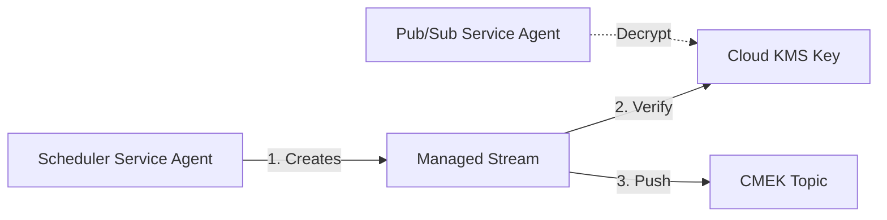

# Infographic vs. Mermaid：深度解析与实战指南

作为一名深耕云原生与自动化领域的专家，理解 **“表达直觉” (Infographic)** 与 **“逻辑严谨” (Mermaid)** 之间的分界线至关重要。这不仅仅是绘图工具的选择，更是**思维模型**的切换。

---

## 1. 核心本质：最大的区别是什么？

如果用一句话概括：
> **Infographic 是“讲故事” (Narrative)，Mermaid 是“建模” (Modeling)。**

### 核心差异对照表

| 维度 | Infographic (信息图) | Mermaid (架构图) |
| :--- | :--- | :--- |
| **视角** | **外部/用户视角** (User-Centric) | **内部/工程视角** (System-Centric) |
| **关注点** | **“什么发生了？”** (What happens?) | **“是怎么发生的？”** (How does it work?) |
| **表达手段** | 模版、图标、色彩、隐喻 (Icons/Theme) | 语法、节点、边、状态 (DSL Syntax) |
| **信息密度** | 低密度：强调关键节点与直观流程 | 高密度：强调拓扑、协议、依赖关系 |
| **生命周期** | 展示级：常用于 Onboarding、汇报、科普 | 文档级：常用于 README、ADR、架构设计 |
| **Git 友好度**| 主要是结果展示，难以 Diff | **完美适配 Git**，源码即图，可自动化生成 |

---

## 2. 以 Pub/Sub CMEK 为例：两种图的对比

为了让你感触最深，我们用刚才讨论的 **Pub/Sub CMEK 加密流** 来对比。

### A. Infographic 视角：**“直觉流”**
它关注的是用户理解整个逻辑的“心理路径”。

```infographic list-row-simple-horizontal-arrow
data
  title Pub/Sub CMEK 触发逻辑
  items
    - label 1. 触发
      desc Scheduler 任务启动
      icon mdi:clock-outline
    - label 2. 加密流
      desc 系统自动创建内部托管流
      icon mdi:waves
    - label 3. 鉴权
      desc 验证 KMS 密钥权限
      icon mdi:key-variant
    - label 4. 投递
      desc 消息安全到达 Topic
      icon mdi:send-check
```
*特点：你一眼就能看懂大概发生了什么，不需要知道具体的 Service Account 或 API 路径。*

### B. Mermaid 视角：**“拓扑流”**
它关注的是系统组件之间的硬核依赖与数据流向。


*特点：这里明确了谁是主体 (SSA)、谁是客体 (KMS)、具体的资源关系是什么。这可以作为配置控制列表 (ACL) 的设计依据。*

---

## 3. 深度思考：什么时候该用哪个？

### 💡 场景 A：你需要“对齐共识” (Align Stakeholders)
*   **使用 Infographic**。
*   当你需要向产品经理、安全合规团队或新手解释“为什么我们需要 KMS 权限”时，Infographic 的图标化表达能瞬间打破技术壁垒。

### ⚙️ 场景 B：你需要“落地执行” (Implementation & GitOps)
*   **使用 Mermaid**。
*   当你正在编写 Terraform 配置、设计 K8S 网络策略、或进行代码评审 (Code Review) 时，Mermaid 能够清晰地展示系统拓扑，且能随代码版本演进。

---

## 4. 专家建议：如何组合使用？

在高质量的技术文档（如 `pub-sub-alma.md`）中，**黄金法则是“先 Infographic 后 Mermaid”**：

1.  **先用 Infographic 开篇**：建立宏观感官，消除读者的畏难情绪。
2.  **后用 Mermaid 深挖**：提供可落地的技术细节，满足工程师的精确需求。

---

## 5. 场景落地：Infographic 应该出现在哪里？

在 Git 项目仓库中，Infographic 的“出场位置”决定了它的价值。

### 核心推荐位置：
1.  **README.md 的顶部**：作为项目的“门面”，用 10 秒钟让访问者看懂整个项目的价值主张或核心工作流。
2.  **Onboarding 引导文档**：新员工入职时，复杂的工程细节会让他们窒息，一张 Infographic 能帮助他们建立最初的全局感。
3.  **PR (Pull Request) 的描述栏**：如果你进行了一项复杂的架构重构，在 PR 描述里放一个高层次的流程图，能极大地降低 Reviewer 的理解成本。
4.  **Issue 模板**：在报告复杂 Bug 或提议新功能时，用它描述“预期流”与“现状流”。

---

## 6. 预览与工具链：如何在 Git/IDE 中看到效果？

这是目前开发者最关心的工程问题。由于 `infographic` 是一种高级 DSL（领域专用语言），它与 Mermaid 的预览方式有所不同。

### 6.1 实时预览 (The Alma Experience)
*   **Alma 原生支持**：在你当前的聊天环境或支持 Alma 渲染插件的编辑器中，`infographic` 代码块会被自动捕获并渲染成精美的动态/静态卡片。
*   **VS Code 插件**：在 VS Code 中，结合 Alma 的集成环境，你可以直接在 Markdown 侧边栏预览其效果。

### 6.2 Git 平台兼容性 (GitLab/GitHub)
*   **原生限制**：GitLab 和 GitHub 目前原生支持 Mermaid，但尚未直接支持 `infographic` 这种高层可视化 DSL。
*   **工程化策略**：
    1.  **自动化导出**：在 CI/CD 流水线中（如 GitLab CI），利用 Alma CLI 或相关脚本将 `infographic` 块转换为 **SVG/PNG** 图片，并自动存入项目的 `assets/` 目录。
    2.  **引用图片**：在 Markdown 中通过 `` 引用生成后的图片。这样既保留了代码的可维护性，又保证了 Git 端的可见性。

### 6.3 开发习惯建议
*   **Mermaid 用于“活文档”**：直接写在代码里，利用 Git 原生渲染。
*   **Infographic 用于“展示层”**：作为源码维护，通过 Alma 预览确认效果，最后通过图片快照或 PDF 导出用于演示。

---

## 7. 总结与建议

*   **Infographic** 是为了 **“理解”** —— 它是通往知识的敲门砖。
*   **Mermaid** 是为了 **“构建”** —— 它是指引生产的蓝图。

在处理类似 “Third-party egress configurations” 或 “Complex network abstraction” 这种高难度课题时，灵活切换这两种图，能让你的文档既有**高度**，又有**深度**。
