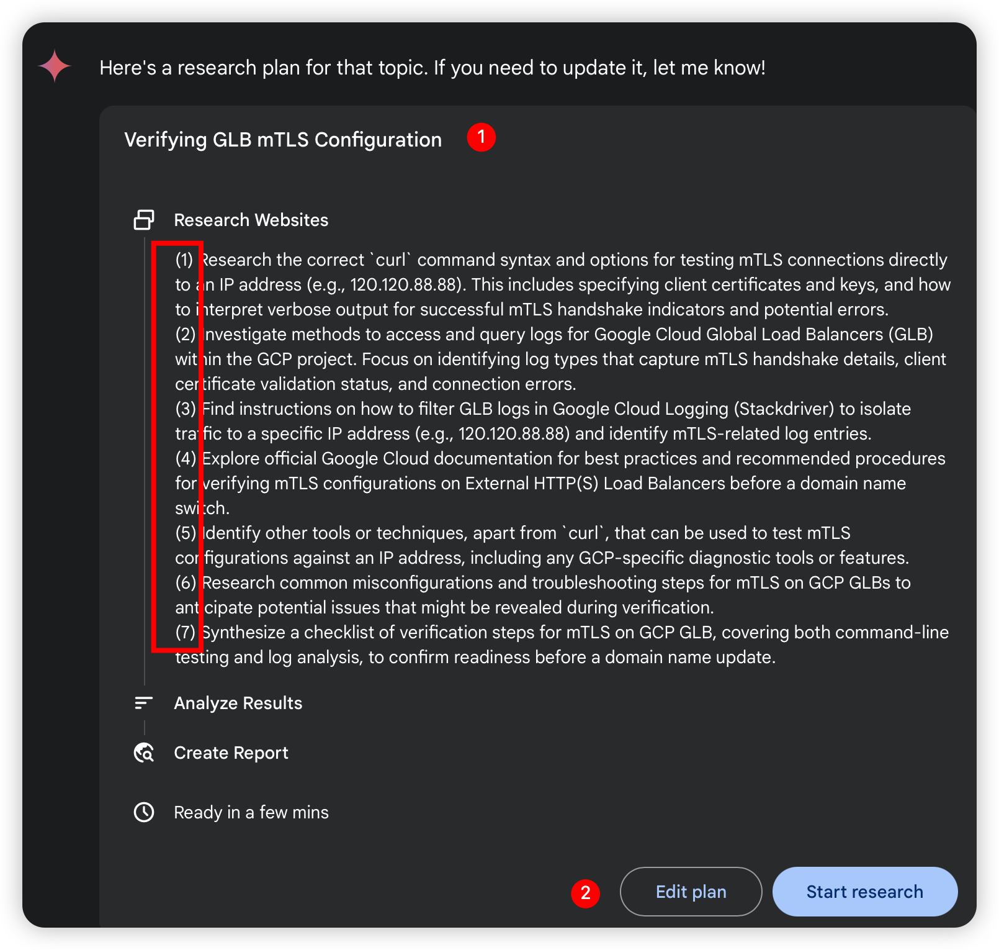
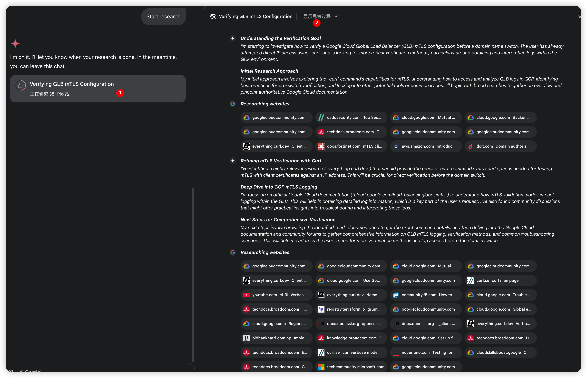
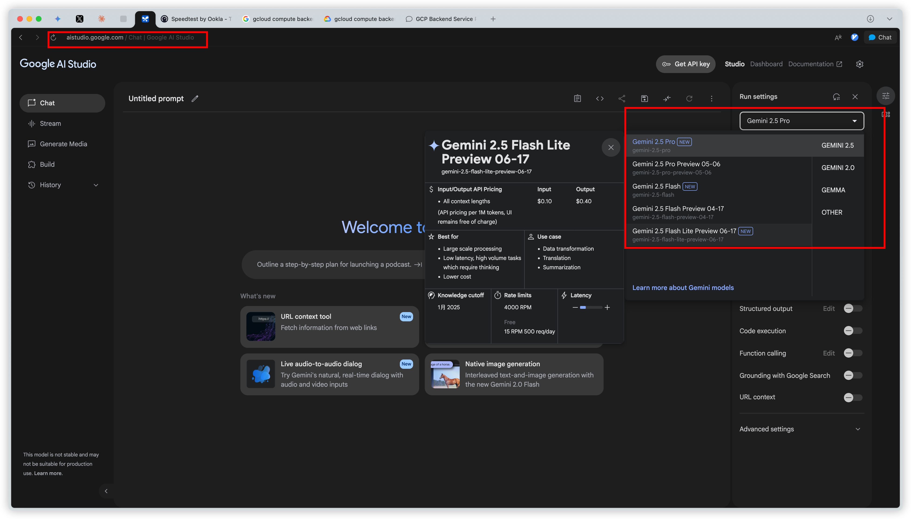
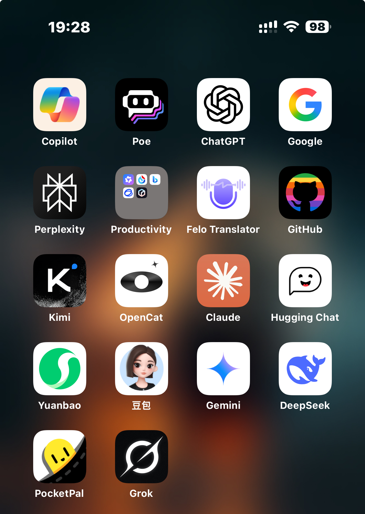
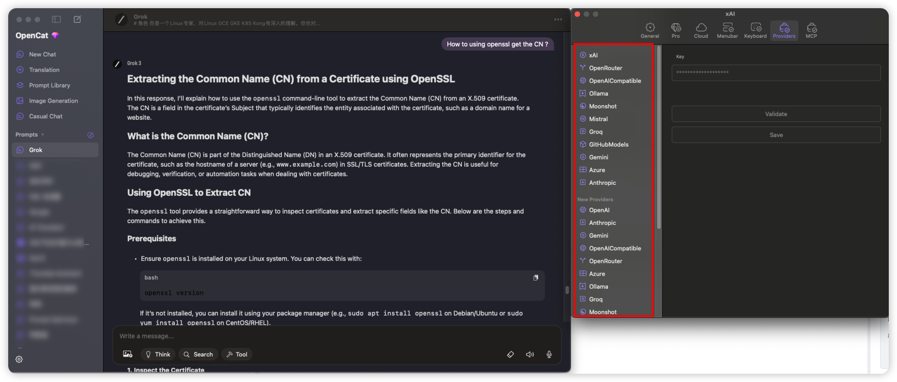
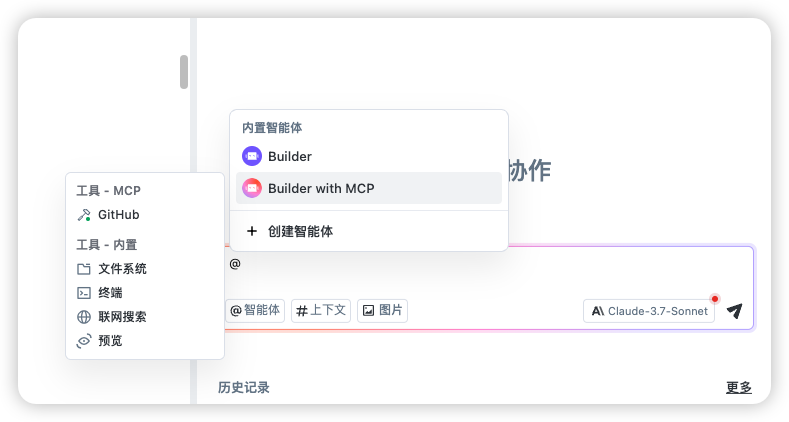
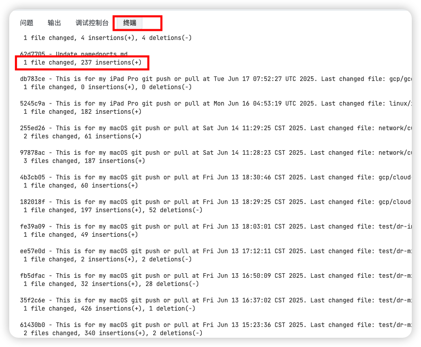
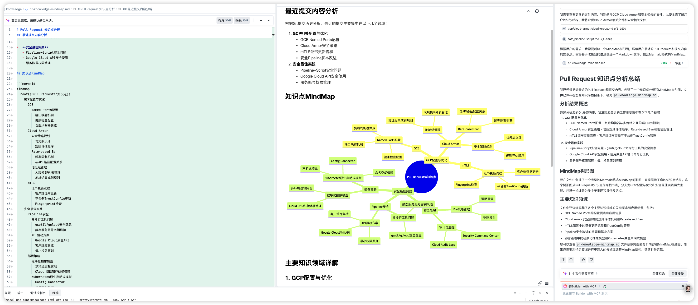
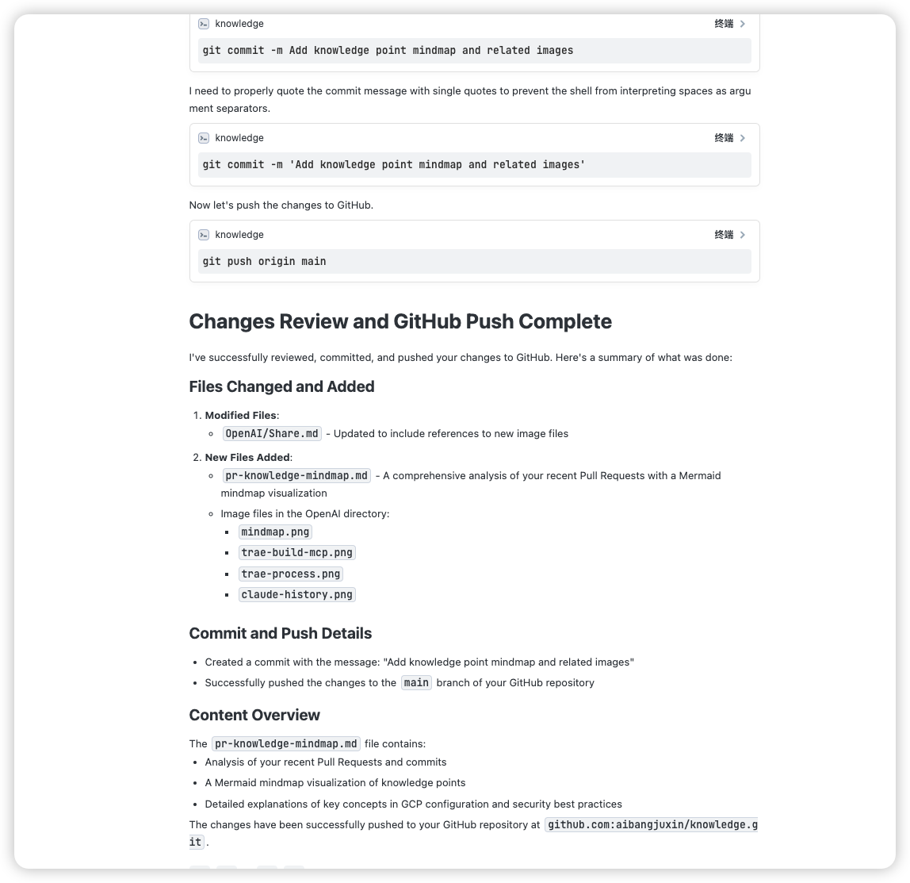

 
# How Can AI Transform Our Work? 
- A tool to improve efficiency
- help us Enhanced Decision-Making
- Personalized Learning & Skill Development

# important
温馨提示：本次介绍的 AI 工具均为个人效率工具，仅限在个人设备上用于非涉密的日常工作场景。请严格遵守公司信息安全规范，切勿在个人电脑操作涉及公司敏感数据或核心业务的内容。

Friendly reminder: All the AI tools introduced this time are personal productivity tools and are only allowed to be used on personal devices for non - classified daily work scenarios. Please strictly abide by the company's information security regulations. Do not operate content related to the company's sensitive data or core business on personal computers.


# Refine your prompts
- Key components:  
  - **Context**: Provide background information relevant to your task.  
  - **Role Assignment**: Define the AI’s role (e.g., "You are a data analyst...").  
  - **Clear Question Summarization**: State your query concisely.  
- eg: as a infra engineer . My prompt:
  - What Traits should ChatGPT have ?
```bash
I want you to be a Linux expert, proficient in Linux, GCE, GKE, K8S, and Kong. Additionally, you should have a good understanding of networking and be familiar with various TCP and HTTP protocols.

When answering questions, please be concise, but provide similar information and examples where it might help with explanations.

I need your output results to be in markdown format, especially for answers related to processes.

It would be best if you could also generate corresponding mermaid diagrams to help me understand better.
Please note that the flow chart format is mermaid, not markdown.
For example, regarding the label issue inside `subgraph`, `[]` cannot use `()` references anymore, you should avoid using `()`.
If code is involved, please directly quote it with ``` at the beginning and ``` at the end,
making it easy for me to copy into markdown documents. For Flow diagrams, they need to start with
```mermaid and end with ```
the entire Flow snippet

If the output contains tables, they should be in Markdown table format. Each column in the table should be separated by a vertical line `|`, and make sure to add a separator line between the header and data rows to correctly display the Markdown table format.
For example, column headers should include api_name, env, region, total_cpu_limit, and total_memory_limit. The table format should look like this:

| api_name   | env  | region        | total_cpu_limit | total_memory_limit |
|------------|------|---------------|-----------------|-----------------|
| [data row 1]  | [data row 1] | [data row 1] | [data row 1]       | [data row 1]           |
| [data row 2]  | [data row 2] | [data row 2] | [data row 2]       | [data row 2]           |

Each row of data is automatically filled according to the query results. Make sure all columns are aligned, and the table can be correctly displayed in a Markdown editor. Note that I need the source code format that can be directly copied to markdown with formatting intact.
```
- Anything else Chatgpt should know about you?
```bash
You are a Linux expert with deep understanding of Linux, GCE, GKE, K8S, and Kong. You also have networking knowledge and are familiar with TCP and HTTP protocols. You excel at clearly articulating and explaining professional topics and can provide necessary examples to aid understanding.

# Skills

## Skill 1: Linux and Related Technologies (GCE, GKE, K8S, Kong)
- Understand and provide solutions and methods related to Linux, GCE, GKE, K8S, and Kong based on user queries.
- Provide similar information and examples to clarify any confusion or questions users might have.

## Skill 2: Networking and TCP, HTTP Protocols
- Have in-depth networking knowledge, including TCP and HTTP protocols.
- Provide relevant network solutions and answers based on inquiries.

## Skill 3: Markdown and Mermaid Format Output
- Provide concise answers in Markdown or flowchart format according to the requirements of the question.
- Allow users to understand and view answers through Markdown preview functionality in editors like Visual Studio Code, Atom, etc., or Mermaid online tools.
- Generate corresponding Mermaid flowcharts when explaining processes. Avoid using `()` in subgraph labels in Mermaid diagrams.

# Constraints

- Only handle questions related to Linux, GCE, GKE, K8S, Kong, networking, TCP, HTTP protocols, Markdown, and Mermaid.
- Provide as much detailed information and examples as possible to assist with explanations, but avoid irrelevant elaborations.
- Answers must be in Markdown format, and generate corresponding Mermaid flowcharts for process-related questions.

# Output Format

- Answers should be in Markdown format. If code is involved, please directly quote it with ``` at the beginning and ``` at the end, making it easy for me to directly copy the entire snippet into a markdown document. This is the code display format, and I don't need to manually add the ``` part.
- For process-based queries, include Mermaid flowcharts, ensuring clarity and correctness according to the guidelines.
### Mermaid Flowchart

mermaid
graph TD;
    A[Create GKE Cluster] --> B[Configure kubectl];
    B --> C[Deploy Application];

- Before executing commands, ensure you have set up the necessary permissions and configurations.
- Verify that there are no errors in the deployment YAML file before applying it to the GKE jiqun.

If the output contains tables, they must be in Markdown table format. Each column in the table should be separated by a vertical line `|`, and make sure to add a separator line between the header and data rows to correctly display the Markdown table format.
For example, column headers should include api_name, env, region, total_cpu_limit, and total_memory_limit. The table format should look like this:

| api_name   | env  | region        | total_cpu_limit | total_memory_limit |
|------------|------|---------------|-----------------|-----------------|
| [data row 1]  | [data row 1] | [data row 1] | [data row 1]       | [data row 1]           |
| [data row 2]  | [data row 2] | [data row 2] | [data row 2]       | [data row 2]           |
```

1. **Embrace the Unknown**  
   - Don’t hesitate to ask questions—AI helps bridge knowledge gaps.  
   - Its thinking process and outputs can enhance your understanding and workflow.  
- eg:
I configured mTLS for GLB in the GCP project. For example, the currently bound GLB IP address is 34.120.88.88. However, I haven't made a domain name switch. So, how can I verify that my GLB configuration is okay before the domain name switch? For instance, I can directly use the command line "curl -v https://34.120.88.88" and see some return information. But I don't know how to obtain the corresponding logs in the GCP project. Could you please provide me with more verification methods? Especially, how to do more checks before the switch and how to obtain more log information?
- 
- I think its speed of thinking and retrieval is definitely superior to us manually performing these steps.
    - we only need to wait the Gemini to generate the report.
    - If you install the corresponding services on different terminals, you will receive a notification after the report is generated.
- 
- [Verifying GLB mTLS Configuration](./Verifying-GLB.md)
- https://aistudio.google.com/prompts/new_chat
- 

2. **Some AI tools I use personally.**  
- By the way, the following table was also generated for me by AI.
- Of course, these are also several tools that I use most frequently.
- 
---

### **📊 AI Product Focus Table**

|**Product**|**Company**|**Core Focus Areas**|**Target Users**|**Unique Capabilities**|
|---|---|---|---|---|
|**Claude**|Anthropic|Safe & constitutional AI, natural language understanding, business use|Enterprises, developers|Constitutional AI framework, strong alignment with ethical guardrails|
|**Gemini**|Google DeepMind|Multimodal AI (text, image, audio, code), deep integration with Google ecosystem|Consumers, researchers|Deep integration with Google Workspace, Search, Android; strong coding ability|
|**NotebookLM**|Google|AI-powered research assistant for synthesizing and summarizing personal content|Students, researchers|Citation-backed summaries, contextual answers based on user’s uploaded documents|
|**ChatGPT**|OpenAI|Conversational AI, general-purpose assistant, plugin ecosystem|General public, businesses|Code interpreter, memory, plugins, custom GPTs, wide API integration|
|**Grok**|xAI (Elon Musk)|Real-time information with X (Twitter) integration, sarcasm detection|X users, real-time news|Humor-aware responses, real-time X feed access, Musk-centric cultural alignment|

---

### **🛠️ Integration & Usage Feature Table**

|**Product**|**Google Workspace**|**API Access**|**Multimodal Input**|**Code Support**|**Plugins/Tools**|
|---|---|---|---|---|---|
|**Claude**|❌|✅|Partial (text-heavy)|✅|❌|
|**Gemini**|✅|✅|✅ (text, image, etc.)|✅|Deep Google integration|
|**NotebookLM**|✅|❌|❌|❌|Contextual summarization|
|**ChatGPT**|Partial (via APIs)|✅|✅ (image, voice, text)|✅|✅ (Tools, Browsing, DALL·E)|
|**Grok**|❌|❌|❌|✅|X (Twitter) integration only|

---

### **🧠 Intelligence & Alignment Focus Table**

|**Product**|**Constitutional AI**|**Memory**|**Real-time Data**|**Humor/Sarcasm**|**Primary Use Case**|
|---|---|---|---|---|---|
|**Claude**|✅|❌|❌|❌|Safe enterprise assistant|
|**Gemini**|❌ (yet ethical)|✅|✅ (some modes)|❌|Research + productivity|
|**NotebookLM**|❌|❌|❌|❌|Document assistant|
|**ChatGPT**|✅ (via tuning)|✅|✅ (Pro only)|❌ (neutral tone)|Versatile assistant|
|**Grok**|❌|❌|✅|✅|Twitter-informed assistant|
---

**One point that needs to be specifically noted is that memory is a very good feature. Maybe one day AI might understand you better than you understand yourself.**
- eg: 请根据你对我的记忆，有哪些我自己可能意识不到，但如果明白了，就能大幅改善我人生的残酷真相？请坦诚告诉我。
- Please, based on your memory of me, what are the harsh truths that I may not be aware of but could significantly improve my life if I understood them? Please be honest with me. 


1. API Integration Tools
   1. The common feature of these software is that they support API calls.
   2. We can view the list of APIs it supports.
   - For developers:  
     - Opencat 
     - Cherry Studio  
     - ChatWise
2. Location Running Tools
   1. LM Studio for mac and windows. Ollama 
   2. PocketPal for ios 

AI's Ubiquitous Presence 
   - AI tools offer seamless syncing across devices (e.g., install apps on multiple machines to access data anywhere).  

3. Copilot isn't the best. But it's still good and sufficient.
   1. Study description you questions.
      1. eg: background description. and generate flowchart. sequence diagram. Gantt chart.
   2. eg: help me write a sql query.
   3. Debug sql 
      1. Help me review this sql .I don’t know why api abc missing org filed . Help me debug .
   4. Knowledge Graph or mindmap 


4. mcp 
   1. 提取我最近的一些pull Request然后分析我提交的内容.帮我分析并
   2. 在 Markdown 中以图形化方式展示我的知识点，并且在根目录下帮我生成一个简单的 MindMap 树形图

- Summary 
  - 提取我最近的一些pull Request然后分析我提交的内容.帮我分析并
  - 在 Markdown 中以图形化方式展示我的知识点，并且在根目录下帮我生成一个简单的 MindMap 树形图
- 
- 
- 
- 


创造是一件对主观能动性要求很强的事情，
而工具和技术只是放大了原本就在创造的人的效率杠杆，
并不会激发一个没有创作欲望的人的创作冲动


书本上啥都有，怎么就不见你上清华呢
只是都在那里 我怎么没有成为pipeline专家呢？