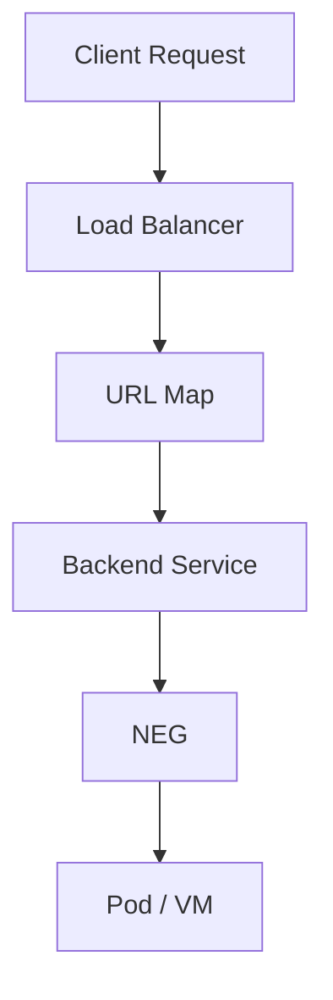

---
# 如何正确思考"创建一个资源"——从命令驱动到模型驱动

---

# 如何正确思考“创建一个资源”

从命令驱动到模型驱动

在使用 GCP、Kubernetes、Terraform 或 Linux Infrastructure 时，很多工程师都会陷入一种习惯：

> “找到命令 → 改参数 → 执行 → 报错 → 再改。”

这种“命令驱动”模式，很容易让人陷入无效调试。更深层的原因是：  
我们在“从命令理解系统”，而不是“从资源模型理解系统”。

正确的方法应该是：

> **先理解资源模型 → 再理解依赖关系 → 最后才是命令。**

---

## 一、资源创建的四个层次

几乎所有的资源创建，都可以抽象成以下四个层次：

**Concept → Resource Model → Dependencies → Command**

换句话说：

> **命令只是资源模型的一种表达方式。**

只有在理解了前面三个层次后，写命令才真正有意义。

---

## 二、标准思考流程

## Step 1：理解概念（Concept）

先搞清楚——**这个资源是什么？它解决了什么问题？**

| 资源               | 本质               |
| ------------------ | ------------------ |
| Backend Service    | LB 的后端逻辑组    |
| URL Map            | 请求路由规则       |
| NEG                | 后端 Endpoint 集合 |
| Service Attachment | PSC 服务发布       |

关键要问自己两个问题：

1. 它属于哪一层架构？

2. 它在流量路径的哪个环节？

一个典型的流量流向：

text

`Client → Load Balancer → URL Map → Backend Service → NEG → Pod / VM`

概念模糊，就会出现逻辑混乱、参数乱填、调试困难。

---

## Step 2：理解资源模型（Resource Model）

每个资源实质上都是一个 **API Object**。  
例如 GCP 的 REST API：

text

`POST https://compute.googleapis.com/.../backendServices`

而命令：

bash

`gcloud compute backend-services create`

只是 API 的 CLI 包装。

资源模型常包含四类字段：

| 类型     | 说明             |
| -------- | ---------------- |
| 必选字段 | 决定资源能否创建 |
| 可选字段 | 控制行为         |
| 默认字段 | 系统自动填充     |
| 只读字段 | 系统生成信息     |

理解这些字段，比背命令重要得多。

---

## Step 3：分析依赖关系（Dependencies）

几乎所有云资源都有前置依赖。

例如创建 Backend Service 之前，必须存在：

- Health Check

- NEG 或 MIG

- Network

其关系可以抽象为：

text

`Resource → Needs → Other Resources`

也可以绘成依赖图：

text

`Client Request → Load Balancer → URL Map → Backend Service → NEG → Pod / VM`

创建顺序通常是：

1. Health Check

2. NEG / MIG

3. Backend Service

4. URL Map

5. Forwarding Rule

顺序错了，错误就会接踵而至。

---

## Step 4：命令只是最后一步

当资源模型与依赖都清楚之后，命令只是“翻译”而已。

json

`{   "name": "api-backend",  "protocol": "HTTPS",  "timeoutSec": 30 }`

对应命令：

bash

`gcloud compute backend-services create api-backend \   --protocol HTTPS \  --timeout 30`

> 命令不是设计工具，只是执行工具。

---

## 三、一个值得坚持的工程思维

> **先画资源图，再写命令。**

例如一个 GCP GLB 结构：

text

`GLB  ├─ Forwarding Rule ├─ Target Proxy ├─ URL Map └─ Backend Service      └─ NEG           └─ Pod`

图清晰了，创建就顺了。

---

## 四、AI 的正确使用方式

常见的误区：

> “问 AI → 拿命令 → 执行 → 报错 → 再问 AI。”

这是“AI 驱动开发”，而不是工程设计。

正确姿势：

> **工程师设计 → AI 验证 → 人执行。**

AI 更适合帮你：

- 解释文档与参数

- 校验架构与依赖

- Debug 与错误分析

而不是代替你下命令。

---

## 五、创建资源前的三个自检问题

1️⃣ 这个资源在架构中的位置是什么？  
2️⃣ 它依赖哪些资源？  
3️⃣ 命令属于 API 哪一层抽象？（REST / Terraform / gcloud / Console）

理解清楚这三点，你几乎不会再“盲配参数”。

---

## 六、工程哲学

可以这样看待云平台：

> 云平台 = 巨大的对象模型  
> 工程师的工作 = 创建对象 + 连接对象 + 配置对象  
> 命令 = 对象创建语法

---

## 七、一个实用的方法

学习每个资源时，整理四个部分：

| 项目     | 内容                      |
| -------- | ------------------------- |
| Resource | Backend Service           |
| 概念     | 管理负载均衡的后端        |
| 必选参数 | name, protocol, backend   |
| 依赖资源 | Health Check, NEG / MIG   |
| 创建方式 | gcloud / REST / Terraform |

长期积累，你会得到一份属于自己的 **云资源知识图谱**。

---

✅ **一句话总结**

> 不要从命令理解云平台，而要从资源模型理解命令。

---

是否希望我帮你再整理一个「GCP 资源分析模板」？  
例如适用于 NEG、Backend Service、URL Map、Service Attachment、PSC 等资源，用统一结构快速分析与学习。

## 1. 问题分析

在云平台（如 **GCP / Kubernetes / Linux Infrastructure**）中创建资源时，很多工程师会进入一种 **"命令驱动模式"**：

- 先找一个 `gcloud` / `kubectl` / `terraform` 命令
- 修改参数
- 执行
- 报错
- 再修改

这种方式虽然能解决问题，但往往存在几个问题：

| 问题         | 说明                          |
| ------------ | ----------------------------- |
| 缺乏整体理解 | 不知道资源真正的模型          |
| 参数理解片面 | 只知道某个 flag，但不知道依赖 |
| 调试成本高   | 不断试错                      |
| 难以复用     | 不能形成稳定的知识结构        |

本质上，这是 **从"命令"理解系统，而不是从"资源模型"理解系统**。

正确的方式应该是：

> **先理解资源模型 → 再理解依赖关系 → 最后才是命令。**

---

## 2. 创建资源的正确思考框架

可以把任何资源创建过程抽象为 **四个层次**：

```
Concept → Resource Model → Dependencies → Command

概念        资源模型          依赖关系         创建命令
```

换句话说：

> **命令只是资源模型的一种表达方式。**

---

## 3. 标准思考流程

### Step 1：理解概念（Concept）

首先要理解 **这个资源是什么，它解决什么问题**。

例如：

| 资源               | 本质                       |
| ------------------ | -------------------------- |
| Backend Service    | Load Balancer 的后端逻辑组 |
| URL Map            | 请求路由规则               |
| NEG                | Backend Endpoint 集合      |
| Service Attachment | PSC 服务发布               |

这里的关键问题是：

- 这个资源属于 **哪一层架构**
- 它在 **流量路径中的位置**

例如：

```
Client
  ↓
Load Balancer
  ↓
URL Map
  ↓
Backend Service
  ↓
NEG / MIG
  ↓
Backend Pod / VM
```

如果概念不清楚，就容易出现：

- 参数乱配
- 逻辑混乱
- 调试困难

---

### Step 2：理解资源模型（Resource Model）

每个资源其实都是一个 **API Object**。

例如：

```
REST API
POST https://compute.googleapis.com/compute/v1/projects/…/backendServices
```

命令：

```bash
gcloud compute backend-services create
```

本质只是：

```
CLI = API 的包装
```

资源模型通常包含：

| 类型     | 说明         |
| -------- | ------------ |
| 必选字段 | 创建资源必须 |
| 可选字段 | 控制行为     |
| 默认字段 | 系统自动填充 |
| 只读字段 | 由系统生成   |

例如 Backend Service：

| 字段           | 类型 | 说明         |
| -------------- | ---- | ------------ |
| name           | 必选 | 资源名称     |
| protocol       | 必选 | HTTP / HTTPS |
| backends       | 必选 | 后端资源     |
| timeoutSec     | 可选 | 请求超时     |
| securityPolicy | 可选 | Cloud Armor  |
| fingerprint    | 只读 | 版本控制     |

---

### Step 3：分析依赖关系（Dependencies）

云资源几乎都有 **依赖图**。

例如：

创建 Backend Service 之前必须有：

```
NEG / MIG
Health Check
Network
```

可以抽象成：

```
Resource
   ↓
Needs
   ↓
Other Resources
```

例如：



所以创建顺序通常是：

```
Health Check
NEG / MIG
Backend Service
URL Map
Forwarding Rule
```

如果顺序错误，就会出现：

```
Resource not found
Invalid reference
Dependency error
```

---

## 4. 命令只是最后一步

当你理解了：

- 资源模型
- 依赖关系

命令其实就变成了 **机械翻译**。

例如：

资源 JSON：

```json
{
  "name": "api-backend",
  "protocol": "HTTPS",
  "timeoutSec": 30
}
```

命令：

```bash
gcloud compute backend-services create api-backend \
  --protocol HTTPS \
  --timeout 30
```

所以：

> **命令不是设计工具，只是执行工具。**

---

## 5. 一个非常重要的工程思维

在复杂系统（GCP / Kubernetes）中，有一个非常重要的思维：

> **先画资源图，再写命令。**

例如：

```
GLB
 ├─ Forwarding Rule
 │
 ├─ Target Proxy
 │
 ├─ URL Map
 │
 └─ Backend Service
      └─ NEG
          └─ Pod
```

然后再逐个创建。

---

## 6. AI 使用的正确方式

AI 在工程实践中最容易造成的问题是：

```
Engineer → 问 AI → 执行命令 → 报错 → 再问 AI
```

这会变成：

```
AI 驱动开发
```

而正确方式应该是：

```
Engineer 设计
      ↓
   AI 验证
      ↓
Engineer 执行
```

AI 更适合做：

| 角色     | 作用         |
| -------- | ------------ |
| 文档解释 | 帮你理解资源 |
| 参数分析 | 解释 flag    |
| 架构验证 | Review 方案  |
| Debug    | 分析错误     |

而不是：

```
AI 给命令 → 直接执行
```

---

## 7. 一个很好的自检问题

每次创建资源前，可以问自己 **三个问题**：

### 1️⃣ 这个资源在架构中的位置是什么？

例如：

```
URL Map = routing layer
Backend Service = traffic distribution
```

---

### 2️⃣ 它依赖哪些资源？

例如：

```
Backend Service
 ├─ Health Check
 ├─ NEG / MIG
 └─ Network
```

---

### 3️⃣ 命令只是 API 的哪一层？

例如：

```
REST API
   ↓
Terraform
   ↓
gcloud CLI
   ↓
Console UI
```

其实是同一个东西。

---

## 8. 一个总结性的哲学

可以把云资源理解为：

```
云平台 = 一个巨大的对象模型
```

而我们做的事情只是：

```
创建对象
连接对象
配置对象
```

命令只是：

```
对象创建语法
```

---

## 9. 一个非常实用的方法（推荐）

以后每学习一个资源，可以整理四个部分：

```
Resource: Backend Service

1. 概念
   负责管理 LB 后端

2. 必选参数
   name
   protocol
   backend

3. 依赖资源
   Health Check
   NEG / MIG

4. 创建方式
   gcloud / REST / Terraform
```

长期积累，你会得到一个：

> **自己的云资源知识图谱**

---

## ✅ 一句话总结

> 不要从命令理解云平台，而要从资源模型理解命令。

---

如果你愿意，我可以再帮你总结一个 **"GCP 资源创建通用分析模板"**。

你以后看任何资源：

```
NEG
Backend Service
URL Map
Service Attachment
PSC
```

都可以用同一个模板分析，这会非常适合你的工作模式。
