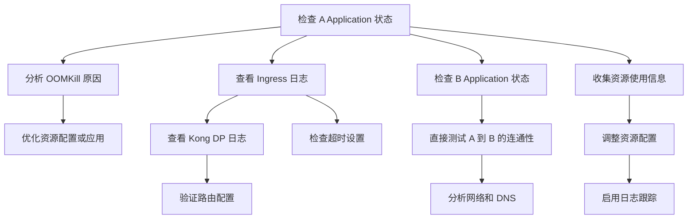

- [Summary](#summary)
- [Gemini2](#gemini2)
- [Claude](#claude)
- [chatgpt](#chatgpt)
    - [1. **检查 A Application 的 Pod 状态**](#1-检查-a-application-的-pod-状态)
    - [2. **验证 Ingress 和 Kong 日志**](#2-验证-ingress-和-kong-日志)
      - [**Ingress 日志**](#ingress-日志)
      - [**Kong DP 日志**](#kong-dp-日志)
    - [3. **检查 B Application 的状态**](#3-检查-b-application-的状态)
    - [4. **测试 A 到 B 的直接连通性**](#4-测试-a-到-b-的直接连通性)
    - [5. **收集和分析资源使用**](#5-收集和分析资源使用)
    - [6. **启用请求跟踪**](#6-启用请求跟踪)
    - [7. **监控和重现问题**](#7-监控和重现问题)
    - [8. **总结**](#8-总结)
    - [注意事项](#注意事项)
- [Grok](#grok)

# Summary 
这个Flow,比如A Application ==> ingress ==> Kong Dp ==> B application 
A application and b application at same namespace ,那么如果A去请求B的时候 A的 application抛出这个异常 java.util.concurrent.TimeoutException
那么我如何Debug这个问题? 比如Ingress的日志 或者Kong DP的日志等等 给我一个完整的思路?
另外一个信息就是A application的Pod 有被 OOMKilled


# Gemini2
好的，我们来一起分析和调试这个问题。这是一个典型的微服务调用超时，并且伴随着 OOMKilled 的情况，需要综合考虑多个环节。

**问题分析：**

*   **超时 (java.util.concurrent.TimeoutException):** A 应用请求 B 应用时出现超时，说明请求在一定时间内没有得到响应。这可能是网络问题、B 应用处理慢、或者中间环节的延迟造成的。
*   **OOMKilled (A 应用 Pod):** A 应用的 Pod 被 OOMKilled，表示 A 应用的内存使用超过了限制，导致 Kubernetes 强制终止 Pod。这可能意味着 A 应用本身有内存泄漏或配置不足，也可能意味着 A 应用需要处理大量的请求或数据，导致内存占用过高。

**Debug 思路：**

由于问题涉及多个环节，我们需要按照请求路径逐步排查，并且关注 A 应用的资源情况。以下是一个完整的调试思路：

**1. 检查 A 应用的 Pod 状态：**

*   **OOMKilled 频率和时间点:**  查看 A 应用的 Pod 事件日志，确认 OOMKilled 的频率和发生时间点。这可以帮助你判断 OOM 是偶发还是频繁发生。
*   **Pod 资源配置:** 检查 A 应用 Pod 的资源限制 (memory request 和 memory limit)。如果设置过低，可能是导致 OOMKilled 的直接原因。
*   **Pod 日志:** 查看 A 应用的 Pod 日志，是否有内存泄露、异常错误等信息。
    *   **监控信息:** 监控 A Pod的内存和CPU使用情况，确认是否是因为某些请求或者某些时间段的请求导致的OOM。

**2. 检查 A 应用的请求日志：**

*   **超时时间:**  确认 A 应用配置的请求超时时间。
*   **超时时间点:**  查找 A 应用的日志，看看超时发生在哪些时间点，是否与 OOMKilled 时间点相关联。
*   **超时请求信息:**  记录超时的请求信息，例如：请求 URL、请求参数等，方便后续分析。
*   **请求量和请求耗时:** 分析 A 应用的请求量和平均请求耗时。是否在超时发生前有请求量突增或者请求耗时变长。
*   **是否有重试：** 是否配置了重试机制，如果配置了，超时发生时，A应用是否会重试，重试是否会导致内存的持续增加。

**3. 检查 Ingress 日志：**

*   **请求日志:** 查看 Ingress 的请求日志，确认请求是否到达了 Ingress。
*   **请求耗时:** 关注 Ingress 的请求耗时，看看请求是否在 Ingress 环节就出现了延迟。
*   **错误日志:** 检查 Ingress 的错误日志，看看是否有转发错误或者连接问题。
*   **Ingress 健康状态：** 确认 ingress 本身是否处于健康状态，如果有流量倾斜或者节点异常，会直接导致请求的失败。

**4. 检查 Kong DP 日志：**

*   **请求日志:** 查看 Kong DP 的请求日志，确认请求是否到达了 Kong DP。
*   **请求耗时:** 关注 Kong DP 的请求耗时，看看 Kong DP 是否引入了延迟。
*   **错误日志:** 检查 Kong DP 的错误日志，看看是否有转发错误或者连接问题。
*   **Kong DP 插件:** 确认是否有插件配置导致请求延迟，比如： 限流，认证等插件的额外耗时。
*  **Kong DP 健康状态：** 确认 Kong DP 本身是否处于健康状态，是否有流量倾斜或者节点异常，会直接导致请求的失败。

**5. 检查 B 应用的 Pod 状态：**

*   **Pod 状态:**  查看 B 应用的 Pod 状态，是否有异常或重启。
*   **Pod 日志:**  查看 B 应用的 Pod 日志，是否有错误或异常信息，看看是否有慢查询或者其他耗时操作导致请求延迟。
*  **监控信息:** 监控 B Pod 的 CPU和内存的使用情况，看看是否有异常导致CPU飙高或者内存增长过快。

**6. 网络排查:**

*   **网络连通性:** 确认 A 应用 Pod 可以正常访问 B 应用 Pod。可以使用 `kubectl exec` 进入 A 应用 Pod 执行 `curl` 或 `telnet` 命令测试网络连通性。
*   **DNS 解析:** 确认 A 应用 Pod 可以正确解析 B 应用的 Service 名称。
*   **Pod 网络策略:** 检查是否有 Pod 网络策略 (Network Policy) 阻止了 A 应用 Pod 访问 B 应用 Pod。
*   **跨namespace:** 如果A 和B 不在同一个namespace，需要检查A的namespace是否有访问B的namespace的权限。
*   **网络延迟:** 使用 `traceroute` 或 `ping` 命令检测网络延迟，特别是在跨节点或跨区域的情况下。

**具体操作步骤建议：**

1.  **复现问题:** 先尝试复现超时错误，以便收集日志和进行调试。
2.  **资源调整:** 先调整A应用的Pod资源配置， 增加memory limit 的大小，观察OOM 是否得到缓解。
3.  **日志收集:** 收集上述提到的各个环节的日志，包括 A 应用 Pod、Ingress、Kong DP 和 B 应用 Pod 的日志。
4.  **对比分析:** 对比分析各个环节的日志，找出请求延迟或错误的环节。
5.  **逐一排除:** 根据分析结果，逐步排除问题，例如：优化 B 应用代码，调整 Kong DP 配置等。
6.  **监控报警:** 建立完善的监控报警机制，及时发现和解决问题。

**总结：**

*   **A 应用 OOMKilled:** 可能是内存泄露、配置不足或请求量过大导致，优先检查 A 应用的资源配置和代码。
*   **超时错误:** 可能涉及网络、Ingress、Kong DP、B 应用等多个环节，需要逐步排查。
*   **综合分析:** 需要综合分析各个环节的日志和监控数据，才能定位根本原因。

**附加建议：**

*   **使用监控工具:**  使用 Prometheus + Grafana 等监控工具，收集和分析应用的性能指标。
*   **分布式追踪:** 引入分布式追踪系统，例如 Jaeger 或 Zipkin，追踪请求在各个环节的耗时，帮助定位性能瓶颈。
*   **代码优化:** 对 A 应用和 B 应用进行代码优化，减少内存消耗和请求耗时。

希望这个调试思路能够帮助你解决问题！如果你在排查过程中有任何疑问，欢迎继续提问。


# Claude 
让我帮你梳理一下如何调试这个超时和OOM的问题。由于涉及多个组件,我们需要系统性地排查:

1. 首先检查 A 应用的问题:
```bash
# 查看 A 应用的详细状态和事件
kubectl describe pod <pod-name> -n <namespace>

# 查看 A 应用的日志
kubectl logs <pod-name> -n <namespace>

# 查看 Pod 的资源使用情况
kubectl top pod <pod-name> -n <namespace>
```

2. 检查 OOMKilled 问题:
- 查看 Pod 的内存限制和请求:
```bash
kubectl get pod <pod-name> -n <namespace> -o yaml | grep -A 5 resources
```
- 分析内存使用模式:
```bash
# 查看历史资源使用情况(如果启用了 metrics-server)
kubectl get --raw "/apis/metrics.k8s.io/v1beta1/namespaces/<namespace>/pods/<pod-name>"
```

3. 检查 Ingress 日志:
```bash
# 获取 ingress-nginx controller pod
kubectl get pods -n ingress-nginx

# 查看 ingress 控制器日志
kubectl logs -n ingress-nginx <ingress-controller-pod> 
```

4. 检查 Kong DP 日志:
```bash
# 获取 Kong pods
kubectl get pods -n <kong-namespace>

# 查看 Kong 数据平面日志
kubectl logs <kong-dp-pod> -n <kong-namespace>

# 查看 Kong 配置
kubectl exec -it <kong-dp-pod> -n <kong-namespace> -- kong config show
```

5. 检查网络连接:
```bash
# 从 A 应用 Pod 内部测试与 B 应用的连接
kubectl exec -it <pod-a> -n <namespace> -- curl -v http://<service-b>

# 查看网络策略
kubectl get networkpolicies -n <namespace>
```

6. 检查服务发现:
```bash
# 验证服务是否正确注册
kubectl get svc -n <namespace>

# 检查 endpoints
kubectl get endpoints <service-b> -n <namespace>
```

7. 性能分析工具:
```bash
# 使用 netshoot 容器进行网络诊断
kubectl run tmp-shell --rm -i --tty --image nicolaka/netshoot -- /bin/bash

# 在 netshoot 中使用 tcpdump 抓包
tcpdump -i any host <pod-b-ip>
```

关键排查点:
1. OOMKilled 问题:
   - 检查 JVM 堆内存设置
   - 查看是否有内存泄漏
   - 考虑增加内存限制或优化应用内存使用

2. TimeoutException 问题:
   - 检查超时配置(A应用客户端超时、Kong超时、B应用处理超时)
   - 观察网络延迟
   - 检查 B 应用的负载和响应时间

3. 监控指标:
   - 查看 Prometheus/Grafana(如果有)中的指标
   - 关注 HTTP 状态码、延迟、错误率等

建议按以下顺序排查:
1. 先确认 A 应用的 OOM 是否与 TimeoutException 相关
2. 检查网络连接性和延迟
3. 验证 Kong 和 Ingress 配置
4. 分析 B 应用的负载和响应能力

如果需要更详细地排查某个具体方面,我可以提供更深入的命令和方法。你想先从哪个方面开始深入排查?

# chatgpt 
当你遇到 `java.util.concurrent.TimeoutException` 并发现 A Application 的 Pod 被 OOMKilled 时，这表明可能存在资源不足或网络层面的问题。以下是一个完整的 Debug 思路：

---

### 1. **检查 A Application 的 Pod 状态**
   - 查看 A Application 的资源配置和状态：
     ```bash
     kubectl describe pod <pod-name> -n <namespace>
     ```
   - 确认是否有如下问题：
     - Pod 是否因内存不足被杀（`OOMKilled` 状态）。
     - 查看 Pod 的资源请求 (`requests`) 和限制 (`limits`) 是否合理。
     - 查看 Pod 的事件日志，确认 OOMKill 的具体原因。

   **解决方法：**
   - 增加 `memory limit` 或优化 A 应用的内存使用。
   - 增加 `liveness` 和 `readiness` 探针，确保 Pod 能快速恢复。

---

### 2. **验证 Ingress 和 Kong 日志**

#### **Ingress 日志**
   - 检查 Ingress 是否正常处理请求：
     ```bash
     kubectl logs <ingress-controller-pod> -n <namespace>
     ```
   - 关注是否有错误，如 404、502、超时等。

   **常见问题和解决方法：**
   - 如果超时：
     - 检查 Ingress 的 `proxy-read-timeout` 和 `proxy-send-timeout` 设置。
     - 增加超时值：
       ```yaml
       annotations:
         nginx.ingress.kubernetes.io/proxy-read-timeout: "120"
         nginx.ingress.kubernetes.io/proxy-send-timeout: "120"
       ```

#### **Kong DP 日志**
   - 获取 Kong 数据平面的日志：
     ```bash
     kubectl logs <kong-dp-pod> -n <namespace>
     ```
   - 观察是否有：
     - 请求超时 (`timeout` 错误)。
     - 路由配置错误。

   **解决方法：**
   - 检查 Kong 的路由配置是否正确，例如目标主机名、端口。
   - 确保 Kong 配置的服务地址和实际服务地址一致。

---

### 3. **检查 B Application 的状态**
   - 确保 B Application 正常工作并且能够处理请求：
     ```bash
     kubectl describe pod <pod-name> -n <namespace>
     kubectl logs <pod-name> -n <namespace>
     ```
   - 验证 B 的 readiness 探针是否通过，以及是否有任何异常日志。

---

### 4. **测试 A 到 B 的直接连通性**
   - 使用 BusyBox 或其他调试工具 Pod 测试直接连接：
     ```bash
     kubectl run busybox --image=busybox --rm -it --restart=Never -- sh
     wget http://<B-Application-Service>:<port> -O-
     ```
   - 确保 DNS 和网络正常。

---

### 5. **收集和分析资源使用**
   - **检查 A Application 和 B Application 的资源使用：**
     ```bash
     kubectl top pod -n <namespace>
     ```
   - **分析节点的资源限制是否导致问题：**
     ```bash
     kubectl describe node <node-name>
     ```

   **解决方法：**
   - 调整资源限制，确保 Pods 有足够的内存和 CPU。
   - 如果资源紧张，考虑增加节点或优化应用。

---

### 6. **启用请求跟踪**
   - 在 Kong 中启用详细日志跟踪：
     - 配置 Kong 的 `log-level` 为 `debug`。
     - 检查是否有请求丢失或错误路由。

   - **捕获流量**：
     使用工具如 `tcpdump` 或 `nginx.ingress.kubernetes.io/access-log` 捕获流量以确认是否有问题请求。

---

### 7. **监控和重现问题**
   - 配置 Prometheus 或类似工具监控 A 和 B 应用的性能指标。
   - 结合 Pod 的 restart 事件，定位是否与 OOMKill 相关。

---

### 8. **总结**
以下是整体排查流程的 Mermaid 图：



---

### 注意事项
- 修复 OOMKill 的问题是第一步，确保 A Application 不再因为资源不足而中断。
- 如果问题在解决资源问题后仍然存在，重点关注 Ingress、Kong 和网络配置的超时参数。


# Grok 

为了有效调试 A Application 在请求 B Application 时抛出的 java.util.concurrent.TimeoutException，并考虑到 A Application 的 Pod 被 OOMKilled，可以按照以下步骤进行：

1. 理解问题背景
Namespace: A Application 和 B Application 在同一个 namespace，说明网络访问应该比较简单，但问题可能在于资源管理或配置。
TimeoutException: 这通常表示请求在指定时间内没有得到响应，可能由于网络问题、服务过载或资源不足。
OOMKilled: 表示 A Application 的 Pod 由于内存耗尽而被 Kubernetes 系统终止。

2. 日志和监控
A Application
应用日志: 查看 A Application 的日志，寻找关于 TimeoutException 的具体信息。使用 kubectl logs <pod-name> 来查看日志。
检查是否有大量请求或长时间等待的迹象。
确认是否有任何异常或错误消息指示内存问题或其他资源限制。

Ingress
Ingress 日志: 查看 Ingress Controller 的日志，确认请求是否正常路由到 Kong DP。
例如，如果使用了 NGINX Ingress Controller，可以查看其日志以查找请求处理速度或错误。
kubectl logs -l app=nginx-ingress -n <namespace> 或类似的命令。

Kong DP (Data Plane)
Kong 日志: Kong 的日志可以提供关于请求处理的详细信息，包括延迟、错误等。
使用 kubectl logs <kong-pod-name> 查看日志，关注请求时间、错误消息或超时。
检查 Kong 的配置是否正确，特别是与超时相关的配置。

B Application
B Application 日志: 确保查看 B Application 的日志，确认它是否接收到了请求，并且是否有处理这些请求的延迟或问题。
同样使用 kubectl logs <pod-name>。

3. 资源和性能分析
内存使用情况：
使用 kubectl top pod 检查 A Application 和 B Application 的内存使用情况，特别是在出现 OOMKilled 时。
分析是否有内存泄漏或资源配置不足，导致 Pod 频繁重启。
网络性能：
使用 kubectl exec 进入 Pod 内部，运行网络诊断工具如 ping 或 traceroute 检查网络延迟。
考虑使用 tcpdump 或其他网络监控工具来捕获网络包，分析请求和响应的时序。

4. 调整和优化
调整超时设置：
在 A Application 中增加超时时间或重试逻辑，确保在网络波动时有更好的容错性。
检查 Kong DP 和 Ingress 的超时配置，确保它们设置合理。
资源配额和限制：
调整 Kubernetes 的资源请求和限制，确保 A Application 和 B Application 有足够的内存预算，避免 OOMKilled。
健康检查和自动扩缩：
配置合理的健康检查和自动扩缩策略，确保服务在高负载下能够动态调整资源。

5. 性能测试和监控工具
使用工具如 Prometheus 和 Grafana 来持续监控服务的性能和资源使用情况。
进行负载测试，模拟高并发情况下的服务行为，找出潜在的瓶颈。

通过这些步骤，你应该能够定位问题的原因，是否是由于 A Application 的内存管理不当导致的 OOMKilled，还是 B Application 的响应性能问题，抑或是网络或配置上的其他问题。记得在每次更改后进行验证，确保问题得到解决。