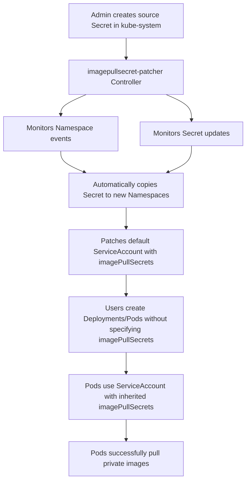

# Why Service Accounts Have imagePullSecrets Automatically Added

## Overview

If you're observing that your ServiceAccounts in GKE (Google Kubernetes Engine) automatically have an `imagePullSecrets` field added, this is likely due to the presence of the `imagepullsecret-patcher` controller in your cluster.

## What is imagepullsecret-patcher?

`imagepullsecret-patcher` is a Kubernetes controller designed to automate the management and distribution of image pull secrets across namespaces within a Kubernetes cluster. Its primary purpose is to simplify the process of authenticating to private container registries for all workloads running in the cluster.

## How It Works

The tool operates by performing two main functions periodically (e.g., every 10 seconds):

### 1. Secret Cloning and Refreshing
- It checks for the existence of a designated image pull secret in each namespace
- If the secret is missing or contains stale information, `imagepullsecret-patcher` clones it from a primary source secret (typically located in a designated namespace like `kube-system`)
- This ensures all namespaces have a consistent and up-to-date image pull secret

### 2. Service Account Patching
- It verifies that the default service account (or optionally all service accounts) in each namespace has a reference to the cloned image pull secret in its `imagePullSecrets` field
- If this reference is missing, the service account is automatically patched to include it
- This enables pods associated with that service account to pull images from the private registry without explicit configuration in each pod's manifest

## Example Behavior

When you run:
```bash
kubectl get sa abc -n namespace -o yaml
```

You see:
```yaml
apiVersion: v1
kind: ServiceAccount
metadata:
  name: abc
  namespace: namespace
imagePullSecrets:
- name: image-pull-secret
```

This happens because the `imagepullsecret-patcher` controller automatically adds this field to ensure pods can pull images from private registries.

## Architecture Flow



## Configuration

The controller typically uses a ConfigMap to define the source secret location:

```yaml
apiVersion: v1
kind: ConfigMap
metadata:
  name: imagepullsecret-patcher
  namespace: kube-system
data:
  config.yaml: |
    source:
      secret:
        name: regcred
        namespace: kube-system
```

## Troubleshooting

### To Check if the Controller is Running
```bash
kubectl get deployments -n kube-system | grep imagepullsecret
```

### To View the Controller Configuration
```bash
kubectl get configmap imagepullsecret-patcher -n kube-system -o yaml
```

### To See the Source Secret
```bash
kubectl get secret <source-secret-name> -n <source-namespace> -o yaml
```

### To Understand Which Namespaces Are Affected
The controller typically affects all namespaces in the cluster, automatically adding the image pull secret to service accounts.

## Managing the Behavior

### If You Want to Disable This Behavior
1. Locate the `imagepullsecret-patcher` deployment in your cluster
2. Either delete the deployment or configure it to exclude certain namespaces
3. Note that removing this may affect pods that rely on private image registries

### If You Want to Modify the Secret Used
1. Update the source secret in the designated namespace (usually `kube-system`)
2. The controller will automatically propagate the changes to all namespaces

## Benefits

- Eliminates the need for manual secret creation in every namespace
- Removes the need to manually patch service accounts
- Ensures consistent authentication to private registries across the cluster
- Simplifies deployment manifests (no need to specify imagePullSecrets in each pod)

## Security Considerations

- All namespaces receive the same image pull secret, which may not be ideal for multi-tenant environments
- Consider using multiple controllers with different configurations for different sets of namespaces if stronger isolation is required