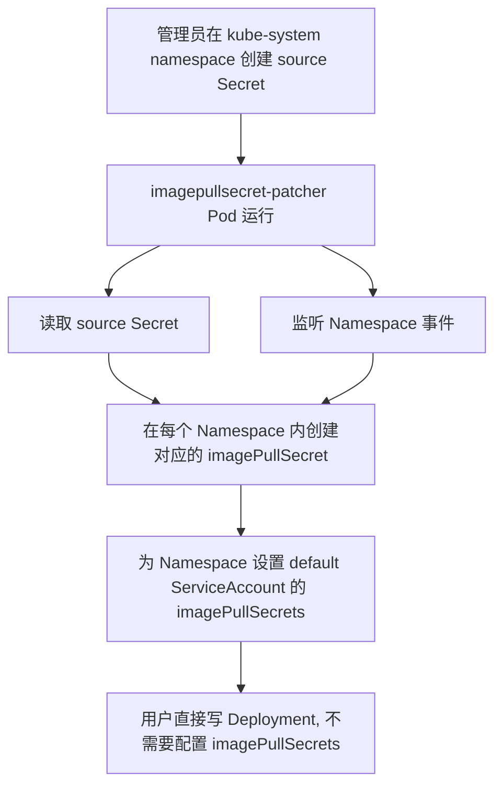
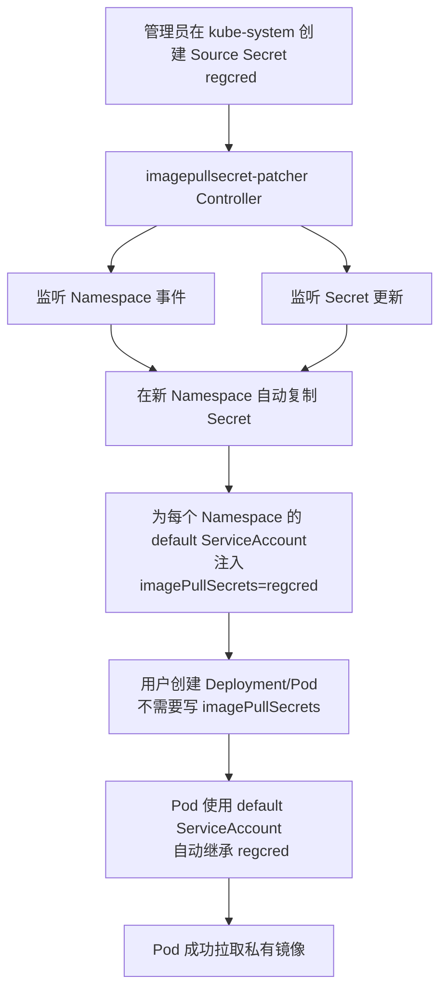
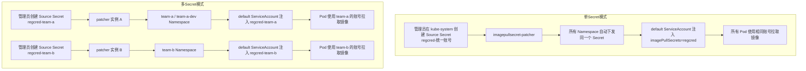

# concepts
`imagepullsecret-patcher` is a Kubernetes client-go application designed to automate the management and distribution of image pull secrets across namespaces within a Kubernetes cluster. Developed by Titansoft, its primary purpose is to simplify the process of authenticating to private container registries, such as Docker Hub or private Artifactory instances, for all workloads running in the cluster.

The tool operates by performing two main functions periodically (e.g., every 10 seconds):

- **Secret Cloning and Refreshing:**
    
    It checks for the existence of a designated image pull secret in each namespace. If the secret is missing or contains stale information, `imagepullsecret-patcher` clones it from a primary, source secret (typically located in its own namespace) to ensure all namespaces have a consistent and up-to-date image pull secret.
    
- **Service Account Patching:**
    
    It verifies that the default service account (or optionally all service accounts) in each namespace has a reference to the cloned image pull secret in its `imagePullSecrets` field. If this reference is missing, the service account is automatically patched to include it, enabling pods associated with that service account to pull images from the private registry without explicit configuration in each pod's manifest.
    

This automation streamlines the management of private registry credentials in large or dynamic Kubernetes environments, eliminating the need for manual secret creation and service account patching in every namespace.


# ChatGPT  

完整梳理一下 [**titansoft-pte-ltd/imagepullsecret-patcher**](https://github.com/titansoft-pte-ltd/imagepullsecret-patcher) 这个工具的原理、使用方式、适配到你们场景的可行性，以及对应需要做的工作。

---

## **1. 工具介绍与工作流程**

  

**目的**：

在 Kubernetes 集群中，Pod 拉取私有镜像需要配置 imagePullSecrets。

如果每个 Namespace 都手动创建 Secret，并在 Deployment/Pod 的 YAML 里手动指定，很繁琐。

  

**这个工具的作用**就是自动化：

- 将一个已有的 Docker Registry Secret 下发到集群中的所有 Namespace；
    
- 自动给 Namespace 打上 imagePullSecrets，使用户无需在 Deployment 里手动写；
    
- 监听 Namespace/Secret 的变化，保证一致性。
    

---

**工作机制流程**：



---

## **2. 软件实现原理**

1. **CRD 不需要**：它是一个轻量级 Controller，不涉及 CRD。
    
2. **监听机制**：
    
    - Watch 所有 Namespace，当有新建 Namespace 时，自动下发 Secret；
        
    - Watch Secret，当源 Secret 更新时，自动同步到所有 Namespace。
        
    
3. **更新 ServiceAccount**：
    
    - 默认会修改 default ServiceAccount，自动挂载 imagePullSecrets。
        
    - 用户创建 Pod 时，如果没特别指定，Pod 就能直接用这个 Secret。
        
    

---

## **3. 你们的使用计划分析**

  

你提到的计划：

- 集群中有一个 SourceAccount（比如阿里云 / GCP / Harbor 的 Registry 凭证）；
    
- 通过 imagepullsecret-patcher，把这个 Secret 自动同步到所有 Namespace；
    
- 用户不需要自己在 Deployment 的 YAML 里写 imagePullSecrets。
    

  

**这是完全可行的**，符合这个工具的设计初衷。

---

### **3.1 Secret 的管理方式**

  

你需要在一个 Namespace（通常是 kube-system）里创建好 Secret，例如：

```bash
kubectl create secret docker-registry regcred \
  --docker-server=registry.cn.aliyuncs.com \
  --docker-username=your-username \
  --docker-password=your-password \
  --docker-email=your-email@example.com \
  -n kube-system
```

这就是 **source secret**。

  

然后 imagepullsecret-patcher 会把它复制到所有 Namespace。

---

### **3.2 Secret 的 YAML 文件管理**

  

如果你要用 GitOps 或配置管理（比如 ArgoCD/Helm），建议把 Secret 存成一个 YAML 文件：

```yaml
apiVersion: v1
kind: Secret
metadata:
  name: regcred
  namespace: kube-system
type: kubernetes.io/dockerconfigjson
data:
  .dockerconfigjson: <base64编码后的docker配置>
```

- namespace: kube-system → 这是工具默认读取的地方；
    
- name: regcred → 默认名字可以在配置里指定。
    

---

### **3.3 imagepullsecret-patcher 的配置文件**

  

默认它有一个 ConfigMap 来定义来源 Secret，比如：

```yaml
apiVersion: v1
kind: ConfigMap
metadata:
  name: imagepullsecret-patcher
  namespace: kube-system
data:
  config.yaml: |
    source:
      secret:
        name: regcred
        namespace: kube-system
```

这里 source.secret 指定了哪个 Secret 作为全局分发的来源。

---

### **3.4 部署方式**

  

官方提供了 Deployment YAML，你可以直接部署：

```bash
kubectl apply -f https://raw.githubusercontent.com/titansoft-pte-ltd/imagepullsecret-patcher/master/deploy/all-in-one.yaml
```

它会在 kube-system 下运行一个 Deployment，持续 Watch 并同步 Secret。

---

## **4. 是否需要自己 build 镜像**

  

通常 **不需要自己 build 镜像**，直接用官方的就可以：

```yaml
containers:
  - name: imagepullsecret-patcher
    image: titansoft/imagepullsecret-patcher:latest
```

只有当你想要**修改逻辑**（比如增加白名单/黑名单 Namespace 策略、支持多个 Secret）时，才需要 Fork + 自己 Build。

---

## **5. 你需要做的事情 Checklist**

1. **确定全局的 source secret**：
    
    - 在 kube-system 下创建一个 docker-registry 类型的 Secret。
        
    - 或者通过 YAML 文件（GitOps 方式）管理它。
        
    
2. **部署 imagepullsecret-patcher**：
    
    - 用官方提供的 all-in-one.yaml，或者自己写 Deployment + ConfigMap；
        
    - 确保配置里指向你创建的 Secret。
        
    
3. **验证**：
    
    - 新建一个 Namespace，检查是否自动生成了 Secret；
        
    - 查看 default ServiceAccount 是否自动带上 imagePullSecrets；
        
    - 部署一个使用私有镜像的 Deployment，确认能直接拉镜像。
        
    
4. **维护**：
    
    - 当 Source Secret 过期时，更新 kube-system 下的 Secret，工具会自动分发；
        
    - 可以考虑在 CI/CD 里定期刷新 Secret。
        
    

---

## **6. 小结**

- **工具作用**：自动将一个 registry Secret 分发到所有 Namespace，并挂载到默认 ServiceAccount，用户不用写 imagePullSecrets。
    
- **可行性**：完全符合你们的需求。
    
- **管理方式**：在 kube-system 下维护一个 Source Secret（用 YAML 管理更好）。
    
- **配置文件**：主要是一个 ConfigMap，指定来源 Secret。
    
- **是否需要自己 build**：一般不需要，除非你要改逻辑。
    

---

要不要我帮你写一个 **完整的 GitOps 版本 YAML（包含 Secret + ConfigMap + Deployment）**，这样你们直接放进仓库就能部署？


好，那我帮你写一个完整的 **GitOps 版本 YAML**，包含三部分：

1. **Source Secret**（存放在 kube-system）
    
2. **ConfigMap**（指定 source secret 的位置）
    
3. **Deployment**（运行 imagepullsecret-patcher 控制器）
    

  

你可以把这个 YAML 放到 Git 仓库里，用 ArgoCD / Flux / kubectl apply 来部署。

---

### **完整 YAML 示例**

```yaml
# 1. Source Secret (docker-registry 类型)
apiVersion: v1
kind: Secret
metadata:
  name: regcred
  namespace: kube-system
type: kubernetes.io/dockerconfigjson
data:
  .dockerconfigjson: <替换成 base64 编码后的 docker 配置>

---
# 2. ConfigMap (配置来源 Secret 的位置)
apiVersion: v1
kind: ConfigMap
metadata:
  name: imagepullsecret-patcher
  namespace: kube-system
data:
  config.yaml: |
    source:
      secret:
        name: regcred
        namespace: kube-system

---
# 3. RBAC 权限
apiVersion: v1
kind: ServiceAccount
metadata:
  name: imagepullsecret-patcher
  namespace: kube-system

---
apiVersion: rbac.authorization.k8s.io/v1
kind: ClusterRole
metadata:
  name: imagepullsecret-patcher
rules:
- apiGroups: [""]
  resources: ["secrets", "namespaces", "serviceaccounts"]
  verbs: ["get", "list", "watch", "create", "update", "patch", "delete"]

---
apiVersion: rbac.authorization.k8s.io/v1
kind: ClusterRoleBinding
metadata:
  name: imagepullsecret-patcher
roleRef:
  apiGroup: rbac.authorization.k8s.io
  kind: ClusterRole
  name: imagepullsecret-patcher
subjects:
- kind: ServiceAccount
  name: imagepullsecret-patcher
  namespace: kube-system

---
# 4. Deployment (运行控制器)
apiVersion: apps/v1
kind: Deployment
metadata:
  name: imagepullsecret-patcher
  namespace: kube-system
spec:
  replicas: 1
  selector:
    matchLabels:
      app: imagepullsecret-patcher
  template:
    metadata:
      labels:
        app: imagepullsecret-patcher
    spec:
      serviceAccountName: imagepullsecret-patcher
      containers:
      - name: imagepullsecret-patcher
        image: titansoft/imagepullsecret-patcher:latest
        imagePullPolicy: IfNotPresent
        volumeMounts:
        - name: config
          mountPath: /config
      volumes:
      - name: config
        configMap:
          name: imagepullsecret-patcher
```

---

### **使用方式**

1. **准备 docker 配置并转成 base64**
    

```
cat ~/.docker/config.json | base64 -w 0
```

1. 替换掉 .dockerconfigjson 里的 <替换成 base64 编码后的 docker 配置>。
    
2. **提交到 GitOps 仓库**
    
    - 可以按文件拆开管理（secret.yaml, config.yaml, deployment.yaml）
        
    - 也可以像上面这样写在一个 all-in-one.yaml
        
    
3. **部署验证**
    

```
kubectl apply -f all-in-one.yaml
```

3.   
    
4. **验证效果**
    

```
kubectl get secrets -n <new-namespace>
kubectl get serviceaccount default -n <new-namespace> -o yaml
```

4. - 新的 Namespace 应该自动有 regcred Secret；
        
    - default ServiceAccount 的 imagePullSecrets 应该自动挂载 regcred。
        
    

---

要不要我帮你再写一个 **测试 Deployment YAML**（用私有镜像），方便你一键验证这个机制是否生效？

好的 👍 我帮你画一个 **完整流程图**，涵盖从 Source Secret 到 Pod 成功拉镜像的过程。

---

### **Mermaid 流程图**



---

### **说明**

1. **Source Secret**：只需在 kube-system 下维护一次。
    
2. **Controller**：负责 watch + sync。
    
3. **Namespace**：一旦新建 Namespace，会自动下发 Secret。
    
4. **ServiceAccount**：自动被更新，避免用户手动改 YAML。
    
5. **Pod 拉镜像**：用户只写业务逻辑，不需要关心镜像凭证。
    

---

要不要我帮你写一个 **团队用的简短操作手册（管理员/用户视角）**，这样你可以直接丢给同事用？


有一点我没有太明白 比如这个Secret的列表在哪里维护?Source Secret 如果是不同的用户使用不同的账户和密码?

非常好的问题 👌，这个点其实涉及 **Secret 管理模型**，关系到你们怎么在集群里区分用户/团队。

我帮你拆开解释清楚：

---

## **1. Source Secret 的维护位置**

- **单账号模型（默认模式）**
    
    - 你在 kube-system 下维护一个全局 Source Secret，比如 regcred；
        
    - 这个 Secret 会被 imagepullsecret-patcher 分发到所有 Namespace；
        
    - **适用场景**：所有团队都用同一个镜像仓库账号（比如企业统一的 CI/CD 账号）。
        
    

---

- **多账号模型（需要扩展）**
    
    - 如果不同的用户/团队需要不同的仓库账号（例如：teamA、teamB 使用不同的 Docker Hub / Harbor / GAR 账号），就不能只靠一个全局 Secret；
        
    - 这时需要为每个 Namespace 定义一个对应的 Source Secret，然后由 patcher 分发。
        
    - 官方版本 imagepullsecret-patcher 只支持 **单 Source Secret**，所以如果你们有这种需求，通常有两个选择：
        
        1. **运行多个 patcher 实例**，每个实例管理一个 Source Secret，并只 watch 特定 Namespace。
            
        2. **改造代码 / Fork 项目**，让它支持多 Secret → 多 Namespace 的映射。
            
        
    

---

## **2. Secret 列表的维护方式**

  

如果是 **单 Source Secret**，只需要维护一个 YAML（例如放 GitOps 仓库里）：

```yaml
apiVersion: v1
kind: Secret
metadata:
  name: regcred
  namespace: kube-system
type: kubernetes.io/dockerconfigjson
data:
  .dockerconfigjson: <base64 编码后的 docker 配置>
```

当你更新这个 Secret（比如换密码/Token），patcher 会自动同步到所有 Namespace。

---

如果要支持 **多账号**，你需要一个 Secret → Namespace 的映射表，常见做法有：

  

### **方法 A：手动维护多份 Secret**

  

在 kube-system 里维护多个 Secret，例如：

- regcred-team-a
    
- regcred-team-b
    

  

然后运行两个 patcher 实例：

```yaml
# team-a 的 patcher
config.yaml:
  source:
    secret:
      name: regcred-team-a
      namespace: kube-system
# team-b 的 patcher
config.yaml:
  source:
    secret:
      name: regcred-team-b
      namespace: kube-system
```

再通过 RBAC 或 Namespace selector 限制同步范围。

---

### **方法 B：自己扩展**

  

Fork 代码，写一个配置文件支持这种映射关系：

```yaml
mappings:
  - source:
      name: regcred-team-a
      namespace: kube-system
    targets:
      - namespace: team-a
      - namespace: team-a-dev

  - source:
      name: regcred-team-b
      namespace: kube-system
    targets:
      - namespace: team-b
```

这样就能把不同 Secret 分发到不同 Namespace。

---

## **3. 建议**

- 如果你们公司是 **统一管理镜像仓库**（比如一个 Harbor，账号密码统一给 CI/CD 用），推荐 **单 Secret 模式**，最省事；
    
- 如果你们公司有 **多租户、多团队、不同仓库账号**，推荐：
    
    - **短期方案**：部署多个 patcher 实例，每个 team 一个 Source Secret；
        
    - **长期方案**：考虑用更强大的工具，比如 [sealed-secrets](https://github.com/bitnami-labs/sealed-secrets) + GitOps 来管理 Secret，或者 Fork imagepullsecret-patcher 实现 Secret → Namespace 的映射。
        
    

---

要不要我帮你设计一个 **多团队（多账号）场景下的分发架构图**，让你更直观地比较 **单 Secret 模式 vs 多 Secret 模式**？

好 👍 我帮你画一个 **多团队（多账号）场景的分发架构图**，对比 **单 Secret 模式** 和 **多 Secret 模式**。

---

### **Mermaid 架构图**



---

### **对比总结**

|**模式**|**特点**|**优点**|**缺点**|
|---|---|---|---|
|**单 Secret 模式**|所有 Namespace 共用一个 Source Secret|简单、省事，易于管理|安全性差，所有团队共用同一账号，无法区分责任|
|**多 Secret 模式**|每个团队对应一个 Secret，由不同 patcher 实例分发|安全隔离性好，不同团队用不同账号|部署和维护复杂，需要多个 Secret + 多个 patcher|

---

👉 结合你的场景：

- 如果你们是 **单一私有镜像仓库账号** → 建议走 **单 Secret 模式**；
    
- 如果你们是 **多租户团队，需要隔离镜像仓库权限** → 建议走 **多 Secret 模式**。
    

---

要不要我帮你写一个 **多 Secret 模式的 YAML 示例**（比如 team-a 和 team-b 各自一套配置 + patcher 实例）？