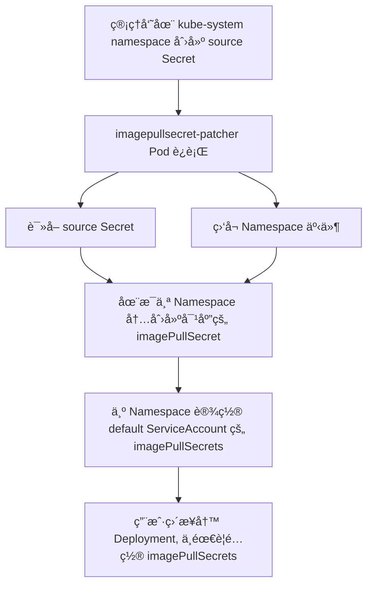
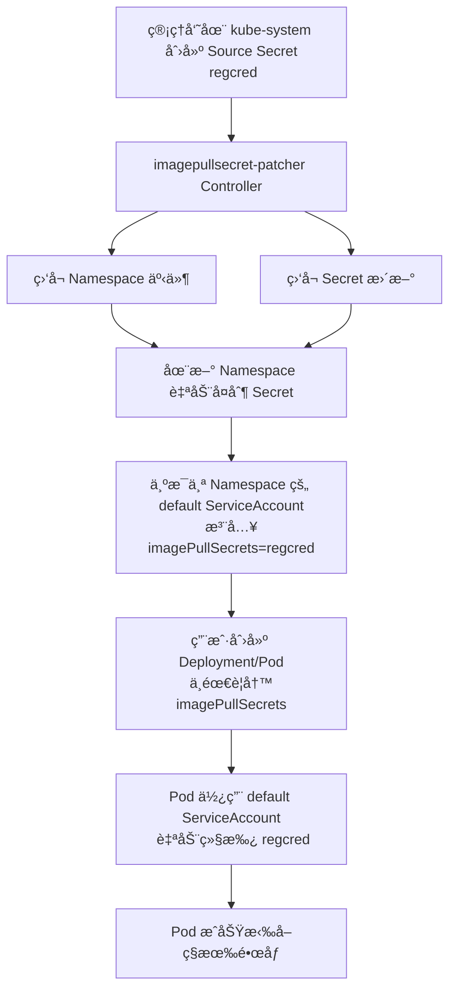

# concepts
`imagepullsecret-patcher` is a Kubernetes client-go application designed to automate the management and distribution of image pull secrets across namespaces within a Kubernetes cluster. Developed by Titansoft, its primary purpose is to simplify the process of authenticating to private container registries, such as Docker Hub or private Artifactory instances, for all workloads running in the cluster.

The tool operates by performing two main functions periodically (e.g., every 10 seconds):

- **Secret Cloning and Refreshing:**
    
    It checks for the existence of a designated image pull secret in each namespace. If the secret is missing or contains stale information, `imagepullsecret-patcher` clones it from a primary, source secret (typically located in its own namespace) to ensure all namespaces have a consistent and up-to-date image pull secret.
    
- **Service Account Patching:**
    
    It verifies that the default service account (or optionally all service accounts) in each namespace has a reference to the cloned image pull secret in its `imagePullSecrets` field. If this reference is missing, the service account is automatically patched to include it, enabling pods associated with that service account to pull images from the private registry without explicit configuration in each pod's manifest.
    

This automation streamlines the management of private registry credentials in large or dynamic Kubernetes environments, eliminating the need for manual secret creation and service account patching in every namespace.


# ChatGPT  

完整梳ç†ä¸€ä¸‹ [**titansoft-pte-ltd/imagepullsecret-patcher**](https://github.com/titansoft-pte-ltd/imagepullsecret-patcher) 这个工具的åŸç†ã€ä½¿ç”¨æ–¹å¼ã€é€‚é…到你们场景的å¯è¡Œæ€§ï¼Œä»¥åŠå¯¹åº”需è¦åšçš„工作。

---

## **1. 工具介ç»ä¸å·¥ä½œæµç¨‹**

  

**目的**：

在 Kubernetes 集群中，Pod 拉å–ç§æœ‰é•œåƒéœ€è¦é…ç½® imagePullSecrets。

如æœæ¯ä¸ª Namespace 都手动创建 Secret，并在 Deployment/Pod çš„ YAML 里手动指定，很ç¹ç。

  

**这个工具的作用**就是自动化：

- 将一个已有的 Docker Registry Secret 下å‘到集群中的所有 Namespaceï¼›
    
- 自动给 Namespace 打上 imagePullSecrets，使用户无需在 Deployment 里手动写；
    
- ç›‘å¬ Namespace/Secret çš„å˜åŒ–，ä¿è¯ä¸€è‡´æ€§ã€‚
    

---

**工作机制æµç¨‹**：



---

## **2. 软件å®ç°åŸç†**

1. **CRD ä¸éœ€è¦**：它是一个轻é‡çº§ Controller，ä¸æ¶‰åŠ CRD。
    
2. **监å¬æœºåˆ¶**：
    
    - Watch 所有 Namespace，当有新建 Namespace æ—¶ï¼Œè‡ªåŠ¨ä¸‹å‘ Secretï¼›
        
    - Watch Secretï¼Œå½“æº Secret 更新时，自动åŒæ­¥åˆ°æ‰€æœ‰ Namespace。
        
    
3. **更新 ServiceAccount**：
    
    - 默认会修改 default ServiceAccount，自动挂载 imagePullSecrets。
        
    - 用户创建 Pod 时，如æœæ²¡ç‰¹åˆ«æŒ‡å®šï¼ŒPod 就能直æ¥ç”¨è¿™ä¸ª Secret。
        
    

---

## **3. 你们的使用计划分æ**

  

ä½ æ到的计划：

- 集群中有一个 SourceAccount（比如阿里云 / GCP / Harbor çš„ Registry 凭è¯ï¼‰ï¼›
    
- 通过 imagepullsecret-patcher，把这个 Secret 自动åŒæ­¥åˆ°æ‰€æœ‰ Namespaceï¼›
    
- 用户ä¸éœ€è¦è‡ªå·±åœ¨ Deployment çš„ YAML 里写 imagePullSecrets。
    

  

**这是完全å¯è¡Œçš„**，符åˆè¿™ä¸ªå·¥å…·çš„设计åˆè¡·ã€‚

---

### **3.1 Secret 的管ç†æ–¹å¼**

  

你需è¦åœ¨ä¸€ä¸ª Namespace（通常是 kube-system）里创建好 Secret，例如：

```bash
kubectl create secret docker-registry regcred \
  --docker-server=registry.cn.aliyuncs.com \
  --docker-username=your-username \
  --docker-password=your-password \
  --docker-email=your-email@example.com \
  -n kube-system
```

这就是 **source secret**。

  

然å imagepullsecret-patcher 会把它å¤åˆ¶åˆ°æ‰€æœ‰ Namespace。

---

### **3.2 Secret çš„ YAML 文件管ç†**

  

如æœä½ è¦ç”¨ GitOps 或é…置管ç†ï¼ˆæ¯”如 ArgoCD/Helm），建议把 Secret å­˜æˆä¸€ä¸ª YAML 文件：

```yaml
apiVersion: v1
kind: Secret
metadata:
  name: regcred
  namespace: kube-system
type: kubernetes.io/dockerconfigjson
data:
  .dockerconfigjson: <base64ç¼–ç åçš„dockeré…ç½®>
```

- namespace: kube-system → 这是工具默认读å–的地方；
    
- name: regcred → 默认åå­—å¯ä»¥åœ¨é…置里指定。
    

---

### **3.3 imagepullsecret-patcher çš„é…置文件**

  

默认它有一个 ConfigMap æ¥å®šä¹‰æ¥æº Secret，比如：

```yaml
apiVersion: v1
kind: ConfigMap
metadata:
  name: imagepullsecret-patcher
  namespace: kube-system
data:
  config.yaml: |
    source:
      secret:
        name: regcred
        namespace: kube-system
```

这里 source.secret 指定了哪个 Secret 作为全局分å‘çš„æ¥æºã€‚

---

### **3.4 部署方å¼**

  

官方æ供了 Deployment YAML，你å¯ä»¥ç›´æ¥éƒ¨ç½²ï¼š

```bash
kubectl apply -f https://raw.githubusercontent.com/titansoft-pte-ltd/imagepullsecret-patcher/master/deploy/all-in-one.yaml
```

它会在 kube-system 下è¿è¡Œä¸€ä¸ª Deployment，æŒç»­ Watch 并åŒæ­¥ Secret。

---

## **4. 是å¦éœ€è¦è‡ªå·± build é•œåƒ**

  

通常 **ä¸éœ€è¦è‡ªå·± build é•œåƒ**，直æ¥ç”¨å®˜æ–¹çš„å°±å¯ä»¥ï¼š

```yaml
containers:
  - name: imagepullsecret-patcher
    image: titansoft/imagepullsecret-patcher:latest
```

åªæœ‰å½“你想è¦**修改逻辑**（比如å¢åŠ ç™½åå•/黑åå• Namespace ç­–ç•¥ã€æ”¯æŒå¤šä¸ª Secret）时，æ‰éœ€è¦ Fork + 自己 Build。

---

## **5. 你需è¦åšçš„事情 Checklist**

1. **确定全局的 source secret**：
    
    - 在 kube-system 下创建一个 docker-registry ç±»å‹çš„ Secret。
        
    - 或者通过 YAML 文件（GitOps æ–¹å¼ï¼‰ç®¡ç†å®ƒã€‚
        
    
2. **部署 imagepullsecret-patcher**：
    
    - 用官方æ供的 all-in-one.yaml，或者自己写 Deployment + ConfigMapï¼›
        
    - ç¡®ä¿é…置里指å‘你创建的 Secret。
        
    
3. **验è¯**：
    
    - 新建一个 Namespace，检查是å¦è‡ªåŠ¨ç”Ÿæˆäº† Secretï¼›
        
    - 查看 default ServiceAccount 是å¦è‡ªåŠ¨å¸¦ä¸Š imagePullSecretsï¼›
        
    - 部署一个使用ç§æœ‰é•œåƒçš„ Deployment，确认能直æ¥æ‹‰é•œåƒã€‚
        
    
4. **维护**：
    
    - 当 Source Secret 过期时，更新 kube-system 下的 Secret，工具会自动分å‘ï¼›
        
    - å¯ä»¥è€ƒè™‘在 CI/CD 里定期刷新 Secret。
        
    

---

## **6. å°ç»“**

- **工具作用**：自动将一个 registry Secret 分å‘到所有 Namespace，并挂载到默认 ServiceAccount，用户ä¸ç”¨å†™ imagePullSecrets。
    
- **å¯è¡Œæ€§**：完全符åˆä½ ä»¬çš„需求。
    
- **管ç†æ–¹å¼**：在 kube-system 下维护一个 Source Secret（用 YAML 管ç†æ›´å¥½ï¼‰ã€‚
    
- **é…置文件**：主è¦æ˜¯ä¸€ä¸ª ConfigMap，指定æ¥æº Secret。
    
- **是å¦éœ€è¦è‡ªå·± build**：一般ä¸éœ€è¦ï¼Œé™¤éä½ è¦æ”¹é€»è¾‘。
    

---

è¦ä¸è¦æˆ‘帮你写一个 **完整的 GitOps 版本 YAMLï¼ˆåŒ…å« Secret + ConfigMap + Deployment）**，这样你们直æ¥æ”¾è¿›ä»“库就能部署？


好，那我帮你写一个完整的 **GitOps 版本 YAML**，包å«ä¸‰éƒ¨åˆ†ï¼š

1. **Source Secret**（存放在 kube-system）
    
2. **ConfigMap**（指定 source secret çš„ä½ç½®ï¼‰
    
3. **Deployment**（è¿è¡Œ imagepullsecret-patcher æ§åˆ¶å™¨ï¼‰
    

  

ä½ å¯ä»¥æŠŠè¿™ä¸ª YAML 放到 Git 仓库里，用 ArgoCD / Flux / kubectl apply æ¥éƒ¨ç½²ã€‚

---

### **完整 YAML 示例**

```yaml
# 1. Source Secret (docker-registry ç±»å‹)
apiVersion: v1
kind: Secret
metadata:
  name: regcred
  namespace: kube-system
type: kubernetes.io/dockerconfigjson
data:
  .dockerconfigjson: <替æ¢æˆ base64 ç¼–ç åçš„ docker é…ç½®>

---
# 2. ConfigMap (é…ç½®æ¥æº Secret çš„ä½ç½®)
apiVersion: v1
kind: ConfigMap
metadata:
  name: imagepullsecret-patcher
  namespace: kube-system
data:
  config.yaml: |
    source:
      secret:
        name: regcred
        namespace: kube-system

---
# 3. RBAC æƒé™
apiVersion: v1
kind: ServiceAccount
metadata:
  name: imagepullsecret-patcher
  namespace: kube-system

---
apiVersion: rbac.authorization.k8s.io/v1
kind: ClusterRole
metadata:
  name: imagepullsecret-patcher
rules:
- apiGroups: [""]
  resources: ["secrets", "namespaces", "serviceaccounts"]
  verbs: ["get", "list", "watch", "create", "update", "patch", "delete"]

---
apiVersion: rbac.authorization.k8s.io/v1
kind: ClusterRoleBinding
metadata:
  name: imagepullsecret-patcher
roleRef:
  apiGroup: rbac.authorization.k8s.io
  kind: ClusterRole
  name: imagepullsecret-patcher
subjects:
- kind: ServiceAccount
  name: imagepullsecret-patcher
  namespace: kube-system

---
# 4. Deployment (è¿è¡Œæ§åˆ¶å™¨)
apiVersion: apps/v1
kind: Deployment
metadata:
  name: imagepullsecret-patcher
  namespace: kube-system
spec:
  replicas: 1
  selector:
    matchLabels:
      app: imagepullsecret-patcher
  template:
    metadata:
      labels:
        app: imagepullsecret-patcher
    spec:
      serviceAccountName: imagepullsecret-patcher
      containers:
      - name: imagepullsecret-patcher
        image: titansoft/imagepullsecret-patcher:latest
        imagePullPolicy: IfNotPresent
        volumeMounts:
        - name: config
          mountPath: /config
      volumes:
      - name: config
        configMap:
          name: imagepullsecret-patcher
```

---

### **使用方å¼**

1. **准备 docker é…ç½®å¹¶è½¬æˆ base64**
    

```
cat ~/.docker/config.json | base64 -w 0
```

1. 替æ¢æ‰ .dockerconfigjson 里的 <替æ¢æˆ base64 ç¼–ç åçš„ docker é…ç½®>。
    
2. **æ交到 GitOps 仓库**
    
    - å¯ä»¥æŒ‰æ–‡ä»¶æ‹†å¼€ç®¡ç†ï¼ˆsecret.yaml, config.yaml, deployment.yaml）
        
    - 也å¯ä»¥åƒä¸Šé¢è¿™æ ·å†™åœ¨ä¸€ä¸ª all-in-one.yaml
        
    
3. **部署验è¯**
    

```
kubectl apply -f all-in-one.yaml
```

3.   
    
4. **验è¯æ•ˆæœ**
    

```
kubectl get secrets -n <new-namespace>
kubectl get serviceaccount default -n <new-namespace> -o yaml
```

4. - 新的 Namespace 应该自动有 regcred Secret；
        
    - default ServiceAccount 的 imagePullSecrets 应该自动挂载 regcred。
        
    

---

è¦ä¸è¦æˆ‘帮你å†å†™ä¸€ä¸ª **测试 Deployment YAML**（用ç§æœ‰é•œåƒï¼‰ï¼Œæ–¹ä¾¿ä½ ä¸€é”®éªŒè¯è¿™ä¸ªæœºåˆ¶æ˜¯å¦ç”Ÿæ•ˆï¼Ÿ

好的 👠我帮你画一个 **完整æµç¨‹å›¾**ï¼Œæ¶µç›–ä» Source Secret 到 Pod æˆåŠŸæ‹‰é•œåƒçš„过程。

---

### **Mermaid æµç¨‹å›¾**



---

### **说æ˜**

1. **Source Secret**：åªéœ€åœ¨ kube-system 下维护一次。
    
2. **Controller**：负责 watch + sync。
    
3. **Namespace**：一旦新建 Namespaceï¼Œä¼šè‡ªåŠ¨ä¸‹å‘ Secret。
    
4. **ServiceAccount**：自动被更新，é¿å…用户手动改 YAML。
    
5. **Pod 拉镜åƒ**：用户åªå†™ä¸šåŠ¡é€»è¾‘，ä¸éœ€è¦å…³å¿ƒé•œåƒå‡­è¯ã€‚
    

---

è¦ä¸è¦æˆ‘帮你写一个 **团队用的简短æ“作手册（管ç†å‘˜/用户视角）**，这样你å¯ä»¥ç›´æ¥ä¸¢ç»™åŒäº‹ç”¨ï¼Ÿ


有一点我没有太æ˜ç™½ 比如这个Secret的列表在哪里维护?Source Secret 如æœæ˜¯ä¸åŒçš„用户使用ä¸åŒçš„账户和密ç ?

é常好的问题 👌，这个点其å®æ¶‰åŠ **Secret 管ç†æ¨¡å‹**，关系到你们æ€ä¹ˆåœ¨é›†ç¾¤é‡ŒåŒºåˆ†ç”¨æˆ·/团队。

我帮你拆开解释清楚：

---

## **1. Source Secret 的维护ä½ç½®**

- **å•è´¦å·æ¨¡å‹ï¼ˆé»˜è®¤æ¨¡å¼ï¼‰**
    
    - 你在 kube-system 下维护一个全局 Source Secret，比如 regcred；
        
    - 这个 Secret 会被 imagepullsecret-patcher 分å‘到所有 Namespaceï¼›
        
    - **适用场景**：所有团队都用åŒä¸€ä¸ªé•œåƒä»“库账å·ï¼ˆæ¯”如ä¼ä¸šç»Ÿä¸€çš„ CI/CD è´¦å·ï¼‰ã€‚
        
    

---

- **多账å·æ¨¡å‹ï¼ˆéœ€è¦æ‰©å±•ï¼‰**
    
    - 如æœä¸åŒçš„用户/团队需è¦ä¸åŒçš„仓库账å·ï¼ˆä¾‹å¦‚：teamAã€teamB 使用ä¸åŒçš„ Docker Hub / Harbor / GAR è´¦å·ï¼‰ï¼Œå°±ä¸èƒ½åªé ä¸€ä¸ªå…¨å±€ Secretï¼›
        
    - 这时需è¦ä¸ºæ¯ä¸ª Namespace 定义一个对应的 Source Secret，然åç”± patcher 分å‘。
        
    - 官方版本 imagepullsecret-patcher åªæ”¯æŒ **å• Source Secret**，所以如æœä½ ä»¬æœ‰è¿™ç§éœ€æ±‚，通常有两个选择：
        
        1. **è¿è¡Œå¤šä¸ª patcher å®ä¾‹**，æ¯ä¸ªå®ä¾‹ç®¡ç†ä¸€ä¸ª Source Secretï¼Œå¹¶åª watch 特定 Namespace。
            
        2. **æ”¹é€ ä»£ç  / Fork 项目**，让它支æŒå¤š Secret → 多 Namespace 的映射。
            
        
    

---

## **2. Secret 列表的维护方å¼**

  

如æœæ˜¯ **å• Source Secret**，åªéœ€è¦ç»´æŠ¤ä¸€ä¸ª YAML（例如放 GitOps 仓库里）：

```yaml
apiVersion: v1
kind: Secret
metadata:
  name: regcred
  namespace: kube-system
type: kubernetes.io/dockerconfigjson
data:
  .dockerconfigjson: <base64 ç¼–ç åçš„ docker é…ç½®>
```

当你更新这个 Secret（比如æ¢å¯†ç /Token），patcher 会自动åŒæ­¥åˆ°æ‰€æœ‰ Namespace。

---

如æœè¦æ”¯æŒ **多账å·**，你需è¦ä¸€ä¸ª Secret → Namespace 的映射表，常è§åšæ³•æœ‰ï¼š

  

### **方法 A：手动维护多份 Secret**

  

在 kube-system 里维护多个 Secret，例如：

- regcred-team-a
    
- regcred-team-b
    

  

然åè¿è¡Œä¸¤ä¸ª patcher å®ä¾‹ï¼š

```yaml
# team-a çš„ patcher
config.yaml:
  source:
    secret:
      name: regcred-team-a
      namespace: kube-system
# team-b çš„ patcher
config.yaml:
  source:
    secret:
      name: regcred-team-b
      namespace: kube-system
```

å†é€šè¿‡ RBAC 或 Namespace selector é™åˆ¶åŒæ­¥èŒƒå›´ã€‚

---

### **方法 B：自己扩展**

  

Fork 代ç ï¼Œå†™ä¸€ä¸ªé…置文件支æŒè¿™ç§æ˜ å°„关系：

```yaml
mappings:
  - source:
      name: regcred-team-a
      namespace: kube-system
    targets:
      - namespace: team-a
      - namespace: team-a-dev

  - source:
      name: regcred-team-b
      namespace: kube-system
    targets:
      - namespace: team-b
```

这样就能把ä¸åŒ Secret 分å‘到ä¸åŒ Namespace。

---

## **3. 建议**

- 如æœä½ ä»¬å…¬å¸æ˜¯ **统一管ç†é•œåƒä»“库**（比如一个 Harbor，账å·å¯†ç ç»Ÿä¸€ç»™ CI/CD 用），æ¨è **å• Secret 模å¼**，最çœäº‹ï¼›
    
- 如æœä½ ä»¬å…¬å¸æœ‰ **多租户ã€å¤šå›¢é˜Ÿã€ä¸åŒä»“库账å·**，æ¨è：
    
    - **短期方案**：部署多个 patcher å®ä¾‹ï¼Œæ¯ä¸ª team 一个 Source Secretï¼›
        
    - **长期方案**：考虑用更强大的工具，比如 [sealed-secrets](https://github.com/bitnami-labs/sealed-secrets) + GitOps æ¥ç®¡ç† Secret，或者 Fork imagepullsecret-patcher å®ç° Secret → Namespace 的映射。
        
    

---

è¦ä¸è¦æˆ‘帮你设计一个 **多团队（多账å·ï¼‰åœºæ™¯ä¸‹çš„分å‘æ¶æ„图**，让你更直观地比较 **å• Secret æ¨¡å¼ vs 多 Secret 模å¼**？

好 👠我帮你画一个 **多团队（多账å·ï¼‰åœºæ™¯çš„分å‘æ¶æ„图**，对比 **å• Secret 模å¼** å’Œ **多 Secret 模å¼**。

---

### **Mermaid æ¶æ„图**

```mermaid
graph TD;

subgraph å•Secret模å¼
    A1[管ç†å‘˜åœ¨ kube-system 创建 Source Secret<br/> regcred-统一账å·] --> B1[imagepullsecret-patcher]
    B1 --> C1[所有 Namespace 自动下å‘åŒä¸€ä¸ª Secret]
    C1 --> D1[default ServiceAccount 注入 imagePullSecrets=regcred]
    D1 --> E1[所有 Pod 使用相åŒè´¦å·æ‹‰å–é•œåƒ]
end

subgraph 多Secret模å¼
    A2a[管ç†å‘˜åˆ›å»º Source Secret<br/> regcred-team-a] --> B2a[patcher å®ä¾‹ A]
    A2b[管ç†å‘˜åˆ›å»º Source Secret<br/> regcred-team-b] --> B2b[patcher å®ä¾‹ B]

    B2a --> C2a[team-a / team-a-dev Namespace]
    B2b --> C2b[team-b Namespace]

    C2a --> D2a[default ServiceAccount 注入 regcred-team-a]
    C2b --> D2b[default ServiceAccount 注入 regcred-team-b]

    D2a --> E2a[Pod 使用 team-a çš„è´¦å·æ‹‰å–é•œåƒ]
    D2b --> E2b[Pod 使用 team-b çš„è´¦å·æ‹‰å–é•œåƒ]
end
```

---

### **对比总结**

|**模å¼**|**特点**|**优点**|**缺点**|
|---|---|---|---|
|**å• Secret 模å¼**|所有 Namespace 共用一个 Source Secret|简å•ã€çœäº‹ï¼Œæ˜“äºç®¡ç†|安全性差，所有团队共用åŒä¸€è´¦å·ï¼Œæ— æ³•åŒºåˆ†è´£ä»»|
|**多 Secret 模å¼**|æ¯ä¸ªå›¢é˜Ÿå¯¹åº”一个 Secret，由ä¸åŒ patcher å®ä¾‹åˆ†å‘|安全隔离性好，ä¸åŒå›¢é˜Ÿç”¨ä¸åŒè´¦å·|部署和维护å¤æ‚，需è¦å¤šä¸ª Secret + 多个 patcher|

---

👉 结åˆä½ çš„场景：

- 如æœä½ ä»¬æ˜¯ **å•ä¸€ç§æœ‰é•œåƒä»“库账å·** → 建议走 **å• Secret 模å¼**ï¼›
    
- 如æœä½ ä»¬æ˜¯ **多租户团队，需è¦éš”离镜åƒä»“库æƒé™** → 建议走 **多 Secret 模å¼**。
    

---

è¦ä¸è¦æˆ‘帮你写一个 **多 Secret 模å¼çš„ YAML 示例**（比如 team-a å’Œ team-b å„自一套é…ç½® + patcher å®ä¾‹ï¼‰ï¼Ÿ