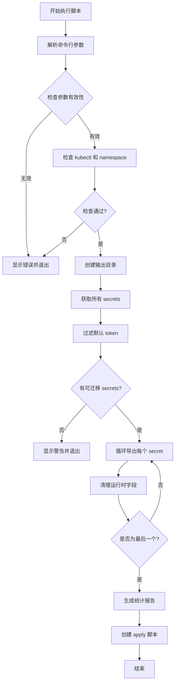

# Kubernetes Secrets 迁移脚本

## 问题分析

在迁移 Kubernetes Secrets 时，每个 namespace 下都存在默认的 service account token secret（通常以 `default-token-` 开头），这些 secret 不需要迁移。需要编写一个脚本来：

1. 获取指定 namespace 下的所有 secrets
2. 排除默认 token secrets
3. 导出并迁移这些 secrets

## 解决方案

### 完整迁移脚本

```bash
#!/bin/bash

# migrate-secrets.sh - Kubernetes Secrets 迁移脚本
# 用法: ./migrate-secrets.sh -n <namespace>

set -e

# 颜色输出
RED='\033[0;31m'
GREEN='\033[0;32m'
YELLOW='\033[1;33m'
NC='\033[0m' # No Color

# 默认值
NAMESPACE=""
OUTPUT_DIR="./secrets-backup"
EXCLUDE_PATTERNS="default-token-|^sh\.helm\.release"

# 显示使用说明
usage() {
    cat << EOF
用法: $0 -n <namespace> [选项]

选项:
    -n <namespace>    指定要迁移的 namespace (必需)
    -o <output_dir>   指定输出目录 (默认: ./secrets-backup)
    -e <pattern>      额外的排除模式 (使用 grep -E 格式)
    -h                显示帮助信息

示例:
    $0 -n production
    $0 -n production -o /backup/secrets
    $0 -n production -e "additional-pattern"
EOF
    exit 1
}

# 解析命令行参数
while getopts "n:o:e:h" opt; do
    case $opt in
        n) NAMESPACE="$OPTARG" ;;
        o) OUTPUT_DIR="$OPTARG" ;;
        e) EXCLUDE_PATTERNS="$EXCLUDE_PATTERNS|$OPTARG" ;;
        h) usage ;;
        *) usage ;;
    esac
done

# 检查必需参数
if [ -z "$NAMESPACE" ]; then
    echo -e "${RED}错误: 必须指定 namespace${NC}"
    usage
fi

# 检查 kubectl 是否可用
if ! command -v kubectl &> /dev/null; then
    echo -e "${RED}错误: kubectl 命令未找到${NC}"
    exit 1
fi

# 检查 namespace 是否存在
if ! kubectl get namespace "$NAMESPACE" &> /dev/null; then
    echo -e "${RED}错误: namespace '$NAMESPACE' 不存在${NC}"
    exit 1
fi

# 创建输出目录
mkdir -p "$OUTPUT_DIR/$NAMESPACE"

echo -e "${GREEN}开始迁移 namespace: $NAMESPACE${NC}"
echo -e "${YELLOW}输出目录: $OUTPUT_DIR/$NAMESPACE${NC}"
echo -e "${YELLOW}排除模式: $EXCLUDE_PATTERNS${NC}"
echo ""

# 获取所有 secrets 并排除默认 token
SECRETS=$(kubectl get secrets -n "$NAMESPACE" -o jsonpath='{.items[*].metadata.name}' | \
          tr ' ' '\n' | \
          grep -vE "$EXCLUDE_PATTERNS")

# 检查是否有需要迁移的 secrets
if [ -z "$SECRETS" ]; then
    echo -e "${YELLOW}警告: 没有找到需要迁移的 secrets${NC}"
    exit 0
fi

# 统计信息
TOTAL_SECRETS=$(echo "$SECRETS" | wc -l)
CURRENT=0
FAILED=0

echo -e "${GREEN}找到 $TOTAL_SECRETS 个需要迁移的 secrets${NC}"
echo ""

# 创建失败列表文件
FAILED_FILE="$OUTPUT_DIR/$NAMESPACE/failed-secrets.txt"
> "$FAILED_FILE"

# 导出每个 secret
for SECRET in $SECRETS; do
    CURRENT=$((CURRENT + 1))
    echo -e "${YELLOW}[$CURRENT/$TOTAL_SECRETS]${NC} 导出 secret: $SECRET"
    
    if kubectl get secret "$SECRET" -n "$NAMESPACE" -o yaml > "$OUTPUT_DIR/$NAMESPACE/$SECRET.yaml" 2>/dev/null; then
        # 清理 secret YAML 中的运行时字段
        sed -i.bak \
            -e '/^  creationTimestamp:/d' \
            -e '/^  resourceVersion:/d' \
            -e '/^  uid:/d' \
            -e '/^  selfLink:/d' \
            -e '/^status:/,$d' \
            "$OUTPUT_DIR/$NAMESPACE/$SECRET.yaml"
        
        # 删除备份文件
        rm -f "$OUTPUT_DIR/$NAMESPACE/$SECRET.yaml.bak"
        
        echo -e "${GREEN}  ✓ 成功${NC}"
    else
        echo -e "${RED}  ✗ 失败${NC}"
        echo "$SECRET" >> "$FAILED_FILE"
        FAILED=$((FAILED + 1))
    fi
done

echo ""
echo -e "${GREEN}迁移完成!${NC}"
echo -e "成功: $((TOTAL_SECRETS - FAILED))/$TOTAL_SECRETS"
if [ $FAILED -gt 0 ]; then
    echo -e "${RED}失败: $FAILED/$TOTAL_SECRETS${NC}"
    echo -e "${RED}失败列表已保存到: $FAILED_FILE${NC}"
fi
echo -e "导出文件位置: $OUTPUT_DIR/$NAMESPACE/"

# 生成应用脚本
cat > "$OUTPUT_DIR/$NAMESPACE/apply-secrets.sh" << 'APPLY_SCRIPT'
#!/bin/bash
# 应用导出的 secrets 到目标集群
set -e

NAMESPACE="${1:-}"
if [ -z "$NAMESPACE" ]; then
    echo "用法: $0 <target-namespace>"
    exit 1
fi

# 确保目标 namespace 存在
kubectl create namespace "$NAMESPACE" --dry-run=client -o yaml | kubectl apply -f -

# 应用所有 secret YAML 文件
for yaml_file in *.yaml; do
    if [ -f "$yaml_file" ]; then
        echo "应用: $yaml_file"
        kubectl apply -f "$yaml_file" -n "$NAMESPACE"
    fi
done

echo "所有 secrets 已成功应用到 namespace: $NAMESPACE"
APPLY_SCRIPT

chmod +x "$OUTPUT_DIR/$NAMESPACE/apply-secrets.sh"
echo -e "${GREEN}已生成应用脚本: $OUTPUT_DIR/$NAMESPACE/apply-secrets.sh${NC}"
```

## 使用流程



## 脚本功能说明

### 主要特性

1. **自动过滤默认 secrets**
    
    - 排除 `default-token-*` 格式的 service account tokens
    - 排除 Helm release secrets（`sh.helm.release.*`）
    - 支持自定义排除模式
2. **清理运行时字段**
    
    - 自动删除 `creationTimestamp`
    - 删除 `resourceVersion` 和 `uid`
    - 移除 `status` 字段
3. **错误处理**
    
    - 记录失败的 secrets
    - 生成失败列表文件
    - 提供详细的执行日志
4. **便捷应用**
    
    - 自动生成 `apply-secrets.sh` 脚本
    - 可直接在目标集群执行

## 使用示例

### 基本用法

```bash
# 迁移 production namespace 的 secrets
./migrate-secrets.sh -n production

# 指定输出目录
./migrate-secrets.sh -n production -o /backup/k8s-secrets

# 添加额外的排除模式
./migrate-secrets.sh -n production -e "temp-|test-"
```

### 应用到目标集群

```bash
# 切换到目标集群 context
kubectl config use-context target-cluster

# 进入导出目录
cd secrets-backup/production

# 应用 secrets 到目标 namespace
./apply-secrets.sh production

# 或应用到不同名称的 namespace
./apply-secrets.sh production-new
```

### 批量迁移多个 namespace

```bash
#!/bin/bash
# batch-migrate.sh

NAMESPACES="prod-app prod-db staging-app staging-db"

for ns in $NAMESPACES; do
    echo "迁移 namespace: $ns"
    ./migrate-secrets.sh -n "$ns"
    echo "---"
done
```

## 注意事项

### 安全考虑

1. **敏感数据保护**
    
    - 导出的 YAML 文件包含 base64 编码的敏感数据
    - 建议加密备份目录或使用安全的存储位置
    - 完成迁移后及时删除导出文件
2. **权限要求**
    
    ```bash
    # 确保当前用户有足够权限
    kubectl auth can-i get secrets -n <namespace>
    kubectl auth can-i list secrets -n <namespace>
    ```
    
3. **备份验证**
    
    ```bash
    # 验证导出的 secrets 数量
    ls -1 secrets-backup/production/*.yaml | wc -l
    
    # 检查文件完整性
    for f in secrets-backup/production/*.yaml; do
        kubectl apply --dry-run=client -f "$f" || echo "Invalid: $f"
    done
    ```
    

### 常见排除模式

```bash
# 排除所有 token 类型
-e ".*-token-.*"

# 排除临时和测试 secrets
-e "temp-|test-|tmp-"

# 排除特定前缀
-e "^system-|^kube-"

# 组合多个模式
-e "default-token-|temp-|test-|^sh\.helm\.release"
```

### 故障排查

|问题|原因|解决方案|
|---|---|---|
|kubectl: command not found|kubectl 未安装或不在 PATH|安装 kubectl 或添加到 PATH|
|namespace not found|namespace 不存在|检查 namespace 名称拼写|
|permission denied|权限不足|使用有足够权限的 kubeconfig|
|导出的 YAML 为空|secret 已被删除或过滤掉|检查 secret 是否存在及排除模式|

## 最佳实践

1. **迁移前检查**
    
    ```bash
    # 列出将要迁移的 secrets
    kubectl get secrets -n production | grep -vE "default-token-|^sh\.helm\.release"
    ```
    
2. **增量迁移**
    
    ```bash
    # 先迁移非生产环境测试
    ./migrate-secrets.sh -n staging
    
    # 验证无误后再迁移生产环境
    ./migrate-secrets.sh -n production
    ```
    
3. **版本控制**
    
    ```bash
    # 将导出的 secrets 加入版本控制（需加密）
    git-crypt init
    git-crypt add-gpg-user your-email@example.com
    echo "secrets-backup/**/*.yaml filter=git-crypt diff=git-crypt" >> .gitattributes
    ```

# one Line
```bash
kubectl get secrets -n <namespace> -o jsonpath='{.items[*].metadata.name}' | \
tr ' ' '\n' | \
grep -vE "^default-token-|^sh\.helm\.release" | \
xargs -I {} kubectl get secret {} -n <namespace> -o json | \
jq -s '{apiVersion: "v1", kind: "List", items: map(del(.metadata.creationTimestamp, .metadata.resourceVersion, .metadata.uid, .metadata.selfLink, .status))}' \
> secrets.json


kubectl get secrets -n lex -o jsonpath='{.items[*].metadata.name}' | \
tr ' ' '\n' | \
grep -vE "^default-token-|^sh\.helm\.release" | \
xargs -I {} kubectl get secret {} -n lex -o json | \
jq -s '{apiVersion: "v1", kind: "List", items: map(del(.metadata.creationTimestamp, .metadata.resourceVersion, .metadata.uid, .metadata.selfLink, .status))}' |jq 


kubectl get secrets -n lex -o jsonpath='{.items[*].metadata.name}' | \
tr ' ' '\n' | \
grep -vE "^default-token-|^sh\.helm\.release" | \
xargs -I {} kubectl get secret {} -n lex -o json | \
jq -s '{apiVersion: "v1", kind: "List", items: map(del(.metadata.creationTimestamp, .metadata.resourceVersion, .metadata.uid, .metadata.selfLink, .status))}' |jq
```
