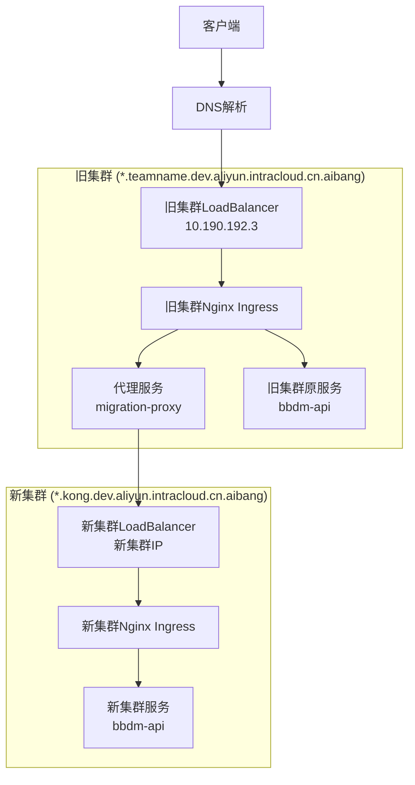

# K8s集群迁移设计文档

## 概述

本设计文档描述了如何实现从旧K8s集群到新K8s集群的平滑迁移。由于DNS限制无法修改域名解析，我们采用在旧集群部署代理服务的方案，通过Nginx Ingress Controller的upstream配置和ExternalName Service实现请求转发。

## 架构设计

### 整体架构



### 迁移策略

采用三阶段迁移策略：

1. **准备阶段**: 在新集群部署服务，在旧集群部署代理服务
2. **灰度阶段**: 通过权重配置逐步将流量切换到新集群
3. **完成阶段**: 100%流量切换到新集群，清理旧集群资源

## 组件和接口

### 1. 代理服务 (Migration Proxy)

**功能**: 在旧集群中部署的代理服务，负责将请求转发到新集群

**实现方式**: 
- 使用Nginx作为代理服务器
- 通过ConfigMap管理代理配置
- 支持动态配置更新

**关键配置**:
```nginx
upstream new_cluster_backend {
    server api-name01.kong.dev.aliyun.intracloud.cn.aibang:443;
}

upstream old_cluster_backend {
    server bbdm-api.aibang-1111111111-bbdm.svc.cluster.local:8078;
}

server {
    listen 80;
    server_name api-name01.teamname.dev.aliyun.intracloud.cn.aibang;
    
    location / {
        # 灰度配置：基于权重分流
        if ($migration_weight = "new") {
            proxy_pass https://new_cluster_backend;
        }
        proxy_pass http://old_cluster_backend;
    }
}
```

### 2. ExternalName Service

**功能**: 为新集群服务创建外部服务引用

**配置示例**:
```yaml
apiVersion: v1
kind: Service
metadata:
  name: new-cluster-proxy
  namespace: aibang-1111111111-bbdm
spec:
  type: ExternalName
  externalName: api-name01.kong.dev.aliyun.intracloud.cn.aibang
  ports:
  - port: 443
    protocol: TCP
    targetPort: 443
```

### 3. 灰度控制器

**功能**: 管理流量分配和迁移进度

**实现**: 
- 基于ConfigMap的配置管理
- 支持按百分比、用户ID、IP等维度分流
- 提供API接口动态调整分流策略

### 4. 监控组件

**功能**: 监控迁移过程中的关键指标

**监控指标**:
- 新旧集群流量分布
- 响应时间对比
- 错误率统计
- 服务可用性

## 数据模型

### 迁移配置模型

```yaml
apiVersion: v1
kind: ConfigMap
metadata:
  name: migration-config
data:
  migration.yaml: |
    services:
      - name: "api-name01"
        old_host: "api-name01.teamname.dev.aliyun.intracloud.cn.aibang"
        new_host: "api-name01.kong.dev.aliyun.intracloud.cn.aibang"
        old_backend: "bbdm-api.aibang-1111111111-bbdm.svc.cluster.local:8078"
        migration_percentage: 0  # 0-100，新集群流量百分比
        strategy: "weight"  # weight, header, ip
        enabled: true
```

### 服务映射模型

```yaml
service_mappings:
  - old_service: "bbdm-api"
    old_namespace: "aibang-1111111111-bbdm"
    new_service: "bbdm-api"
    new_namespace: "kong-bbdm"
    new_cluster_endpoint: "api-name01.kong.dev.aliyun.intracloud.cn.aibang"
```

## 错误处理

### 1. 新集群不可用处理

- **检测机制**: 健康检查探针每30秒检测新集群服务状态
- **降级策略**: 新集群不可用时自动切换到旧集群
- **告警机制**: 通过Prometheus + AlertManager发送告警

### 2. 代理服务异常处理

- **重试机制**: 请求失败时最多重试3次
- **超时设置**: 代理请求超时时间设置为30秒
- **熔断机制**: 连续失败超过阈值时暂停转发

### 3. 配置错误处理

- **配置验证**: 配置更新前进行语法和逻辑验证
- **回滚机制**: 配置错误时自动回滚到上一个可用版本
- **安全模式**: 严重错误时切换到安全模式（仅使用旧集群）

## 测试策略

### 1. 单元测试

- 代理服务配置解析测试
- 流量分配算法测试
- 健康检查逻辑测试

### 2. 集成测试

- 端到端请求转发测试
- 灰度切换功能测试
- 故障恢复测试

### 3. 性能测试

- 代理服务性能基准测试
- 大流量场景下的稳定性测试
- 新旧集群响应时间对比测试

### 4. 灾难恢复测试

- 新集群完全不可用场景测试
- 网络分区场景测试
- 配置错误恢复测试

## 安全考虑

### 1. TLS终止和传递

- **旧集群**: 在Ingress Controller层面终止TLS
- **代理转发**: 使用HTTPS转发到新集群保证端到端加密
- **证书管理**: 确保新集群使用有效的TLS证书

### 2. 认证和授权

- **透明传递**: 保持原有的认证头和会话信息
- **访问控制**: 在新集群中配置相同的RBAC策略
- **审计日志**: 记录所有转发操作的详细日志

### 3. 网络安全

- **网络策略**: 配置NetworkPolicy限制代理服务的网络访问
- **防火墙规则**: 确保新旧集群间的网络连通性
- **加密传输**: 集群间通信使用TLS加密

## 部署架构

### 阶段1: 准备阶段
1. 在新集群部署所有服务
2. 在旧集群部署代理服务
3. 配置监控和日志收集
4. 验证新集群服务可用性

### 阶段2: 灰度迁移
1. 配置5%流量到新集群
2. 监控关键指标，确认无异常
3. 逐步提升到25%、50%、75%
4. 每个阶段观察24小时确认稳定

### 阶段3: 完全切换
1. 100%流量切换到新集群
2. 保持旧集群服务运行1周作为备份
3. 清理旧集群资源
4. 更新文档和运维手册

## 监控和告警

### 关键指标
- 新旧集群流量分布比例
- 平均响应时间和P99延迟
- 错误率和可用性
- 代理服务资源使用率

### 告警规则
- 新集群错误率 > 1%
- 响应时间增加 > 50%
- 代理服务CPU/内存使用率 > 80%
- 配置更新失败

### 日志收集
- 所有代理请求的访问日志
- 配置变更审计日志
- 错误和异常日志
- 性能指标日志