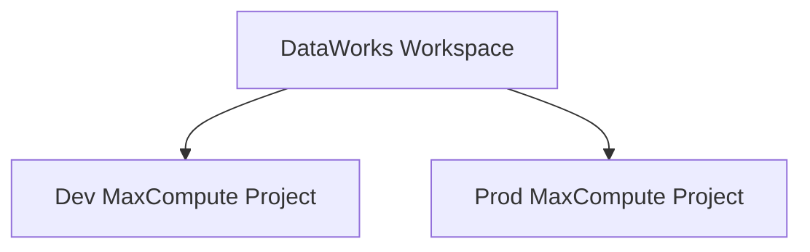

非常好的问题，这里你提到的两个概念 — **MaxCompute Project** 和 **DataWorks 工作空间（Workspace）** — 虽然在阿里云上看似独立，但实际上它们在底层是可以“绑定”的，也就是说，**DataWorks Workspace 是以 MaxCompute Project 为底层计算引擎的工作空间**。

  

我们来一步步拆解你的问题，并说明 **“绑定” 与 “解绑”** 的机制、操作方法、以及常见的坑。

---

## **🧩 一、基础概念梳理**

|**名称**|**概念说明**|
|---|---|
|**MaxCompute Project**|相当于一个数据计算与存储的“逻辑租户”，提供 SQL 计算、表、分区、UDF 等能力。|
|**DataWorks Workspace（工作空间）**|数据开发与调度平台，用于开发任务、数据集成、可视化管理等。底层必须依托一个 MaxCompute Project 作为计算引擎。|
|**绑定关系**|每个 DataWorks 工作空间都必须绑定一个 MaxCompute Project（主项目），并可选绑定一个独立的“生产项目”（Prod）与“开发项目”（Dev）。|

---

## **🏗️ 二、绑定机制理解**

  
在阿里云内部，其实绑定关系是这样的：



- **开发模式（Dev）**：开发者调试、测试用。
    
- **生产模式（Prod）**：调度运行、线上作业用。
    
- 一个 DataWorks 工作空间通常会对应两个 MaxCompute Project（可相同）。
    

---

## **🚀 三、如何绑定 DataWorks 工作空间 到 MaxCompute Project**

  

假设你已经：

- 有一个 MaxCompute Project（例如：my_project）
    
- 有一个 DataWorks 工作空间（例如：my_workspace）
    
- 并且你可以登录 DataWorks 控制台。
    

  

### **✅ 步骤一：进入 DataWorks 控制台**

  

打开控制台：

```
https://dataworks.console.aliyun.com/
```

进入你的工作空间（Workspace）列表。

---

### **✅ 步骤二：进入目标工作空间 → 基本信息页**

  

路径：

```
DataWorks 控制台 → 工作空间列表 → 选择目标 Workspace → 工作空间管理 → 基本信息
```

在此页面你会看到：

|**字段**|**示例**|
|---|---|
|绑定的开发环境项目（Dev）|my_project_dev|
|绑定的生产环境项目（Prod）|my_project_prod|
|计算引擎类型|MaxCompute|
|操作|编辑绑定关系|

---

### **✅ 步骤三：点击“编辑绑定关系”**

  

你可以在这里修改绑定的 **MaxCompute Project 名称**，指定你想绑定的项目。

  

操作路径：

```
编辑 → 计算引擎绑定配置 → 选择 MaxCompute Project → 保存
```

> ⚠️ 注意：

- > 你必须对目标 MaxCompute Project 拥有 **Owner 或至少项目管理员权限**；
    
- > 若目标项目在其他账号下，需要该账号授权。
    

---

### **✅ 步骤四：授权 DataWorks 使用 MaxCompute Project**

  

进入 MaxCompute 控制台（[https://maxcompute.console.aliyun.com/](https://maxcompute.console.aliyun.com/)），

确认以下权限：

1. DataWorks 的主账号（或 RAM 子账号）对该 Project 有访问权；
    
2. 执行以下命令授权（通过 odpscmd 或控制台 SQL 编辑器）：
    

```
-- 授权 DataWorks 账号对项目访问
grant Project 'dataworks_account_name' to 'ProjectOwner';
```

或者在控制台 → 权限管理 中添加。

---

### **✅ 步骤五：验证绑定是否成功**

1. 在 DataWorks 控制台内的 “数据开发” 页面；
    
2. 尝试使用 MaxCompute 表（SELECT * FROM your_table LIMIT 1;）；
    
3. 若能执行成功，即表示绑定已生效。
    

---

## **⚙️ 四、如果当前已绑定但想修改/解绑**

  

在 MaxCompute 控制台 → Project 管理中，可能看到：

  

> “解绑并删除 DataWorks 空间” 按钮

  

这说明当前 Project 已绑定一个 DataWorks 工作空间。

  

如果你点击解绑：

- 原 DataWorks Workspace 与 MaxCompute Project 的绑定关系将解除；
    
- 不会立即删除 MaxCompute Project；
    
- 但 DataWorks 上的数据开发节点将无法访问原 Project。
    

  

> ⚠️ 一旦解绑，请在确认不会影响线上任务后操作。

---

## **🧠 五、常见坑点与解决建议**

|**问题**|**原因**|**解决办法**|
|---|---|---|
|无法选择目标 Project|权限不足或不在同一账号下|让 Project Owner 添加 DataWorks 账号为成员|
|绑定后任务执行失败|DataWorks 未获得 Project 权限|检查授权命令或控制台权限|
|两个环境混乱（Dev/Prod）|工作空间双项目配置不一致|可将两者绑定为同一 Project 简化测试|
|控制台显示解绑按钮灰色|项目由系统创建，不能手动解绑|提工单或使用新 Workspace 重新绑定|

---

## **✅ 六、建议的最佳实践**

|**场景**|**建议配置**|
|---|---|
|测试/扫描验证|DataWorks Dev 和 Prod 都绑定同一个 MaxCompute Project|
|正式生产环境|Dev 与 Prod 各绑定独立 MaxCompute Project，分离测试与上线|
|跨账号协作|使用 RAM 授权并通过 Resource Group 隔离项目|

---

是否希望我帮你画一张完整的 **“DataWorks 与 MaxCompute 绑定架构示意图（含授权流向）”**？

可以更清晰看到主账号、RAM 子账号、Workspace、Project 之间的关系。