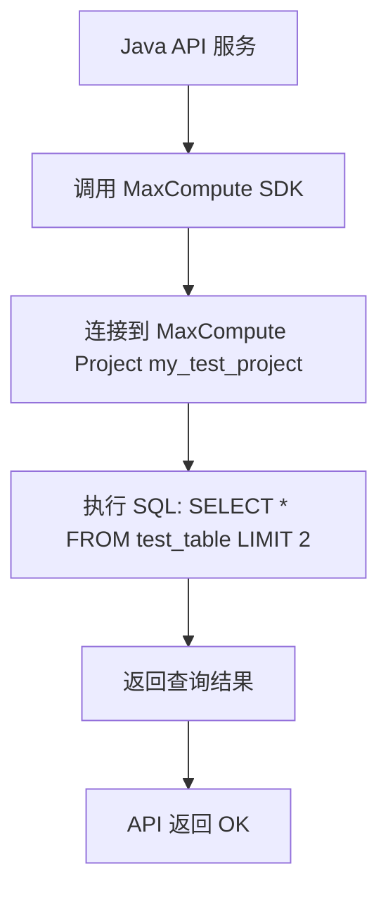

我们来系统地说明一下逻辑——你想 **验证 MaxCompute 的可访问性与基本查询能力**，但**不一定非要建立 DataWorks 工作空间**。

  

我给你分成三部分讲解：

---

## **🧩 一、核心目标与实现路径**

  

> 🎯 目标：

> 实现最简单的 **可程序化访问 MaxCompute** 的例子，例如：

  

- 创建一个 Project 或数据库（在 MaxCompute 中称为 _Project_）；
    
- 创建一个表；
    
- 授权给指定用户；
    
- 在 Java/Python 等代码中执行一个简单查询；
    
- 作为你的 /api/max_computer 健康检查接口的一部分。
    

  

> ✅ 结论：

> **你不需要创建 DataWorks 工作空间**。

> 只要你有一个 **MaxCompute Project + AccessKey + Endpoint**，就可以直接使用 SDK（Java/Python）调用 MaxCompute 进行查询操作。

---

## **🏗️ 二、实现思路（不依赖 DataWorks）**

  

### **1️⃣ 在控制台或 CLI 创建 Project（如果还没有）**

- 登录 MaxCompute 控制台：
    
    👉 https://maxcompute.console.aliyun.com/
    
- 确认已存在一个 Project（例如：my_test_project）
    

---

### **2️⃣ 创建表（测试数据）**

  

使用 SQL 控制台或 odpscmd：

```
CREATE TABLE IF NOT EXISTS test_table (
    id BIGINT,
    name STRING
);

INSERT INTO test_table VALUES (1, 'Alice'), (2, 'Bob');
```

---

### **3️⃣ 授权给测试用户（可选）**

  

如果你想让其他 RAM 用户访问该 Project：

```
GRANT ALL ON PROJECT my_test_project TO USER 'your_ram_user';
```

> ⚠️ 注意：

- > your_ram_user 必须是已经存在于阿里云账号下的 RAM 用户；
    
- > 授权后才能使用该用户的 AccessKey 调用 MaxCompute SDK。
    

---

### **4️⃣ 使用 Java SDK 进行最简单的调用**

  

#### **Maven 依赖**

```java
<dependency>
    <groupId>com.aliyun.odps</groupId>
    <artifactId>odps-sdk-core</artifactId>
    <version>0.46.0-public</version>
</dependency>
```

#### **示例代码（最小可运行）**

```Python
import com.aliyun.odps.*;
import com.aliyun.odps.account.AliyunAccount;
import com.aliyun.odps.task.SQLTask;

public class MaxComputeSimpleTest {
    public static void main(String[] args) throws Exception {
        String accessId = System.getenv("ODPS_ACCESS_ID");
        String accessKey = System.getenv("ODPS_ACCESS_KEY");
        String project = System.getenv("ODPS_PROJECT");
        String endpoint = System.getenv("ODPS_ENDPOINT");

        Account account = new AliyunAccount(accessId, accessKey);
        Odps odps = new Odps(account);
        odps.setDefaultProject(project);
        odps.setEndpoint(endpoint);

        // 执行 SQL 查询
        Instance inst = SQLTask.run(odps, "SELECT * FROM test_table LIMIT 2;");
        inst.waitForSuccess();

        System.out.println("✅ MaxCompute 查询成功：" + inst.getId());
    }
}
```

#### **环境变量配置**

```bash
export ODPS_ACCESS_ID="your-access-id"
export ODPS_ACCESS_KEY="your-access-key"
export ODPS_PROJECT="my_test_project"
export ODPS_ENDPOINT="http://service.cn-hangzhou.maxcompute.aliyun.com/api"
```

> ✅ 如果控制台打印出 instance id，说明调用成功。

---

### **5️⃣ 可选：封装成 REST API（供安全扫描使用）**

```Python
import org.springframework.web.bind.annotation.GetMapping;
import org.springframework.web.bind.annotation.RestController;

@RestController
public class MaxComputeHealthAPI {

    @GetMapping("/api/max_computer/health")
    public String check() {
        try {
            MaxComputeSimpleTest.main(null);
            return "OK";
        } catch (Exception e) {
            return "FAILED: " + e.getMessage();
        }
    }
}
```

部署后即可让扫描器调用：

```
GET http://your-service/api/max_computer/health
```

---

## **🧠 三、DataWorks 的作用与区别**

|**项目**|**是否必须**|**用途**|
|---|---|---|
|**MaxCompute Project**|✅ 必须|存储表、执行 SQL、存储计算资源|
|**DataWorks Workspace**|❌ 非必须|提供可视化开发界面、调度、任务管理|
|**SDK/API 调用**|✅ 支持|通过 Java/Python SDK 直接连接 MaxCompute，无需 DataWorks|

> 📘 结论：

- > 如果你只是想 **验证可连通、可查询**，**不需要 DataWorks**；
    
- > 如果后续要做 **可视化数据开发、调度、集成**，那时再绑定 DataWorks。
    

---

## **📊 四、流程图示例**



---

## **⚙️ 五、最佳实践与注意事项**

|**项目**|**建议**|
|---|---|
|AccessKey 管理|建议使用 RAM 用户专用 AccessKey，最小权限原则|
|Endpoint|根据地域选择，如 cn-hangzhou、cn-shanghai|
|网络|若服务在 VPC 内，确认能访问 *.maxcompute.aliyun.com|
|调用 SQL|仅执行轻量级 SQL（如 SELECT 1）用于 Health Check|
|错误处理|返回 HTTP 200/500 明确标识连接状态|

---

如果你愿意，我可以帮你生成一个 **完整可直接运行的 Spring Boot Demo 项目结构（含 pom.xml、配置、Controller）**，只要替换 AccessKey 即可运行验证。

是否希望我帮你生成？


在MaxCompute（原ODPS）中，若已创建Project，可通过控制台创建表，具体步骤如下（基于阿里云MaxCompute控制台最新操作逻辑）： ### **前提条件** 1. 已登录阿里云账号，并拥有目标Project的操作权限（如`admin`或`CreateTable`权限）。 2. 已进入目标Project（登录后在控制台左上角切换到对应Project）。 ### **具体步骤** 1. **进入MaxCompute控制台的“表管理”页面** - 登录阿里云官网，进入【MaxCompute控制台】（可通过搜索“MaxCompute”快速找到）。 - 在左侧导航栏中，选择【数据管理】→【表】，进入表管理页面。 2. **点击“创建表”按钮** - 在表管理页面右上角，点击【创建表】按钮，打开创建表的配置窗口。 3. **配置表的基本信息** - **表名称**：输入表名（需符合MaxCompute命名规范，如字母开头，仅包含字母、数字、下划线，长度不超过128字符）。 - **表类型**：选择表类型，常用类型包括： - **内部表（Managed Table）**：数据由MaxCompute管理，删除表时数据会同时删除。 - **外部表（External Table）**：数据存储在OSS等外部存储，删除表时不删除数据（需配置外部存储路径）。 - **生命周期（可选）**：设置表的生命周期（单位：天），超过周期未更新的数据会被自动清理（默认-1，即永久保存）。 - **备注（可选）**：填写表的描述信息，方便管理。 4. **定义表的字段（列）** - 在“字段定义”区域，点击【添加字段】，依次配置每个字段的： - **字段名**：列名（遵循命名规范）。 - **类型**：选择字段数据类型（如`BIGINT`、`STRING`、`DOUBLE`、`DATETIME`等）。 - **备注（可选）**：字段描述。 - 若需定义分区表，点击“分区字段”区域，添加分区字段（分区字段类型通常为`STRING`、`BIGINT`等，用于数据分片）。 5. **配置表的属性（可选）** - **表属性**：可添加自定义属性（如`odps.table.compress`设置压缩格式等），一般默认即可。 - **存储格式**：默认`ORC`（推荐），也可选择`TEXT`等格式（根据需求选择）。 6. **确认并创建表** - 配置完成后，点击【创建】按钮，系统会校验表结构的合法性。 - 若校验通过，表会被创建，可在表管理页面看到新创建的表。 ### **补充说明** - 若熟悉SQL，也可通过【查询编辑器】执行`CREATE TABLE`语句创建表，例如： ```sql -- 创建内部表 CREATE TABLE IF NOT EXISTS my_table ( id BIGINT COMMENT '用户ID', name STRING COMMENT '用户名', create_time DATETIME COMMENT '创建时间' ) COMMENT '我的测试表' LIFECYCLE 30; -- 创建分区表（按日期分区） CREATE TABLE IF NOT EXISTS my_partitioned_table ( id BIGINT, name STRING ) PARTITIONED BY (dt STRING COMMENT '日期分区，格式yyyy-mm-dd') LIFECYCLE 30; ``` - 创建后可在表详情页查看结构、分区、数据等信息，也可通过`DESCRIBE 表名;`语句在查询编辑器中查看表结构。 按以上步骤操作，即可在MaxCompute控制台完成表的创建。w
