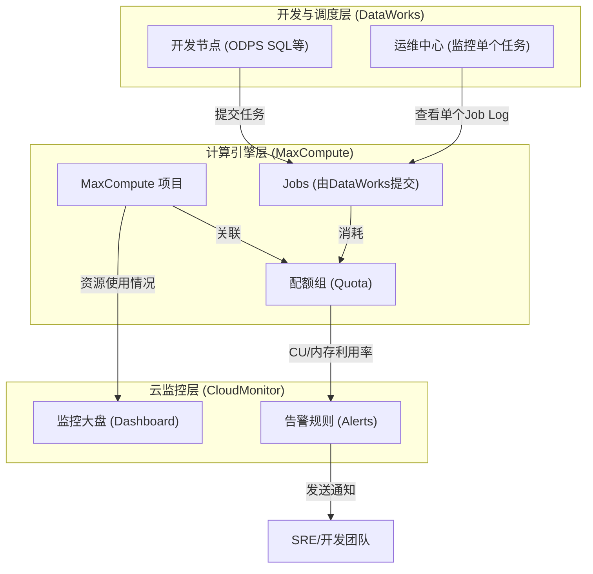
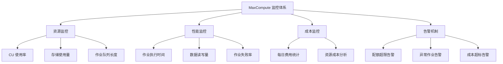

#  MaxCompute 资源阈值、配额管理与 SRE 监控实践 (结合 DataWorks)

本文档旨在深入探讨阿里云 MaxCompute 的资源管理机制，解答关于“资源阈值”(Threshold) 的核心问题，并为 SRE (站点可靠性工程师) 提供一套结合 DataWorks 使用场景的监控与管理最佳实践。

---

## 1. 核心问题：MaxCompute 是否有“资源阈值”？

结论是：**有，但并非通过单一的 `set threshold` 命令实现**。MaxCompute 的资源限制是通过一个分层、弹性的“配额组 (Quota Group)”体系来完成的。您在申请和配置配额组时，实际上就已经在设定资源的使用边界。

### 1.1. 计算资源 (CU) 的限制机制

计算资源是核心，通过以下方式进行限制：

- **配额组 (Quota Group)**: MaxCompute 的计算资源管理单位。您可以创建一个或多个配额组，并为每个组分配特定的计算资源（CU）。
- **minCU (最小预留 CU)**: 为配额组保证的最低计算资源，确保关键任务总有资源运行。
- **maxCU (最大可用 CU)**: 配额组在资源空闲时可弹性扩展到的 CU 上限。这是一个硬性限制，该组的总 CU 使用量不会超过此值。
- **单作业 CU 限制**: 您可以限制单个作业（Job）能使用的最大 CU 量，防止单个“坏查询”耗尽整个配额组的资源。
    ```sql
    -- 在作业级别设置
    set odps.task.max.concurrent.cu = 20;
    ```
- **自动弹性 (Auto Scaling)**: 您可以启用自动弹性功能，并设置 `AutoscaleLimitCU`，允许在预留资源耗尽时，按需购买并使用额外的 CU，直到达到这个弹性上限。这为应对突发流量提供了灵活性，同时控制了成本。

### 1.2. 存储资源的限制

您提到的“逻辑存储空间 50GB” 是存储资源的范畴。MaxCompute 的存储和计算是分开计费和管理的。通常，存储是按量付费的，虽然可以设置项目级别的存储上限或告警，但其管理逻辑与计算资源的配額组不同。

**总结**：您提到的“申请配额组时限制 20U”和“配置逻辑存储空间 50GB”，正是 MaxCompute 资源限制的体现。前者通过 `maxCU` 控制计算，后者管理存储。

---

## 2. SRE 视角：如何监控 MaxCompute 性能与资源？

作为 SRE，目标是确保平台的稳定性、性能和成本效益。以下是针对 MaxCompute 的监控体系建设建议。

### 2.1. 监控的层次与工具

监控需要覆盖从全局到个体的多个层次，DataWorks 和 MaxCompute 的关系如下图所示：



### 2.2. 关键监控指标与实践

1.  **全局资源监控 (CloudMonitor)**
    *   **核心指标**:
        *   `Quota组CU利用率`: 最关键的指标，反映资源池是否饱和。
        *   `Quota组内存利用率`: 同样重要，内存不足也会导致任务失败或排队。
        *   `作业等待数 (Waiting Jobs)`: 如果此数值持续偏高，通常意味着资源不足。
        *   `弹性CU使用量`: 监控弹性扩容的频率和规模，是评估成本和资源是否匹配的重要依据。
    *   **实践**:
        *   **建立监控大盘**: 在 CloudMonitor 或 Grafana 中创建一个专门的 MaxCompute 监控大盘。
        *   **配置告警**:
            *   **高水位告警**: CU/内存利用率超过 80% 时，发送“警告”级别通知。
            *   **饱和告警**: CU/内存利用率超过 95% 或作业等待数 > N 时，发送“严重”级别通知。
            *   **成本告警**: 弹性 CU 费用或总费用超出预算时告警。

2.  **DataWorks 运维中心 (任务级别监控)**
    *   **场景**: 当某个业务流程变慢或失败时，需要深入排查。
    *   **实践**:
        *   在 DataWorks 的“运维中心”，找到对应的任务实例。
        *   通过实例的 **LogView**，可以查到该 Job 在 MaxCompute 中的详细执行信息，包括：
            *   **CU 消耗**: 这个 Job 花了多少 CU。
            *   **执行阶段**: 哪个 Stage 耗时最长。
            *   **排队时间**: Job 等待资源花了多久。
        *   这对于定位慢查询、数据倾斜等具体问题至关重要。

3.  **DataWorks 资源组 (间接控制)**
    *   DataWorks 自身有“调度资源组”的概念，它定义了 DataWorks **同时可以运行多少个任务**。
    *   通过限制调度资源组的并发数，可以间接控制提交到 MaxCompute 的任务流量，从而避免瞬间打满 MaxCompute 的 CU 配额。这是一种从“入口”进行流量控制的有效手段。

### 2.3. SRE 运维与优化流程

1.  **定期审查**: 每周或每月回顾监控大盘，分析 CU 使用趋势、高峰时段、弹性使用情况。
2.  **资源优化**: 使用 MaxCompute 控制台的“计算资源优化”功能，它能根据历史数据预测未来资源需求，并给出调整建议（例如，应该增加预留 CU 还是调整弹性上限）。
3.  **成本管理**: 分析弹性 CU 的账单，如果弹性使用频繁且量大，可能意味着预留的 `minCU` 过低，适当提高 `minCU` 可能比长期依赖高价的弹性 CU 更经济。
4.  **自动化响应**:
    *   **高频场景**: 考虑使用 FunctionCompute 或其他自动化工具，在接收到 CloudMonitor 告警时，自动分析并通知相关业务负责人。
    *   **预案**: 针对核心业务，制定资源不足时的应急预案，例如临时提升配额、暂停非核心任务等。

---

## 3. 总结与建议

1.  **明确资源边界**: 在 MaxCompute 控制台的 **Quota 管理**中，仔细检查并设置每个配额组的 `minCU` 和 `maxCU`，这是控制计算资源的核心。
2.  **利用 DataWorks 控制并发**: 在 DataWorks 中配置合理的“调度资源组”，从源头控制任务提交的并发度，避免对 MaxCompute 造成冲击。
3.  **建立分层监控**:
    *   使用 **CloudMonitor** 进行全局和核心资源的宏观监控与告警。
    *   使用 **DataWorks 运维中心** 进行具体业务任务的微观诊断与调优。
4.  **拥抱弹性，但管理成本**: 启用 Auto-Scaling 并设置合理的弹性上限 (`AutoscaleLimitCU`)，同时通过监控告警确保成本在可控范围内。
5.  **定期优化**: 将资源审查和优化作为 SRE 的常规工作，与业务团队保持沟通，确资源配置与业务发展相匹配。


这是一个非常好的问题，您对MaxCompute资源管理的理解已经抓住了核心。

简单来说：**您猜对了**。在MaxCompute中，您提到的“阈值”管理，其核心实现方式就是通过 **“配额组（Quota Group）”** 来实现的。

下面我来为您详细拆解一下您的几个问题。

---

### 1. "设置阈值" 与 "配额组管理"

您提到的“设置阈值”这个概念，在MaxCompute中并不叫“Threshold”，而是直接体现在**配额组（Quota Group）**的配置上。

您在申请或配置配额组时，**其实就已经在设置“阈值”或“上限”了**。

- **计算资源 (CU数量, 20U):**
    
    - 您说的“20U” (20 CU) 非常准确。但这**不是一天总共只能用20U**，而是指这个配额组在**同一时刻最多能并发使用的计算资源量是20 CU**。
        
    - **打个比方：** 这就像一个有20个计算窗口的办事大厅。如果一个作业（Job）需要5 CU，那么它会占用5个窗口。您可以同时运行4个这样的作业（4 * 5 CU = 20 CU）。
        
    - **如果资源已满：** 当第5个需要5 CU的作业提交时，由于20 CU已满，这个新作业不会失败，而是会进入**排队（Queue）**状态，等待有足够的CU资源被释放出来。
        
    - 所以，这个“20U”就是您要的“计算阈值”，它控制的是**并发计算能力**。
        
- **存储资源 (逻辑存储空间, 50GB):**
    
    - 这个“50GB”就是您这个MaxCompute项目（Project）**所能存储的数据总量的上限**。
        
    - 如果存储量接近或达到50GB，新的数据将无法写入。
        
    - 这和计算资源不同，它是一个**总量（Capacity）**的阈值，而不是一个并发阈值。
        

**总结：** 您在配额组管理中设置的 **CU 数量** 和 **存储空间**，**就是您要的“阈值”**。它们是MaxCompute进行资源隔离和成本控制的根本手段。

---

### 2. SRE如何监控MaxCompute的性能和资源

作为SRE，您需要监控的核心指标主要分为三类：**资源使用、作业状态、成本**。

以下是主要的监控途径：

#### 📈 途径一：MaxCompute 自带控制台 (DataWorks)

这是最直接、最常用的监控手段，提供了项目级别和作业级别的详细信息。

- **监控什么：**
    
    - **项目概览：** 当前项目总存储量、表数量、近期的作业运行（Job）情况（成功、失败、排队）。
        
    - **作业运维（SRE核心）：**
        
        - **实时Job：** 查看当前正在运行的作业，它们占用了多少CU资源，已经运行了多久。
            
        - **排队Job：** 查看有多少作业正在排队，**为什么排队**（通常就是因为配额组的CU资源满了）。
            
        - **历史Job：** 查看失败的作业，分析失败原因（例如SQL错误、资源不足等）。
            
    - **资源使用：** 查看CU的实时和历史使用曲线（看峰值是否打满20U）、存储量的增长趋势。
        

#### 🔔 途径二：阿里云“云监控” (Cloud Monitor)

这是从**平台SRE**角度进行**自动化监控和告警**的核心工具。您不应该（也不可能）7x24小时盯着控制台。

- **监控什么：** 云监控会采集MaxCompute的核心指标，您可以为这些指标设置**告警（Alarm）**。
    
- **SRE核心实践（设置告警）：**
    
    - **存储空间告警：**
        
        - **指标：** `Project Storage Usage` (项目存储使用量)
            
        - **规则：** 当存储空间 > 40GB (即80%阈值) 时，发送钉钉/短信/邮件告警。
            
    - **计算资源告警（排队作业）：**
        
        - **指标：** `Waiting Jobs Count` (排队作业数)
            
        - **规则：** 当排队作业数 > 5 (或持续10分钟) 时，发送告警。这说明您的20U并发可能不够用了，需要分析是否有慢SQL或是否需要扩容。
            
    - **作业失败告警：**
        
        - **指标：** `Failed Jobs Count` (失败作业数)
            
        - **规则：** 当10分钟内失败作业数 > 3 时，发送告警，SRE需要介入排查。
            

#### 📄 途径三：日志服务 (SLS)

如果云监控和MaxCompute控制台告诉您“出事了”，日志服务（SLS）就是帮您定位“出什么事了”的工具。

- **监控什么：** MaxCompute会将操作日志、审计日志、作业运行的详细Logview等信息投递到SLS。
    
- **SRE核心实践：**
    
    - **审计分析：** 谁在什么时间执行了高危操作（如 `DROP TABLE`）？
        
    - **性能回溯：** 某个作业为什么突然变慢了？通过SLS中的Logview信息，可以详细分析作业的每一个执行阶段（Stage）的耗时和资源消耗。
        
    - **消费分析：** 分析哪些用户、哪些作业是CU消耗大户，用于成本优化。
        

---

### 总结

- **阈值设置：** 就是在**配额组（Quota Group）**里设置的**CU并发数**和**存储空间上限**。
    
- **SRE监控：**
    
    1. **日常运维：** 使用 **MaxCompute/DataWorks控制台** 查看作业状态和资源大盘。
        
    2. **主动告警：** 使用 **云监控（Cloud Monitor）** 为核心指标（存储、排队、失败）设置告警，实现自动化运维。
        
    3. **深度排查：** 使用 **日志服务（SLS）** 进行事后审计和深度性能问题定位。
        

希望这个回答对您有帮助！

您是否想了解一下如何在云监控中为“存储空间超过80%”这个场景配置一个具体的告警规则呢？


# Claude
# MaxCompute 资源配额与监控方案

## 问题分析

您提出了两个核心问题：

1. MaxCompute 是否有 threshold（阈值）概念及如何设置
2. 如何作为 SRE 监控 MaxCompute 的资源使用情况

## 解决方案

### 1. MaxCompute 配额管理机制

MaxCompute 确实支持配额（Quota）管理，这是阿里云提供的资源限制和成本控制机制。

#### 配额组（Quota Group）的作用

配额组本质上就是您提到的 threshold 机制：

|配额类型|说明|示例值|
|---|---|---|
|CU 配额|计算资源上限（Compute Unit）|20 CU|
|存储配额|逻辑存储空间限制|50 GB|
|作业并发数|同时运行的作业数量|10 个|

**关键点**：当您在配额组管理中设置了 20 CU，这就已经是硬性限制（Hard Limit），超过此值的作业会被拒绝或排队。

#### 配额设置方式

```bash
# 使用 MaxCompute 客户端设置配额
# 1. 创建配额组
CREATE QUOTA quota_group_name WITH PROPERTIES (
  'minCU' = '5',
  'maxCU' = '20',
  'schedule_policy' = 'FIFO',
  'enable_priority' = 'true'
);

# 2. 将项目绑定到配额组
ALTER PROJECT project_name SET PROPERTIES ('quota_id' = 'quota_group_name');

# 3. 查看配额使用情况
DESC QUOTA quota_group_name;
```

### 2. MaxCompute 监控方案



#### 方案 1：使用阿里云云监控服务

```yaml
# 云监控配置示例（通过 API 或控制台配置）
monitoring_config:
  resource: MaxCompute
  metrics:
    - name: CU使用率
      threshold: 80%
      alert_type: warning
      notification: 
        - email: sre-team@company.com
        - sms: +86-xxx
    
    - name: 存储使用率
      threshold: 90%
      alert_type: critical
      
    - name: 作业失败率
      threshold: 10%
      alert_type: warning
```

#### 方案 2：通过 MaxCompute Information Schema 监控

```sql
-- 1. 监控项目级别的 CU 使用情况
SELECT 
    project_name,
    quota_name,
    cu_usage,
    cu_quota,
    (cu_usage / cu_quota * 100) as usage_percentage,
    instance_count
FROM 
    information_schema.quota_usage
WHERE 
    ds = TO_CHAR(GETDATE(), 'yyyymmdd')
ORDER BY 
    usage_percentage DESC;

-- 2. 监控作业执行情况
SELECT 
    instance_id,
    project_name,
    start_time,
    end_time,
    DATEDIFF(end_time, start_time, 'ss') as duration_seconds,
    status,
    cu_usage,
    input_records,
    output_records
FROM 
    information_schema.tasks_history
WHERE 
    ds = TO_CHAR(GETDATE(), 'yyyymmdd')
    AND status IN ('Failed', 'Terminated')
LIMIT 100;

-- 3. 监控存储使用情况
SELECT 
    project_name,
    table_name,
    SUM(physical_size) / 1024 / 1024 / 1024 as size_gb,
    COUNT(*) as partition_count
FROM 
    information_schema.tables
GROUP BY 
    project_name, table_name
HAVING 
    size_gb > 10
ORDER BY 
    size_gb DESC;
```

#### 方案 3：构建自定义监控脚本

```python
#!/usr/bin/env python3
# maxcompute_monitor.py

from odps import ODPS
import json
import requests
from datetime import datetime

class MaxComputeMonitor:
    def __init__(self, access_id, access_key, project, endpoint):
        self.odps = ODPS(access_id, access_key, project, endpoint)
        
    def check_quota_usage(self):
        """检查配额使用情况"""
        sql = """
        SELECT 
            quota_name,
            cu_usage,
            cu_quota,
            (cu_usage / cu_quota * 100) as usage_pct
        FROM information_schema.quota_usage
        WHERE ds = TO_CHAR(GETDATE(), 'yyyymmdd')
        """
        
        result = []
        with self.odps.execute_sql(sql).open_reader() as reader:
            for record in reader:
                result.append({
                    'quota_name': record[0],
                    'cu_usage': record[1],
                    'cu_quota': record[2],
                    'usage_percentage': record[3]
                })
        
        return result
    
    def check_storage_usage(self):
        """检查存储使用情况"""
        tables = self.odps.list_tables()
        storage_info = []
        
        for table in tables:
            t = self.odps.get_table(table.name)
            size_gb = t.size / (1024**3)
            
            if size_gb > 1:  # 只记录大于 1GB 的表
                storage_info.append({
                    'table_name': table.name,
                    'size_gb': round(size_gb, 2),
                    'last_modified': str(t.last_modified_time)
                })
        
        return storage_info
    
    def send_alert(self, alert_type, message):
        """发送告警到监控系统"""
        # 示例：发送到钉钉机器人
        webhook_url = "https://oapi.dingtalk.com/robot/send?access_token=YOUR_TOKEN"
        
        data = {
            "msgtype": "text",
            "text": {
                "content": f"[MaxCompute {alert_type}]\n{message}"
            }
        }
        
        requests.post(webhook_url, json=data)
    
    def run_monitoring(self):
        """执行监控检查"""
        print(f"[{datetime.now()}] Starting MaxCompute monitoring...")
        
        # 1. 检查配额
        quota_usage = self.check_quota_usage()
        for quota in quota_usage:
            if quota['usage_percentage'] > 80:
                alert_msg = (
                    f"配额组 {quota['quota_name']} 使用率达到 "
                    f"{quota['usage_percentage']:.2f}%\n"
                    f"当前使用: {quota['cu_usage']} CU\n"
                    f"配额上限: {quota['cu_quota']} CU"
                )
                self.send_alert("WARNING", alert_msg)
        
        # 2. 检查存储
        storage = self.check_storage_usage()
        total_storage = sum(item['size_gb'] for item in storage)
        
        if total_storage > 45:  # 假设配额是 50GB
            alert_msg = f"存储使用量达到 {total_storage:.2f} GB，接近 50GB 上限"
            self.send_alert("WARNING", alert_msg)
        
        print(f"[{datetime.now()}] Monitoring completed.")

# 使用示例
if __name__ == "__main__":
    monitor = MaxComputeMonitor(
        access_id='YOUR_ACCESS_ID',
        access_key='YOUR_ACCESS_KEY',
        project='your_project',
        endpoint='http://service.cn-shanghai.maxcompute.aliyun.com/api'
    )
    
    monitor.run_monitoring()
```

#### 方案 4：使用 Prometheus + Grafana

```yaml
# prometheus-maxcompute-exporter.yml
scrape_configs:
  - job_name: 'maxcompute'
    scrape_interval: 5m
    static_configs:
      - targets: ['maxcompute-exporter:9100']
    metrics_path: '/metrics'
```

```python
# maxcompute_exporter.py (简化示例)
from prometheus_client import start_http_server, Gauge
from odps import ODPS
import time

# 定义指标
cu_usage_gauge = Gauge('maxcompute_cu_usage', 'CU Usage', ['project', 'quota'])
storage_usage_gauge = Gauge('maxcompute_storage_gb', 'Storage Usage in GB', ['project'])

def collect_metrics():
    odps = ODPS(ACCESS_ID, ACCESS_KEY, PROJECT, ENDPOINT)
    
    # 收集 CU 使用情况
    # ... 执行 SQL 查询 ...
    cu_usage_gauge.labels(project=PROJECT, quota='default').set(current_cu_usage)
    
    # 收集存储使用情况
    storage_usage_gauge.labels(project=PROJECT).set(total_storage_gb)

if __name__ == '__main__':
    start_http_server(9100)
    while True:
        collect_metrics()
        time.sleep(300)  # 每 5 分钟采集一次
```

### 3. 监控指标体系

#### 核心监控指标

```markdown
| 指标类别 | 指标名称 | 告警阈值建议 | 监控频率 |
|---------|---------|-------------|---------|
| 资源使用 | CU 使用率 | > 80% 警告, > 95% 严重 | 5 分钟 |
| 资源使用 | 存储使用率 | > 90% 警告 | 1 小时 |
| 性能指标 | 作业平均执行时间 | 环比增长 > 50% | 1 小时 |
| 性能指标 | 作业失败率 | > 5% | 10 分钟 |
| 成本指标 | 每日费用 | 超预算 20% | 1 天 |
| 队列指标 | 等待作业数 | > 50 | 5 分钟 |
```

#### 日常巡检脚本

```bash
#!/bin/bash
# maxcompute_daily_check.sh

echo "=== MaxCompute 日常巡检报告 $(date) ==="

# 1. 检查配额使用情况
echo -e "\n[配额使用情况]"
odpscmd -e "
SELECT 
    quota_name,
    cu_usage,
    cu_quota,
    CONCAT(CAST(cu_usage / cu_quota * 100 AS STRING), '%') as usage_pct
FROM information_schema.quota_usage
WHERE ds = TO_CHAR(GETDATE(), 'yyyymmdd');
"

# 2. 检查失败作业
echo -e "\n[过去24小时失败作业]"
odpscmd -e "
SELECT 
    instance_id,
    start_time,
    status,
    cu_usage
FROM information_schema.tasks_history
WHERE ds = TO_CHAR(GETDATE(), 'yyyymmdd')
    AND status = 'Failed'
LIMIT 20;
"

# 3. 检查大表存储
echo -e "\n[存储 TOP 10]"
odpscmd -e "
SELECT 
    table_name,
    CAST(physical_size / 1024 / 1024 / 1024 AS BIGINT) as size_gb
FROM information_schema.tables
ORDER BY physical_size DESC
LIMIT 10;
"

# 4. 生成报告并发送
# ... 邮件发送逻辑 ...
```

## 注意事项

### ⚠️ 配额设置注意事项

1. **预留冗余**：配额不要设置得过于紧张，建议预留 20-30% 的余量
2. **分级配置**：可以为不同业务线设置不同的配额组
3. **弹性调整**：根据业务高峰期动态调整配额上限

### ⚠️ 监控注意事项

1. **监控频率**：不要过于频繁查询 information_schema，建议 5-10 分钟一次
2. **历史数据**：定期导出监控数据到外部存储，MaxCompute 只保留有限时间的历史
3. **成本控制**：监控查询本身也会消耗 CU，需要优化 SQL 效率
4. **告警策略**：设置合理的告警阈值和通知频率，避免告警疲劳

### ⚠️ 最佳实践

1. **建立基线**：收集至少 2 周的数据建立性能基线
2. **定期审计**：每月审查配额使用情况和成本分析
3. **自动化响应**：对于可预见的问题（如配额不足）设置自动扩容机制
4. **文档化**：记录所有配额变更和异常事件

## 总结

**回答您的问题**：

1. ✅ MaxCompute 有 threshold 概念，通过**配额组（Quota Group）**实现
2. ✅ 在申请配额组时设置的 CU 数量（如 20 CU）和存储空间（如 50 GB）就是硬性限制
3. ✅ 监控方案包括：
    - 使用阿里云云监控服务（最简单）
    - 通过 Information Schema 自建监控（最灵活）
    - 集成 Prometheus/Grafana（企业级方案）

建议从阿里云控制台的云监控开始，然后逐步补充自定义监控脚本来满足特定需求。
