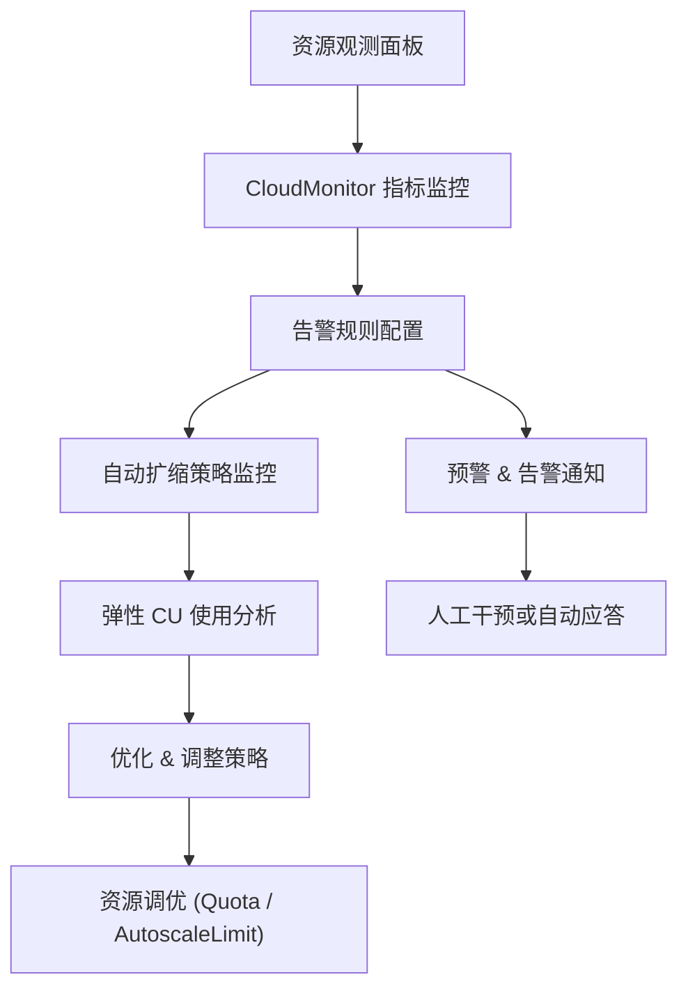

```bash
关于 Ali的工程里面的 Max computer 我想知道有没有这样一个概念set threshold for maxCompute 如果有的话那如何设置 ？ 
还是说我在申请配额组管理的时候其实就已经限制了这个资源[CU数量]的使用情况比如说是 20U。 比如说还有一个配置的逻辑存储空间 ，我默认给 50GB。
那么跟进带来的另一个问题就是说我如果我的工程里面启用了这个 Max compuder，那么我如何对它进行一些监控或者我作为 SRE的话如何去监控这些性能或者资源
另外可以把问题给我进行拓展比如我们在这里是使用的Dataworks 

```

#  A 
这是一个很好的问题 —MaxCompute（阿里云）确实有“设置上限（threshold）”的机制，不过形式可能和你用“阈值（threshold）”这个词想的不太一样。下面我是把 MaxCompute 的配额（Quota）机制 + CU 管理 +监控 +弹性配置这些方面拆开解释，再给你建议。

---

## **问题分析**

- 你提到 “set threshold for maxCompute” — 可能是想问：是否可以限制某个 quota 组（或项目）最大可用 CU 数量（类似最大并发 / 上限）
    
- 也提到配额组管理和 “20U”（应该是 20 CU）这样的限制，以及 “配置逻辑存储空间” — 说明你可能在讨论 MaxCompute 的资源（计算 + 存储）配额管理。
    

---

## **MaxCompute 的 Quota 与 CU 限制机制**

1. **Quota (配额) 管理**
    
    MaxCompute 的 “Quota 管理”功能是用于管理计算资源（CU）的。Quota 分为 **一级 (level-1)** 和 **二级 (level-2)**。一级是顶层 quota，二级是具体给项目 /用户 /组分配的 quota。 
    
2. **CU 单位**
    
    - MaxCompute 计算资源以 CU（Compute Unit）为单位。 
        
    - CU 是你在配额里设置的“保留量 + 弹性量 +最大量”这些组合起来管理。 
        
    
3. **设置 minCU 和 maxCU**
    
    - 在 Quota 的 **Basic Configuration** 里，你可以为每个 level-2 quota 设置 minCU（保证量）和 maxCU（上限量）。 
        
    - minCU 是保证给这个 quota 的最低 CU；maxCU 是这个 quota 在高负载时可用的最大 CU（如果有空闲、可抢占的话）。 
        
    - 注意：maxCU 必须 ≥ minCU；且 maxCU 不可超过对应一级 quota 的 CU。 
        
    
4. **弹性预留 CU (Elastic Reserved CU)**
    
    - 除了固定预留的 CU (minCU)，你还可以设置弹性预留 CU（elastic reserved CU），也就是在一定时间范围内可以弹性扩容的 CU。 
        
    - 弹性预留 CU 是按小时计费 (按弹性预留用量来付费)。 
        
    
5. **自动弹性 (Auto Scaling)**
    
    - 在部分区域（目前官方说明支持印尼雅加达为例）可以开启 auto scaling (自动弹性)。 
        
    - 当启用 auto scaling 时，你可以设置一个 “AutoscaleLimitCU” — 也就是自动弹性 CU 的上限。系统根据实际作业负载，在这个上限之内自动调整使用量。 
        
    - 这样你的 quota 就有了一个 “阈值”：在正常预留 CU 之外，如果有弹性 + auto-scaling，就可以再扩展，但扩展不会无限制，而是受你设定的 AutoscaleLimitCU 限制。 
        
    
6. **单作业 CU 限制**
    
    - 在配置 Quota 的时候，可以为 level-2 quota 设置 “CU limit per job（每个作业的 CU 最大并发使用）”。 
        
    - 也可以在作业里通过设置参数来限制单 job 的 CU 比如：set odps.task.max.concurrent.cu = <CU_Amount>;。 
        
    
7. **监控 + 警报 (Alert)**
    
    - 你可以给 CU 使用情况设置监控告警（通过 CloudMonitor）。比如你可以设定 “当某个 quota 组的 CU 利用率超过某个百分比 /某个值，就触发告警”。 
        
    - 这样，虽然 MaxCompute 本身并不会 “自动停止提交 /拒绝任务” 达到你设定阈值（除非资源真实被用完），但你可以通过告警及时获得预警，并手动干预（比如申请扩容、调整任务提交节奏）。
        
    
8. **最大 CU 限制 (账户级别)**
    
    - MaxCompute 对于包年包月 (subscription) 的 CU 数量有默认上限（例如默认最多可买 2000 CU），如果要超过这个限额，需要提交工单申请。 
        
    - 对于按量付费 (pay-as-you-go) 的 CU 也有限额（单用户、单地域最大 CU 数）。 
        
    
9. **变配 (升级 / 降配)**
    
    - 你可以对已有的配额 (Quota) 做 “升配 / 降配”。也就是说，如果你原来给某个 quota 组分配了 20 CU（或更多），你可以变更它。 
        
    - 降配时要注意最小值 (minCU) 的逻辑：降配前，要确保默认 /自定义 quota 的最小值配置正确，否则可能无法降配。 
        
    

---

## **回到你的问题**

- **“有没有这样一个概念 set threshold for maxCompute”**
    
    是有的 — 可以通过 maxCU (在 quota 里) + 自动弹性 (auto scaling) 的 AutoscaleLimitCU 来控制最大 CU 使用上限。
    
- **“还是说我在申请配额组管理的时候其实就已经限制了这个资源 CU 数量”**
    
    对的，当你创建 /配置 quota 组 (level-2 quota) 时，minCU 和 maxCU 的设置就是在做这个限制。你提到 “20U”，如果是指 20 CU，那你可以在 quota 里把这个 quota 的 maxCU 设置成 20，这样这个 quota 组不会使用超过 20 CU（除非别的 quota 组抢占 /共享特性 + 弹性配置中有更高设置）。
    
- **“配置逻辑存储空间 (50GB)”**
    
    你提到 “逻辑存储空间”，MaxCompute 里确实有存储，但 “存储配额 /空间 (Storage quota)”和 CU（计算配额）是分开的。上述 Quota 管理主要针对计算 (CU) 资源。你设置 “50GB” 逻辑存储空间，这属于数据存储配额 /上限管理的范畴 (具体是否能以 quota 形式管控存储上限要看 MaxCompute 存储配额策略) — 但在 MaxCompute 的 Quota 管理主要文档聚焦在计算资源 (CU)。
    

---

## **建议**

- 在 **MaxCompute 控制台 → Quota 管理** 中，检查你的 quota 组 (level-2) 的 minCU / maxCU 是否是按你的预期设定。
    
- 如果你希望节省成本又能弹性扩展：考虑用弹性预留 CU + auto scaling（如果你所在 region 支持）。
    
- 配置 **告警 (CloudMonitor)**：设定 CU 使用率阈值，当接近上限时触发告警，以便及时扩容或调整。
    
- 定期审视你的配额策略 (Quota plan + 时间计划)：如果你的工作负载有波峰 (高峰期) / 波谷 (空闲期)，可以设置不同时间段的 quota 计划 (time-based plan)，动态设置 minCU / maxCU。
    
- 如果你当前配额 (CU) 已经不够用，而且你预测未来增长：可以提交 MaxCompute 升配申请 (升级 CU)；反之，如果过剩，也可以降配减少成本。
    

---

如果你愿意，我可以帮你画一个 **Quota + CU 使用 + 弹性 +监控** 的推荐设计示意图 (Mermaid)，你想我帮你做吗？


这是一个非常关键的问题 —作为 SRE（或运维/平台团队）监控 MaxCompute 的资源使用和性能，对保证稳定性、成本效率非常重要。下面是 MaxCompute（阿里云）可用的监控指标、监控方式，以及 SRE 可以考虑建立的监控/告警体系 +最佳实践。

---

## **问题分析**

- 你启用了 MaxCompute 并配置了 CU 资源（通过 Quota 组等）。
    
- 你希望监控这些 CU 资源的使用情况（例如利用率、是否快满）、以及作业执行相关的性能（排队、计算效率等）。
    
- SRE 角度要关心资源饱和预警、成本、以及作业性能异常。
    

---

## **MaxCompute 的监控能力 & 指标**

1. **资源观测 (Resource Observation)**
    
    - MaxCompute 控制台提供 “资源观测” 界面。你可以查看某个配额组 (Quota) 的 CU 消耗趋势。 
        
    - 在 “计算资源 (Compute Resource)” 页签里，选择一级 /二级 quota、时间范围、监控粒度 (1 分钟 / 5 分钟 /15 分钟)。 
        
    - 可查看指标，比如 _单位 CU 时处理扫描数据量 (GB / CU·h)_，作业扫描量 (GB)，作业数趋势等。 
        
    
2. **CloudMonitor 指标 + 告警**
    
    - MaxCompute 支持通过阿里云 CloudMonitor 配置监控指标和告警。 
        
    - 可监控的关键指标包括：配额组 (Quota group) 的 CU 使用率 (或 “CU 利用率 / 消耗”)、内存使用率等。 
        
    - 告警规则可以设定阈值 (threshold)：例如，当 CU 或内存利用率超过某值时发送警报。 
        
    - 示例：资源组为 150 CU，最大 “满负载”表示是 15000%（假设 1 核为 100%），可以设告警在 > 12000%。 
        
    
3. **作业级别监控**
    
    - 虽然 MaxCompute 本身对作业队列 /延迟 /等待数 可以在 CloudMonitor 中告警 (例如 “作业等待数”)。官方文档提到可以以 “作业等待数 + CU 使用” 结合判断是否资源饱和。 
        
    - 还可以结合 MaxCompute 的历史任务信息 (通过 Information Schema 或日志) 做更详细的分析 (比如长时间延迟作业、慢任务、资源效率问题)。
        
    
4. **成本 & 弹性 (Auto-Scaling) 监控**
    
    - 如果你启用了 **自动弹性 (Auto Scaling)**，MaxCompute 会自动根据负载扩缩弹性 CU。 
        
    - 弹性 CU 的使用按秒级别监控，并最终在 CloudMonitor 和账单中体现。 
        
    - 通过监控弹性 CU 的使用，可以评估自动扩容是否被合理利用，并判断是否需要调整弹性上限 (AutoscaleLimitCU)。
        
    
5. **资源优化建议 (Cost / Performance)**
    
    - MaxCompute 有 “计算资源优化”功能，可以根据历史作业请求 (CU 时) 预测资源需求，并给出优化建议 (例如 “应该保留多少预留 CU + 弹性 CU + auto scale 限额”)。 
        
    - 作为 SRE，可以定期运行这个优化评估，和业务团队校准资源配置 (避免过度预留或资源不足)。
        
    

---

## **SRE 视角：构建监控 + 告警体系 (建议)**

  

下面是一个建议的监控 +告警 +运维流程 (从 SRE 角度)：



具体策略：

1. **基础仪表盘 (Dashboard)**
    
    - 建一个 MaxCompute 的监控 Dashboard (在 CloudMonitor 或 Grafana + CloudMonitor 数据源)
        
    - 显示关键指标：Quota 组 CU 使用量 (实时 &趋势)、单位 CU 时处理量 (GB/CU·h)、弹性 CU 使用、作业等待数
        
    
2. **告警策略**
    
    - 对 Quota 组资源 (CU + 内存) 设置高水位告警 (e.g. > 80% 或 > 某 %)，当接近满额时通知 SRE /业务。
        
    - 对作业等待数 +队列长度设置告警 (结合 CU 满负载警告)，用于预警资源饱和可能导致作业延迟。
        
    - 对弹性 CU 的高使用或异常弹性扩容行为设告警 (比如弹性 CU 短时间多次扩容) — 表明负载波动较大。
        
    
3. **资源使用分析 (定期)**
    
    - 定期 (例如每周或每月) 使用 MaxCompute 的资源优化功能，生成资源优化建议。
        
    - 分析弹性 CU 的使用情况 (小时 /日)，判断是否弹性上限合适。
        
    - 统计 CU 效率 (例如单位 CU 时处理的数据量) — 发现低效率作业或浪费。
        
    
4. **自动化 &响应机制**
    
    - 当告警触发时 (高 CU 使用 /等待数)，SRE 工具或 runbook 执行响应：
        
        - 临时提升配额 (如果可能/已有 buffer)
            
        - 调整作业调度 (让非关键作业避开高峰)
            
        - 与业务沟通是否需要增加包年资源或调整弹性策略
            
        
    - 对长期趋势 (弹性使用持续高或低) 的反馈回调给业务 /负责资源配置的团队，执行调整 (Quota /弹性最大值 /时间计划)。
        
    
5. **审查 & 回顾**
    
    - 每隔一段时间 (例如季度)回顾监控数据 +告警历史 +优化建议，是否资源配置合理、是否成本高效。
        
    - 基于 SRE 的经验和监控反馈，和业务一起迭代配置策略 (如调整 minCU / maxCU、自动扩缩上限、告警阈值等)。
        
    

---

## **注意事项 / 最佳实践**

- **权限**：确保 SRE 团队在 MaxCompute 控制台和 CloudMonitor 中有足够权限（查看资源观测 +配置告警 +看账单等）。
    
- **指标延迟 &粒度**：监控时间粒度 (1 分钟 / 5 分钟 /15 分钟) 选择需根据业务特性和成本权衡。
    
- **误报控制**：告警阈值不宜设得过于敏感（避免频繁告警干扰），建议设为接近满负荷但有余量 (比如 80~90%)。
    
- **扩容策略**：弹性自动扩缩不是万能，有极端峰值 (如突发大批作业) 时可能仍不够，应考虑预约 /提前扩容。
    
- **成本意识**：弹性 CU 虽然按用量计费，但如果自动扩容不受控，也可能导致账单意外增加；SRE 需要平衡性能和成本。
    

---

如果你愿意，我可以给出一个 **MaxCompute SRE 监控系统具体指标 + Dashboard 样板 (CloudMonitor + Grafana)**，你想让我帮你画一个吗？