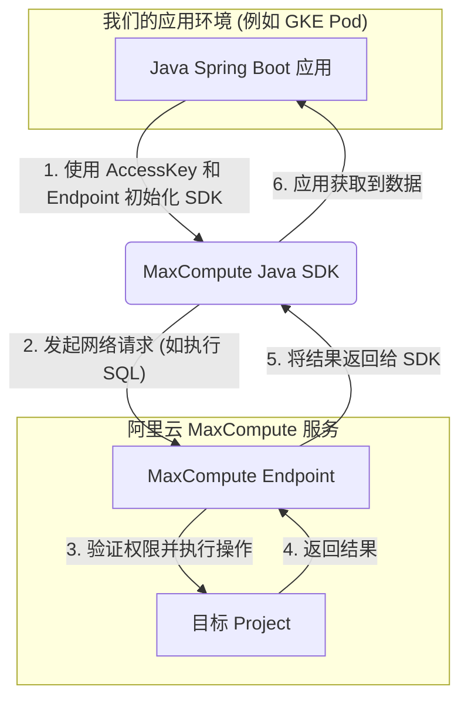

# 关于“我们是否必须使用 MaxCompute”的技术澄清

## 1. 问题背景

一个常见的疑问是：当数据提供方使用阿里云 MaxCompute，并通过 `Package` 方式向我们授权数据访问权限时，我们作为数据消费方，是否也被限制必须使用 MaxCompute 的技术栈或平台（如 DataWorks）？

## 2. 核心结论

这个说法是 **不完全正确** 的。为了更精确地理解，我们可以将其分解为以下两点：

1.  **访问方式的“限制”**：我们 **必须** 使用遵循 MaxCompute 协议的客户端或 SDK 来访问数据。这是由数据源本身的技术体系决定的。
2.  **应用架构的“自由”**：我们的应用程序 **不需要** 是一个“MaxCompute 应用”。它可以是任何我们熟悉和选择的技术栈（如 Java Spring Boot、Python Django/Flask 等），只需在应用内部集成 MaxCompute 的 SDK 即可。

**简而言之：我们的应用将 MaxCompute 视为一个外部的、远程的数据源，而非我们必须置身其中的运行环境。**

---

## 3. 技术实现原理

这种解耦的实现方式依赖于 **MaxCompute SDK (Software Development Kit)**。

无论我们的应用程序部署在哪里（例如 GKE 集群、ECS 服务器或本地开发环境），只要满足以下三个条件，就可以连接到 MaxCompute 并执行操作：

| 要素 | 说明 | 示例 |
| :--- | :--- | :--- |
| **1. AccessKey & Secret** | 访问阿里云服务的身份凭证。 | `LTAI5t...` / `m4q8g...` |
| **2. Endpoint** | MaxCompute 服务的接入地址。 | `http://service.cn-hangzhou.maxcompute.aliyun.com/api` |
| **3. Project Name** | 目标 MaxCompute 项目的名称。 | `data_provider_project` |

我们的应用通过 SDK 发起网络请求到 MaxCompute 的 Endpoint，完成身份验证和数据操作。整个过程如下图所示：

从 `maxcompute-health-check` 项目的实践中可以看出，我们正是采用这种标准的、解耦的模式。

---

## 4. 如何理解 "Package 授权"

`Package` 是 MaxCompute 提供的一种**跨项目、可控的资源授权机制**。它的作用是**权限管理**，而不是技术栈绑定。

-   **它决定了“你能访问什么”**：数据提供方通过创建一个 `Package`，将他们项目中的特定表（Table）、函数（UDF）或资源（Resource）授权给我们。
-   **它不决定“你必须如何访问”**：我们获得授权后，依然是通过标准的 SDK 来调用这些被授权的资源。

**一个类比**：
这就像一个数据库管理员（数据提供方）执行了 `GRANT SELECT ON some_table TO 'our_user';`。我们作为 `our_user`，可以使用任何标准的数据库客户端（DBeaver, Navicat, JDBC Driver）去连接并查询 `some_table`，而不需要也成为一名数据库管理员或使用和他们完全一样的工具。

---

## 5. 总结

综上所述，我们选择使用 MaxCompute SDK 直接在标准 Java 应用中进行调用，是基于以下正确理解：

1.  **技术解耦**：我们的应用架构与数据源的底层技术是分离的，我们保持了技术选型的灵活性。
2.  **标准实践**：将数据源（无论是 MySQL、Redis 还是 MaxCompute）作为外部服务来调用，是现代应用开发的标准实践。
3.  **关注点分离**：我们只需关注如何通过 SDK 与 MaxCompute 交互，而无需关心其内部复杂的运行机制或被其平台绑定。

因此，“因为对方用 MaxCompute，所以我们也必须用 MaxCompute”的说法是对场景的误解。正确的理解是：“**我们的应用需要集成 MaxCompute SDK 来与作为数据源的 MaxCompute 服务进行通信。**”
