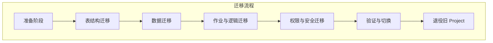

# 阿里云 MaxCompute 是什么以及如何迁移

本文档旨在解释阿里云 MaxCompute 的核心概念，并提供一个将现有 MaxCompute 项目迁移到新环境的详细分步指南。

## 1. MaxCompute 核心概念解析

首先，理解 MaxCompute 是什么至关重要，因为它与传统的计算集群（如 K8s/GKE）有本质区别。

- **资源类型**: MaxCompute 是阿里云提供的一种**大数据计算服务**，它整合了分布式数据仓库和分布式计算引擎。
- **核心能力**:
    - **存储**: 提供 PB 级别的海量数据存储能力，数据通过项目（Project）、表（Table）和分区（Partition）来组织。
    - **计算**: 支持多种计算模型，包括但不限于 SQL、MapReduce、Graph 和机器学习算法。
    - **管理**: **项目（Project）** 是 MaxCompute 中最核心的资源隔离和管理单元，类似于传统数据库中的 Schema 加上一个权限管理域。

> **结论**: MaxCompute 是一个完全托管的云上“逻辑计算引擎 + 存储服务”，用户无需关心底层物理集群的运维。因此，不存在“迁移集群”这样的操作。

## 2. MaxCompute “迁移”的真正含义

当讨论“迁移”一个 MaxCompute 项目时，我们实际上指的是将其中的**逻辑资产**从一个旧的 Project 迁移到一个新的 Project。

- **迁移的本质**: 迁移工作围绕 Project 内的资产展开，包括：
    - **数据层**: 表中的数据和分区。
    - **逻辑层**: SQL 脚本、UDF（用户自定义函数）、资源文件和调度任务。
    - **权限层**: 项目成员、角色以及 ACL 权限配置。
- **为何如此**: 因为底层计算和存储资源由阿里云平台统一管理和调度，用户无法也无需直接操作。所谓的“集群退役”，实际上是退役一个旧的 Project，并在新 Project 中重新部署业务。

## 3. MaxCompute 项目迁移清单 (Step-by-Step)

以下是详细的迁移实施清单，您可以作为操作的 Checklist。

### 阶段一：前期准备

1.  **明确目标**: 确定旧 Project 和新 Project 的名称、所在的 Region 以及计费方式。
2.  **开通服务**: 确保新 Project 已经开通了 MaxCompute 服务，并为相关人员分配了必要的 RAM 权限。
3.  **评估规模**: 评估旧 Project 的数据规模（例如，表的数量、分区大小、总存储量），以决定最合适的数据迁移方案（例如，全量一次性迁移 vs. 增量同步）。
4.  **识别依赖**: 确认项目是否依赖阿里云的 DataWorks（用于调度、数据集成、任务开发等），如果依赖，需要将 DataWorks 中的相关工作空间和任务一并迁移。

### 阶段二：数据层迁移

1.  **表结构迁移**:
    - 使用 `desc <table_name>;` 命令或 SDK API 导出旧 Project 中所有表的 Schema。
    - 在新 Project 中执行导出的 DDL 语句，重建表结构。
2.  **数据迁移**:
    - **方案A：Tunnel 工具 (适用于中小数据量)**
        - 使用 Tunnel 命令将表数据从旧 Project 下载到本地或 OSS。
        - 再使用 Tunnel 命令将数据上传到新 Project 的对应表中。
        ```bash
        # 导出数据
        tunnel download old_project.table_name data.txt;

        # 导入数据
        tunnel upload data.txt new_project.table_name;
        ```
    - **方案B：跨项目查询 (适用于大数据量)**
        - 在新 Project 中，通过创建跨项目查询任务，直接将旧 Project 的数据写入新表。
        ```sql
        INSERT INTO new_project.table_name SELECT * FROM old_project.table_name;
        ```
    - **方案C：DataWorks 数据集成**
        - 如果使用 DataWorks，可以配置数据同步任务，实现两个 Project 之间的数据迁移。
3.  **分区表处理**: 迁移分区表时，务必注意迁移所有分区信息，防止历史数据丢失。

### 阶段三：作业与逻辑层迁移

1.  **SQL 脚本与作业**: 将旧 Project 中的所有 SQL 脚本和被调度的作业任务同步到新 Project 或新的 DataWorks 工作空间。
2.  **自定义函数 (UDF)**:
    - 导出旧 Project 中注册的 UDF、UDTF、UDAGG 等自定义函数。
    - 在新 Project 中重新注册这些函数，并确保其依赖的 Jar 包或资源文件也已上传。
3.  **资源文件**: 检查旧 Project 中是否存在依赖的资源文件（如 Jar、txt、py 等），并将其重新上传到新 Project。
4.  **历史记录**: 如果需要保留作业（Instance/Job）的历史执行记录，可以考虑将其日志导出到 OSS 或其他外部存储中进行归档。

### 阶段四：权限与安全层迁移

1.  **成员与角色**: 在新 Project 中根据需要重新添加 RAM 用户和角色。
2.  **ACL 权限**: 根据业务需求，重新为新 Project 中的表、函数等资源设置精确的访问控制权限。
3.  **Quota 配置**: 确认新 Project 的计算资源配额（Quota）是否与旧 Project 的需求一致，包括 CU（计算单元）和存储空间等。

### 阶段五：验证与切换

1.  **数据校验**: 随机抽取几张核心表，对比新旧 Project 中的数据量、分区数量是否完全一致。
2.  **作业验证**: 在新 Project 中试跑核心业务任务，确认执行结果与旧 Project 保持一致。
3.  **双写/双跑 (可选)**: 为了实现平滑过渡，可以设置一个短暂的并行期，让业务同时向新旧两个 Project 写入数据，或同时运行任务。
4.  **业务切换**: 将所有外部系统（如 API、BI 工具、DataWorks 调度）的连接指向新 Project。

### 阶段六：退役旧 Project

1.  **通知用户**: 提前通知所有相关用户，业务已正式切换到新 Project。
2.  **停止调度**: 停止旧 Project 上的所有任务调度。
3.  **清理资源**: 在确认业务稳定运行于新 Project 一段时间后，可以开始清理旧 Project 的数据，并最终释放该项目资源以节省成本。

## 4. 迁移流程图 (Mermaid)



通过遵循以上步骤，您可以系统地将 MaxCompute 资产从一个项目迁移到另一个项目，同时确保业务的连续性和数据的完整性。
