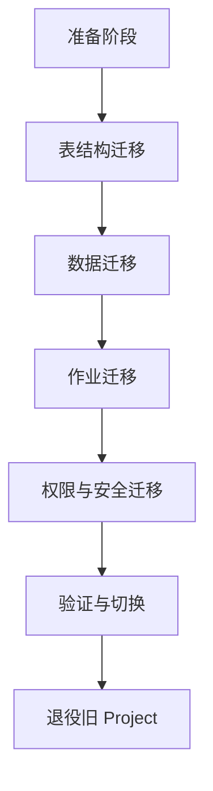

我来帮你拆开解释下阿里云里的 MaxCompute（以前叫 ODPS，Open Data Processing Service）：

1. MaxCompute 是什么资源

- 类型：阿里云的大数据计算服务（分布式数据仓库 + 分布式计算引擎）。
- 核心能力：

- 存储：PB 级数据存储，按表、分区、项目来组织。
- 计算：支持 SQL、MapReduce、Graph、机器学习等计算模型。
- 管理：项目（Project）是资源隔离单位，类似于数据库里的 schema + 权限域。

-

所以 MaxCompute 不是传统意义上的 K8S/GKE Cluster，而是一个云上的“逻辑计算引擎 + 存储服务”。

2. 关于“迁移”和“Cluster Demis”

你说的 Cluster Demis → 我理解是你要把一个已有的计算集群退役掉，然后在新建集群里继续跑业务。

在阿里云 MaxCompute 的场景里，要注意几点：

- MaxCompute 没有传统的 Cluster 概念：  
     计算资源和存储资源都由阿里云平台统一管理，用户看不到也不能直接迁移“集群”。  
     你能控制的主要是 Project（项目）以及其中的数据表、作业、权限。
- 迁移的本质：  
     如果你要“迁移”，其实是把旧 Project 里的 表数据、资源、函数、权限配置 搬到新的 Project 或新的环境。  
     对应方法：

- 数据层：通过 Tunnel 工具（数据导入导出）、MaxCompute DataWorks 迁移、或直接跨 Project 查询。
- 作业层：把 SQL 脚本、UDF、调度任务同步过去。
- 权限层：重新配置 Project 和表的权限。

-

3. 是否有“迁移”的概念

- 严格来说，MaxCompute 的底层资源不会迁移，因为用户不拥有也不管理物理集群。
- 可迁移的对象是 Project 内的逻辑资源（表、函数、作业、ACL）。
- 如果你的旧环境（Cluster）要退役 → 就需要在新建的 Project/Cluster 里重新部署数据和任务。

✅ 结论：

- 阿里云的 MaxCompute 不是一个你能“迁移 Cluster” 的资源，而是 一个托管型大数据计算平台。
- “迁移”只存在于 数据和作业层（表、任务、权限），底层计算集群是阿里云平台内部的，不存在迁移的说法。
- 如果要退役一个旧环境 → 需要把 MaxCompute Project 里的对象导出/导入到新 Project。

要不要我帮你整理一个 MaxCompute Project 迁移清单（类似 step by step），比如：数据、UDF、作业、权限分别怎么迁移？

好，那我帮你整理一个 MaxCompute Project 迁移清单，你可以直接用来作为实施步骤的 checklist。

MaxCompute Project 迁移清单

1. 前期准备

- 明确旧 Project 与新 Project 的 命名、Region、计费方式。
- 确认新 Project 已开通 MaxCompute 服务，并分配了对应的 RAM 权限。
- 评估旧 Project 的数据规模（表数量、分区大小、存储量），决定迁移方式（全量导出导入 or 增量同步）。
- 确认是否依赖 DataWorks（调度、数据集成、任务开发），需要同步迁移 DataWorks 相关资源。

2. 数据层迁移

- 表结构迁移

- 导出旧 Project 的表 Schema（desc table 或 SDK API），在新 Project 重建表结构。

-
- 数据迁移

- 使用 Tunnel 命令 导出数据，再导入到新 Project。

-

# 导出数据

tunnel download old_project.table_name data.txt

# 导入数据

tunnel upload data.txt new_project.table_name

-

- 如果数据量较大，可以用 DataWorks 数据集成、或者 MaxCompute 跨 Project 查询（INSERT INTO new_project.table SELECT \* FROM old_project.table）。
-

- 分区表处理：注意迁移分区信息，避免漏掉历史分区。

3. 作业与逻辑层迁移

- SQL 脚本：把旧 Project 里的 SQL 脚本、调度作业同步到新 Project。
- UDF/UDTF/UDAGG 函数：重新在新 Project 注册自定义函数，确保依赖 Jar 包资源也迁移。
- 资源文件：检查旧 Project 里是否有 resource（文件、jar 包等），需要重新上传。
- Instance/Job 历史：如果要保留历史执行记录，可以通过日志导出到 OSS 或外部存储。

4. 权限与安全层迁移

- 成员与角色：在新 Project 中重新添加 RAM 用户、角色。
- ACL 权限：重新设置表级、函数级别的访问控制。
- Quota 配置：确认新 Project 的计算资源配额是否和旧的一致（CU、存储空间等）。

5. 验证与切换

- 数据校验：对比新旧 Project 的表数据量、分区数量是否一致。
- 作业验证：在新 Project 上跑一遍任务，确认执行结果与旧 Project 一致。
- 双写/双跑（可选）：在迁移过程中，可以设置一段时间双写（写入旧 Project + 新 Project）以保证平滑切换。
- 业务切换：切换外部系统对新 Project 的访问（比如 DataWorks 调度、外部 API）。

6. 退役旧 Project

- 通知用户在新 Project 上使用。
- 停止旧 Project 的任务调度。
- 清理旧 Project 数据，确认不再使用后释放资源。

📝 Mermaid 流程图

✅ 这样迁移下来的对象主要是 表、函数、资源、作业、权限。底层 MaxCompute 的计算集群不用关心，因为那是阿里云托管的。

要不要我帮你写一个 Tunnel + SQL 跨 Project 的混合迁移脚本示例？这样你在执行的时候可以直接套用。
