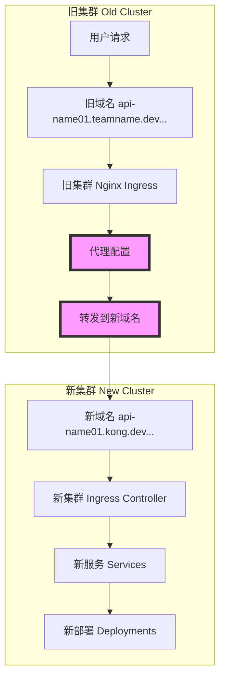
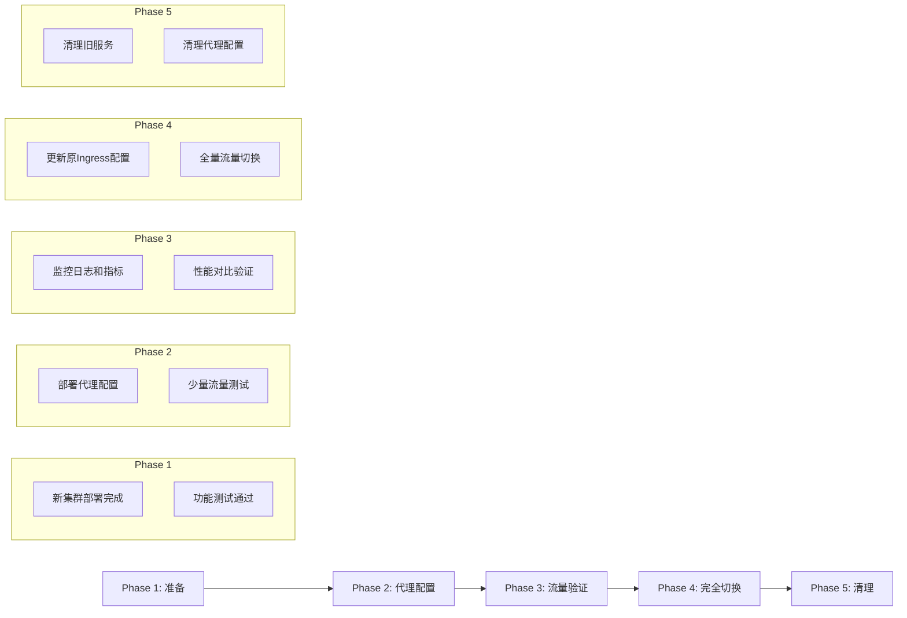
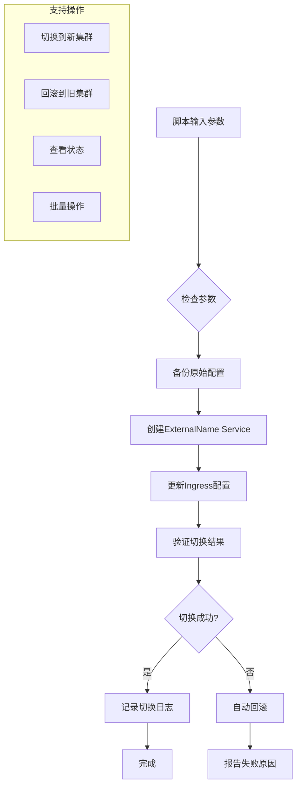

初步的一个想法,帮我确认 **反向代理的方式**，那核心思路就是： **旧集群的 Ingress Controller / Nginx 接收到请求后，把请求转发到新集群的 Ingress 域名（或者服务）**。

你的想法是正确的，反向代理是最适合你这个场景的解决方案。让我为你提供几种具体的实现方案：

## 方案对比

|方案|优点|缺点|复杂度|
|---|---|---|---|
|修改现有Ingress|简单快速|依赖nginx-ingress功能|低|
|独立Nginx代理|灵活可控|需要额外资源|中|
|Kong网关代理|功能强大|学习成本高|高|

## 推荐方案：修改现有Ingress配置

最简单的方式是利用nginx-ingress的`nginx.ingress.kubernetes.io/upstream-vhost`和重写功能：

```yaml
apiVersion: networking.k8s.io/v1
kind: Ingress
metadata:
  name: bbdm-proxy
  namespace: aibang-1111111111-bbdm
  annotations:
    # 关键配置：将请求代理到新集群
    nginx.ingress.kubernetes.io/upstream-vhost: "api-name01.kong.dev.aliyun.intracloud.cn.aibang"
    nginx.ingress.kubernetes.io/backend-protocol: "HTTP"
    # 可选：保持原始Host头
    nginx.ingress.kubernetes.io/proxy-set-headers: |
      Host api-name01.kong.dev.aliyun.intracloud.cn.aibang
      X-Original-Host $host
      X-Forwarded-Host $host
spec:
  ingressClassName: nginx
  rules:
    - host: api-name01.teamname.dev.aliyun.intracloud.cn.aibang
      http:
        paths:
          - backend:
              service:
                name: external-proxy-service
                port:
                  number: 80
            path: /
            pathType: ImplementationSpecific
---
apiVersion: v1
kind: Service
metadata:
  name: external-proxy-service
  namespace: aibang-1111111111-bbdm
spec:
  type: ExternalName
  externalName: api-name01.kong.dev.aliyun.intracloud.cn.aibang
  ports:
    - port: 80
      targetPort: 80
    - port: 443
      targetPort: 443
```

## 完整迁移流程



## 详细实施步骤

### 1. 在新集群部署服务

```bash
# 1. 创建新集群的完整服务配置
kubectl apply -f new-cluster-config.yaml --context=new-cluster
```

### 2. 在旧集群创建代理配置

```yaml
# proxy-service.yaml
apiVersion: v1
kind: Service
metadata:
  name: new-cluster-proxy
  namespace: aibang-1111111111-bbdm
spec:
  type: ExternalName
  externalName: api-name01.kong.dev.aliyun.intracloud.cn.aibang
  ports:
    - name: http
      port: 80
      targetPort: 80
    - name: https  
      port: 443
      targetPort: 443
---
apiVersion: networking.k8s.io/v1
kind: Ingress
metadata:
  name: bbdm-migration-proxy
  namespace: aibang-1111111111-bbdm
  annotations:
    nginx.ingress.kubernetes.io/upstream-vhost: "api-name01.kong.dev.aliyun.intracloud.cn.aibang"
    nginx.ingress.kubernetes.io/proxy-set-headers: |
      Host api-name01.kong.dev.aliyun.intracloud.cn.aibang
      X-Real-IP $remote_addr
      X-Forwarded-For $proxy_add_x_forwarded_for
      X-Forwarded-Proto $scheme
      X-Original-Host $host
spec:
  ingressClassName: nginx
  rules:
    - host: api-name01.teamname.dev.aliyun.intracloud.cn.aibang
      http:
        paths:
          - backend:
              service:
                name: new-cluster-proxy
                port:
                  number: 80
            path: /
            pathType: ImplementationSpecific
    - host: api-name01.01.teamname.dev.aliyun.intracloud.cn.aibang
      http:
        paths:
          - backend:
              service:
                name: new-cluster-proxy
                port:
                  number: 80
            path: /
            pathType: ImplementationSpecific
```

### 3. 灰度切换策略



## 验证和监控

```bash
# 验证代理是否生效
curl -H "Host: api-name01.teamname.dev.aliyun.intracloud.cn.aibang" \
     http://10.190.192.3/health

# 检查nginx配置
kubectl exec -n kube-system $(kubectl get pods -n kube-system -l app=nginx-ingress -o name | head -1) \
  -- cat /etc/nginx/nginx.conf | grep -A 10 "api-name01.teamname"

# 监控代理日志
kubectl logs -n kube-system -l app=nginx-ingress -f | grep "api-name01"
```

## 注意事项

1. **SSL证书问题**: 确保新集群有对应的SSL证书
2. **会话保持**: 如果有session sticky需求，需要额外配置
3. **健康检查**: 配置upstream健康检查避免请求失败
4. **回滚策略**: 保留原始配置以便快速回滚

这种方案可以实现零停机迁移，你觉得哪个环节需要详细展开？


最简单的方式是利用nginx-ingress的`nginx.ingress.kubernetes.io/upstream-vhost`和重写功能 如果我真对某个比如host 来迁移,因为我是一个平台有很多类似这种ingress配置.比如我新cluster搭建好之后我知道对应的入口地址来.我想在旧集群进行切换,写一个脚本 比如执行命令就能切换对应的资源 按照你的理解如何操作或者脚本是什么比较好


理解了，你需要一个自动化脚本来批量切换Ingress配置。让我为你设计一个完整的解决方案：

## 脚本设计架构



## 核心迁移脚本

```bash
#!/bin/bash
# k8s-ingress-migration.sh

set -e

# 配置文件
CONFIG_FILE="migration-config.yaml"
BACKUP_DIR="./backups/$(date +%Y%m%d_%H%M%S)"
LOG_FILE="./migration.log"

# 颜色输出
RED='\033[0;31m'
GREEN='\033[0;32m'
YELLOW='\033[1;33m'
NC='\033[0m' # No Color

# 日志函数
log() {
    echo -e "[$(date '+%Y-%m-%d %H:%M:%S')] $1" | tee -a $LOG_FILE
}

error() {
    log "${RED}ERROR: $1${NC}"
}

success() {
    log "${GREEN}SUCCESS: $1${NC}"
}

warning() {
    log "${YELLOW}WARNING: $1${NC}"
}

# 使用说明
usage() {
    cat << EOF
K8s Ingress Migration Tool

用法:
  $0 switch <host> <new-cluster-host>     # 单个host切换
  $0 batch-switch <config-file>           # 批量切换
  $0 rollback <host>                      # 回滚单个host
  $0 status <host>                        # 查看切换状态
  $0 list-migrations                      # 列出所有迁移记录

示例:
  $0 switch api-name01.teamname.dev.aliyun.intracloud.cn.aibang api-name01.kong.dev.aliyun.intracloud.cn.aibang
  $0 rollback api-name01.teamname.dev.aliyun.intracloud.cn.aibang
  $0 status api-name01.teamname.dev.aliyun.intracloud.cn.aibang

EOF
}

# 检查kubectl连接
check_kubectl() {
    if ! kubectl cluster-info >/dev/null 2>&1; then
        error "无法连接到kubernetes集群"
        exit 1
    fi
}

# 备份Ingress配置
backup_ingress() {
    local namespace=$1
    local ingress_name=$2
    
    mkdir -p $BACKUP_DIR
    local backup_file="$BACKUP_DIR/${namespace}_${ingress_name}_$(date +%H%M%S).yaml"
    
    kubectl get ingress $ingress_name -n $namespace -o yaml > $backup_file
    log "已备份 $namespace/$ingress_name 到 $backup_file"
    echo $backup_file
}

# 查找包含指定host的Ingress
find_ingress_by_host() {
    local host=$1
    local result=""
    
    log "查找包含host '$host' 的Ingress..."
    
    # 查找所有namespace中的ingress
    while IFS= read -r line; do
        local namespace=$(echo $line | awk '{print $1}')
        local ingress_name=$(echo $line | awk '{print $2}')
        
        # 检查该ingress是否包含指定的host
        local hosts=$(kubectl get ingress $ingress_name -n $namespace -o jsonpath='{.spec.rules[*].host}' 2>/dev/null)
        
        if [[ $hosts == *"$host"* ]]; then
            result="$namespace $ingress_name"
            break
        fi
    done < <(kubectl get ingress --all-namespaces --no-headers | awk '{print $1" "$2}')
    
    echo $result
}

# 创建ExternalName Service
create_external_service() {
    local namespace=$1
    local service_name=$2
    local external_host=$3
    
    cat << EOF | kubectl apply -f -
apiVersion: v1
kind: Service
metadata:
  name: $service_name
  namespace: $namespace
  labels:
    migration: "true"
    original-host: "$external_host"
spec:
  type: ExternalName
  externalName: $external_host
  ports:
    - name: http
      port: 80
      targetPort: 80
    - name: https
      port: 443
      targetPort: 443
EOF
    
    success "已创建ExternalName Service: $namespace/$service_name"
}

# 更新Ingress配置为代理模式
update_ingress_to_proxy() {
    local namespace=$1
    local ingress_name=$2
    local old_host=$3
    local new_host=$4
    local proxy_service_name=$5
    
    # 生成临时配置文件
    local temp_file="/tmp/ingress_${ingress_name}_$(date +%s).yaml"
    
    # 获取当前配置
    kubectl get ingress $ingress_name -n $namespace -o yaml > $temp_file
    
    # 使用yq或sed修改配置 (这里使用kubectl patch更安全)
    kubectl patch ingress $ingress_name -n $namespace --type=merge -p "$(cat << EOF
{
  "metadata": {
    "annotations": {
      "nginx.ingress.kubernetes.io/upstream-vhost": "$new_host",
      "nginx.ingress.kubernetes.io/proxy-set-headers": "Host $new_host\nX-Real-IP \$remote_addr\nX-Forwarded-For \$proxy_add_x_forwarded_for\nX-Forwarded-Proto \$scheme\nX-Original-Host \$host",
      "migration/status": "migrated",
      "migration/target": "$new_host",
      "migration/timestamp": "$(date -Iseconds)"
    }
  },
  "spec": {
    "rules": [
      {
        "host": "$old_host",
        "http": {
          "paths": [
            {
              "path": "/",
              "pathType": "ImplementationSpecific",
              "backend": {
                "service": {
                  "name": "$proxy_service_name",
                  "port": {
                    "number": 80
                  }
                }
              }
            }
          ]
        }
      }
    ]
  }
}
EOF
)"
    
    rm -f $temp_file
    success "已更新Ingress $namespace/$ingress_name 为代理模式"
}

# 验证切换结果
verify_migration() {
    local host=$1
    local new_host=$2
    
    log "验证迁移结果..."
    
    # 等待配置生效
    sleep 10
    
    # 简单的HTTP检查
    local old_response=$(curl -s -H "Host: $host" http://localhost/health 2>/dev/null || echo "failed")
    local new_response=$(curl -s -H "Host: $new_host" http://localhost/health 2>/dev/null || echo "failed")
    
    if [[ $old_response != "failed" ]]; then
        success "代理验证成功: $host -> $new_host"
        return 0
    else
        warning "代理验证警告，请手动检查"
        return 1
    fi
}

# 主要的切换函数
switch_ingress() {
    local old_host=$1
    local new_host=$2
    
    log "开始切换 $old_host -> $new_host"
    
    # 查找对应的Ingress
    local ingress_info=$(find_ingress_by_host $old_host)
    
    if [[ -z $ingress_info ]]; then
        error "未找到包含host '$old_host' 的Ingress"
        exit 1
    fi
    
    local namespace=$(echo $ingress_info | awk '{print $1}')
    local ingress_name=$(echo $ingress_info | awk '{print $2}')
    
    log "找到Ingress: $namespace/$ingress_name"
    
    # 检查是否已经是代理模式
    local current_status=$(kubectl get ingress $ingress_name -n $namespace -o jsonpath='{.metadata.annotations.migration/status}' 2>/dev/null || echo "")
    
    if [[ $current_status == "migrated" ]]; then
        warning "Ingress $namespace/$ingress_name 已经处于迁移状态"
        local current_target=$(kubectl get ingress $ingress_name -n $namespace -o jsonpath='{.metadata.annotations.migration/target}')
        log "当前目标: $current_target"
        return 0
    fi
    
    # 备份原始配置
    local backup_file=$(backup_ingress $namespace $ingress_name)
    
    # 创建代理服务
    local proxy_service_name="proxy-$(echo $old_host | sed 's/[^a-zA-Z0-9]/-/g' | head -c 50)"
    create_external_service $namespace $proxy_service_name $new_host
    
    # 更新Ingress配置
    update_ingress_to_proxy $namespace $ingress_name $old_host $new_host $proxy_service_name
    
    # 验证结果
    if verify_migration $old_host $new_host; then
        success "切换完成: $old_host -> $new_host"
        
        # 记录迁移信息
        echo "$(date -Iseconds),$namespace,$ingress_name,$old_host,$new_host,$backup_file,migrated" >> ./migration-records.csv
    else
        error "切换验证失败"
        # 这里可以添加自动回滚逻辑
    fi
}

# 回滚函数
rollback_ingress() {
    local host=$1
    
    log "开始回滚 $host"
    
    local ingress_info=$(find_ingress_by_host $host)
    
    if [[ -z $ingress_info ]]; then
        error "未找到包含host '$host' 的Ingress"
        exit 1
    fi
    
    local namespace=$(echo $ingress_info | awk '{print $1}')
    local ingress_name=$(echo $ingress_info | awk '{print $2}')
    
    # 查找备份文件
    local backup_file=$(grep "$namespace,$ingress_name,$host" ./migration-records.csv 2>/dev/null | tail -1 | cut -d, -f6)
    
    if [[ -z $backup_file ]] || [[ ! -f $backup_file ]]; then
        error "未找到备份文件"
        exit 1
    fi
    
    # 恢复配置
    kubectl apply -f $backup_file
    
    # 删除代理服务
    local proxy_service_name="proxy-$(echo $host | sed 's/[^a-zA-Z0-9]/-/g' | head -c 50)"
    kubectl delete service $proxy_service_name -n $namespace 2>/dev/null || true
    
    # 更新记录
    sed -i "s/,$host,.*,migrated$/,$host,rolled-back,$(date -Iseconds)/" ./migration-records.csv
    
    success "回滚完成: $host"
}

# 检查状态
check_status() {
    local host=$1
    
    local ingress_info=$(find_ingress_by_host $host)
    
    if [[ -z $ingress_info ]]; then
        error "未找到包含host '$host' 的Ingress"
        exit 1
    fi
    
    local namespace=$(echo $ingress_info | awk '{print $1}')
    local ingress_name=$(echo $ingress_info | awk '{print $2}')
    
    echo "Host: $host"
    echo "Namespace: $namespace"
    echo "Ingress: $ingress_name"
    
    local status=$(kubectl get ingress $ingress_name -n $namespace -o jsonpath='{.metadata.annotations.migration/status}' 2>/dev/null || echo "original")
    local target=$(kubectl get ingress $ingress_name -n $namespace -o jsonpath='{.metadata.annotations.migration/target}' 2>/dev/null || echo "N/A")
    local timestamp=$(kubectl get ingress $ingress_name -n $namespace -o jsonpath='{.metadata.annotations.migration/timestamp}' 2>/dev/null || echo "N/A")
    
    echo "Migration Status: $status"
    echo "Target Host: $target"  
    echo "Migration Time: $timestamp"
}

# 批量切换
batch_switch() {
    local config_file=$1
    
    if [[ ! -f $config_file ]]; then
        error "配置文件不存在: $config_file"
        exit 1
    fi
    
    log "开始批量切换，配置文件: $config_file"
    
    while IFS=, read -r old_host new_host; do
        if [[ $old_host != \#* ]] && [[ -n $old_host ]] && [[ -n $new_host ]]; then
            log "处理: $old_host -> $new_host"
            switch_ingress $old_host $new_host
            sleep 5  # 避免并发过多
        fi
    done < $config_file
    
    success "批量切换完成"
}

# 主逻辑
main() {
    check_kubectl
    
    case "$1" in
        "switch")
            if [[ $# -ne 3 ]]; then
                usage
                exit 1
            fi
            switch_ingress "$2" "$3"
            ;;
        "rollback")
            if [[ $# -ne 2 ]]; then
                usage
                exit 1
            fi
            rollback_ingress "$2"
            ;;
        "status")
            if [[ $# -ne 2 ]]; then
                usage
                exit 1
            fi
            check_status "$2"
            ;;
        "batch-switch")
            if [[ $# -ne 2 ]]; then
                usage
                exit 1
            fi
            batch_switch "$2"
            ;;
        "list-migrations")
            if [[ -f ./migration-records.csv ]]; then
                echo "迁移记录:"
                column -t -s, ./migration-records.csv
            else
                log "暂无迁移记录"
            fi
            ;;
        *)
            usage
            ;;
    esac
}

# 初始化
mkdir -p backups
touch migration-records.csv

# 运行主函数
main "$@"
```

## 批量配置文件示例

```csv
# batch-migration-config.csv
# 格式: 旧域名,新域名
api-name01.teamname.dev.aliyun.intracloud.cn.aibang,api-name01.kong.dev.aliyun.intracloud.cn.aibang
api-name02.teamname.dev.aliyun.intracloud.cn.aibang,api-name02.kong.dev.aliyun.intracloud.cn.aibang
api-name03.teamname.dev.aliyun.intracloud.cn.aibang,api-name03.kong.dev.aliyun.intracloud.cn.aibang
```

## 使用方法

```bash
# 1. 赋予执行权限
chmod +x k8s-ingress-migration.sh

# 2. 单个切换
./k8s-ingress-migration.sh switch api-name01.teamname.dev.aliyun.intracloud.cn.aibang api-name01.kong.dev.aliyun.intracloud.cn.aibang

# 3. 批量切换
./k8s-ingress-migration.sh batch-switch batch-migration-config.csv

# 4. 查看状态
./k8s-ingress-migration.sh status api-name01.teamname.dev.aliyun.intracloud.cn.aibang

# 5. 回滚
./k8s-ingress-migration.sh rollback api-name01.teamname.dev.aliyun.intracloud.cn.aibang

# 6. 查看所有迁移记录
./k8s-ingress-migration.sh list-migrations
```

## 目录结构

```
.
├── k8s-ingress-migration.sh     # 主脚本
├── batch-migration-config.csv   # 批量配置
├── migration-records.csv        # 迁移记录
├── migration.log               # 操作日志
└── backups/                    # 备份目录
    └── 20250904_143022/        # 按时间分组的备份
        ├── namespace1_ingress1_143022.yaml
        └── namespace2_ingress2_143023.yaml
```

这个脚本具备完整的生产环境特性：备份、回滚、批量操作、状态检查和详细日志。你觉得哪部分需要调整？