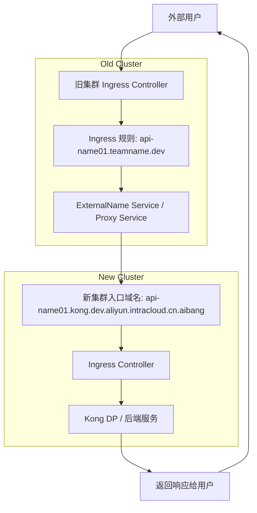

# summary
好的 👍 如果你倾向于 **反向代理的方式**，那核心思路就是：  
**旧集群的 Ingress Controller / Nginx 接收到请求后，把请求转发到新集群的 Ingress 域名（或者服务）**。  

---

## 实现步骤

### 1. 在新集群准备好服务入口
- 确保新集群有一个 **Ingress** 或 **LoadBalancer** 对外暴露。
- 新的域名例如：
```

api-name01.kong.dev.aliyun.intracloud.cn.aibang

````
- 测试访问：  
```bash
curl -vk https://api-name01.kong.dev.aliyun.intracloud.cn.aibang
````

---

### **2. 在旧集群创建一个反向代理 Service**

  

你可以直接使用 Nginx 或者 Nginx Ingress 的 annotation 来做 **proxy_pass**。

  

#### **方案 A：用 Nginx Ingress Annotation 转发**

```
apiVersion: networking.k8s.io/v1
kind: Ingress
metadata:
  name: api-name01-redirect
  namespace: aibang-1111111111-bbdm
  annotations:
    nginx.ingress.kubernetes.io/rewrite-target: /
    nginx.ingress.kubernetes.io/backend-protocol: "HTTPS"
    nginx.ingress.kubernetes.io/upstream-vhost: "api-name01.kong.dev.aliyun.intracloud.cn.aibang"
spec:
  rules:
  - host: api-name01.teamname.dev.aliyun.intracloud.cn.aibang
    http:
      paths:
      - path: /
        pathType: Prefix
        backend:
          service:
            name: api-name01-upstream
            port:
              number: 443
```

然后定义一个 **ExternalName Service** 来指向新集群域名：

```
apiVersion: v1
kind: Service
metadata:
  name: api-name01-upstream
  namespace: aibang-1111111111-bbdm
spec:
  type: ExternalName
  externalName: api-name01.kong.dev.aliyun.intracloud.cn.aibang
  ports:
    - port: 443
      name: https
```

---

#### **方案 B：直接跑一个 Nginx Pod 做反向代理**

  

如果不想用 ExternalName，可以自己部署一个小 Nginx：

```
apiVersion: apps/v1
kind: Deployment
metadata:
  name: api-name01-proxy
  namespace: aibang-1111111111-bbdm
spec:
  replicas: 1
  selector:
    matchLabels:
      app: api-name01-proxy
  template:
    metadata:
      labels:
        app: api-name01-proxy
    spec:
      containers:
      - name: nginx
        image: nginx:1.25
        volumeMounts:
        - name: config
          mountPath: /etc/nginx/conf.d
      volumes:
      - name: config
        configMap:
          name: api-name01-proxy-conf
---
apiVersion: v1
kind: ConfigMap
metadata:
  name: api-name01-proxy-conf
  namespace: aibang-1111111111-bbdm
data:
  default.conf: |
    server {
      listen 80;
      server_name api-name01.teamname.dev.aliyun.intracloud.cn.aibang;
      location / {
        proxy_pass https://api-name01.kong.dev.aliyun.intracloud.cn.aibang;
        proxy_ssl_server_name on;
      }
    }
```

再暴露这个 Deployment 给旧集群的 Ingress：

```
apiVersion: v1
kind: Service
metadata:
  name: api-name01-proxy-svc
  namespace: aibang-1111111111-bbdm
spec:
  ports:
  - port: 80
    targetPort: 80
  selector:
    app: api-name01-proxy
```

---

### **3. DNS 层保持旧域名不变**

- 外部用户仍然访问：
    

```
api-name01.teamname.dev.aliyun.intracloud.cn.aibang
```

-   
    
- 旧集群的 Ingress Controller 接收到请求 → 代理到新集群的 api-name01.kong.dev.aliyun.intracloud.cn.aibang。
    

---

### **4. 验证流程**

1. 外部用户请求旧域名：
    

```
curl -vk https://api-name01.teamname.dev.aliyun.intracloud.cn.aibang
```

1.   
    
2. 请求进入旧集群 Ingress。
    
3. Ingress/Nginx 反向代理到新集群 Ingress。
    
4. 最终服务由新集群返回结果。
    

---

### **5. 注意事项**

- **Host Header**：必须保证请求转发时带上新集群能识别的域名（用 nginx.ingress.kubernetes.io/upstream-vhost 或 proxy_set_header Host）。
    
- **TLS 证书**：外部用户仍然用旧域名访问 → 证书要在旧集群的 Ingress Controller 上保留。
    
- **性能**：这种方式是双跳（旧集群 Ingress → 新集群 Ingress），可能增加一点延迟。
    
- **临时迁移最佳**：适合迁移过渡期，后续最好直接把 DNS 指到新集群入口。
    

---

✅ 推荐：如果只是迁移过渡期，**方案 A (Ingress + ExternalName)** 最简洁。

方案 B (自定义 Nginx Proxy) 更灵活，但多维护一层。

  

要不要我帮你画一张 **Mermaid 流程图**，展示用户请求经过旧集群再到新集群的完整路径？这样会更直观。




# 目标
在 **不改旧域名 DNS 解析** 的前提下，让用户仍访问旧集群的 Ingress Controller，但把请求**透明地**转发/迁移到**新集群**对应的域名（或 IP），以实现平滑迁移与可回滚。

> 关键思路：在旧集群做 L7 反向代理/跳转。TLS 在旧集群终止，后端到新集群使用 HTTPS 并设置正确的 SNI 与 Host。

---

## 可选方案总览

| 方案 | 适用场景 | 优点 | 注意点 |
|------|----------|------|--------|
| A：HTTP 308 跳转 | 客户端可接受跳转（浏览器、标准 SDK） | 实现简单、可观测性强 | 客户端需跟随 30x；对硬编码 Host 的客户端不友好 |
| B：L7 反向代理（推荐） | 需要对客户端**完全透明** | 旧集群终止 TLS，向新集群发起 HTTPS，保持或改写 Host | 需要配置 upstream SNI/Host、可选 mTLS、健康检查 |
| C：L4 SNI 透传 | 新集群同时持有**旧域名证书** | 不改 L7、吞吐高 | 复杂、对 Ingress 能力与证书分发要求高，通常不如 B 实用 |

> 一般建议 **B 反向代理** 为主，**A 跳转** 作为灰度期/部分 API 的应急手段。

---

## 方案 B：在旧集群做 L7 反向代理（推荐）

### 设计要点
1. 旧集群 Ingress 继续使用旧域名证书，完成 TLS 终止。
2. 旧集群到新集群走 **HTTPS**，并通过注解设置：
   - **SNI**：`proxy-ssl-name` = 新域名  
   - **Host 头**：`upstream-vhost` = 新域名（很多新集群 Ingress 依赖 Host 匹配）
3. 后端指向新集群：
   - 用 `Service type: ExternalName` 指向 **新域名**；或  
   - 用 **无 selector Service + Endpoints** 指向 **新集群 LB IP**。
4. 若新集群对上游做 **mTLS**，在旧集群配置 `proxy-ssl-secret`。
5. 灰度：可对单个 API/Host 先切，逐步扩大。

### 示例一：ExternalName + HTTPS + SNI/Host 改写
```yaml
apiVersion: v1
kind: Service
metadata:
  name: bbdm-upstream
  namespace: aibang-1111111111-bbdm
spec:
  type: ExternalName
  externalName: api-name01.kong.dev.aliyun.intracloud.cn.aibang
---
apiVersion: networking.k8s.io/v1
kind: Ingress
metadata:
  name: bbdm-proxy
  namespace: aibang-1111111111-bbdm
  annotations:
    kubernetes.io/ingress.class: nginx
    nginx.ingress.kubernetes.io/backend-protocol: "HTTPS"
    nginx.ingress.kubernetes.io/upstream-vhost: "api-name01.kong.dev.aliyun.intracloud.cn.aibang"
    nginx.ingress.kubernetes.io/proxy-ssl-server-name: "true"
    nginx.ingress.kubernetes.io/proxy-ssl-name: "api-name01.kong.dev.aliyun.intracloud.cn.aibang"
    # 若新集群要求mTLS（可选）：命名空间内包含 client cert/key/ca.crt
    # nginx.ingress.kubernetes.io/proxy-ssl-secret: "aibang-1111111111-bbdm/client-mtls-secret"
spec:
  ingressClassName: nginx
  tls:
    - hosts:
        - api-name01.teamname.dev.aliyun.intracloud.cn.aibang
      secretName: old-host-tls # 旧域名证书
  rules:
    - host: api-name01.teamname.dev.aliyun.intracloud.cn.aibang
      http:
        paths:
          - path: /
            pathType: Prefix
            backend:
              service:
                name: bbdm-upstream
                port:
                  number: 443
````

> 说明

- > ExternalName 直接指向新集群域名，NGINX 通过注解把 **SNI** 和 **Host** 都设为新域名，使新集群 Ingress 能匹配到正确的后端。
    
- > 旧域名证书 old-host-tls 继续由旧集群持有，客户端无感知。
    

  

### **示例二：固定后端 IP（无 selector Service + Endpoints）**

  

当你想绕过新域名解析或需要直连新集群 LB **IP**：

```
apiVersion: v1
kind: Service
metadata:
  name: bbdm-upstream-ip
  namespace: aibang-1111111111-bbdm
spec:
  ports:
    - name: https
      port: 443
      targetPort: 443
  clusterIP: None
---
apiVersion: v1
kind: Endpoints
metadata:
  name: bbdm-upstream-ip
  namespace: aibang-1111111111-bbdm
subsets:
  - addresses:
      - ip: 203.0.113.10   # 新集群 Ingress/LB 的对外 IP
    ports:
      - port: 443
---
apiVersion: networking.k8s.io/v1
kind: Ingress
metadata:
  name: bbdm-proxy-ip
  namespace: aibang-1111111111-bbdm
  annotations:
    kubernetes.io/ingress.class: nginx
    nginx.ingress.kubernetes.io/backend-protocol: "HTTPS"
    nginx.ingress.kubernetes.io/upstream-vhost: "api-name01.kong.dev.aliyun.intracloud.cn.aibang"
    nginx.ingress.kubernetes.io/proxy-ssl-server-name: "true"
    nginx.ingress.kubernetes.io/proxy-ssl-name: "api-name01.kong.dev.aliyun.intracloud.cn.aibang"
spec:
  ingressClassName: nginx
  tls:
    - hosts:
        - api-name01.teamname.dev.aliyun.intracloud.cn.aibang
      secretName: old-host-tls
  rules:
    - host: api-name01.teamname.dev.aliyun.intracloud.cn.aibang
      http:
        paths:
          - path: /
            pathType: Prefix
            backend:
              service:
                name: bbdm-upstream-ip
                port:
                  number: 443
```

> 说明

- > 仍旧通过注解设置后端 **SNI/Host** 为新域名，即便后端是 IP。
    
- > 新集群若只接受来自特定源 IP，需要把旧集群 egress 出口 IP 加入白名单（如 Cloud Armor/防火墙）。
    

---

## **方案 A：返回 308 永久跳转**

  

对能接受跳转的客户端，可快速迁移：

```
apiVersion: networking.k8s.io/v1
kind: Ingress
metadata:
  name: bbdm-redirect
  namespace: aibang-1111111111-bbdm
  annotations:
    kubernetes.io/ingress.class: nginx
    nginx.ingress.kubernetes.io/server-snippet: |
      if ($host = api-name01.teamname.dev.aliyun.intracloud.cn.aibang) {
        return 308 https://api-name01.kong.dev.aliyun.intracloud.cn.aibang$request_uri;
      }
spec:
  ingressClassName: nginx
  tls:
    - hosts:
        - api-name01.teamname.dev.aliyun.intracloud.cn.aibang
      secretName: old-host-tls
  rules:
    - host: api-name01.teamname.dev.aliyun.intracloud.cn.aibang
      http:
        paths:
          - path: /
            pathType: Prefix
            backend:
              service:
                name: placeholder
                port:
                  number: 80
```

> 说明

- > server-snippet 在 NGINX Ingress 中可用（需 controller 启用自定义 snippet）。
    
- > placeholder 可以是一个空的 Service（不会被真正命中）。
    

---

## **扩展：批量迁移与灰度策略**

  

### **1）按 Host 批量生成（kustomize/模板化）**

  

为每个旧域名生成一份 Ingress + ExternalName Service，把 api-nameNN 替换到 kong 域名上。建议使用 kustomize 或 Helm，把以下变量模板化：

- old_host: api-nameNN.teamname.dev.aliyun.intracloud.cn.aibang
    
- new_host: api-nameNN.kong.dev.aliyun.intracloud.cn.aibang
    
- namespace
    
- tls_secret_name
    

  

### **2）灰度发布**

- 先挑选 **少量 API** 切到方案 B，观察 5xx、延迟、日志。
    
- 如需要**流量分流**（例如 10%/90%），可在旧集群前再加一层 **Nginx Deployment**（独立于 Ingress Controller）用 split_clients 做权重转发，或在新/旧后端以业务层做灰度。NGINX Ingress 自身不支持按权重到两个不同后端 Service（除非借助 canary 注解与第二条 Ingress；但那通常仍在**同一集群**内，跨集群比较绕），因此更推荐 **独立 Nginx/Envoy** 做跨集群灰度。
    

  

### **3）回滚**

- 保留原始 Ingress 资源清单（指向旧后端）。出现问题时，仅需 kubectl apply -f original.yaml 回滚。
    
- 或保留两套资源，通过 kubectl rollout undo/切换注解启停。
    

---

## **健康检查与可观测性**

- 旧集群侧：开启 nginx.ingress.kubernetes.io/proxy-next-upstream、proxy-read-timeout 等合适的超时与重试（谨慎设置，避免幂等性风险）。
    
- 新集群侧：允许来自旧集群出口的来源（Cloud Armor/防火墙/VPC FW），暴露 /healthz 用于快速判定。
    
- 度量：在旧集群 NGINX 打开 ingress.kubernetes.io/enable-access-log: "true"（或默认），区分接入日志字段以统计 4xx/5xx、RTT。
    

---

## **最小验证步骤（建议）**

```
# 1) 在旧集群创建 ExternalName Service 与 Ingress（方案B示例一）
kubectl apply -f bbdm-proxy-externalname.yaml

# 2) 验证 SNI/Host 是否被正确改写（抓包/日志）
# 方式A：新集群 Ingress 日志中应看到 Host=api-name01.kong....
# 方式B：临时在新集群后端返回 Host/Echo，确认 header

# 3) 压测/对比
# - 并行小流量发到旧域名，观测新集群的接入和状态码
# - 对比延迟与带宽，必要时调优 keepalive/超时
```

---

## **流程图**

```
graph TD
  A[Client] --> B[旧集群 LB / Ingress Controller]
  B -->|TLS 终止: 旧域名证书| C[NGINX Ingress 规则匹配]
  C -->|反向代理: HTTPS 到新集群<br/>SNI=新域名, Host=新域名| D[新集群 LB / Ingress]
  D --> E[新集群 Service]
  E --> F[新集群 Deployment/Pod]

  subgraph 旧集群
    B
    C
  end

  subgraph 新集群
    D
    E
    F
  end
```

---

## **常见坑位与处理**

- **后端证书校验失败**：务必启用 proxy-ssl-server-name: "true" 并设置 proxy-ssl-name 为新域名；若用 IP 后端，也要保持 upstream-vhost 与 proxy-ssl-name 为新域名（SNI/Host 与 SAN 匹配）。
    
- **新集群仅按 Host 路由**：必须设置 upstream-vhost，否则 Host 仍是旧域名会 404。
    
- **跨集群 mTLS**：在旧集群放置 proxy-ssl-secret（包含 client crt/key 与信任 CA）。
    
- **来源限制**：把旧集群出口 IP/范围加入新集群的访问白名单。
    
- **自定义 snippet 权限**：若控制器禁用 server-snippet/configuration-snippet，308 跳转需改为独立 Nginx Deployment。
    
- **大规模主机名迁移**：用 Helm/Kustomize 批量生成 Ingress/Service，避免手工出错。
    

---

## **结论**

- **首推方案 B**：在旧集群保持旧域名与证书不变，通过 NGINX Ingress 注解把请求 **反向代理** 到新集群，并设置 **SNI 与 Host** 为新域名，实现对客户端透明的迁移与快速回滚。
    
- 对能接受跳转的场景，辅以 **方案 A**（308），降低旧集群负载与链路复杂度。
    

  

> 如果你提供 2~3 个具体 API 域名清单和新集群对应域名/出口限制，我可以直接帮你生成可一键应用的 YAML（Helm/Kustomize 两版都行）。


# 旧集群 -> 新集群代理迁移示例

你提供的域名映射是：

- **旧域名（用户访问保持不变）**  
  `api-name01.teamname.dev.aliyun.intracloud.cn.aibang`

- **新域名（新集群实际服务）**  
  `api-name01.kong.dev.aliyun.intracloud.cn.aibang`

目标：在 **旧集群** 里让旧域名的流量透明转发到新集群的 Ingress。

---

## 实现方案（推荐：反向代理）

### Step 1: 在旧集群创建一个 ExternalName Service

```yaml
apiVersion: v1
kind: Service
metadata:
  name: api-name01-upstream
  namespace: aibang-1111111111-bbdm
spec:
  type: ExternalName
  externalName: api-name01.kong.dev.aliyun.intracloud.cn.aibang
  ports:
    - name: https
      port: 443
```

> 说明：

- > 这里 ExternalName 直接解析到新集群的 **新域名**。
    
- > 端口保持为 443，因为新集群通过 HTTPS 暴露。
    

---

### **Step 2: 修改旧集群 Ingress，增加反向代理配置**

```
apiVersion: networking.k8s.io/v1
kind: Ingress
metadata:
  name: api-name01-proxy
  namespace: aibang-1111111111-bbdm
  annotations:
    kubernetes.io/ingress.class: nginx
    nginx.ingress.kubernetes.io/backend-protocol: "HTTPS"
    nginx.ingress.kubernetes.io/upstream-vhost: "api-name01.kong.dev.aliyun.intracloud.cn.aibang"
    nginx.ingress.kubernetes.io/proxy-ssl-server-name: "true"
    nginx.ingress.kubernetes.io/proxy-ssl-name: "api-name01.kong.dev.aliyun.intracloud.cn.aibang"
spec:
  ingressClassName: nginx
  tls:
    - hosts:
        - api-name01.teamname.dev.aliyun.intracloud.cn.aibang
      secretName: old-host-tls  # 旧域名的证书，继续使用
  rules:
    - host: api-name01.teamname.dev.aliyun.intracloud.cn.aibang
      http:
        paths:
          - path: /
            pathType: Prefix
            backend:
              service:
                name: api-name01-upstream
                port:
                  number: 443
```

> 说明：

- > 旧集群 NGINX 终止 **旧域名证书**。
    
- > 转发时，NGINX 使用 upstream-vhost 与 proxy-ssl-name，把 **SNI 和 Host 头** 都改为 **新域名**。
    
- > 这样新集群的 Ingress 才能正确匹配路由规则。
    

---

## **验证步骤**

1. 部署配置到旧集群：
    

```
kubectl apply -f externalname-service.yaml
kubectl apply -f ingress-proxy.yaml
```

1.   
    
2. 从客户端访问：
    

```
curl -vk https://api-name01.teamname.dev.aliyun.intracloud.cn.aibang/
```

2.   
    
3. 在 **新集群** Ingress Controller 的日志中，应看到：
    
    - Host: api-name01.kong.dev.aliyun.intracloud.cn.aibang
        
    - TLS SNI 也是新域名。
        
    

---

## **流程图**

```
graph TD
  A[Client] --> B[旧集群 Ingress Controller<br/>TLS终止: 旧域名证书]
  B -->|HTTPS转发<br/>SNI/Host=新域名| C[新集群 Ingress Controller]
  C --> D[新集群 Service]
  D --> E[新集群 Deployment/Pod]

  subgraph 旧集群
    B
  end

  subgraph 新集群
    C
    D
    E
  end
```

---

✅ 这样，用户仍访问 **旧域名**，但流量会透明转发到 **新域名对应的新集群服务**，无需修改 DNS。

---

要不要我帮你把这个方案扩展成 **一个 Helm 模板**，这样你可以批量生成（适用于 api-name02, api-name03 …）的迁移规则？


明白 ✅  
你现在的关键点是 **外部用户访问旧域名（旧集群 Ingress） → 自动跳转/转发到新集群域名（新集群 Ingress）**。

---

## 你有两种选择

### 方案一：**HTTP 302 跳转（浏览器可见跳转）**
- 在旧集群 Ingress 上直接返回 `302 Redirect`，把用户带到新的域名。
- 用户浏览器会显示 **新域名**。

示例 Ingress 配置（使用 NGINX Ingress 的 redirect 注解）：

```yaml
apiVersion: networking.k8s.io/v1
kind: Ingress
metadata:
  name: api-name01-redirect
  namespace: aibang-1111111111-bbdm
  annotations:
    nginx.ingress.kubernetes.io/permanent-redirect: "https://api-name01.kong.dev.aliyun.intracloud.cn.aibang$request_uri"
spec:
  ingressClassName: nginx
  rules:
    - host: api-name01.teamname.dev.aliyun.intracloud.cn.aibang
      http:
        paths:
          - path: /
            pathType: Prefix
            backend:
              service:
                name: dummy-svc
                port:
                  number: 80
````

⚠️ 注意：

- dummy-svc 可以是随便一个 Nginx 空服务，因为请求不会真正到后端。
    
- 用户在浏览器地址栏会看到 **新域名**。
    

---

### **方案二：**

### **反向代理转发（用户仍然访问旧域名）**

- 外部用户访问旧域名。
    
- 旧集群 Ingress Controller 把流量代理到新域名（新集群）。
    
- 用户地址栏 **保持旧域名**，对用户透明。
    

  

示例 Ingress 配置（带反向代理注解）：

```
apiVersion: networking.k8s.io/v1
kind: Ingress
metadata:
  name: api-name01-proxy
  namespace: aibang-1111111111-bbdm
  annotations:
    kubernetes.io/ingress.class: nginx
    nginx.ingress.kubernetes.io/backend-protocol: "HTTPS"
    nginx.ingress.kubernetes.io/upstream-vhost: "api-name01.kong.dev.aliyun.intracloud.cn.aibang"
    nginx.ingress.kubernetes.io/proxy-ssl-server-name: "true"
    nginx.ingress.kubernetes.io/proxy-ssl-name: "api-name01.kong.dev.aliyun.intracloud.cn.aibang"
spec:
  ingressClassName: nginx
  tls:
    - hosts:
        - api-name01.teamname.dev.aliyun.intracloud.cn.aibang
      secretName: old-host-tls
  rules:
    - host: api-name01.teamname.dev.aliyun.intracloud.cn.aibang
      http:
        paths:
          - path: /
            pathType: Prefix
            backend:
              service:
                name: api-name01-upstream
                port:
                  number: 443
```

这里的 api-name01-upstream 可以是：

```
apiVersion: v1
kind: Service
metadata:
  name: api-name01-upstream
  namespace: aibang-1111111111-bbdm
spec:
  type: ExternalName
  externalName: api-name01.kong.dev.aliyun.intracloud.cn.aibang
  ports:
    - name: https
      port: 443
```

---

## **两种方案对比**

|**方案**|**地址栏域名**|**优点**|**缺点**|
|---|---|---|---|
|**302 跳转**|新域名|简单，明确，负载直接到新集群|用户看到域名变化，可能要改 SDK 配置|
|**反向代理**|旧域名|用户无感知，旧域名不变|流量绕一层 → 旧集群成为转发代理，增加延迟和带宽压力|

---

## **流程图（反向代理）**

```
graph TD
  U[用户<br/>访问旧域名] --> I[旧集群 Ingress Controller]
  I -->|代理请求<br/>Host/SNI 改为新域名| N[新集群 Ingress Controller]
  N --> S[新集群 Service]
  S --> P[Pod]

  subgraph 旧集群
    I
  end

  subgraph 新集群
    N
    S
    P
  end
```

---

👉 如果你想要 **用户无感知迁移** → 用 **方案二（反向代理）**。

👉 如果你想要 **彻底切流量** → 用 **方案一（302 跳转）**。

  

要不要我帮你写一个 **通用 YAML 模板**，你只需要改 api-nameXX，就能批量生成这些迁移规则？