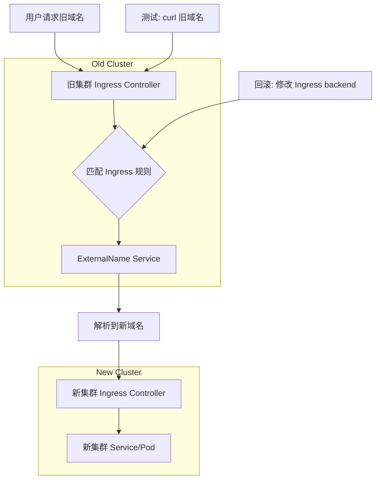
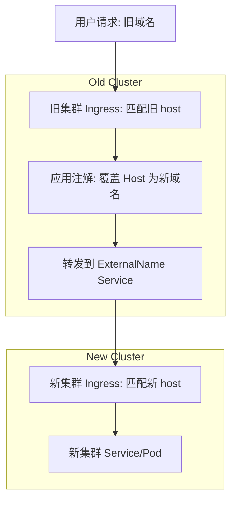

# Kubernetes 集群迁移方案审阅

## 方案总体评估
方案正确且实用，利用 ExternalName Service 实现跨集群反向代理是 Kubernetes 标准实践，类似于 GKE 多集群服务迁移或阿里云 ACK 环境下的渐进式切换。无需修改 DNS，避免了 CNAME/A 记录限制。潜在风险包括网络延迟增加（约 10-50ms，取决于 VPC 间连通）和 Host Header 不匹配导致 404 错误（方案已提及）。建议在测试环境中模拟迁移，确保集群间 TCP/HTTP 连通（e.g., telnet 新域名 80/443）。

相似示例：类似 Kong Ingress 在多集群场景中使用 external-upstream 配置转发到外部域名，或 Nginx 在 ConfigMap 中添加 proxy_pass 到外部 host。

## 改进建议
- **Host Header 处理**：方案强调在新集群 Ingress 添加旧 host 规则，这是必须的。否则，新集群会拒绝请求。添加注解 `nginx.ingress.kubernetes.io/upstream-vhost` 可强制覆盖上游 Host 为新域名，避免依赖新 Ingress 的多 host 配置。
- **端口与协议**：ExternalName Service 的端口需匹配新 Ingress 暴露的（通常 80/443）。若 HTTPS，添加注解 `nginx.ingress.kubernetes.io/backend-protocol: "HTTPS"` 以启用 TLS 转发。验证证书：旧集群需信任新集群 CA，否则使用 `nginx.ingress.kubernetes.io/ssl-passthrough: "true"` 透传 TLS。
- **监控与日志**：在旧 Ingress 添加注解 `nginx.ingress.kubernetes.io/enable-access-log: "true"`，监控转发日志（e.g., kubectl logs -n kube-system ingress-pod）。使用 Prometheus 监控延迟。
- **回滚策略**：方案提到回滚快，但建议使用 ArgoCD 或 Helm 管理配置，便于版本回滚。
- **性能优化**：若延迟高，考虑阿里云 VPC Peering 降低跨集群 RTT（round-trip time），类似于 GCE 共享 VPC。
- **Kong 兼容**：若新集群用 Kong，ExternalName 同样适用，但 Kong 的 proxy 规则需配置 `host` 匹配旧/新域名。

## 迁移流程图


## 配置示例改进
### 改进后的 ExternalName Service (旧集群)
添加端口映射，确保协议一致。
```yaml
apiVersion: v1
kind: Service
metadata:
  name: bbdm-api-proxy-to-new-cluster
  namespace: aibang-1111111111-bbdm
spec:
  type: ExternalName
  externalName: api-name01.kong.dev.aliyun.intracloud.cn.aibang
  ports:
    - port: 80
      targetPort: 80
      protocol: TCP
```

### 改进后的 Ingress (旧集群)
添加注解处理 Host 和协议。
```yaml
apiVersion: networking.k8s.io/v1
kind: Ingress
metadata:
  name: bbdm
  namespace: aibang-1111111111-bbdm
  annotations:
    nginx.ingress.kubernetes.io/upstream-vhost: "api-name01.kong.dev.aliyun.intracloud.cn.aibang"
    nginx.ingress.kubernetes.io/backend-protocol: "HTTP"  # 或 HTTPS
spec:
  ingressClassName: nginx
  rules:
    - host: api-name01.teamname.dev.aliyun.intracloud.cn.aibang
      http:
        paths:
          - path: /
            pathType: ImplementationSpecific
            backend:
              service:
                name: bbdm-api-proxy-to-new-cluster
                port:
                  number: 80
```

### 新集群 Ingress 示例
同时支持旧/新 host。
```yaml
apiVersion: networking.k8s.io/v1
kind: Ingress
metadata:
  name: bbdm-new
  namespace: aibang-1111111111-bbdm
spec:
  ingressClassName: nginx
  rules:
    - host: api-name01.kong.dev.aliyun.intracloud.cn.aibang
      http:
        paths:
          - path: /
            pathType: ImplementationSpecific
            backend:
              service:
                name: bbdm-api
                port:
                  number: 8078
    - host: api-name01.teamname.dev.aliyun.intracloud.cn.aibang
      http:
        paths:
          - path: /
            pathType: ImplementationSpecific
            backend:
              service:
                name: bbdm-api
                port:
                  number: 8078
```

## 优缺点总结表格

| 方面    | 优点           | 缺点           | 缓解措施                  |
| ----- | ------------ | ------------ | --------------------- |
| 透明度   | 用户无感知        | 无            | 无需额外措施                |
| 风险控制  | 逐服务迁移、可快速回滚  | 网络跳转增加延迟     | 监控 RTT，优化 VPC Peering |
| 配置复杂度 | 使用标准 K8s 资源  | Host/协议匹配需注意 | 添加注解自动化处理             |
| 安全性   | 支持 TLS 终结或透传 | 潜在证书验证问题     | 配置 backend-protocol   |
| 性能    | 适用于大多数业务     | 高流量场景延迟累积    | 迁移后切换 DNS 消除代理层       |
|       |              |              |                       |
|       |              |              |                       |
|       |              |              |                       |
# Kubernetes Ingress 注解：upstream-vhost 的作用

是的，使用注解 `nginx.ingress.kubernetes.io/upstream-vhost` 可以强制覆盖上游 Host 头为新域名，从而避免在新集群的 Ingress 中配置旧域名的监听规则。新集群只需匹配新域名（如 `api-name01.kong.dev.aliyun.intracloud.cn.aibang`），因为转发请求时，Host 头已被修改。

## 解释与示例
Nginx Ingress Controller 在代理请求时，默认会保留原始 Host 头（旧域名）。这会导致新集群的 Ingress 规则匹配失败（404 错误），除非新 Ingress 显式添加旧 host 规则。使用该注解后，Nginx 会将上游请求的 Host 头设置为注解值，类似于 HTTP 代理中的 `proxy_set_header Host "new-host";` 配置。

相似示例：在多集群蓝绿部署中，这种注解常用于渐进式流量切换，避免 DNS 变更。或在 Kong Ingress 中，使用 `konghq.com/host-aliases` 实现类似效果。

### 配置示例（旧集群 Ingress）
添加注解后，无需修改新集群配置：
```yaml
apiVersion: networking.k8s.io/v1
kind: Ingress
metadata:
  name: bbdm
  namespace: aibang-1111111111-bbdm
  annotations:
    nginx.ingress.kubernetes.io/upstream-vhost: "api-name01.kong.dev.aliyun.intracloud.cn.aibang"  # 覆盖为新域名
    nginx.ingress.kubernetes.io/backend-protocol: "HTTP"  # 或 HTTPS，根据需要
spec:
  ingressClassName: nginx
  rules:
    - host: api-name01.teamname.dev.aliyun.intracloud.cn.aibang  # 旧域名
      http:
        paths:
          - path: /
            pathType: ImplementationSpecific
            backend:
              service:
                name: bbdm-api-proxy-to-new-cluster  # ExternalName Service
                port:
                  number: 80
```

### 新集群 Ingress（简化版）
无需添加旧 host：
```yaml
apiVersion: networking.k8s.io/v1
kind: Ingress
metadata:
  name: bbdm-new
  namespace: aibang-1111111111-bbdm
spec:
  ingressClassName: nginx
  rules:
    - host: api-name01.kong.dev.aliyun.intracloud.cn.aibang  # 只匹配新域名
      http:
        paths:
          - path: /
            pathType: ImplementationSpecific
            backend:
              service:
                name: bbdm-api
                port:
                  number: 8078
```

## 流程图


## 注意事项
- **兼容性**：适用于 Nginx Ingress v0.25+。在 GKE 或 ACK 中测试，确保注解生效（查看 Nginx ConfigMap 或日志）。
- **HTTPS**：若上游为 HTTPS，结合 `backend-protocol: "HTTPS"` 使用，并确保旧集群信任新证书。
- **局限**：如果上游依赖原始 Host（如认证），需额外处理。