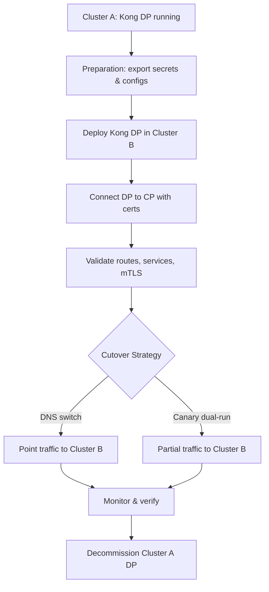

Got it 👍 — migrating a Kong DP (Data Plane) from Cluster A → Cluster B is not just reinstalling the pods, it involves making sure the new DP can connect to the CP (Control Plane) properly, that traffic cutover is smooth, and that all dependencies (Secrets, Certificates, ConfigMaps, Routes, Services) are correctly migrated.

Below I’ll give you a detailed migration plan broken down into phases (Preparation → Deployment → Validation → Cutover → Post-Migration).

📝 Kong DP Migration Plan (Cluster A → Cluster B)

1. Preparation

- Check CP/DP mode

- Confirm your Kong is running in Hybrid mode (CP/DP split) or DB-less mode.
- If Hybrid: DP only needs connection to CP + certificates.
- If DB-less: you need to sync the declarative config (routes/services/plugins).

-
- Inventory of dependencies

- Collect the following from Cluster A:

- Kong Proxy Service (LoadBalancer / NodePort / Ingress) definition.
- Kong DP secrets:

- cluster_cert, cluster_ca, cluster_key (for CP/DP mTLS).
- Any client certs if your DP is serving mTLS to upstream clients.

-
- ConfigMaps or declarative config if DB-less.
- Ingress/CRDs (KongIngress, TCPIngress, etc.).

-

-
- Networking / Connectivity

- Ensure Cluster B DP can reach CP’s Admin API / Cluster Control Plane port (default :8005 gRPC).
- If clients connect directly to DP → plan for DNS update or dual-registration (cutover strategy).

-

2. Deployment in Cluster B

- Install Kong DP in Cluster B (helm or manifest):

- Use the same Kong image + version as Cluster A.
- Use the same proxy service config (LB/Ingress settings).
- Apply the DP Secrets (cluster_cert, cluster_key, cluster_ca).
- Configure env vars in Helm chart:

-

env:

role: data_plane

cluster_control_plane: <CP address>:8005

cluster_server_name: kong_clustering

-

-
- If client-side TLS authentication is required (external users authenticate to DP with client certs), mount the same client CA trust bundle in DP.
-

- Service/Route migration

- If Hybrid mode: No need to migrate routes/services manually; CP pushes config to DP.
- If DB-less mode: Copy the declarative config (kong.yaml) and apply it in Cluster B.

-

3. Validation

- Internal DP → CP connectivity

- Check logs: DP should show

-

[notice] connected to control plane, successfully

-

-
- If failed, recheck secrets and connectivity.
-

- Route/Service availability

- Test internal services (curl DP_IP:8000/route).
- Verify plugins (auth, rate limit, etc.) are loaded correctly.

-
- Client TLS validation (if used)

- Test with valid client cert.
- Test with invalid cert → must be rejected.

-

4. Cutover Strategy

- Option A: DNS switch (big-bang cutover)

- Update DNS for api.example.com from Cluster A DP → Cluster B DP service.

-
- Option B: Dual run (canary cutover)

- Deploy DP in Cluster B with new DNS (api-b.example.com).
- Route a portion of traffic for testing.
- Once stable → update main DNS record to Cluster B DP.

-

5. Post-Migration

- Decommission Cluster A DP

- Scale DP to 0 in Cluster A once Cluster B is stable.
- Keep secrets backup in a secure vault (for rollback).

-
- Monitoring

- Ensure metrics/logs are flowing from DP to your monitoring system.
- Validate latency/error rate is consistent.

-

✅ Things that usually need attention

1. Client certificates:

- If your clients authenticate at the DP layer (mTLS), you must migrate the same trusted CA bundle / certs.
- If only CP ↔ DP uses certs, just migrate cluster_cert, cluster_key, cluster_ca.

3.

4. Routes/Services:

- In Hybrid mode, no adjustment needed — CP pushes config automatically.
- In DB-less, you must re-apply config in Cluster B.

6.

7. External dependencies:

- Any custom plugins? Check that image/volume are migrated.
- Any external DNS/LB config? Update accordingly.

9.

Mermaid Flow (Migration Workflow)

👉 Would you like me to prepare this migration plan in a checklist format (step-by-step with commands/Helm values) so your team can follow it directly during execution?
