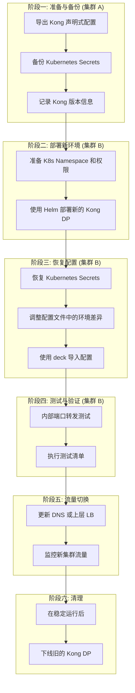

# Kong DP 迁移计划 (从集群 A 到集群 B)

## 1. 概述

本文档旨在为 Kong Data Plane (DP) 从现有 Kubernetes 集群 (集群 A) 迁移到新的 Kubernetes 集群 (集群 B) 提供一份详细、可执行的行动计划。迁移的核心目标是确保服务的平滑过渡，最小化停机时间，并保证所有路由、服务、插件和安全配置在新环境中正确无误。

## 2. 核心原则

- **声明式优先**: 优先使用 Kong 的声明式配置工具 `deck` 来导出和导入配置，确保一致性和可复现性。
- **备份一切**: 在进行任何变更之前，完整备份所有相关配置和敏感数据。
- **分阶段验证**: 在流量切换之前，在新环境中进行彻底的测试和验证。
- **不可变基础设施**: 将集群 B 的 Kong DP 视为一个全新的部署，而不是在旧有状态上进行修改。

## 3. 迁移流程图



## 4. 详细步骤

### 阶段一：准备与备份 (集群 A)

1.  **导出 Kong 声明式配置**:
    使用 `deck` 工具导出当前 Kong DP 的所有非敏感配置（Routes, Services, Plugins, Consumers, Upstreams）。

    ```bash
    # 假设你已经配置好 kubectl 指向集群 A
    # 通过端口转发连接到 Kong Admin API
    kubectl port-forward -n <kong-namespace-A> svc/<kong-admin-service> 8001:8001 &

    # 导出配置
    deck dump --kong-addr http://localhost:8001 -o kong-backup.yaml
    ```

2.  **备份敏感数据 (Kubernetes Secrets)**:
    `deck` 不会导出敏感信息。你需要手动备份所有与 Kong 相关的 Kubernetes Secrets。这包括：
    - **TLS 证书**: 用于 Ingress 或 API Gateway 的 SSL 证书。
    - **客户端证书 (mTLS)**: 如果你的 Kong DP 使用双向 TLS 认证来验证客户端，这些 CA 证书和客户端证书至关重要。
    - **插件凭证**: 例如 `jwt-signer` 的密钥，`basic-auth` 的凭证，`key-auth` 的 API 密钥等。
    - **Session 配置**: 如 `session` 插件的密钥。

    ```bash
    # 备份所有在 Kong Namespace 下的 Secrets
    # 建议逐个备份，并给予有意义的文件名
    kubectl get secret -n <kong-namespace-A> <my-tls-secret> -o yaml > my-tls-secret.yaml
    kubectl get secret -n <kong-namespace-A> <my-mtls-ca-secret> -o yaml > my-mtls-ca-secret.yaml
    kubectl get secret -n <kong-namespace-A> <my-plugin-jwt-secret> -o yaml > my-plugin-jwt-secret.yaml
    ```

3.  **记录版本信息**:
    记录当前 Kong DP 的版本和数据库模式（如果使用）。这对于在新集群中部署相同版本至关重要，避免版本不兼容导致的问题。

    ```bash
    # 获取 Kong Pod 镜像版本
    kubectl get pod -n <kong-namespace-A> <kong-pod-name> -o jsonpath='{.spec.containers[0].image}'
    ```

### 阶段二：部署新环境 (集群 B)

1.  **准备 Kubernetes 环境**:
    在集群 B 中创建 Kong 所需的 Namespace 和必要的 RBAC 权限。

    ```bash
    kubectl create namespace <kong-namespace-B>
    ```

2.  **部署新的 Kong DP**:
    使用 Helm Chart 在集群 B 中部署一个与集群 A 版本一致的、干净的 Kong DP 实例。此时**不要**应用任何自定义配置。

    ```bash
    helm install kong/kong --namespace <kong-namespace-B> --set image.tag=<version-from-A> ...
    ```

### 阶段三：恢复配置 (集群 B)

1.  **恢复 Kubernetes Secrets**:
    在应用 `deck` 配置之前，必须先将备份的 Secrets 恢复到集群 B 的新 Namespace 中。

    ```bash
    # 确保 kubectl 指向集群 B
    kubectl apply -n <kong-namespace-B> -f my-tls-secret.yaml
    kubectl apply -n <kong-namespace-B> -f my-mtls-ca-secret.yaml
    kubectl apply -n <kong-namespace-B> -f my-plugin-jwt-secret.yaml
    ```

2.  **调整配置文件 (`kong-backup.yaml`)**:
    **这是迁移中最关键的一步**。集群 A 的配置可能包含硬编码的、指向其内部服务的地址。你需要将这些地址更新为集群 B 的对应地址。

    - **检查 `services` 对象**: 重点关注 `host` 字段。
      - **旧配置 (集群 A)**: `host: my-app.default.svc.cluster.local`
      - **新配置 (集群 B)**: 可能需要改为 `host: my-app.production.svc.cluster.local` 或其他新环境的 FQDN。
    - **检查 `plugins` 配置**: 某些插件（如 `request-transformer`）可能也包含需要修改的旧环境 URL。

3.  **使用 `deck` 导入配置**:
    将调整后的配置文件同步到新的 Kong DP 实例。

    ```bash
    # 假设你已经配置好 kubectl 指向集群 B
    kubectl port-forward -n <kong-namespace-B> svc/<new-kong-admin-service> 8001:8001 &

    # 使用 sync 命令应用配置
    deck sync --kong-addr http://localhost:8001 -s kong-backup.yaml
    ```

### 阶段四：测试与验证 (集群 B)

在将生产流量指向新集群之前，进行彻底的内部测试。

1.  **内部访问测试**:
    使用 `kubectl port-forward` 将新 Kong DP 的代理端口暴露到本地，绕过外部负载均衡器进行直接测试。

    ```bash
    # 转发代理端口
    kubectl port-forward -n <kong-namespace-B> svc/<new-kong-proxy-service> 8080:80 &
    ```

2.  **执行测试清单**:
    - **API 调用**: 使用 `curl` 或 Postman，通过 `localhost:8080` 访问关键的 API 路由，验证是否能正确代理到后端的上游服务。
    - **认证插件**: 测试 `key-auth`, `basic-auth`, `jwt` 等认证是否正常工作。
    - **mTLS 认证**: 如果配置了客户端认证，请使用正确的客户端证书进行请求，验证连接是否成功。
    - **其他插件**: 检查限流、请求转换、日志记录等插件是否按预期执行。
    - **查看日志**: 监控新 Kong DP Pod 的日志，检查是否有错误信息。

### 阶段五：流量切换

1.  **更新 DNS 或上层负载均衡器**:
    当所有测试都通过后，将指向 Kong DP 的公共 DNS 记录（例如 `api.example.com`）或上层 LB 的后端目标，从集群 A 的 Ingress IP 地址切换到集群 B 的 Ingress IP 地址。
    - 建议设置一个较短的 TTL，以便在出现问题时可以快速回滚。

2.  **监控**:
    在流量切换后，密切监控新 Kong DP 的性能指标（延迟、错误率）以及后端应用服务的状态。

### 阶段六：清理

在确认新集群稳定运行一段时间（例如 24-48 小时）后，可以开始计划下线并清理集群 A 中的旧 Kong DP 资源。

## 5. 关键问题解答

#### 问：Kong DP 的客户端证书需要认证吗？

**答：是的，绝对需要。**
如果你的服务（`service` 或 `route` 对象）配置了 mTLS（双向 TLS 认证）来验证客户端身份，那么用于验证的 CA 证书（以及可能的证书链）是作为 Kubernetes Secret 存储的，并通过 Kong 的 `certificate` 对象进行引用的。
**迁移时必须**：
1.  **备份**这些包含 CA 证书的 Secrets (`my-mtls-ca-secret.yaml`)。
2.  在导入 `deck` 配置**之前**，将这些 Secrets **恢复**到新集群。
否则，当 `deck` 尝试创建引用了不存在的 Secret 的 `certificate` 对象时，将会失败。

#### 问：Routes 和 Services 需要调整吗？

**答：是的，极有可能需要调整。**
这是迁移中最常见的陷阱。Kong 的 `service` 对象中的 `host` 字段定义了上游服务的地址。在 Kubernetes 环境中，这通常是 K8s Service 的内部 FQDN（Fully Qualified Domain Name），其格式为 `<service-name>.<namespace>.svc.cluster.local`。

当你从集群 A 迁移到集群 B 时：
- **Namespace 可能不同**: `dev` -> `production`
- **集群域名后缀可能不同** (虽然不常见)

因此，在将 `kong-backup.yaml` 应用到集群 B 之前，你必须**搜索并替换**所有指向旧集群内部服务的 `host` 值，使其指向新集群 B 中正确的服务地址。如果不这样做，Kong DP 将无法找到上游服务，所有请求都会失败（通常是 `503 Service Unavailable`）。

## 6. 回滚计划

- 如果在流量切换后发现严重问题，**立即将 DNS 或上层 LB 的配置改回集群 A 的 IP 地址**。
- 由于我们没有立即下线集群 A 的资源，它可以作为即时回滚的热备。
- 分析在集群 B 中发现的问题，修复后再次进行测试和切换。
