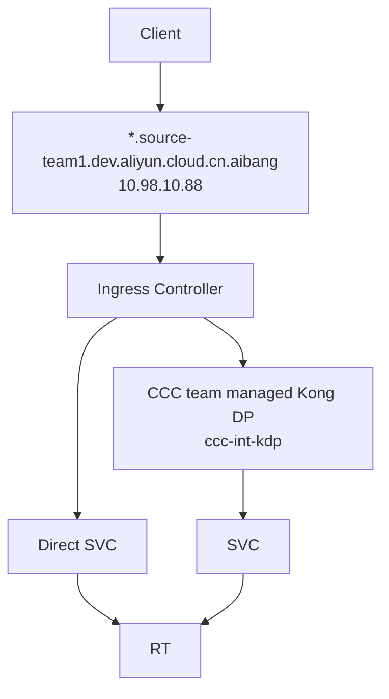
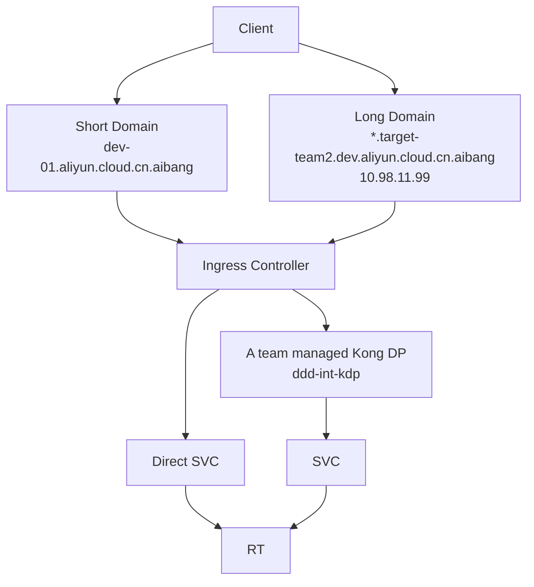
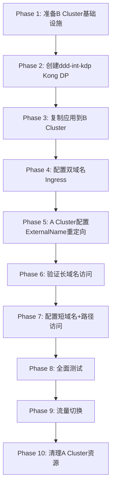

# Q

```
Aliyun里面的迁移建议和规划
我需要将运行在aliyun里面的A cluster迁移到aliyun  B cluster 里面去
A cluster ==> Flow
Ingress controller ==>  CCC team managed Kong DP [ccc-int-kdp] ==> SVC ==> RT
Ingress controller ==> SVC ==> RT
A cluster目前是通过不同的域名来提供服务。申请了泛解析比如
*.source-team1.dev.aliyun.cloud.cn.aibang ==> 10.98.10.88
api01.source-team1.dev.aliyun.cloud.cn.aibang ==> 10.98.10.88
api02.source-team1.dev.aliyun.cloud.cn.aibang ==> 10.98.10.88

B Cluster 完成2个目标
第一个就是把A Cluster里面的资源完全复制到B cluster
Ingress controller ==> A team managed Kong DP ==> SVC ==> RT
Ingress controller ==> SVC ==> RT
因为更换了工程所以域名会变更为
*.target-team2.dev.aliyun.cloud.cn.aibang ==> 10.98.11.99
api01.target-team2.dev.aliyun.cloud.cn.aibang ==> 10.98.11.99
api02.target-team2.dev.aliyun.cloud.cn.aibang ==> 10.98.11.99

我将使用external name的方式把api01.source-team1.dev.aliyun.cloud.cn.aibang 请求
跳转到api01.target-team2.dev.aliyun.cloud.cn.aibang 这个新的Cluster 注意这个长域名变化了

第二个目标
B Cluster要通过一个短域名dev-01.aliyun.cloud.cn.aibang入口然后通过apiname+paths ==> 来提供服务。比如
https://dev-01.aliyun.cloud.cn.aibang/api01/ ==> 后面提供服务的其实就是第一个目标里的api01.target-team2.dev.aliyun.cloud.cn.aibang 提供的服务
https://dev-01.aliyun.cloud.cn.aibang/api02/ ==》 后面提供服务的其实就是第一个目标里的api02.target-team2.dev.aliyun.cloud.cn.aibang
另外需要注意我的A cluster当初还有一个 CCC team managed Kong DP ,因为这个是CCC team managed的服务，我最终还要使用一个我们自己的Kong DP  比如我命名 ddd-int-kdp
这个我也需要迁移到这个B Cluster里面

其实说白了就是新的长期目标是短域名+ path来访问
那么我要在迁移的过程中，满足我的长期目标，有哪些地方需要注意。比如我需要直接迁移的时候就要修改资源的绑定域名信息，或者多侦听一个name ? 帮我详细分析 并给出解决的方
```

# Claude

基于您的需求，我来详细分析迁移策略和解决方案。

## 迁移整体架构分析

### 当前架构 (A Cluster)



### 目标架构 (B Cluster)



## 迁移策略与步骤

### Phase 1: 基础资源迁移

#### 1.1 Kong DP 迁移配置

```yaml
# ddd-int-kdp Kong DataPlane 配置
apiVersion: v1
kind: ConfigMap
metadata:
  name: ddd-int-kdp-config
  namespace: kong-system
data:
  kong.conf: |
    database = off
    declarative_config = /kong/declarative/kong.yml
    proxy_listen = 0.0.0.0:8000
    admin_listen = 0.0.0.0:8001
    log_level = info
---
apiVersion: apps/v1
kind: Deployment
metadata:
  name: ddd-int-kdp
  namespace: kong-system
spec:
  replicas: 3
  selector:
    matchLabels:
      app: ddd-int-kdp
  template:
    metadata:
      labels:
        app: ddd-int-kdp
    spec:
      containers:
      - name: kong
        image: kong:3.4
        env:
        - name: KONG_DATABASE
          value: "off"
        - name: KONG_DECLARATIVE_CONFIG
          value: /kong/declarative/kong.yml
        ports:
        - containerPort: 8000
          name: proxy
        - containerPort: 8001
          name: admin
```

#### 1.2 双域名支持的 Ingress 配置

```yaml
# 支持长域名访问的Ingress
apiVersion: networking.k8s.io/v1
kind: Ingress
metadata:
  name: api01-long-domain
  namespace: default
  annotations:
    kubernetes.io/ingress.class: nginx
    nginx.ingress.kubernetes.io/rewrite-target: /
spec:
  rules:
  - host: api01.target-team2.dev.aliyun.cloud.cn.aibang
    http:
      paths:
      - path: /
        pathType: Prefix
        backend:
          service:
            name: ddd-int-kdp-proxy
            port:
              number: 80
---
# 支持短域名+路径访问的Ingress
apiVersion: networking.k8s.io/v1
kind: Ingress
metadata:
  name: api01-short-domain
  namespace: default
  annotations:
    kubernetes.io/ingress.class: nginx
    nginx.ingress.kubernetes.io/rewrite-target: /$2
spec:
  rules:
  - host: dev-01.aliyun.cloud.cn.aibang
    http:
      paths:
      - path: /api01(/|$)(.*)
        pathType: Prefix
        backend:
          service:
            name: ddd-int-kdp-proxy
            port:
              number: 80
```

### Phase 2: ExternalName 服务配置

#### 2.1 A Cluster 中的重定向配置

```yaml
# A Cluster中创建ExternalName Service
apiVersion: v1
kind: Service
metadata:
  name: api01-redirect
  namespace: default
spec:
  type: ExternalName
  externalName: api01.target-team2.dev.aliyun.cloud.cn.aibang
  ports:
  - port: 80
    targetPort: 80
    protocol: TCP
---
# 修改原有Ingress指向新的ExternalName Service
apiVersion: networking.k8s.io/v1
kind: Ingress
metadata:
  name: api01-original
  namespace: default
  annotations:
    kubernetes.io/ingress.class: nginx
spec:
  rules:
  - host: api01.source-team1.dev.aliyun.cloud.cn.aibang
    http:
      paths:
      - path: /
        pathType: Prefix
        backend:
          service:
            name: api01-redirect
            port:
              number: 80
```

### Phase 3: Kong 路由配置迁移

#### 3.1 从 ccc-int-kdp 迁移到 ddd-int-kdp

```yaml
# Kong Route配置 - 支持双域名
apiVersion: configuration.konghq.com/v1
kind: KongRoute
metadata:
  name: api01-dual-domain
  namespace: default
spec:
  hosts:
  - api01.target-team2.dev.aliyun.cloud.cn.aibang  # 长域名支持
  - dev-01.aliyun.cloud.cn.aibang                  # 短域名支持
  paths:
  - /                    # 长域名根路径
  - /api01              # 短域名带路径
  methods:
  - GET
  - POST
  - PUT
  - DELETE
  strip_path: true
  service:
    name: api01-service
```

## 迁移过程中的关键注意事项

### 1. DNS 解析配置

| 域名类型 | 域名                                       | IP 地址     | 用途                 |
| -------- | ------------------------------------------ | ----------- | -------------------- |
| 泛域名   | \*.source-team1.dev.aliyun.cloud.cn.aibang | 10.98.10.88 | A Cluster (原)       |
| 泛域名   | \*.target-team2.dev.aliyun.cloud.cn.aibang | 10.98.11.99 | B Cluster (新长域名) |
| 短域名   | dev-01.aliyun.cloud.cn.aibang              | 10.98.11.99 | B Cluster (新短域名) |

### 2. 服务发现配置调整

```yaml
# B Cluster中的Service配置需要同时支持两种访问方式
apiVersion: v1
kind: Service
metadata:
  name: api01-service
  namespace: default
  labels:
    app: api01
    domain-type: dual-support  # 标记支持双域名
spec:
  selector:
    app: api01
  ports:
  - port: 80
    targetPort: 8080
    name: http
  type: ClusterIP
```

### 3. 监控和日志配置

```yaml
# ServiceMonitor配置
apiVersion: monitoring.coreos.com/v1
kind: ServiceMonitor
metadata:
  name: api01-metrics
  namespace: default
spec:
  selector:
    matchLabels:
      app: api01
  endpoints:
  - port: metrics
    path: /metrics
    interval: 30s
```

## 分阶段迁移流程



### 迁移时需要修改的关键配置

1. **Kong DP 名称变更**: `ccc-int-kdp` → `ddd-int-kdp`
2. **域名绑定**: 需要在 B Cluster 中同时配置长域名和短域名支持
3. **路径重写规则**: 短域名访问需要正确的路径重写
4. **服务标签**: 添加标识以区分访问方式

### 风险控制建议

1. **灰度发布**: 先迁移一个 API 进行验证
2. **健康检查**: 配置详细的健康检查机制
3. **回滚方案**: 保持 A Cluster 运行直到验证完成
4. **监控告警**: 设置关键指标监控

这样的迁移方案既满足了您的长期目标（短域名+路径访问），又保证了迁移过程的平滑过渡。​​​​​​​​​​​​​​​​

# ChatGPT

下面给出一个面向你场景（Aliyun A cluster -> B cluster，保持长期目标“短域名 + path”访问）的详细迁移分析 + 分步可执行方案，包含关键注意点、命令 / YAML 示例、验证与回滚建议，以及一个 mermaid 流程图，方便直接复制到 .md 使用。

我按阶段组织：清点 → 准备 → 迁移（双路/灰度）→ 切换 → 验证 → 清理 / 收尾。

````mermaid
graph TD;

  subgraph PREP[准备阶段]

    A1[清点 A cluster 资源清单]

    A2[在 B 集群准备 Namespace/Ingress/Kong(DP)]

    A3[准备证书与 DNS 策略]

  end


  subgraph MIGRATE[迁移阶段]

    B1[导出 Deployment/Service/Ingress/ConfigMap]

    B2[迁移 Secret (sealed/sops)]

    B3[迁移 Kong 配置 (deck 或 kong config)]

    B4[部署到 B cluster]

  end


  subgraph DUAL[灰度/双域并行]

    C1[在 B 上同时监听 source & target host]

    C2[在 A 上创建 ExternalName / 反向代理 -> B]

    C3[低 TTL，DNS 指向逐步切换]

  end


  subgraph CUTOVER[切换/验收]

    D1[流量切换到短域名 dev-01 + path]

    D2[功能/性能/安全验证]

    D3[回滚或清理旧集群资源]

  end


  PREP --> MIGRATE --> DUAL --> CUTOVER
  ```


一、先决条件与清点（必须）


1. 清点所有资源（按 namespace）


- Deployments, StatefulSets, DaemonSets, Services, Ingresses, ConfigMaps, Secrets（敏感）、Ingress annotations、ServiceAccount、ClusterRole/Binding、PersistentVolumes、PVC、CRDs（若有）。

3.

4. 列出域名映射表（示例表格，供直接复制到 markdown）：


|   |   |   |   |
|---|---|---|---|
|api_name|from_domain (A)|to_domain (B)|short_domain path|
|api01|api01.source-team1.dev.aliyun.cloud.cn.aibang|api01.target-team2.dev.aliyun.cloud.cn.aibang|https://dev-01.aliyun.cloud.cn.aibang/api01/|
|api02|api02.source-team1.dev.aliyun.cloud.cn.aibang|api02.target-team2.dev.aliyun.cloud.cn.aibang|https://dev-01.aliyun.cloud.cn.aibang/api02/|


3. 证书/密钥清单：source 的 TLS 证书、client cert（若有 mTLS）、Kong consumer credentials（apikey/jwt/acl/mtls）等。
4. Kong 架构确认：你现在 A cluster 使用 CCC team managed Kong DP（由 CCC 管理 DP），迁移后要在 B cluster 部署并使用自有 ddd-int-kdp。确认你是否有对应的 Kong Control Plane（CP）或是否需要建立新的 CP / decK 管理流程。


二、总体迁移策略（两条并行目标）


- 短期/过渡目标（平滑迁移、最小改动）
    A域名仍可访问，但内部将转发到 B cluster（使用 ExternalName/Ingress 或 A 上做反向代理）。DNS 先不急改或先调短 TTL。
- 长期目标（目标架构）
    使用单一短域名 dev-01.aliyun.cloud.cn.aibang，通过 path (/api01/, /api02/) 将请求路由到 B cluster 内部服务（由 B cluster 的 Ingress 或 B cluster 的 Kong DP 做 path->上游 host 转发与路径重写）。


三、详细步骤（可直接执行的命令 + YAML 示例）


3.1 导出/备份 A cluster 资源（示例命令）


注意：不要直接把 Secret 明文复制到仓库，建议使用 kubeseal 或 sops 做密文迁移。

# 列出要迁移的 namespaces

kubectl --context=ctx-a get ns


# 导出常规资源 （示例 namespace: team1）

kubectl --context=ctx-a -n team1 get deploy,sts,ds,svc,ingress,configmap -o yaml > team1-resources.yaml


# 导出 Secrets（谨慎）：建议单独导出并使用加密工具

kubectl --context=ctx-a -n team1 get secret -o yaml > team1-secrets-raw.yaml

清理 metadata（示意）：导出后需移除 metadata.resourceVersion、metadata.uid、status 等字段，可用 yq / 脚本批量处理。

示例（需要安装 yq）：

yq -i 'del(.items[].metadata.resourceVersion, .items[].metadata.uid, .items[].metadata.selfLink, .items[].metadata.creationTimestamp, .items[].status, .items[].metadata.managedFields)' team1-resources.yaml


3.2 迁移 Secrets（推荐方式）


- 若公司用 sealed-secrets：在 A cluster 使用 kubeseal --controller-namespace 创建 sealed secret，然后在 B cluster 解封或直接 apply sealed secret（如果使用相同 controller）。
- 若用 sops：加密后传输并在目标环境解密 apply。


示例（使用 sealed-secrets）：

# 在 source 集群生成 sealed secret（在有 kubectl 的本地并且连接到 source）

kubectl --context=ctx-a -n team1 get secret my-secret -o yaml | kubeseal --format yaml > my-secret-sealed.yaml


# 在目标集群 apply

kubectl --context=ctx-b -n team1 apply -f my-secret-sealed.yaml


3.3 Kong 配置导出/导入（强烈推荐使用 decK）


- 安装 decK（deck）并导出 CCC 管理的 Kong 配置信息（前提你能访问 CCC 的 Kong Admin API；若没有权限，请与 CCC team 协调导出）。


# 导出（需要能访问 kong admin）

deck dump --kong-addr http://ccc-kong-admin:8001 -o kong-dump.yaml

# 检查并替换域名 api01.source... -> api01.target... 或更新 service url

# 同步到你的 Kong CP（或直接 apply 到 ddd-int-kdp 的 Admin API）

deck sync --kong-addr http://our-kong-admin:8001 -s kong-dump.yaml

注意点：


- consumers、credentials（apikey/jwt）和 certificates 都要一并迁移/重新生成；credentials 涉及安全，确认密钥策略。
- 如果 CCC 是单独的 CP 并不打算转移 CNF/CP 数据，则你需要在自己的 CP/DP 上重建所需的 Service/Route/Plugin 配置（deck 可简化此事）。


3.4 在 B 集群部署 Kong DP（ddd-int-kdp）


使用 Helm 安装 Kong Data Plane（或 Kong Ingress Controller，取决于你用哪种方式）：

# 示例：用 helm 安装 Kong（简化示例）

helm repo add kong https://charts.konghq.com

helm repo update

helm install ddd-int-kdp kong/kong --namespace kong --create-namespace \

  --set ingressController.enabled=true \

  --set proxy.type=LoadBalancer

配置完成后，保证 Admin API 可被 deck 访问（或通过 CI/CD 将 kong 配置下发到 CP）。


3.5 在 B 上同时监听 source host（平滑策略）


在 B 的 Ingress / Kong Route 上同时添加两个 host： api01.source-team1.... 与 api01.target-team2....。这样切换时无需修改应用内 host 绑定。示例 Ingress（nginx）：

```yaml
apiVersion: networking.k8s.io/v1

kind: Ingress

metadata:

  name: api01-ingress

  namespace: team1

  annotations:

    kubernetes.io/ingress.class: nginx

    nginx.ingress.kubernetes.io/rewrite-target: /$2

    nginx.ingress.kubernetes.io/use-regex: "true"

spec:

  tls:

  - hosts:

    - api01.source-team1.dev.aliyun.cloud.cn.aibang

    - api01.target-team2.dev.aliyun.cloud.cn.aibang

    secretName: api01-tls-secret

  rules:

  - host: api01.target-team2.dev.aliyun.cloud.cn.aibang

    http:

      paths:

      - path: /?(.*)

        pathType: ImplementationSpecific

        backend:

          service:

            name: api01-svc

            port:

              number: 80

  - host: api01.source-team1.dev.aliyun.cloud.cn.aibang

    http:

      paths:

      - path: /?(.*)

        pathType: ImplementationSpecific

        backend:

          service:

            name: api01-svc

            port:

              number: 80
````

这样做的好处：在切 DNS 前，B 集群能直接响应旧 host 的请求（前提 DNS 指向已改变或 A 上有代理）。

3.6 在 A cluster 做“跳转/转发”到 B（过渡方案）

选项 A — ExternalName 服务 + 本地 Ingress 指向 ExternalName

在 A 集群为每个旧 svc 创建 ExternalName 指向 api01.target...（只是集群内部 name 解析到新域名，配合 ingress 可实现转发）。

```yaml
apiVersion: v1

kind: Service

metadata:

  name: api01-ext

  namespace: team1

spec:

  type: ExternalName

  externalName: api01.target-team2.dev.aliyun.cloud.cn.aibang

  ports:

  - port: 80

    protocol: TCP

    targetPort: 80
```

然后把 A 的 Ingress 指向 api01-ext。优点：无需修改外部 DNS；缺点：依赖集群 DNS & 解析、可能无法用于跨证书/端口复杂场景。

选项 B — 在 A 部署反向代理（nginx）或 K8s External LB，将请求正向代理到 B 的公开 IP/域名

优点：更灵活（可处理 TLS、header rewrite、重写 Host），适用于需要修改 Host header 的场景（比如短域名切换时保留 Host）。缺点：多一跳，性能略低，需维护。

3.7 实现短域名 dev-01 + path 的方案（在 B）

方案 1：使用 Nginx Ingress（path -> service（ExternalName））

先在 B cluster 创建 ExternalName service 指向 api01.target-team2...，再用 Ingress 的 path rule 把 /api01/ 转发到该 service（见上面示例）。并使用 rewrite-target 去掉 /api01 前缀（或在 upstream 处理）。

方案 2（推荐用于 API 平台）：使用 Kong Gateway 作为边缘（更强的 Plugin 支持）

在 Kong 上配置 Service 指向上游 https://api01.target-team2...，再为其创建 Route 指向 path /api01，并设置 strip_path: true 或 preserve_host 根据需要。示例（declarative）：

\_format: "1.1"

services:

- name: api01-service

url: https://api01.target-team2.dev.aliyun.cloud.cn.aibang

routes:

- name: api01-route

paths:

- /api01

strip_path: true

protocols:

- https

Kong 的优势：可做 auth、rate-limiting、mTLS、IP allow/deny、CORS、日志等插件一站式管理。

3.8 TLS / mTLS 注意点

- 证书边界：短域名 dev-01... 需有对应证书；旧域名 api01.source... 的证书若不在 B，则 A 上的反向代理需做 TLS termination 或 SNI passthrough。
- 客户端证书（mTLS）：如果上游要求 client-cert，确保 B 的 Kong 或 ingress 能使用正确的 client certs；若原来由 CCC team 的 Kong 做 client cert check，迁移后请确认谁负责 CA / 验证链。
- Host header：若上游基于 Host 做路由（多数情形），选择 preserve_host 或在代理层 rewrite Host 为 api01.target...。

四、切换（Cutover）步骤（一步步执行、易回滚）

1. 预备：把 B cluster 的 ingress/kong 部署好，且 api01.target... 能被外部访问（测试域名解析/证书生效）。
2. 短 TTL：先把源 DNS TTL 调低到例如 60s（cutover 前至少 24h）。
3. 灰度测试（非破坏性）：

- 在 A 集群创建 ExternalName 或反向代理指向 B（并保留旧服务不变）。
- 在 B 集群将 ingress 同时监听 api01.source...（上面已示例）。
- 从外部与内部并行测试：curl -H "Host: api01.source..." https://<A-ingress-ip>/... 与 curl https://api01.target...。

5.

6. 切换短域名路径：

- 在 DNS 上新增 dev-01.aliyun.cloud.cn.aibang 指向 B 的 LB / ingress IP（或 ALB）。
- 配置路由 /api01 -> api01 upstream（Ingress/Kong）并验证 path rewrite 生效。

8.

9. 监控 & 验证：

- 功能（接口返回）、性能（P95 latency）、错误率（4xx/5xx）、日志（Kong/nginx 日志，应用日志）。

11.

12. 完全切换：当灰度通过并稳定后，把旧域 api01.source... 的 DNS 指向新集群或删掉 A 上转发（并最终清理 A cluster 的资源）。
13. 回滚策略：保留 A cluster 的 Ingress/服务 1-2 小时或更长（取决风险），如果发现问题把 DNS TTL 指回旧 IP，或把 A 的 ExternalName 删除，让 A 直接回原服务。

五、验证项清单（Go/No-Go 判定）

- B cluster 的服务 reachable（内部 curl、外部 curl）。
- TLS 生效（openssl s_client -connect host:443 -servername <host>）。
- Host header 与 upstream 行为正确（保留或重写）。
- Kong 插件（auth、rate-limit、acl、mtls）按需生效。
- 日志 & traces 正常（请求 ID 转发）。
- 性能基线无异常（与 A cluster 比）。
- 回滚路径可立即执行（DNS TTL 足够短 / A 上保留代理）。

六、常见风险与缓解

1. Secret 泄露或频繁暴露密钥：使用 sealed-secrets / sops，避免明文。
2. 证书/CA 不匹配（尤其 mTLS）：迁移前确认 CA/Trust chain；避免直接更换证书导致客户端拒绝。
3. 服务地址改变导致内部依赖失效：在服务发现层（Ingress/Kong/Service）同时监听 old & new host。
4. Session stickiness / Cookie domain 失效：如果需要保持会话，确保 Cookie domain、路径一致或做迁移策略。
5. PVS/PVC 数据迁移复杂：Stateful 服务的 PV 数据需独立迁移（快照 -> 恢复），不要盲目重建。
6. Kong DP/CP 认证问题：DP 需要和 CP 正确握手；如果你独立部署 DP，需要确保 CP 的 credentials/certs 正确。

七、常用实操命令 & 快速模板（便于直接复制）

导出 resource（按 namespace）

NAMESPACE=team1

kubectl --context=ctx-a -n ${NAMESPACE} get deploy,sts,ds,svc,ingress,configmap -o yaml > ${NAMESPACE}-res.yaml

sealed-secrets（示例）

# on local (connected to source)

kubectl --context=ctx-a -n team1 get secret my-secret -o yaml | kubeseal --controller-namespace kube-system > my-secret-sealed.yaml

# apply to target

kubectl --context=ctx-b -n team1 apply -f my-secret-sealed.yaml

ExternalName service 示例（A 上用于转发到 B）

apiVersion: v1

kind: Service

metadata:

name: api01-ext

namespace: team1

spec:

type: ExternalName

externalName: api01.target-team2.dev.aliyun.cloud.cn.aibang

ports:

- port: 80

targetPort: 80

Nginx Ingress（dev-01 path -> ExternalName service）

apiVersion: networking.k8s.io/v1

kind: Ingress

metadata:

name: dev-01-routing

namespace: infra

annotations:

kubernetes.io/ingress.class: nginx

nginx.ingress.kubernetes.io/rewrite-target: /$2

nginx.ingress.kubernetes.io/use-regex: "true"

spec:

tls:

- hosts:

- dev-01.aliyun.cloud.cn.aibang

secretName: dev-01-tls

rules:

- host: dev-01.aliyun.cloud.cn.aibang

http:

paths:

- path: /api01(/|$)(.\*)

pathType: ImplementationSpecific

backend:

service:

name: api01-ext

port:

number: 80

- path: /api02(/|$)(.\*)

pathType: ImplementationSpecific

backend:

service:

name: api02-ext

port:

number: 80

Kong declarative snippet（短域名 path -> upstream）

\_format: "1.1"

services:

- name: api01-service

url: https://api01.target-team2.dev.aliyun.cloud.cn.aibang

routes:

- name: api01-route

paths:

- /api01

strip_path: true

protocols:

- https

八、Checklist（迁移前核对，复制到任务单）

- 列出完整资源清单（包含 CRD & ClusterRole）
- 证书、CA 列表并准备好 TLS secrets
- Kong 配置能导出并能导入（或能由 CI 下发）
- B 集群 ingress/loadbalancer 已就绪且有公网/内网 IP
- Sealed secret / sops 流程确认并测试过
- DNS TTL 已准备可变更（提前降 TTL）
- 回滚与监控仪表盘（错误率 + latency）准备完成

九、结论与建议（优先级）

1. 优先配置 B 集群同时监听旧 host 与新 host（最小破坏、方便回滚）。
2. 使用 decK（deck）导出/导入 Kong 配置，不要手工逐条迁移消费者/credentials。
3. Secrets 一定要用 sealed/sops，不要明文传输。
4. 短域名 dev-01 做边缘（Kong 或 Nginx），推荐使用 Kong（插件整合、mtls、auth 更灵活）。
5. 切换前把 DNS TTL 降到 60s，便于快速回滚。
6. 若存在 Stateful PV，单独设计数据迁移方案（快照 -> 恢复）。

如果你愿意，我可以直接把你 A cluster 的资源迁移清单化为具体的 kubectl / deck 操作脚本（例如：自动导出 team1 的资源并生成 sealed-secret 的模板、生成 deck dump + 替换域名脚本、生成 B cluster 的 Ingress YAML），并同时生成一份可执行的迁移步骤 checklist（带时间点和回滚命令）。我已经基于你给的信息做了完整分析和可执行示例 —— 如果需要我马上把“导出脚本 + deck 替换域名脚本 + dev-01 Ingress 模板”直接写出来（可复制粘贴到 .sh / .yaml），我会把这些文件打包在下一个回复里并以纯 Markdown 源码输出（包含 YAML/mermaid），直接可用。你想要我生成这些脚本吗？

# Gemini Studio

这个迁移和规划涉及到域名、Ingress Controller 以及服务路由的调整，挑战在于如何在保证服务连续性的前提下，平滑地实现域名切换和短域名访问的目标。下面我将详细分析并给出解决方

### 迁移总览

首先，我们来可视化一下这个迁移过程：
**A Cluster (Source)**
`**B Cluster (Target) - Phase 1 (复制和新域名)**`
**B Cluster (Target) - Phase 2 (短域名和最终架构)**
`

### 迁移建议与规划

**核心策略：分阶段、逐步切换、最小化影响。**

#### 第一阶段：A Cluster 资源复制到 B Cluster (新长域名)

**目标：** 将 A Cluster 的所有服务（RT、SVC）及其对应的路由配置（Ingress）完全复制到 B Cluster，并使用新的长域名。同时，将 `ccc-int-kdp` 的功能迁移到 `ddd-int-kdp`。

**关键步骤和注意事项：**

1.  **资源复制与部署：**

    - **RT (Runtime):** 将 A Cluster 中运行的所有应用程序/服务部署到 B Cluster。确保配置（环境变量、数据库连接等）适应新环境。
    - **SVC (Service):** 为部署在 B Cluster 中的每个 RT 创建对应的 Service。
    - **Ingress 配置（新长域名）：**
        - 为每个服务在 B Cluster 中配置 Ingress 规则，使用新的长域名 `*.target-team2.dev.aliyun.cloud.cn.aibang`。
        - **注意：** 此时 B Cluster 的 Ingress Controller 可以是 A team managed Kong DP 或你自己的 `ddd-int-kdp`。建议一开始就使用 `ddd-int-kdp`，这样可以避免二次迁移。
    - **Kong DP 配置：** 如果你的服务需要 Kong DP 进行额外的处理（如鉴权、限流），确保在 `ddd-int-kdp` 上复制 A Cluster `ccc-int-kdp` 的所有配置。

2.  **域名解析配置：**

    - 在 DNS 服务中，为 `*.target-team2.dev.aliyun.cloud.cn.aibang` 配置泛解析，指向 B Cluster 的 Ingress Controller IP (`10.98.11.99`)。
    - 为 `api01.target-team2.dev.aliyun.cloud.cn.aibang` 和 `api02.target-team2.dev.aliyun.cloud.cn.aibang` 配置 DNS A 记录，指向 `10.98.11.99`。

3.  **流量切换方案（External Name）：**

    - **External Name SVC 的作用：** 你提到的使用 `ExternalName` 的方式是一个非常巧妙的流量切换策略。它允许你在不修改上游调用方代码的情况下，将请求从旧域名平滑地切换到新域名。
    - **实现方式：**
        - 在 A Cluster 中，对于需要迁移的每个 `apiXX.source-team1.dev.aliyun.cloud.cn.aibang`，创建一个 `Service` 类型为 `ExternalName` 的 K8s Service。
        - 这个 `ExternalName` Service 的 `externalName` 字段指向 B Cluster 中对应服务的新长域名，例如：
            ```yaml
            apiVersion: v1
            kind: Service
            metadata:
              name: api01-redirect-svc
              namespace: default
            spec:
              type: ExternalName
              externalName: api01.target-team2.dev.aliyun.cloud.cn.aibang
            ```
        - 修改 A Cluster 中处理 `api01.source-team1.dev.aliyun.cloud.cn.aibang` 请求的 Ingress rule，让它指向 `api01-redirect-svc` 这个 `ExternalName` Service。
        - **注意：** 如果 A Cluster 有 `ccc-int-kdp`，你需要在 `ccc-int-kdp` 的路由配置中，将 `api01.source-team1.dev.aliyun.cloud.cn.aibang` 的路由指向这个 `ExternalName` Service。

4.  **测试与验证：**
    - 在切换 DNS 之前，通过修改本地 hosts 文件或使用 cURL 命令，测试 B Cluster 中新长域名下的服务是否正常工作。
    - **External Name 切换测试：** 逐步将 A Cluster 的 Ingress rule 指向 `ExternalName` Service，并监控流量和日志，确保流量成功转发到 B Cluster。

#### 第二阶段：B Cluster 实现短域名访问 (长期目标)

**目标：** 在 B Cluster 中，通过短域名 `dev-01.aliyun.cloud.cn.aibang` 和 `apiname+paths` 的方式来提供服务。

**关键步骤和注意事项：**

1.  **Ingress Controller 配置（短域名）：**

    - 在 B Cluster 的 `ddd-int-kdp` (或 A team managed Kong DP) 上配置新的 Ingress 规则，处理来自 `dev-01.aliyun.cloud.cn.aibang` 的请求。
    - 使用 Path-based Routing 将请求路由到相应的后端服务：
        - `https://dev-01.aliyun.cloud.cn.aibang/api01/` 路由到 `api01.target-team2.dev.aliyun.cloud.cn.aibang` 对应的 Service。
        - `https://dev-01.aliyun.cloud.cn.aibang/api02/` 路由到 `api02.target-team2.dev.aliyun.cloud.cn.aibang` 对应的 Service。
    - **示例 Ingress 配置 (假设使用 Nginx Ingress Controller 或 Kong Ingress Controller)：**
        ```yaml
        apiVersion: networking.k8s.io/v1
        kind: Ingress
        metadata:
          name: short-domain-ingress
          namespace: default
          annotations:
            # 根据你的 Ingress Controller 类型可能需要不同的 annotation
            # konghq.com/strip-path: "true" # 如果 Kong 需要剥离路径
        spec:
          ingressClassName: your-kong-ingress-class # 或其他 Ingress class
          rules:
          - host: dev-01.aliyun.cloud.cn.aibang
            http:
              paths:
              - path: /api01
                pathType: Prefix
                backend:
                  service:
                    name: api01-svc-in-b-cluster # 对应B cluster中的api01服务
                    port:
                      number: 80 # 或其他端口
              - path: /api02
                pathType: Prefix
                backend:
                  service:
                    name: api02-svc-in-b-cluster # 对应B cluster中的api02服务
                    port:
                      number: 80 # 或其他端口
        ```
    - **注意：** 这里的 `api01-svc-in-b-cluster` 是指 B Cluster 中实际提供 `api01` 服务的 Kubernetes Service。

2.  **域名解析配置：**

    - 在 DNS 服务中，为 `dev-01.aliyun.cloud.cn.aibang` 配置 DNS A 记录，指向 B Cluster 的 Ingress Controller IP (`10.98.11.99`)。

3.  **测试与验证：**
    - 测试短域名 `https://dev-01.aliyun.cloud.cn.aibang/api01/` 和 `https://dev-01.aliyun.cloud.cn.aibang/api02/` 是否能正常访问对应的服务。
    - 确保 Path-based Routing 正确工作。

### 需要注意的地方和建议

1.  **Ingress Controller 选择和配置：**

    - 你提到了 A team managed Kong DP 和你自己的 `ddd-int-kdp`。建议在 B Cluster 中直接使用你的 `ddd-int-kdp` 来统一管理所有 Ingress 规则，包括新长域名和短域名的路由。
    - 仔细规划 Kong DP 的路由、Service 和 Upstream 配置，确保它们与 Kubernetes Ingress 资源协同工作。
    - 如果需要，考虑使用 Kong Ingress Controller，它可以将 Kubernetes Ingress 资源转换为 Kong 的路由和 Service 配置。

2.  **SSL/TLS 证书管理：**

    - 为新的长域名 `*.target-team2.dev.aliyun.cloud.cn.aibang` 和短域名 `dev-01.aliyun.cloud.cn.aibang` 申请并配置 SSL/TLS 证书。
    - 在 Kong DP 中配置这些证书，确保 HTTPS 访问正常。
    - 考虑使用 `cert-manager` 这样的工具来自动化证书的申请和续期。

3.  **灰度发布与回滚策略：**

    - **External Name 的优势：** 使用 External Name 是一种天然的灰度发布方式。你可以逐步将 A Cluster 中服务的 Ingress 指向 `ExternalName` Service，观察流量和错误率。如果出现问题，可以快速将 Ingress 指回 A Cluster 内部 Service。
    - **DNS TTL：** 在进行 DNS 切换时，将 TTL (Time To Live) 设置得尽可能短（例如 60 秒或 300 秒），以便在出现问题时能快速回滚。
    - **逐步切换 API：** 如果你的 API 数量很多，可以分批次进行切换，先切换不那么关键的 API，积累经验后再切换核心 API。

4.  **可观测性 (Observability)：**

    - 在整个迁移过程中，确保有完善的监控、日志和告警系统。
    - 监控 A Cluster 和 B Cluster 的流量、错误率、延迟等关键指标。
    - 特别关注 `ExternalName` Service 切换后的流量走向和潜在错误。
    - 集成分布式追踪系统，以便在出现问题时能够追踪请求的完整路径。

5.  **客户端更新：**

    - **长域名：** `ExternalName` 可以帮助你避免立即修改客户端。但长期来看，所有内部和外部调用方都应该逐步更新为使用 `*.target-team2.dev.aliyun.cloud.cn.aibang` 这个新长域名。
    - **短域名：** 对于最终需要使用短域名 `dev-01.aliyun.cloud.cn.aibang` 和 Path 访问的客户端，需要明确通知并要求他们进行更新。这通常是长期目标，需要更长时间的规划和沟通。
    - **兼容性：** 在短域名上线后，旧的长域名 (target-team2) 应该继续保留一段时间，以确保所有客户端都有足够的时间完成切换。

6.  **遗留系统处理：**

    - A Cluster 中如果还有其他服务或依赖，需要考虑它们与迁移服务的关联。确保这些依赖在迁移过程中不受影响。

7.  **迁移文档和 Runbook：**
    - 详细记录迁移计划、每一步骤、回滚方案、验证清单。
    - 准备好 Runbook，以便在生产环境中进行操作时有清晰的指导。

### 总结

这个迁移计划的核心在于利用 `ExternalName` Service 实现旧长域名到新长域名的平滑过渡，并在 B Cluster 中逐步实现短域名+Path 的最终目标。

**整体流程概括：**

1.  **搭建 B Cluster 基础设施：** 部署 `ddd-int-kdp`，配置好网络。
2.  **部署服务到 B Cluster (新长域名)：** 将 A Cluster 的所有服务复制到 B Cluster，并配置其在 `ddd-int-kdp` 上的新长域名 Ingress 规则。
3.  **DNS 配置新长域名：** 为 `*.target-team2.dev.aliyun.cloud.cn.aibang` 指向 B Cluster 的 Ingress IP。
4.  **灰度切换（External Name）：** 在 A Cluster 中为旧长域名配置 `ExternalName` Service，将其流量逐步转发到 B Cluster 的新长域名。监控并验证。
5.  **上线短域名：** 在 B Cluster 的 `ddd-int-kdp` 上配置短域名 `dev-01.aliyun.cloud.cn.aibang` 的 Ingress 规则，实现 Path-based Routing。
6.  **DNS 配置短域名：** 为 `dev-01.aliyun.cloud.cn.aibang` 指向 B Cluster 的 Ingress IP。
7.  **逐步弃用旧长域名：** 在所有客户端都切换到新长域名或短域名后，逐步淘汰 A Cluster 中的服务和旧长域名的 Ingress。

这个过程需要细致的规划、充分的测试和严格的监控。祝您迁移顺利！

# Grok

阿里云中 A 集群到 B 集群的迁移建议和规划

当前架构概述 (A 集群)

A 集群使用 CCC 团队管理的 Kong 数据平面（DP），名为 ccc-int-kdp，流量路径如下：

- Ingress Controller → CCC 团队管理的 Kong DP (ccc-int-kdp) → Service (SVC) → Route (RT)
- 或者直接：Ingress Controller → SVC → RT

域名配置：

- 泛解析域名：\*.source-team1.dev.aliyun.cloud.cn.aibang 指向 IP 10.98.10.88
- 示例：

- api01.source-team1.dev.aliyun.cloud.cn.aibang → 10.98.10.88
- api02.source-team1.dev.aliyun.cloud.cn.aibang → 10.98.10.88

服务通过不同域名提供，依赖 Kong 进行路由。

graph TD

A[Client] -->|\*.source-team1.dev.aliyun.cloud.cn.aibang| B[Ingress Controller]

B --> C[CCC Managed Kong DP (ccc-int-kdp)]

C --> D[Service (SVC)]

D --> E[Route (RT)]

B -->|Direct Path| D

目标架构 (B 集群)

B 集群有两个主要目标：

1. 资源复制和域名变更：

- 复制 A 集群资源到 B 集群。
- 使用 A 团队管理的 Kong DP（例如 ddd-int-kdp）。
- 流量路径：Ingress Controller → A 团队管理的 Kong DP → SVC → RT，或直接 Ingress Controller → SVC → RT。
- 新域名：\*.target-team2.dev.aliyun.cloud.cn.aibang 指向 IP 10.98.11.99。
- 示例：

- api01.target-team2.dev.aliyun.cloud.cn.aibang → 10.98.11.99
- api02.target-team2.dev.aliyun.cloud.cn.aibang → 10.98.11.99

- 使用 Kubernetes ExternalName Service 将旧域名（如 api01.source-team1.dev.aliyun.cloud.cn.aibang）重定向到新域名（如 api01.target-team2.dev.aliyun.cloud.cn.aibang）。

3. 短域名 + Path 路由：

- 使用短域名入口：dev-01.aliyun.cloud.cn.aibang。
- 通过路径路由服务：

- https://dev-01.aliyun.cloud.cn.aibang/api01/ → 路由到 api01.target-team2.dev.aliyun.cloud.cn.aibang 的服务。
- https://dev-01.aliyun.cloud.cn.aibang/api02/ → 路由到 api02.target-team2.dev.aliyun.cloud.cn.aibang 的服务。

- 替换 CCC 管理的 Kong DP 为自己的 ddd-int-kdp，并迁移到 B 集群。

长期目标：所有访问通过短域名 + Path，实现统一入口，简化管理。

```mermaid
graph TD

    subgraph BCluster

        F[Client] -->|dev-01.aliyun.cloud.cn.aibang/api01/| G[Ingress Controller]

        G --> H[A Team Managed Kong DP (ddd-int-kdp)]

        H --> I[Service (SVC)]

        I --> J[Route (RT) for api01]

        G -->|Direct Path| I

        F -->|dev-01.aliyun.cloud.cn.aibang/api02/| G

        G --> H

        H --> K[Service (SVC)]

        K --> L[Route (RT) for api02]

    end

    M[Old Domain Redirect] -->|ExternalName Service| N[New Domain in B Cluster]
```

迁移过程分析和注意事项

迁移涉及 Kubernetes 集群（假设为阿里云 ACK 或类似 K8S 环境）、Kong Ingress Controller、域名解析和路由配置。关键注意事项包括：

1. 域名变更和兼容性：

- A 集群的资源（如 Ingress 规则、Kong Routes）绑定了旧域名。如果直接复制，可能导致路由失败，因为新集群域名不同。
- 注意：Kong Routes 通常基于 Host（域名）和 Path 匹配。如果不修改，旧域名不会匹配新环境。
- 潜在问题：证书（TLS）绑定旧域名，迁移后需更新为新域名或短域名，否则 HTTPS 失败。
- 阿里云 DNS（AliDNS）需更新泛解析记录指向新 IP 10.98.11.99。

3. Kong DP 迁移：

- CCC 管理的 ccc-int-kdp 无法直接控制，需替换为自管理的 ddd-int-kdp。
- 注意：Kong 配置（如 Plugins、Consumers、Routes）需导出并导入。使用 Kong 的 declarative config（kong.yaml）避免手动重配。
- 潜在问题：如果 CCC Kong 有自定义插件或认证，需确保 ddd-int-kdp 兼容。

5. 短域名 + Path 实现：

- 需在 Kong 或 Ingress 中配置 Path-based 路由（e.g., strip_path=true 以去除前缀）。
- 注意：路径冲突风险，如果/api01/ 和 /api02/ 下有重叠路径。
- 阿里云 SLB（负载均衡）或 Ingress 需支持 Path 路由，且短域名需申请证书。

7. 零停机迁移：

- 使用 ExternalName Service 重定向旧流量到新集群，避免服务中断。
- 注意：ExternalName 不代理流量，仅 DNS 解析，需确保网络连通（阿里云 VPC peering 如果跨 VPC）。
- 测试阶段：多监听域名（旧+新+短），逐步切换。

9. 资源复制：

- 使用 kubectl get --export 或 Velero 备份工具复制 Deployments、Services 等。
- 注意：Secrets、ConfigMaps 需手动迁移，避免泄露。
- 阿里云特定：如果涉及 NAS/PV，需跨集群迁移数据。

11. 安全与合规：

- 更新 RBAC 角色，确保新 Kong DP 有权限。
- 监控：集成阿里云 ARMS 或 Prometheus，迁移后验证指标。

13. 性能与扩展：

- 新 Kong DP 需评估负载，配置 autoscaling。
- TCP/HTTP 协议：确保 Path 路由支持 HTTP/1.1 或 HTTP/2，Kong 默认支持。

相似示例：类似于从 GKE 旧集群迁移到新集群，使用 ExternalName 桥接域名，结合 Kong 的 Path rewriting 插件实现短域名路由（如 Kong 的 request-transformer 插件）。

迁移步骤和解决方案

以下是详细迁移规划，按阶段分步。每个阶段包括注意事项和示例配置。

阶段 1: 准备和资源复制

- 复制 A 集群资源到 B 集群：使用 kubectl 导出 YAML 并 apply 到 B。
- 修改绑定域名：更新 Ingress YAML 中的 host 为新域名，或添加多 host 支持。
- 示例 Ingress YAML 修改（支持多域名）：

```yaml
apiVersion: networking.k8s.io/v1

kind: Ingress

metadata:

  name: api01-ingress

spec:

  rules:

  - host: api01.source-team1.dev.aliyun.cloud.cn.aibang  # 旧域名（临时）

    http:

      paths:

      - path: /

        pathType: Prefix

        backend:

          service:

            name: api01-svc

            port:

              number: 80

  - host: api01.target-team2.dev.aliyun.cloud.cn.aibang  # 新域名

    http:

      paths:

      - path: /

        pathType: Prefix

        backend:

          service:

            name: api01-svc

            port:

              number: 80

  - host: dev-01.aliyun.cloud.cn.aibang  # 短域名

    http:

      paths:

      - path: /api01/

        pathType: Prefix

        backend:

          service:

            name: api01-svc

            port:

              number: 80
```

- 注意：使用 annotations 如 konghq.com/strip-path: "true"去除路径前缀。
- 部署新 Kong DP (ddd-int-kdp)：安装 Kong Enterprise 或开源版，配置为 Ingress Controller。

阶段 2: Kong DP 迁移和配置

- 导出 CCC Kong 配置：如果可访问，使用 deck dump 工具导出 kong.yaml。
- 导入到 ddd-int-kdp：修改 Routes 的 host 为新域名或路径。
- 示例 Kong Route 配置（通过 Kong Manager 或 API）：

```yaml
services:

- name: api01-service

  host: api01-svc

routes:

- name: api01-route

  hosts:

  - api01.target-team2.dev.aliyun.cloud.cn.aibang

  - dev-01.aliyun.cloud.cn.aibang

  paths:

  - /api01/

  strip_path: true
```

- 注意：为短域名添加 rewrite 插件，重写路径。

阶段 3: 域名重定向

- 创建 ExternalName Service 在 A 集群（或 DNS 层）：

```yaml
apiVersion: v1

kind: Service

metadata:

  name: api01-redirect

spec:

  type: ExternalName

  externalName: api01.target-team2.dev.aliyun.cloud.cn.aibang
```

- 更新阿里云 DNS：指向 B 集群 IP。

阶段 4: 测试和切换

- 多监听域名：如上 Ingress 示例，支持旧/新/短。
- 逐步切换：先路由 10%流量到 B，监控。
- 回滚计划：保持 A 集群在线。


潜在风险和缓解

|              |                                  |                                       |
| ------------ | -------------------------------- | ------------------------------------- |
| 风险类型     | 描述                             | 缓解措施                              |
| 域名解析失败 | 旧域名未正确重定向，导致服务中断 | 使用 ExternalName + DNS TTL 低值测试  |
| 路径冲突     | /api01/ 和 /api02/ 下路径重叠    | 在 Kong 中使用 regex 路径匹配         |
| 证书问题     | TLS 证书不匹配新/短域名          | 使用阿里云 CAS 申请通配符证书         |
| 性能瓶颈     | 新 Kong DP 负载高                | 配置 HPA autoscaling，监控 CPU/Memory |
| 数据丢失     | 迁移时 PV/数据未同步             | 使用 Velero 备份或阿里云 OSS 同步     |

此规划确保迁移满足长期短域名+Path 目标，同时最小化中断。如果涉及具体阿里云 API，建议检查 ACK 文档。

# Gemini

阿里云 Kubernetes 集群服务迁移规划与实施报告
第一部分：项目总览与迁移策略选择
1.1 迁移目标与范围界定
本次项目旨在将位于阿里云上的现有 A 集群（"Flow"）中的所有 API 服务，平稳、安全地迁移至一个全新的 B 集群。此迁移任务包含两个核心目标：第一，对 A 集群中运行的所有 Kubernetes 资源进行精确复制，确保其功能在 B 集群中得以完整重现。第二，在迁移过程中，逐步实现团队的长期架构愿景，即通过一个简洁的短域名配合路径路由来统一 API 访问入口。迁移范围不仅涵盖了核心应用（RT）和其对应的服务（Service, SVC），还包括了至关重要的 API 网关层——Ingress 控制器（由 CCC 团队管理的 Kong DP），该组件将被替换为团队自维护的 Kong DP（ddd-int-kdp）。这种架构变更的复杂性要求迁移方案必须稳健且可控，以确保业务连续性。
1.2 现有架构回顾（A Cluster）
在 A 集群的现有架构中，外部流量通过阿里云 DNS 的泛解析记录（例如 _.source-team1.dev.aliyun.cloud.cn.aibang）被导向至其 Ingress 控制器的负载均衡器 IP (10.98.10.88) 。该 Ingress 控制器实际上是一个由 CCC 团队管理的 Kong DP，它作为 API 网关承担着统一的流量入口职责 。Kong DP 依据接收到的请求主机名（Host Header）和路径（Path）等路由规则，将请求精准地转发至后端的 Service，最终由服务背后的 Pod（RT）进行处理 。
该架构的流量路由模式具备双重依赖性：外部流量的路由首先依赖于 DNS 层面的域名解析，将请求指向正确的集群入口；其次，集群内部的流量分发则完全依赖于 Ingress 层（Kong）的路由规则。此次迁移涉及域名（从 _.source-team1... 到 _.target-team2...）和 API 网关组件（从 CCC 团队管理的 Kong 到团队自管理的 Kong）的同时变更。任何一方的配置更新滞后或不一致，都将直接导致流量中断和业务受损。因此，一套能够同步、协调管理 DNS 和 Ingress 配置变更的迁移策略至关重要。
1.3 目标架构展望（B Cluster）
B 集群的规划旨在分步实现两个目标。首先，它将完全复制 A 集群的现有功能，并使用新的泛解析域名 _.target-team2.dev.aliyun.cloud.cn.aibang 来提供服务。此阶段，新的自管理 Kong DP (ddd-int-kdp) 将被部署并配置为与旧 Kong DP 相似的路由规则，接收并处理指向新域名的请求。
其次，也是本次迁移的长期目标，B 集群将通过一个简化的短域名 dev-01.aliyun.cloud.cn.aibang 来对外暴露服务。在这种模式下，不同的 API 服务将通过唯一的短域名配合不同的 URL 路径进行访问，例如 https://dev-01.aliyun.cloud.cn.aibang/api01/ 和 https://dev-01.aliyun.cloud.cn.aibang/api02/ 。这种统一入口的模式代表了一种更成熟的 API 管理实践，它允许 API 网关集中处理外部流量，同时利用其强大的路径重写（Path Rewriting）能力，将用户友好的外部 URL 转换为后端服务所需的内部路径。此模式的成功实现，依赖于 Kong Ingress Controller 对主机名（Host）和路径（Path）混合路由以及路径操作（如 strip-path 和 rewrite）的原生支持 。
1.4 迁移方案选型：为何选择 Blue-Green 部署模型？
鉴于迁移的复杂性和对业务连续性的高要求，本报告强烈推荐采用 Blue-Green 部署策略。Blue-Green 部署的核心理念是同时维护两个生产环境：“蓝色”（Blue）环境代表当前正在运行的 A 集群，而“绿色”（Green）环境则代表新的 B 集群 。在迁移过程中，A 集群将继续处理所有生产流量，而 B 集群则在后台进行部署、配置和测试。当 B 集群完全就绪并通过验证后，流量将通过一个可控的、逐步进行的过程从蓝色环境切换至绿色环境 。
该策略的优势在于：

- 零停机时间： 流量切换过程可无缝进行，用户不会察觉到任何服务中断 。
- 即时回滚： 如果 B 集群在切换后出现任何问题，可以迅速将所有流量重新导向 A 集群，实现即时回滚，最大程度降低风险 。
- 安全验证： 可以在一个完全独立的生产环境中对新版本进行全面测试，而不会对现有用户产生影响 。
    尽管 Blue-Green 部署需要暂时性的双倍基础设施投入，但对于本次集群级别的迁移，其所提供的业务连续性和可控性远远 outweighs 成本考量。实施的关键挑战在于如何实现跨集群的流量平滑切换，这需要外部 DNS 和内部 Ingress 层面的紧密协同。
    第二部分：技术方案深度剖析与规划
    2.1 Kubernetes ExternalName Service 方案的技术考量与风险评估
    用户提出了一个利用 Kubernetes ExternalName Service 实现流量跳转的方案，即在 A 集群创建 ExternalName 服务，将来自旧域名 api01.source-team1... 的请求内部转发至 B 集群的域名 api01.target-team2... 。
    该方案的优点在于其配置的集中化，通过在 A 集群内部 DNS 中创建一个 CNAME 记录，可以为集群内应用提供一个抽象层，使其无需感知外部服务 URL 的变更 。然而，这种看似简便的方案在实际生产环境中，特别是处理 HTTPS 流量时，存在着致命的缺陷。
    ExternalName 服务的工作原理是直接在 Kubernetes 的内部 DNS 中创建一条 CNAME 记录，将服务名称（例如 api01.source-team1.svc.cluster.local）映射到其 externalName 字段指定的外部域名 (api01.target-team2...) 。它本身不提供任何代理或负载均衡能力，仅仅是进行 DNS 层面的重定向。
    对于依赖 TLS/HTTPS 协议的 API 流量，该方案将导致证书验证失败。当 A 集群中的客户端应用通过 ExternalName 服务访问 api01.source-team1...时，其发出的 HTTP 请求头中的 Host 通常是 api01.source-team1...。然而，B 集群的 API 网关（Kong DP）或后端服务提供的 TLS 证书是为其新域名 api01.target-team2...签发的。由于请求 Host (api01.source-team1...) 与服务器证书中的主题备用名称（Subject Alternative Name, SAN）或通用名称（Common Name, CN）不匹配，客户端将无法完成 TLS 握手，并抛出证书验证错误 。除非客户端配置为忽略证书验证（这在生产环境中是极不安全的），否则该方案无法正常工作。此外，ExternalName 服务本身不具备负载均衡能力，且每次 DNS 解析都需要额外的 DNS 跳跃，在高流量或低延迟场景下可能引发性能问题 。鉴于这些严重的局限性，本报告不推荐使用此方案。
    2.2 稳健的 Blue-Green 迁移：基于 DNS 权重路由与 Ingress 的流量管理
    为了规避 ExternalName 方案的风险，本报告提出一个更为稳健的、基于 DNS 和 Ingress 层协同工作的迁移策略。该方案的核心思想是将流量切换的主战场从 Kubernetes 内部转移到外部 DNS 和 Ingress 层面。
- DNS 层面的流量控制：
    利用阿里云 DNS（Authoritative DNS）的加权路由功能，可以对指向旧域名 \*.source-team1... 的请求进行精细化的流量分配 。在迁移准备阶段，可以为该域名配置两条 A 记录：一条指向 A 集群的负载均衡器 IP (10.98.10.88)，另一条指向 B 集群的新负载均衡器 IP (10.98.11.99)。通过调整这两条记录的权重（例如，99%指向 A，1%指向 B），可以实现流量的渐进式灰度切换 。阿里云 DNS 支持通配符解析和智能解析，这与 Azure Traffic Manager 和 AWS Route 53 的功能类似，为跨集群迁移提供了原生、强大的支持 。
- Ingress 层面的多域名监听：
    在 B 集群的 Kong Ingress Controller 中，需要同时配置新旧两个域名的路由规则。这意味着，在流量切换期间，B 集群的 Kong 将能够同时处理来自 _.source-team1... 和 _.target-team2... 的请求。Kubernetes 的 Ingress 资源支持在一个 spec.rules 数组中定义多个主机名规则，每个主机名可以对应不同的后端服务，或指向同一个后端服务 。这种 Ingress 层面的冗余配置，完美应对了 DNS 传播的延迟性（即使将 TTL 值设置得较低，DNS 缓存仍可能导致部分流量在切换期间继续流向旧集群的 ALB，而其 Kong 可能已经不再监听旧域名） 。通过让 B 集群的 Kong 同时监听旧域名，可以确保即使在 DNS 完全传播之前，所有被导向至 B 集群的请求都能被正确处理，避免任何请求失败。
    第三部分：分阶段迁移实施与操作指南
    本次迁移将遵循以下三个明确的阶段进行，每个阶段都有其特定的任务和验证目标。
    3.1 阶段一：准备工作与新集群部署
- 基础设施构建：
    - 在阿里云上创建新的 ACK 集群，作为“绿色”环境。建议选择高可用的网络插件（如 Terway）并配置合适的 VPC、vSwitch 和安全组 。为了确保环境的可复现性和管理简便性，可以使用 Terraform 等基础设施即代码（IaC）工具进行自动化部署 。
- 核心组件部署：
    - 在新的 B 集群中，通过 Helm Chart 安装团队自管理的 Kong Ingress Controller（ddd-int-kdp）。需要确保该控制器与一个阿里云 ALB（或 SLB）关联，并获取其公网 IP。与 ACK 控制台内置的 ALB Ingress 控制器不同，这种自管理模式提供了更高的灵活性和可定制性 。在安装过程中，务必配置正确的 ingress-class，以避免与其他可能存在的 Ingress 控制器冲突 。同时，为了实现长期目标，需要通过--set controller.ingressController.env.feature_gates="RewriteURIs=true"等参数启用路径重写功能 。
- 应用资源复制：
    - 将 A 集群中的所有 Kubernetes 资源（如 Deployment、Services、ConfigMaps、Secrets 等）的 YAML 文件复制到 B 集群中，并进行必要的调整（例如镜像版本、配置项等）。对于有状态应用，如果存在持久化数据，则必须制定严格的数据迁移和同步计划，例如利用阿里云 OSS 或 NAS 进行备份和恢复 。
- DNS 预配置：
    - 在阿里云 DNS 中，为新的泛解析域名 \*.target-team2.dev.aliyun.cloud.cn.aibang 创建 A 记录，指向 B 集群的 ALB 公网 IP (10.98.11.99)。为了加快后续切换的生效速度，建议将该记录的 TTL 值设置为一个较小的值（例如 60 秒），但要意识到 DNS 传播仍然存在延迟 。
        3.2 阶段二：渐进式流量切换与验证
- 内部验证：
    - 在进行外部流量切换前，首先进行全面的内部测试。可以通过修改本地 hosts 文件，将旧域名 \*.source-team1... 指向 B 集群的 ALB IP，然后对所有 API 进行功能和性能回归测试。这可以确保 B 集群在正式面向公众前已完全就绪。
- 流量灰度：
    - 在内部验证通过后，开始逐步切换流量。在阿里云 DNS 中，将旧域名 \*.source-team1... 的 DNS 记录从单一 A 记录（指向 A 集群）修改为两条加权 A 记录：一条指向 A 集群（权重 99），另一条指向 B 集群（权重 1）。这使得 1%的生产流量开始流向 B 集群 。在接下来的几天里，根据 B 集群的表现，逐步调整权重，例如从 99/1 到 90/10，再到 50/50，最终实现 100%流量切换至 B 集群。
- 核心指标监控：
    - 在流量切换的每个阶段，必须持续监控 B 集群的关键指标，包括延迟、错误率、吞吐量和资源利用率等。将这些指标与 A 集群进行横向对比，以确保服务质量不下降。自动化监控和告警是该阶段成功的关键 。
- 遇错回滚策略：
    - 如果监控发现 B 集群出现任何异常，必须能够立即将 DNS 权重调整为 100%指向 A 集群，实现即时回滚 。由于提前设置了低 TTL，回滚生效时间可以被控制在最低限度。
        3.3 阶段三：实现长期目标与旧集群退役
- 新域名配置与路径路由：
    - 在确认所有流量已成功切换且 B 集群稳定运行后，开始实现长期目标。在阿里云 DNS 中为短域名 dev-01.aliyun.cloud.cn.aibang 创建一条新的 A 记录，指向 B 集群的 ALB IP。
    - 在 B 集群的 Kong Ingress Controller 中，为该短域名添加新的路由规则。利用 Kong 的路径操作注解，可以实现 https://dev-01.../api01/ 到后端服务 api01-service 的路由和路径重写。
- 最终流量切换与旧集群清理：
    - 待短域名访问模式经过内部和外部小规模验证后，可以逐步将旧域名（_.source-team1... 和 _.target-team2...）的 DNS 记录修改为 CNAME 记录，指向短域名 dev-01...。这使得所有流量最终通过短域名入口进入，实现 API 访问的统一。
    - 一旦所有旧域名流量都已清零，并且短域名模式稳定运行，可以逐步清理 A 集群的资源，包括 Kubernetes 集群、ALB 和 EIP 等，释放占用的资源。
        第四部分：详细配置与示例代码
        本部分提供具体的 DNS 配置和 Kubernetes YAML 示例，以供实际操作参考。
        4.1 DNS 配置对比表
        该表格直观地展示了迁移三个阶段中 DNS 记录的变化，体现了 DNS 在流量控制中的核心作用。
        | 阶段 | 域名 | 记录类型 | 记录值 | 备注 |
        |---|---|---|---|---|
        | 阶段一：准备 | _.source-team1... | A | 10.98.10.88 | 指向 A 集群，业务正常运行 |
        | | _.target-team2... | A | 10.98.11.99 | 指向 B 集群，用于内部验证 |
        | 阶段二：灰度 | _.source-team1... | 加权 A | 10.98.10.88 (99%)<br>10.98.11.99 (1%) | 流量逐渐从 A 集群切换至 B 集群 |
        | | _.target-team2... | A | 10.98.11.99 | 新域名可正常访问 |
        | 阶段三：最终 | _.target-team2... | A | 10.98.11.99 | 备用长期域名，可选 |
        | | dev-01... | A | 10.98.11.99 | 最终短域名入口 |
        | | _.source-team1... | CNAME | dev-01... | 可选，将旧域名请求重定向至新入口 |
        4.2 示例 YAML 文件
        下面的 Kubernetes Ingress YAML 文件展示了如何在同一个 Kong Ingress 资源中同时处理来自新旧长域名和新短域名的请求，并实现了路径重写，以满足用户的长期目标。这种多规则配置简化了管理，避免了为每个域名创建单独的 Ingress 资源 。
        apiVersion: networking.k8s.io/v1
        kind: Ingress
        metadata:
        name: api-gateway-ingress
        annotations:


        # 启用Kong的路径重写注解，用于满足长期目标
        konghq.com/strip-path: "true"
        konghq.com/rewrite: /
        # 在KIC 3.x及以上版本中，RewriteURIs特性门需要被启用
        # helm install kong kong/ingress --set controller.ingressController.env.feature_gates="RewriteURIs=true"
    spec:
    ingressClassName: kong # 确保此 Ingress 由团队自管理的 Kong 处理
    rules:

# 规则 1: 监听新长域名，作为主要 API 入口

- host: "api01.target-team2.dev.aliyun.cloud.cn.aibang"
    http:
    paths:
    - path: /
        pathType: Prefix
        backend:
        service:
        name: api01-service
        port:
        number: 80

# 规则 2: 监听旧长域名，用于迁移期间处理旧流量

- host: "api01.source-team1.dev.aliyun.cloud.cn.aibang"
    http:
    paths:
    - path: /
        pathType: Prefix
        backend:
        service:
        name: api01-service
        port:
        number: 80

# 规则 3: 监听短域名，并根据路径路由到相应的后端服务

- host: "dev-01.aliyun.cloud.cn.aibang"
    http:
    paths:
    - path: /api01
        pathType: Prefix
        backend:
        service:
        name: api01-service
        port:
        number: 80
    - path: /api02
        pathType: Prefix
        backend:
        service:
        name: api02-service
        port:
        number: 80

在上述配置中，konghq.com/strip-path 注解确保 Kong 在将请求转发给后端服务前，会移除 Ingress 匹配到的路径前缀 。例如，对于 https://dev-01.../api01/的请求，后端服务 api01-service 实际接收到的请求路径将是/，而不是/api01/。这实现了外部路径到内部路径的透明转换。
第五部分：总结、最佳实践与后续展望
本次迁移是一项复杂的系统性工程，其成功与否取决于对技术细节的精确把控和对潜在风险的周密规划。

- 迁移过程中的关键风险与防范措施：
    - DNS 传播延迟： 即使 TTL 设置得较低，全球范围内的 DNS 缓存仍可能导致流量切换不完全。通过在 B 集群的 Kong Ingress 中同时监听新旧域名，可以有效应对这种不确定性 。
    - Kong 配置不一致： 在迁移过程中，A 和 B 集群的 Kong 配置必须保持同步。推荐使用声明式配置工具（如 decK）或 GitOps 工作流，将 Kong 的配置保存在版本控制系统中，并通过 CI/CD 管道自动同步部署，以确保配置的一致性 。
    - 数据一致性： 尽管用户查询未明确提及，但对于任何有状态的服务，都必须事先制定详尽的数据迁移和同步计划。
- 自动化与可观测性：
    - 自动化是平滑迁移的基石。从基础设施（ACK 集群）到应用资源（Deployment, Services）再到 API 网关配置，都应尽可能通过代码（IaC）和流水线进行管理，以减少人工错误并提高效率 。
    - 可观测性（Metrics, Logging, Tracing）在整个过程中至关重要 。通过实时监控 B 集群的流量、延迟和错误率，可以为流量切换决策提供数据支持，并在出现问题时快速定位和回滚。例如，可以利用 kubectl describe service 等命令，实时检查服务状态和端点 。
        本次从 A 集群到 B 集群的迁移，不仅仅是资源的简单复制，更是一次架构的升级。通过替换为团队自管理的 Kong DP，并实现了短域名加路径的统一 API 访问入口，为后续的 API 版本控制、统一安全策略、限流和认证等高级功能奠定了坚实的基础 。该方案为业务的持续发展和 API 网关的灵活扩展铺平了道路。
