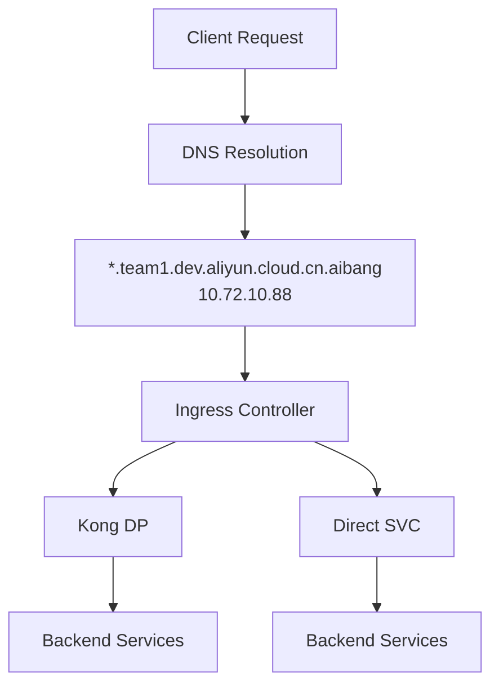
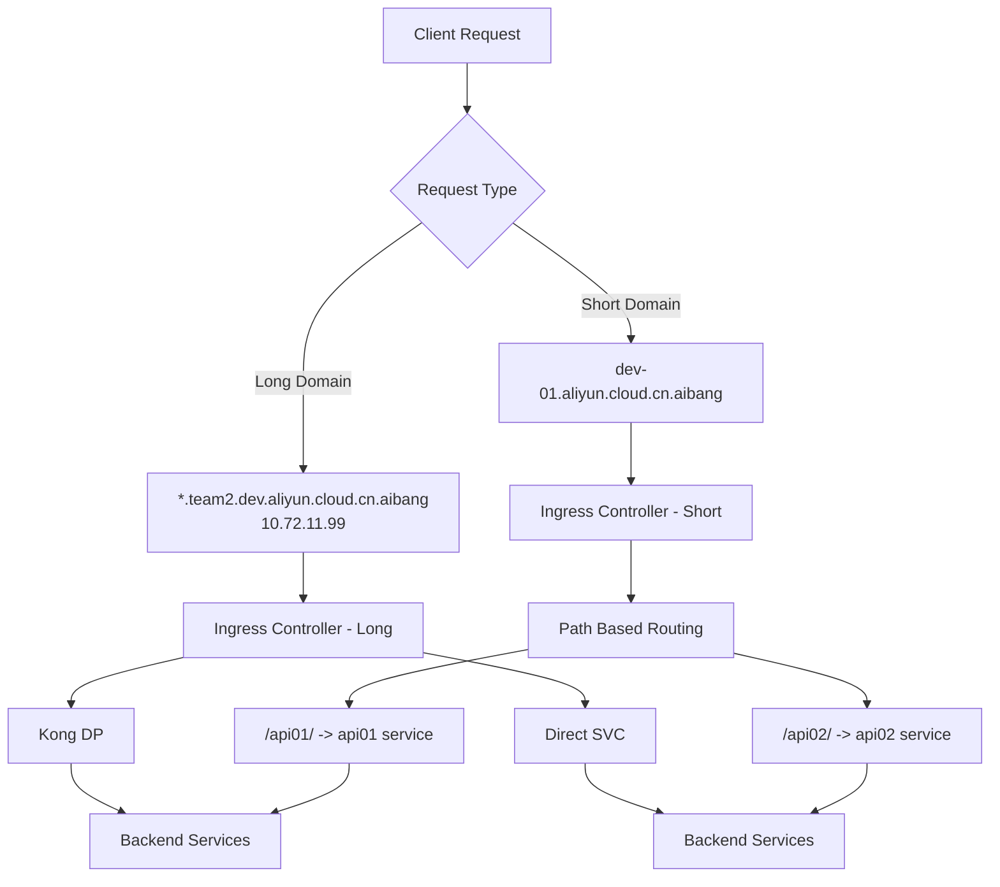
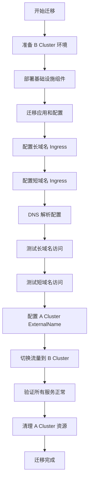

根据您的迁移需求，我来详细分析迁移方案和注意事项。

## 迁移架构分析

### 当前架构 (A Cluster)



### 目标架构 (B Cluster)



## 迁移策略和方案

### 阶段1: 基础资源迁移

#### 1.1 命名空间和基础资源准备

```bash
# 创建新的命名空间
kubectl create namespace team2-services
kubectl create namespace kong-dp-team2
```

#### 1.2 Kong DP 配置迁移

```yaml
# kong-dp-configmap.yaml
apiVersion: v1
kind: ConfigMap
metadata:
  name: kong-dp-config
  namespace: kong-dp-team2
data:
  kong.conf: |
    database = off
    cluster_control_plane = kong-cp.kong-system.svc.cluster.local:8005
    cluster_server_name = kong-cp.kong-system.svc.cluster.local
```

#### 1.3 服务和部署迁移

需要批量更新所有相关资源的域名配置。

### 阶段2: Ingress 资源配置

#### 2.1 长域名 Ingress 配置

```yaml
# long-domain-ingress.yaml
apiVersion: networking.k8s.io/v1
kind: Ingress
metadata:
  name: api01-long-domain
  namespace: team2-services
  annotations:
    nginx.ingress.kubernetes.io/rewrite-target: /
    konghq.com/override: kong-dp-team2
spec:
  ingressClassName: nginx
  tls:
    - hosts:
        - api01.team2.dev.aliyun.cloud.cn.aibang
      secretName: team2-tls-secret
  rules:
    - host: api01.team2.dev.aliyun.cloud.cn.aibang
      http:
        paths:
          - path: /
            pathType: Prefix
            backend:
              service:
                name: api01-service
                port:
                  number: 80
---
apiVersion: networking.k8s.io/v1
kind: Ingress
metadata:
  name: api02-long-domain
  namespace: team2-services
spec:
  ingressClassName: nginx
  tls:
    - hosts:
        - api02.team2.dev.aliyun.cloud.cn.aibang
      secretName: team2-tls-secret
  rules:
    - host: api02.team2.dev.aliyun.cloud.cn.aibang
      http:
        paths:
          - path: /
            pathType: Prefix
            backend:
              service:
                name: api02-service
                port:
                  number: 80
```

#### 2.2 短域名 Ingress 配置

```yaml
# short-domain-ingress.yaml
apiVersion: networking.k8s.io/v1
kind: Ingress
metadata:
  name: short-domain-gateway
  namespace: team2-services
  annotations:
    nginx.ingress.kubernetes.io/rewrite-target: /$2
    nginx.ingress.kubernetes.io/configuration-snippet: |
      rewrite ^(/api01)$ $1/ redirect;
      rewrite ^(/api02)$ $1/ redirect;
spec:
  ingressClassName: nginx
  tls:
    - hosts:
        - dev-01.aliyun.cloud.cn.aibang
      secretName: short-domain-tls-secret
  rules:
    - host: dev-01.aliyun.cloud.cn.aibang
      http:
        paths:
          - path: /api01(/|$)(.*)
            pathType: Prefix
            backend:
              service:
                name: api01-service
                port:
                  number: 80
          - path: /api02(/|$)(.*)
            pathType: Prefix
            backend:
              service:
                name: api02-service
                port:
                  number: 80
```

### 阶段3: External Name 服务配置 (A Cluster)

在 A Cluster 中创建 ExternalName 服务进行流量转发：

```yaml
# external-name-services.yaml (部署到 A Cluster)
apiVersion: v1
kind: Service
metadata:
  name: api01-redirect
  namespace: default
spec:
  type: ExternalName
  externalName: api01.team2.dev.aliyun.cloud.cn.aibang
  ports:
    - port: 80
      targetPort: 80
      protocol: TCP
    - port: 443
      targetPort: 443
      protocol: TCP
---
apiVersion: v1
kind: Service
metadata:
  name: api02-redirect
  namespace: default
spec:
  type: ExternalName
  externalName: api02.team2.dev.aliyun.cloud.cn.aibang
  ports:
    - port: 80
      targetPort: 80
      protocol: TCP
    - port: 443
      targetPort: 443
      protocol: TCP
```

更新 A Cluster 的 Ingress：

```yaml
# updated-a-cluster-ingress.yaml
apiVersion: networking.k8s.io/v1
kind: Ingress
metadata:
  name: api01-redirect-ingress
  namespace: default
spec:
  ingressClassName: nginx
  rules:
    - host: api01.team1.dev.aliyun.cloud.cn.aibang
      http:
        paths:
          - path: /
            pathType: Prefix
            backend:
              service:
                name: api01-redirect
                port:
                  number: 80
```

## 关键注意事项

### 1. TLS 证书管理

```bash
# 生成新的证书或复制现有证书
kubectl get secret team1-tls-secret -o yaml > team1-tls.yaml
# 修改 namespace 和 secret name 后应用到 B Cluster
kubectl apply -f team2-tls.yaml
```

### 2. DNS 配置更新

| 域名                                | 目标IP      | 状态           |
| ----------------------------------- | ----------- | -------------- |
| \*.team2.dev.aliyun.cloud.cn.aibang | 10.72.11.99 | 新增           |
| dev-01.aliyun.cloud.cn.aibang       | 10.72.11.99 | 新增           |
| \*.team1.dev.aliyun.cloud.cn.aibang | 10.72.10.88 | 保持(临时转发) |

### 3. Kong DP 配置注意事项

```yaml
# kong-plugin-config.yaml
apiVersion: configuration.konghq.com/v1
kind: KongPlugin
metadata:
  name: rate-limiting
config:
  minute: 100
  hour: 1000
plugin: rate-limiting
```

### 4. 服务发现和健康检查

```yaml
# health-check-service.yaml
apiVersion: v1
kind: Service
metadata:
  name: api01-service
  namespace: team2-services
  annotations:
    service.beta.kubernetes.io/aws-load-balancer-healthcheck-path: "/health"
    service.beta.kubernetes.io/aws-load-balancer-healthcheck-interval: "10"
spec:
  selector:
    app: api01
  ports:
    - port: 80
      targetPort: 8080
  type: ClusterIP
```

## 迁移步骤流程



## 风险控制和回滚方案

### 1. 分阶段验证脚本

```bash
#!/bin/bash
# migration-verify.sh

echo "验证长域名访问..."
curl -k https://api01.team2.dev.aliyun.cloud.cn.aibang/health
curl -k https://api02.team2.dev.aliyun.cloud.cn.aibang/health

echo "验证短域名访问..."
curl -k https://dev-01.aliyun.cloud.cn.aibang/api01/health
curl -k https://dev-01.aliyun.cloud.cn.aibang/api02/health

echo "验证 ExternalName 转发..."
curl -k https://api01.team1.dev.aliyun.cloud.cn.aibang/health
```

### 2. 回滚策略

如果出现问题，可以快速修改 A Cluster 的 Ingress，直接指向原始服务：

```bash
kubectl patch ingress api01-redirect-ingress -p '{"spec":{"rules":[{"host":"api01.team1.dev.aliyun.cloud.cn.aibang","http":{"paths":[{"path":"/","pathType":"Prefix","backend":{"service":{"name":"api01-original-service","port":{"number":80}}}}]}}]}}'
```

这个方案确保了平滑迁移，同时为长期的短域名+路径访问模式做好了准备。​​​​​​​​​​​​​​​​
