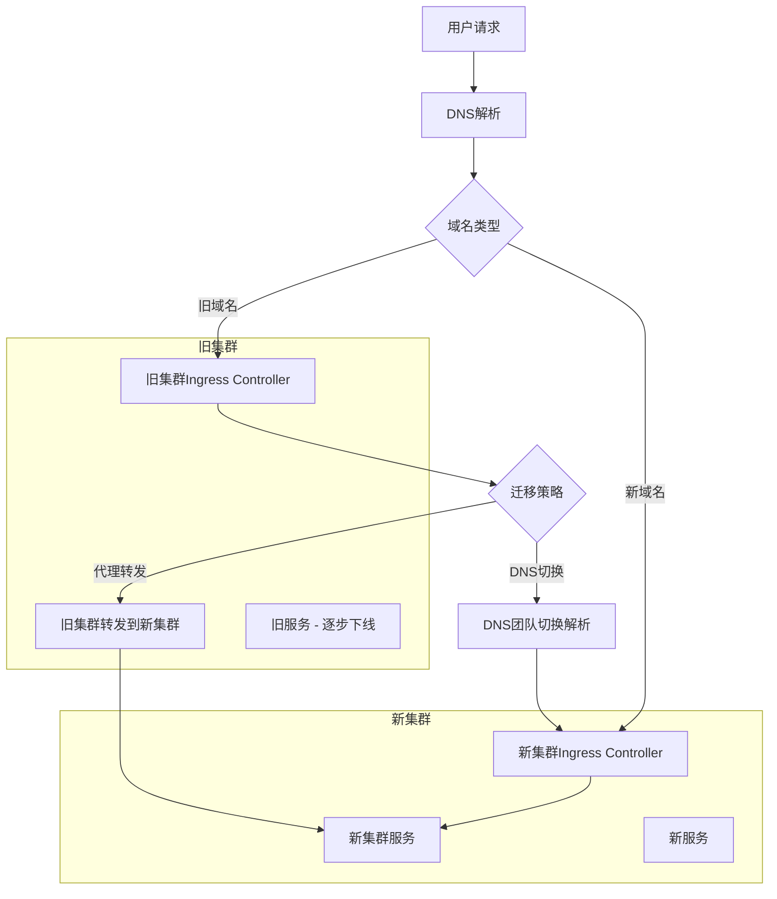

# summary
- The biggest problem with this method is that we have to use the original domain name and then directly translate it into the original language. We can't use our own domain name. 
- So if you use the old name, it doesn't look like it's working in our project. And then there's no corresponding signature. This is a display problem. 
- If we find a network team to help us switch DNS, they can actually roll back directly. So this risk can be reduced. But if we use our own DNS, we can configure the transfer. In this way, the network team will not intervene. 
- There is a solution to this problem. We can listen to the new song directly during the creation process. This will be a solution to the problem. We can use the new song directly in the future. 
- if we using ExternalName this method. The advantage of this is that we can directly use the new Domain in the new cluster. In the future, when deleting old cluster it does not affect anything in my feature.
- 在新集群中，需要为新域名配置对应的证书（通过cert-manager或手动）

```
我现在做的事情是要做k8s集群的迁移
假设我现在有一个旧的集群在这个旧的k8s 集群里面 我安装 了ingress controller 在Kube-system 这个命名空间下 然后我对应的服务会在其他的，比如说另外一个name space里面 然后后面跟对应的deployment services 
我现在新建了一个集群，然后的目的就是把运行在旧集群所有的资源迁移到新的集群
我现在希望访问到旧集群 Ingress Controller 上面的请求，能够通过一种配置跳转到我新的集群里面。因为我们这边做了 DNS 的限制，我不能在旧集群的 DNS 的名字上面做更多的工作，比如说做 CNAME 的解析或者 A NAME 的重新指向。

旧集群对应的DNS
然后teamname.dev.aliyun.intracloud.cn.aibang 下的
*.teamname.dev.aliyun.intracloud.cn.aibang 
api-name01.teamname.dev.aliyun.intracloud.cn.aibang. 都是类似这样的域名
如果我搭建另一个集群,即使把原来的配置文件或者域名直接拿过来到新的集群,那么应该是不能工作的?
因为这个集群默认要使用的域名是这样的kong.dev.aliyun.intracloud.cn.aibang
对应多用户是*.kong.dev.aliyun.intracloud.cn.aibang
另外我如果如果能找域名管理团队将*.teamname.dev.aliyun.intracloud.cn.aibang 对应的入口全部解析到我新的工程,那么在新工程里面的Ingres部分我应该做哪些工作呢?
这个是我的旧集群里面一个API域名服务的的典型配置
```

```yaml

apiVersion: networking.k8s.io/v1

kind: Ingress

metadata:

  name: bbdm

  namespace: aibang-1111111111-bbdm

  creationTimestamp: '2025-06-03T13:47:19Z'

  generation: 1

  labels:

    app.kubernetes.io/instance: api-name01

  managedFields:

    - apiVersion: networking.k8s.io/v1

      fieldsType: FieldsV1

      fieldsV1:

        f:metadata:

          f:annotations:

            f:kubectl.kubernetes.io/last-applied-configuration: 0

          f:labels:

            f:app.kubernetes.io/instance: 0

        f:spec:

          f:rules: {}

      manager: argocd-controller

      operation: Update

      time: '2025-06-03T13:47:19Z'

    - apiVersion: networking.k8s.io/v1

      fieldsType: FieldsV1

      fieldsV1:

        f:status:

          f:loadBalancer:

          f:ingress: {}

      manager: nginx-ingress-controller

      operation: Update

      subresource: status

      time: '2025-06-03T13:47:38Z'

spec:

  ingressClassName: nginx

  rules:

    - host: api-name01.teamname.dev.aliyun.intracloud.cn.aibang

      http:

        paths:

          - backend:

              service:

                name: bbdm-api

                port:

                  number: 8078

            path: /

            pathType: ImplementationSpecific

    - host: api-name01.01.teamname.dev.aliyun.intracloud.cn.aibang

      http:

        paths:

          - backend:

              service:

                name: bbdm-api

                port:

                  number: 8078

            path: /

            pathType: ImplementationSpecific

status:

  loadBalancer:

    ingress:

      - ip: 10.190.192.3

```


好的，我们来拆解你的场景。你的目标是 **K8s 集群迁移**，要求在迁移期间保持原有域名不变，并且最终流量能打到新集群。你遇到的关键点在于：

- **DNS 不能自由修改**（比如不能直接 CNAME 到新的入口）。
    
- **旧集群 Ingress Controller 域名和新集群域名模式不同**。
    
- **Ingress 规则里绑定的 host 必须和 DNS 保持一致，否则证书/路由都会失效**。
    

  

下面我分两种方案帮你分析。

---

### **1. 如果**  **DNS 不能调整**

  

在这种情况下，你必须保证 **旧集群入口依然生效**。思路是把旧集群的 Ingress Controller 当成一个 **反向代理/转发器**，请求打到旧集群入口，再跳转到新集群。

  

做法：

1. 保留旧集群的 Ingress Controller（比如 Nginx）。
    
2. 在旧集群中，把所有原有 API 的 Ingress 改为指向新集群的 Service 地址。
    
    - 新集群需要暴露一个统一的入口（Ingress Controller LB IP 或 NodePort + LB）。
        
    - 旧集群的 Ingress backend 不再指向本地 Service，而是指向新集群的 **ExternalName Service** 或 Nginx 反代。
        
    

  

典型配置（旧集群 → 新集群）：

```
apiVersion: v1
kind: Service
metadata:
  name: bbdm-api-upstream
  namespace: aibang-1111111111-bbdm
spec:
  type: ExternalName
  externalName: bbdm-api.newcluster.svc.cluster.local  # 指向新集群暴露的地址
  ports:
    - port: 8078
      protocol: TCP
```

Ingress 规则保持原有 DNS host，不改：

```
spec:
  ingressClassName: nginx
  rules:
    - host: api-name01.teamname.dev.aliyun.intracloud.cn.aibang
      http:
        paths:
          - path: /
            pathType: ImplementationSpecific
            backend:
              service:
                name: bbdm-api-upstream
                port:
                  number: 8078
```

这样客户端访问 api-name01.teamname.dev.aliyun.intracloud.cn.aibang → 旧 Ingress → 转发到新集群。

  

优点：DNS 不变，业务无感知迁移。

缺点：流量绕路（旧集群多一跳），延迟略增加。

---

### **2. 如果** **DNS 可以调整**

  

比如你能找域名团队，把：

```
*.teamname.dev.aliyun.intracloud.cn.aibang
```

直接解析到新集群的 Ingress LB（新 IP）。

  

这种情况下，你要做的就是在 **新集群**里保证 Ingress 配置和旧集群一致。

  

操作步骤：

1. 在新集群安装 Ingress Controller（nginx 或 kong）。
    
2. 确保新集群里 Ingress host 保持和旧集群一致，比如：
    

```
spec:
  ingressClassName: nginx
  rules:
    - host: api-name01.teamname.dev.aliyun.intracloud.cn.aibang
      http:
        paths:
          - path: /
            pathType: ImplementationSpecific
            backend:
              service:
                name: bbdm-api
                port:
                  number: 8078
```

3. 部署应用、Service 与 Ingress 完整同步过去。
    
4. 域名切换到新集群 LB（由域名团队操作）。
    

  

这样客户端请求直接落到新集群，不再经过旧集群。

  

优点：性能最佳，架构更干净。

缺点：需要域名团队支持。

---

### **流程对比图**

```
graph TD
    subgraph Old Cluster
        A[Client Request] --> B[Old Ingress Controller]
    end

    subgraph New Cluster
        C[New Ingress Controller] --> D[New Service] --> E[New Deployment/Pod]
    end

    B --方案1: 反向代理--> C
    A --方案2: DNS切换--> C
```

---

### **总结**

- **如果 DNS 不可动**：在旧集群 Ingress 中配置反向代理/ExternalName，把流量转发到新集群。
    
- **如果 DNS 可动**：直接让域名解析到新集群入口，新集群中保证 Ingress host 与旧集群一致即可。
    

  

👉 你的问题里提到新集群默认使用的 *.kong.dev.aliyun.intracloud.cn.aibang 域名模式，这只是新 Ingress Controller 默认生成的 **外部 LB 域名**，**不影响你手动指定 host**。所以在新集群里，你完全可以继续写 api-name01.teamname.dev.aliyun.intracloud.cn.aibang，只要 DNS 指过去，它就能工作。

---

要不要我帮你写一份 **完整迁移步骤清单**（包含两个方案的详细命令和注意点）？

好的 👍

下面我给你整理 **完整迁移步骤清单（方案二：DNS 切换到新集群）**，只包含第二个方案，适合你让域名管理团队把

```
*.teamname.dev.aliyun.intracloud.cn.aibang
```

切换到新集群的场景。

---

## **🚀 K8s 集群迁移步骤清单（方案二：DNS 切换）**

  

### **1. 前期准备**

- 确认新集群已创建，并能访问。
    
- 确认旧集群 Ingress Controller 当前入口域名（DNS 指向的 LB IP）。
    
- 获取域名管理团队支持，准备在最终阶段把 *.teamname.dev.aliyun.intracloud.cn.aibang 切换到新集群 LB IP。
    

---

### **2. 新集群环境准备**

```
# 切换到新集群上下文
kubectl config use-context new-cluster

# 创建所需 namespace（和旧集群保持一致）
kubectl create namespace aibang-1111111111-bbdm
```

- 安装 Ingress Controller（以 Nginx 为例）：
    

```
helm repo add ingress-nginx https://kubernetes.github.io/ingress-nginx
helm repo update

helm install ingress-nginx ingress-nginx/ingress-nginx \
  --namespace kube-system \
  --set controller.service.type=LoadBalancer
```

- 确认新集群 Ingress Controller 有一个外部负载均衡 IP：
    

```
kubectl get svc -n kube-system ingress-nginx-controller
```

记录 EXTERNAL-IP，这个就是新集群的对外入口。

---

### **3. 资源迁移**

  

把旧集群中的 Deployment、Service、ConfigMap、Secret、Ingress 等 YAML 导出并应用到新集群。

```
# 在旧集群导出
kubectl config use-context old-cluster
kubectl get deploy,svc,cm,secret,ing -n aibang-1111111111-bbdm -o yaml > resources.yaml

# 在新集群应用
kubectl config use-context new-cluster
kubectl apply -f resources.yaml
```

注意事项：

- Ingress 的 spec.rules.host 保持和旧集群完全一致，比如：
    

```
spec:
  ingressClassName: nginx
  rules:
    - host: api-name01.teamname.dev.aliyun.intracloud.cn.aibang
      http:
        paths:
          - path: /
            pathType: ImplementationSpecific
            backend:
              service:
                name: bbdm-api
                port:
                  number: 8078
```

- 不要改成 *.kong.dev.aliyun.intracloud.cn.aibang，这个是 Controller 默认域名，你的业务必须用原来的域名。
    

---

### **4. 验证新集群服务**

1. 通过修改本地 /etc/hosts，模拟域名解析到新集群 LB：
    

```
echo "<NEW_LB_IP> api-name01.teamname.dev.aliyun.intracloud.cn.aibang" | sudo tee -a /etc/hosts
```

1.   
    
2. 本地发请求验证：
    

```
curl -v https://api-name01.teamname.dev.aliyun.intracloud.cn.aibang
```

2.   
    
3. 确认返回结果和旧集群一致。
    

---

### **5. 切换 DNS**

- 提交给域名团队，把：
    

```
*.teamname.dev.aliyun.intracloud.cn.aibang
```

解析到新集群的 EXTERNAL-IP（即新 Ingress Controller LB）。

---

### **6. 切换后观察**

- 切换完成后，持续监控新集群 Ingress Controller 日志：
    

```
kubectl logs -n kube-system deploy/ingress-nginx-controller
```

-   
    
- 监控 Pod readiness：
    

```
kubectl get pods -n aibang-1111111111-bbdm -w
```

-   
    
- 确保没有 502/503 错误。
    

---

### **7. 回滚方案**

- 如果切换后出现问题，可以立即让域名团队恢复 DNS 到旧集群的 LB IP。
    
- 业务即可回退，不影响原有服务。
    

---

### **✅ 总结**

- 新集群 **Ingress host 必须保持和旧集群一致**，不要使用默认的 *.kong.dev.aliyun...。
    
- 在切换 DNS 前，一定要通过 /etc/hosts 完成灰度验证。
    
- 切换 DNS 后，用户透明感知不到集群迁移。
    

---

要不要我帮你写一个 **迁移 checklist 表格**（每一步状态确认项），方便你在执行迁移时逐条勾选？
好的 👍 我帮你整理一份 **迁移 Checklist 表格**，你可以直接用在实际迁移时逐条勾选，确保不遗漏关键步骤。

---

## **📝 K8s 集群迁移 Checklist（方案二：DNS 切换）**

| **步骤**     | **操作项**                                                         | **状态** |
| ---------- | --------------------------------------------------------------- | ------ |
| **准备阶段**   | 确认新集群已创建并可访问                                                    | ☐      |
|            | 获取旧集群 Ingress Controller 的 LB IP                                | ☐      |
|            | 与域名团队确认可操作 *.teamname.dev.aliyun.intracloud.cn.aibang 的解析       | ☐      |
| **新集群准备**  | 创建所需 namespace，与旧集群保持一致                                         | ☐      |
|            | 安装 Ingress Controller（Nginx/Kong 等）                             | ☐      |
|            | 确认新集群 Ingress Controller 分配到 EXTERNAL-IP                        | ☐      |
| **资源迁移**   | 从旧集群导出 Deployment/Service/ConfigMap/Secret/Ingress              | ☐      |
|            | 修改 Ingress 规则，确保 spec.rules.host 保持原有域名                         | ☐      |
|            | 将资源应用到新集群                                                       | ☐      |
| **验证阶段**   | 本地通过 /etc/hosts 将业务域名指向新集群 LB IP                                | ☐      |
|            | 测试 curl 请求，确认返回结果正确                                             | ☐      |
|            | 检查新集群 Pod readiness/日志，确保应用健康                                   | ☐      |
| **DNS 切换** | 通知域名团队将 *.teamname.dev.aliyun.intracloud.cn.aibang 解析到新集群 LB IP | ☐      |
|            | 切换后验证服务正常，确认无 502/503 错误                                        | ☐      |
| **切换后监控**  | 监控新集群 Ingress Controller 日志                                     | ☐      |
|            | 监控新集群 Pod 状态                                                    | ☐      |
|            | 持续观察业务接口性能和错误率                                                  | ☐      |
| **回滚预案**   | 预留旧集群不下线，确保 DNS 可回退                                             | ☐      |
|            | 出现问题时立即通知域名团队恢复到旧集群 LB IP                                       | ☐      |

---


# Claude 
我来分析这个K8S集群迁移的场景和解决方案。

## 问题分析

你的情况确实比较复杂：

1. **旧集群域名**: `*.teamname.dev.aliyun.intracloud.cn.aibang`
2. **新集群域名**: `*.kong.dev.aliyun.intracloud.cn.aibang`
3. **DNS限制**: 无法修改旧集群DNS解析
4. **目标**: 将旧集群流量逐步迁移到新集群

## 迁移流程图



## 解决方案

### 方案1: DNS解析切换 (推荐)

如果能协调DNS团队将`*.teamname.dev.aliyun.intracloud.cn.aibang`解析到新集群，你需要在新集群做以下配置：

#### 1. 新集群Ingress配置

```yaml
apiVersion: networking.k8s.io/v1
kind: Ingress
metadata:
  name: bbdm-migrated
  namespace: aibang-1111111111-bbdm
  annotations:
    nginx.ingress.kubernetes.io/rewrite-target: /
spec:
  ingressClassName: nginx
  rules:
    # 保持原有域名配置
    - host: api-name01.teamname.dev.aliyun.intracloud.cn.aibang
      http:
        paths:
          - backend:
              service:
                name: bbdm-api
                port:
                  number: 8078
            path: /
            pathType: ImplementationSpecific
    - host: api-name01.01.teamname.dev.aliyun.intracloud.cn.aibang
      http:
        paths:
          - backend:
              service:
                name: bbdm-api
                port:
                  number: 8078
            path: /
            pathType: ImplementationSpecific
    # 可选：同时支持新域名
    - host: api-name01.kong.dev.aliyun.intracloud.cn.aibang
      http:
        paths:
          - backend:
              service:
                name: bbdm-api
                port:
                  number: 8078
            path: /
            pathType: ImplementationSpecific
```

#### 2. 迁移步骤

|步骤|操作|验证方法|
|---|---|---|
|1|在新集群部署所有服务|`kubectl get pods -n <namespace>`|
|2|配置新集群Ingress使用旧域名|`kubectl get ingress -A`|
|3|测试新集群服务可用性|内部测试或临时hosts文件|
|4|协调DNS团队切换解析|`nslookup api-name01.teamname.dev...`|
|5|监控流量和错误日志|Ingress Controller和应用日志|
|6|确认稳定后下线旧集群|监控一段时间无流量后清理|

### 方案2: 旧集群代理转发

如果DNS无法立即切换，可以在旧集群配置反向代理：

#### 1. 旧集群代理配置

```yaml
apiVersion: v1
kind: Service
metadata:
  name: new-cluster-proxy
  namespace: aibang-1111111111-bbdm
spec:
  type: ExternalName
  externalName: <new-cluster-ingress-ip>
  ports:
    - port: 80
      targetPort: 80
    - port: 443
      targetPort: 443
---
apiVersion: networking.k8s.io/v1
kind: Ingress
metadata:
  name: bbdm-proxy
  namespace: aibang-1111111111-bbdm
  annotations:
    nginx.ingress.kubernetes.io/upstream-vhost: api-name01.kong.dev.aliyun.intracloud.cn.aibang
    nginx.ingress.kubernetes.io/backend-protocol: "HTTP"
spec:
  ingressClassName: nginx
  rules:
    - host: api-name01.teamname.dev.aliyun.intracloud.cn.aibang
      http:
        paths:
          - backend:
              service:
                name: new-cluster-proxy
                port:
                  number: 80
            path: /
            pathType: ImplementationSpecific
```

#### 2. 使用Kong进行流量分流

如果新集群使用Kong作为Ingress Controller：

```yaml
apiVersion: configuration.konghq.com/v1
kind: KongIngress
metadata:
  name: bbdm-upstream
  namespace: aibang-1111111111-bbdm
upstream:
  host_header: api-name01.teamname.dev.aliyun.intracloud.cn.aibang
---
apiVersion: networking.k8s.io/v1
kind: Ingress
metadata:
  name: bbdm-kong
  namespace: aibang-1111111111-bbdm
  annotations:
    konghq.com/ingress.class: kong
    configuration.konghq.com/ingress: bbdm-upstream
spec:
  rules:
    - host: api-name01.teamname.dev.aliyun.intracloud.cn.aibang
      http:
        paths:
          - backend:
              service:
                name: bbdm-api
                port:
                  number: 8078
            path: /
            pathType: ImplementationSpecific
```

## 关键注意事项

### 1. SSL证书处理

```yaml
apiVersion: networking.k8s.io/v1
kind: Ingress
metadata:
  name: bbdm-with-tls
  annotations:
    cert-manager.io/cluster-issuer: letsencrypt-prod
spec:
  tls:
    - hosts:
        - api-name01.teamname.dev.aliyun.intracloud.cn.aibang
        - api-name01.01.teamname.dev.aliyun.intracloud.cn.aibang
      secretName: bbdm-tls-secret
  rules:
    # ... rules配置
```

### 2. 健康检查和监控

```bash
# 检查Ingress状态
kubectl get ingress -A -o wide

# 检查Ingress Controller日志
kubectl logs -f -n ingress-nginx deployment/nginx-ingress-controller

# 测试域名解析
nslookup api-name01.teamname.dev.aliyun.intracloud.cn.aibang

# 测试HTTP连接
curl -v https://api-name01.teamname.dev.aliyun.intracloud.cn.aibang
```

### 3. 回滚计划


## 总结

**推荐使用方案1（DNS切换）**，因为：

- 配置简单，维护成本低
- 性能损耗最小
- 便于后续管理

关键是与DNS管理团队协调，确保在新集群准备就绪后能够快速切换解析，同时准备好回滚方案以应对突发问题。