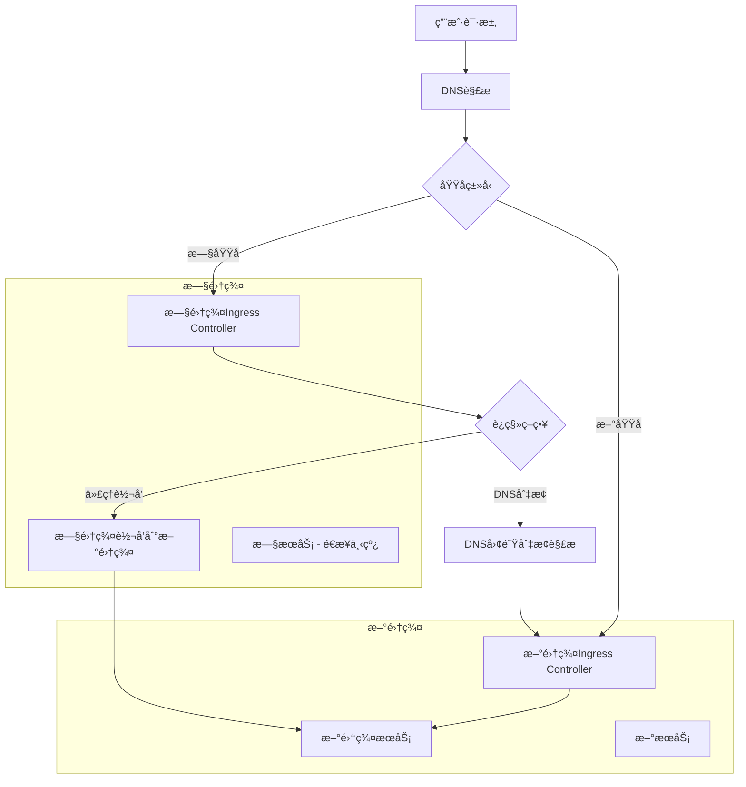
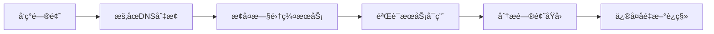

# summary
- The biggest problem with this method is that we have to use the original domain name and then directly translate it into the original language. We can't use our own domain name. 
- So if you use the old name, it doesn't look like it's working in our project. And then there's no corresponding signature. This is a display problem. 
- If we find a network team to help us switch DNS, they can actually roll back directly. So this risk can be reduced. But if we use our own DNS, we can configure the transfer. In this way, the network team will not intervene. 
- There is a solution to this problem. We can listen to the new song directly during the creation process. This will be a solution to the problem. We can use the new song directly in the future. 
- if we using ExternalName this method. The advantage of this is that we can directly use the new Domain in the new cluster. In the future, when deleting old cluster it does not affect anything in my feature.
- 在新集群中，需è¦ä¸ºæ–°åŸŸåé…置对应的è¯ä¹¦ï¼ˆé€šè¿‡cert-manager或手动）

```
我ç°åœ¨åšçš„事情是è¦åšk8s集群的è¿ç§»
å‡è®¾æˆ‘ç°åœ¨æœ‰ä¸€ä¸ªæ—§çš„集群在这个旧的k8s é›†ç¾¤é‡Œé¢ æˆ‘å®‰è£… 了ingress controller 在Kube-system 这个命å空间下 然å我对应的æœåŠ¡ä¼šåœ¨å…¶ä»–的，比如说å¦å¤–一个name spaceé‡Œé¢ ç„¶ååé¢è·Ÿå¯¹åº”çš„deployment services 
我ç°åœ¨æ–°å»ºäº†ä¸€ä¸ªé›†ç¾¤ï¼Œç„¶å的目的就是把è¿è¡Œåœ¨æ—§é›†ç¾¤æ‰€æœ‰çš„资æºè¿ç§»åˆ°æ–°çš„集群
我ç°åœ¨å¸Œæœ›è®¿é—®åˆ°æ—§é›†ç¾¤ Ingress Controller 上é¢çš„请求，能够通过一ç§é…置跳转到我新的集群里é¢ã€‚因为我们这边åšäº† DNS çš„é™åˆ¶ï¼Œæˆ‘ä¸èƒ½åœ¨æ—§é›†ç¾¤çš„ DNS çš„å字上é¢åšæ›´å¤šçš„å·¥ä½œï¼Œæ¯”å¦‚è¯´åš CNAME 的解æ或者 A NAME çš„é‡æ–°æŒ‡å‘。

旧集群对应的DNS
然åteamname.dev.aliyun.intracloud.cn.aibang 下的
*.teamname.dev.aliyun.intracloud.cn.aibang 
api-name01.teamname.dev.aliyun.intracloud.cn.aibang. 都是类似这样的域å
如æœæˆ‘æ­å»ºå¦ä¸€ä¸ªé›†ç¾¤,å³ä½¿æŠŠåŸæ¥çš„é…置文件或者域åç›´æ¥æ‹¿è¿‡æ¥åˆ°æ–°çš„集群,那么应该是ä¸èƒ½å·¥ä½œçš„?
因为这个集群默认è¦ä½¿ç”¨çš„域å是这样的kong.dev.aliyun.intracloud.cn.aibang
对应多用户是*.kong.dev.aliyun.intracloud.cn.aibang
å¦å¤–我如æœå¦‚æœèƒ½æ‰¾åŸŸå管ç†å›¢é˜Ÿå°†*.teamname.dev.aliyun.intracloud.cn.aibang 对应的入å£å…¨éƒ¨è§£æ到我新的工程,那么在新工程里é¢çš„Ingres部分我应该åšå“ªäº›å·¥ä½œå‘¢?
这个是我的旧集群里é¢ä¸€ä¸ªAPI域åæœåŠ¡çš„çš„å…¸å‹é…ç½®
```

```yaml

apiVersion: networking.k8s.io/v1

kind: Ingress

metadata:

  name: bbdm

  namespace: aibang-1111111111-bbdm

  creationTimestamp: '2025-06-03T13:47:19Z'

  generation: 1

  labels:

    app.kubernetes.io/instance: api-name01

  managedFields:

    - apiVersion: networking.k8s.io/v1

      fieldsType: FieldsV1

      fieldsV1:

        f:metadata:

          f:annotations:

            f:kubectl.kubernetes.io/last-applied-configuration: 0

          f:labels:

            f:app.kubernetes.io/instance: 0

        f:spec:

          f:rules: {}

      manager: argocd-controller

      operation: Update

      time: '2025-06-03T13:47:19Z'

    - apiVersion: networking.k8s.io/v1

      fieldsType: FieldsV1

      fieldsV1:

        f:status:

          f:loadBalancer:

          f:ingress: {}

      manager: nginx-ingress-controller

      operation: Update

      subresource: status

      time: '2025-06-03T13:47:38Z'

spec:

  ingressClassName: nginx

  rules:

    - host: api-name01.teamname.dev.aliyun.intracloud.cn.aibang

      http:

        paths:

          - backend:

              service:

                name: bbdm-api

                port:

                  number: 8078

            path: /

            pathType: ImplementationSpecific

    - host: api-name01.01.teamname.dev.aliyun.intracloud.cn.aibang

      http:

        paths:

          - backend:

              service:

                name: bbdm-api

                port:

                  number: 8078

            path: /

            pathType: ImplementationSpecific

status:

  loadBalancer:

    ingress:

      - ip: 10.190.192.3

```


好的，我们æ¥æ‹†è§£ä½ çš„场景。你的目标是 **K8s 集群è¿ç§»**，è¦æ±‚在è¿ç§»æœŸé—´ä¿æŒåŸæœ‰åŸŸåä¸å˜ï¼Œå¹¶ä¸”最终æµé‡èƒ½æ‰“到新集群。你é‡åˆ°çš„关键点在äºï¼š

- **DNS ä¸èƒ½è‡ªç”±ä¿®æ”¹**（比如ä¸èƒ½ç›´æ¥ CNAME 到新的入å£ï¼‰ã€‚
    
- **旧集群 Ingress Controller 域å和新集群域å模å¼ä¸åŒ**。
    
- **Ingress 规则里绑定的 host 必须和 DNS ä¿æŒä¸€è‡´ï¼Œå¦åˆ™è¯ä¹¦/路由都会失效**。
    

  

下é¢æˆ‘分两ç§æ–¹æ¡ˆå¸®ä½ åˆ†æ。

---

### **1. 如æœ**  **DNS ä¸èƒ½è°ƒæ•´**

  

在这ç§æƒ…况下，你必须ä¿è¯ **旧集群入å£ä¾ç„¶ç”Ÿæ•ˆ**。æ€è·¯æ˜¯æŠŠæ—§é›†ç¾¤çš„ Ingress Controller 当æˆä¸€ä¸ª **åå‘代ç†/转å‘器**，请求打到旧集群入å£ï¼Œå†è·³è½¬åˆ°æ–°é›†ç¾¤ã€‚

  

åšæ³•ï¼š

1. ä¿ç•™æ—§é›†ç¾¤çš„ Ingress Controller（比如 Nginx）。
    
2. 在旧集群中，把所有åŸæœ‰ API çš„ Ingress 改为指å‘新集群的 Service 地å€ã€‚
    
    - 新集群需è¦æš´éœ²ä¸€ä¸ªç»Ÿä¸€çš„å…¥å£ï¼ˆIngress Controller LB IP 或 NodePort + LB）。
        
    - 旧集群的 Ingress backend ä¸å†æŒ‡å‘本地 Service，而是指å‘新集群的 **ExternalName Service** 或 Nginx å代。
        
    

  

å…¸å‹é…置（旧集群 → 新集群）：

```
apiVersion: v1
kind: Service
metadata:
  name: bbdm-api-upstream
  namespace: aibang-1111111111-bbdm
spec:
  type: ExternalName
  externalName: bbdm-api.newcluster.svc.cluster.local  # 指å‘新集群暴露的地å€
  ports:
    - port: 8078
      protocol: TCP
```

Ingress 规则ä¿æŒåŸæœ‰ DNS host，ä¸æ”¹ï¼š

```
spec:
  ingressClassName: nginx
  rules:
    - host: api-name01.teamname.dev.aliyun.intracloud.cn.aibang
      http:
        paths:
          - path: /
            pathType: ImplementationSpecific
            backend:
              service:
                name: bbdm-api-upstream
                port:
                  number: 8078
```

这样客户端访问 api-name01.teamname.dev.aliyun.intracloud.cn.aibang → æ—§ Ingress → 转å‘到新集群。

  

优点：DNS ä¸å˜ï¼Œä¸šåŠ¡æ— æ„ŸçŸ¥è¿ç§»ã€‚

缺点：æµé‡ç»•è·¯ï¼ˆæ—§é›†ç¾¤å¤šä¸€è·³ï¼‰ï¼Œå»¶è¿Ÿç•¥å¢åŠ ã€‚

---

### **2. 如æœ** **DNS å¯ä»¥è°ƒæ•´**

  

比如你能找域å团队，把：

```
*.teamname.dev.aliyun.intracloud.cn.aibang
```

ç›´æ¥è§£æ到新集群的 Ingress LB（新 IP）。

  

è¿™ç§æƒ…况下，你è¦åšçš„就是在 **新集群**里ä¿è¯ Ingress é…置和旧集群一致。

  

æ“作步骤：

1. 在新集群安装 Ingress Controller（nginx 或 kong）。
    
2. ç¡®ä¿æ–°é›†ç¾¤é‡Œ Ingress host ä¿æŒå’Œæ—§é›†ç¾¤ä¸€è‡´ï¼Œæ¯”如：
    

```
spec:
  ingressClassName: nginx
  rules:
    - host: api-name01.teamname.dev.aliyun.intracloud.cn.aibang
      http:
        paths:
          - path: /
            pathType: ImplementationSpecific
            backend:
              service:
                name: bbdm-api
                port:
                  number: 8078
```

3. 部署应用ã€Service ä¸ Ingress 完整åŒæ­¥è¿‡å»ã€‚
    
4. 域å切æ¢åˆ°æ–°é›†ç¾¤ LB（由域å团队æ“作）。
    

  

这样客户端请求直æ¥è½åˆ°æ–°é›†ç¾¤ï¼Œä¸å†ç»è¿‡æ—§é›†ç¾¤ã€‚

  

优点：性能最佳，æ¶æ„更干净。

缺点：需è¦åŸŸå团队支æŒã€‚

---

### **æµç¨‹å¯¹æ¯”图**

```
graph TD
    subgraph Old Cluster
        A[Client Request] --> B[Old Ingress Controller]
    end

    subgraph New Cluster
        C[New Ingress Controller] --> D[New Service] --> E[New Deployment/Pod]
    end

    B --方案1: åå‘代ç†--> C
    A --方案2: DNS切æ¢--> C
```

---

### **总结**

- **å¦‚æœ DNS ä¸å¯åŠ¨**：在旧集群 Ingress 中é…ç½®åå‘代ç†/ExternalName，把æµé‡è½¬å‘到新集群。
    
- **å¦‚æœ DNS å¯åŠ¨**：直æ¥è®©åŸŸå解æ到新集群入å£ï¼Œæ–°é›†ç¾¤ä¸­ä¿è¯ Ingress host ä¸æ—§é›†ç¾¤ä¸€è‡´å³å¯ã€‚
    

  

👉 你的问题里æ到新集群默认使用的 *.kong.dev.aliyun.intracloud.cn.aibang 域å模å¼ï¼Œè¿™åªæ˜¯æ–° Ingress Controller 默认生æˆçš„ **外部 LB 域å**，**ä¸å½±å“你手动指定 host**。所以在新集群里，你完全å¯ä»¥ç»§ç»­å†™ api-name01.teamname.dev.aliyun.intracloud.cn.aibang，åªè¦ DNS 指过å»ï¼Œå®ƒå°±èƒ½å·¥ä½œã€‚

---

è¦ä¸è¦æˆ‘帮你写一份 **完整è¿ç§»æ­¥éª¤æ¸…å•**（包å«ä¸¤ä¸ªæ–¹æ¡ˆçš„详细命令和注æ„点）？

好的 ğŸ‘

下é¢æˆ‘ç»™ä½ æ•´ç† **完整è¿ç§»æ­¥éª¤æ¸…å•ï¼ˆæ–¹æ¡ˆäºŒï¼šDNS 切æ¢åˆ°æ–°é›†ç¾¤ï¼‰**，åªåŒ…å«ç¬¬äºŒä¸ªæ–¹æ¡ˆï¼Œé€‚åˆä½ è®©åŸŸå管ç†å›¢é˜ŸæŠŠ

```
*.teamname.dev.aliyun.intracloud.cn.aibang
```

切æ¢åˆ°æ–°é›†ç¾¤çš„场景。

---

## **🚀 K8s 集群è¿ç§»æ­¥éª¤æ¸…å•ï¼ˆæ–¹æ¡ˆäºŒï¼šDNS 切æ¢ï¼‰**

  

### **1. å‰æœŸå‡†å¤‡**

- 确认新集群已创建，并能访问。
    
- 确认旧集群 Ingress Controller 当å‰å…¥å£åŸŸå（DNS 指å‘çš„ LB IP）。
    
- è·å–域å管ç†å›¢é˜Ÿæ”¯æŒï¼Œå‡†å¤‡åœ¨æœ€ç»ˆé˜¶æ®µæŠŠ *.teamname.dev.aliyun.intracloud.cn.aibang 切æ¢åˆ°æ–°é›†ç¾¤ LB IP。
    

---

### **2. 新集群ç¯å¢ƒå‡†å¤‡**

```
# 切æ¢åˆ°æ–°é›†ç¾¤ä¸Šä¸‹æ–‡
kubectl config use-context new-cluster

# 创建所需 namespace（和旧集群ä¿æŒä¸€è‡´ï¼‰
kubectl create namespace aibang-1111111111-bbdm
```

- 安装 Ingress Controller（以 Nginx 为例）：
    

```
helm repo add ingress-nginx https://kubernetes.github.io/ingress-nginx
helm repo update

helm install ingress-nginx ingress-nginx/ingress-nginx \
  --namespace kube-system \
  --set controller.service.type=LoadBalancer
```

- 确认新集群 Ingress Controller 有一个外部负载å‡è¡¡ IP：
    

```
kubectl get svc -n kube-system ingress-nginx-controller
```

记录 EXTERNAL-IP，这个就是新集群的对外入å£ã€‚

---

### **3. 资æºè¿ç§»**

  

把旧集群中的 Deploymentã€Serviceã€ConfigMapã€Secretã€Ingress ç­‰ YAML 导出并应用到新集群。

```
# 在旧集群导出
kubectl config use-context old-cluster
kubectl get deploy,svc,cm,secret,ing -n aibang-1111111111-bbdm -o yaml > resources.yaml

# 在新集群应用
kubectl config use-context new-cluster
kubectl apply -f resources.yaml
```

注æ„事项：

- Ingress çš„ spec.rules.host ä¿æŒå’Œæ—§é›†ç¾¤å®Œå…¨ä¸€è‡´ï¼Œæ¯”如：
    

```
spec:
  ingressClassName: nginx
  rules:
    - host: api-name01.teamname.dev.aliyun.intracloud.cn.aibang
      http:
        paths:
          - path: /
            pathType: ImplementationSpecific
            backend:
              service:
                name: bbdm-api
                port:
                  number: 8078
```

- ä¸è¦æ”¹æˆ *.kong.dev.aliyun.intracloud.cn.aibang，这个是 Controller 默认域å，你的业务必须用åŸæ¥çš„域å。
    

---

### **4. 验è¯æ–°é›†ç¾¤æœåŠ¡**

1. 通过修改本地 /etc/hosts，模拟域å解æ到新集群 LB：
    

```
echo "<NEW_LB_IP> api-name01.teamname.dev.aliyun.intracloud.cn.aibang" | sudo tee -a /etc/hosts
```

1.   
    
2. 本地å‘请求验è¯ï¼š
    

```
curl -v https://api-name01.teamname.dev.aliyun.intracloud.cn.aibang
```

2.   
    
3. 确认返å›ç»“æœå’Œæ—§é›†ç¾¤ä¸€è‡´ã€‚
    

---

### **5. åˆ‡æ¢ DNS**

- æ交给域å团队，把：
    

```
*.teamname.dev.aliyun.intracloud.cn.aibang
```

解æ到新集群的 EXTERNAL-IP（å³æ–° Ingress Controller LB）。

---

### **6. 切æ¢å观察**

- 切æ¢å®Œæˆå，æŒç»­ç›‘æ§æ–°é›†ç¾¤ Ingress Controller 日志：
    

```
kubectl logs -n kube-system deploy/ingress-nginx-controller
```

-   
    
- ç›‘æ§ Pod readiness：
    

```
kubectl get pods -n aibang-1111111111-bbdm -w
```

-   
    
- ç¡®ä¿æ²¡æœ‰ 502/503 错误。
    

---

### **7. å›æ»šæ–¹æ¡ˆ**

- 如æœåˆ‡æ¢å出ç°é—®é¢˜ï¼Œå¯ä»¥ç«‹å³è®©åŸŸå团队æ¢å¤ DNS 到旧集群的 LB IP。
    
- 业务å³å¯å›é€€ï¼Œä¸å½±å“åŸæœ‰æœåŠ¡ã€‚
    

---

### **✅ 总结**

- 新集群 **Ingress host å¿…é¡»ä¿æŒå’Œæ—§é›†ç¾¤ä¸€è‡´**，ä¸è¦ä½¿ç”¨é»˜è®¤çš„ *.kong.dev.aliyun...。
    
- åœ¨åˆ‡æ¢ DNS å‰ï¼Œä¸€å®šè¦é€šè¿‡ /etc/hosts 完æˆç°åº¦éªŒè¯ã€‚
    
- åˆ‡æ¢ DNS å，用户é€æ˜æ„ŸçŸ¥ä¸åˆ°é›†ç¾¤è¿ç§»ã€‚
    

---

è¦ä¸è¦æˆ‘帮你写一个 **è¿ç§» checklist 表格**（æ¯ä¸€æ­¥çŠ¶æ€ç¡®è®¤é¡¹ï¼‰ï¼Œæ–¹ä¾¿ä½ åœ¨æ‰§è¡Œè¿ç§»æ—¶é€æ¡å‹¾é€‰ï¼Ÿ
好的 👠我帮你整ç†ä¸€ä»½ **è¿ç§» Checklist 表格**，你å¯ä»¥ç›´æ¥ç”¨åœ¨å®é™…è¿ç§»æ—¶é€æ¡å‹¾é€‰ï¼Œç¡®ä¿ä¸é—æ¼å…³é”®æ­¥éª¤ã€‚

---

## **📠K8s 集群è¿ç§» Checklist（方案二：DNS 切æ¢ï¼‰**

| **步骤**     | **æ“作项**                                                         | **状æ€** |
| ---------- | --------------------------------------------------------------- | ------ |
| **准备阶段**   | 确认新集群已创建并å¯è®¿é—®                                                    | ☠     |
|            | è·å–旧集群 Ingress Controller çš„ LB IP                                | ☠     |
|            | ä¸åŸŸå团队确认å¯æ“作 *.teamname.dev.aliyun.intracloud.cn.aibang çš„è§£æ       | ☠     |
| **新集群准备**  | 创建所需 namespace，ä¸æ—§é›†ç¾¤ä¿æŒä¸€è‡´                                         | ☠     |
|            | 安装 Ingress Controller（Nginx/Kong 等）                             | ☠     |
|            | 确认新集群 Ingress Controller 分é…到 EXTERNAL-IP                        | ☠     |
| **资æºè¿ç§»**   | ä»æ—§é›†ç¾¤å¯¼å‡º Deployment/Service/ConfigMap/Secret/Ingress              | ☠     |
|            | 修改 Ingress è§„åˆ™ï¼Œç¡®ä¿ spec.rules.host ä¿æŒåŸæœ‰åŸŸå                         | ☠     |
|            | 将资æºåº”用到新集群                                                       | ☠     |
| **验è¯é˜¶æ®µ**   | 本地通过 /etc/hosts 将业务域å指å‘新集群 LB IP                                | ☠     |
|            | 测试 curl 请求，确认返å›ç»“æœæ­£ç¡®                                             | ☠     |
|            | 检查新集群 Pod readiness/日志，确ä¿åº”用å¥åº·                                   | ☠     |
| **DNS 切æ¢** | 通知域å团队将 *.teamname.dev.aliyun.intracloud.cn.aibang 解æ到新集群 LB IP | ☠     |
|            | 切æ¢å验è¯æœåŠ¡æ­£å¸¸ï¼Œç¡®è®¤æ—  502/503 错误                                        | ☠     |
| **切æ¢å监æ§**  | 监æ§æ–°é›†ç¾¤ Ingress Controller 日志                                     | ☠     |
|            | 监æ§æ–°é›†ç¾¤ Pod çŠ¶æ€                                                    | ☠     |
|            | æŒç»­è§‚察业务æ¥å£æ€§èƒ½å’Œé”™è¯¯ç‡                                                  | ☠     |
| **å›æ»šé¢„案**   | 预留旧集群ä¸ä¸‹çº¿ï¼Œç¡®ä¿ DNS å¯å›é€€                                             | ☠     |
|            | 出ç°é—®é¢˜æ—¶ç«‹å³é€šçŸ¥åŸŸå团队æ¢å¤åˆ°æ—§é›†ç¾¤ LB IP                                       | ☠     |

---


# Claude 
我æ¥åˆ†æ这个K8S集群è¿ç§»çš„场景和解决方案。

## 问题分æ

你的情况确å®æ¯”较å¤æ‚：

1. **旧集群域å**: `*.teamname.dev.aliyun.intracloud.cn.aibang`
2. **新集群域å**: `*.kong.dev.aliyun.intracloud.cn.aibang`
3. **DNSé™åˆ¶**: 无法修改旧集群DNS解æ
4. **目标**: 将旧集群æµé‡é€æ­¥è¿ç§»åˆ°æ–°é›†ç¾¤

## è¿ç§»æµç¨‹å›¾



## 解决方案

### 方案1: DNS解æåˆ‡æ¢ (æ¨è)

如æœèƒ½åè°ƒDNS团队将`*.teamname.dev.aliyun.intracloud.cn.aibang`解æ到新集群，你需è¦åœ¨æ–°é›†ç¾¤åšä»¥ä¸‹é…置：

#### 1. 新集群Ingressé…ç½®

```yaml
apiVersion: networking.k8s.io/v1
kind: Ingress
metadata:
  name: bbdm-migrated
  namespace: aibang-1111111111-bbdm
  annotations:
    nginx.ingress.kubernetes.io/rewrite-target: /
spec:
  ingressClassName: nginx
  rules:
    # ä¿æŒåŸæœ‰åŸŸåé…ç½®
    - host: api-name01.teamname.dev.aliyun.intracloud.cn.aibang
      http:
        paths:
          - backend:
              service:
                name: bbdm-api
                port:
                  number: 8078
            path: /
            pathType: ImplementationSpecific
    - host: api-name01.01.teamname.dev.aliyun.intracloud.cn.aibang
      http:
        paths:
          - backend:
              service:
                name: bbdm-api
                port:
                  number: 8078
            path: /
            pathType: ImplementationSpecific
    # å¯é€‰ï¼šåŒæ—¶æ”¯æŒæ–°åŸŸå
    - host: api-name01.kong.dev.aliyun.intracloud.cn.aibang
      http:
        paths:
          - backend:
              service:
                name: bbdm-api
                port:
                  number: 8078
            path: /
            pathType: ImplementationSpecific
```

#### 2. è¿ç§»æ­¥éª¤

|步骤|æ“作|验è¯æ–¹æ³•|
|---|---|---|
|1|在新集群部署所有æœåŠ¡|`kubectl get pods -n <namespace>`|
|2|é…置新集群Ingress使用旧域å|`kubectl get ingress -A`|
|3|测试新集群æœåŠ¡å¯ç”¨æ€§|内部测试或临时hosts文件|
|4|åè°ƒDNS团队切æ¢è§£æ|`nslookup api-name01.teamname.dev...`|
|5|监æ§æµé‡å’Œé”™è¯¯æ—¥å¿—|Ingress Controller和应用日志|
|6|确认稳定å下线旧集群|监æ§ä¸€æ®µæ—¶é—´æ— æµé‡å清ç†|

### 方案2: 旧集群代ç†è½¬å‘

如æœDNS无法立å³åˆ‡æ¢ï¼Œå¯ä»¥åœ¨æ—§é›†ç¾¤é…ç½®åå‘代ç†ï¼š

#### 1. 旧集群代ç†é…ç½®

```yaml
apiVersion: v1
kind: Service
metadata:
  name: new-cluster-proxy
  namespace: aibang-1111111111-bbdm
spec:
  type: ExternalName
  externalName: <new-cluster-ingress-ip>
  ports:
    - port: 80
      targetPort: 80
    - port: 443
      targetPort: 443
---
apiVersion: networking.k8s.io/v1
kind: Ingress
metadata:
  name: bbdm-proxy
  namespace: aibang-1111111111-bbdm
  annotations:
    nginx.ingress.kubernetes.io/upstream-vhost: api-name01.kong.dev.aliyun.intracloud.cn.aibang
    nginx.ingress.kubernetes.io/backend-protocol: "HTTP"
spec:
  ingressClassName: nginx
  rules:
    - host: api-name01.teamname.dev.aliyun.intracloud.cn.aibang
      http:
        paths:
          - backend:
              service:
                name: new-cluster-proxy
                port:
                  number: 80
            path: /
            pathType: ImplementationSpecific
```

#### 2. 使用Kong进行æµé‡åˆ†æµ

如æœæ–°é›†ç¾¤ä½¿ç”¨Kong作为Ingress Controller：

```yaml
apiVersion: configuration.konghq.com/v1
kind: KongIngress
metadata:
  name: bbdm-upstream
  namespace: aibang-1111111111-bbdm
upstream:
  host_header: api-name01.teamname.dev.aliyun.intracloud.cn.aibang
---
apiVersion: networking.k8s.io/v1
kind: Ingress
metadata:
  name: bbdm-kong
  namespace: aibang-1111111111-bbdm
  annotations:
    konghq.com/ingress.class: kong
    configuration.konghq.com/ingress: bbdm-upstream
spec:
  rules:
    - host: api-name01.teamname.dev.aliyun.intracloud.cn.aibang
      http:
        paths:
          - backend:
              service:
                name: bbdm-api
                port:
                  number: 8078
            path: /
            pathType: ImplementationSpecific
```

## 关键注æ„事项

### 1. SSLè¯ä¹¦å¤„ç†

```yaml
apiVersion: networking.k8s.io/v1
kind: Ingress
metadata:
  name: bbdm-with-tls
  annotations:
    cert-manager.io/cluster-issuer: letsencrypt-prod
spec:
  tls:
    - hosts:
        - api-name01.teamname.dev.aliyun.intracloud.cn.aibang
        - api-name01.01.teamname.dev.aliyun.intracloud.cn.aibang
      secretName: bbdm-tls-secret
  rules:
    # ... rulesé…ç½®
```

### 2. å¥åº·æ£€æŸ¥å’Œç›‘æ§

```bash
# 检查Ingress状æ€
kubectl get ingress -A -o wide

# 检查Ingress Controller日志
kubectl logs -f -n ingress-nginx deployment/nginx-ingress-controller

# 测试域å解æ
nslookup api-name01.teamname.dev.aliyun.intracloud.cn.aibang

# 测试HTTPè¿æ¥
curl -v https://api-name01.teamname.dev.aliyun.intracloud.cn.aibang
```

### 3. å›æ»šè®¡åˆ’



## 总结

**æ¨è使用方案1（DNS切æ¢ï¼‰**，因为：

- é…置简å•ï¼Œç»´æŠ¤æˆæœ¬ä½
- 性能æŸè€—最å°
- 便äºå续管ç†

关键是ä¸DNS管ç†å›¢é˜Ÿå调，确ä¿åœ¨æ–°é›†ç¾¤å‡†å¤‡å°±ç»ªå能够快速切æ¢è§£æ，åŒæ—¶å‡†å¤‡å¥½å›æ»šæ–¹æ¡ˆä»¥åº”对çªå‘问题。