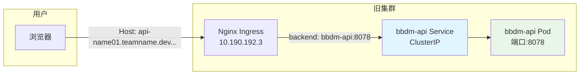
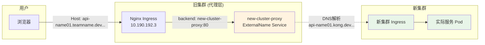

# 迁移前后对比图

## 迁移前：直接路由



**配置文件对比：**

### old-ingress.yaml (迁移前)
```yaml
spec:
  rules:
    - host: api-name01.teamname.dev.aliyun.intracloud.cn.aibang
      http:
        paths:
          - backend:
              service:
                name: bbdm-api        # ← 直接指向内部服务
                port:
                  number: 8078        # ← 内部服务端口
```

---

## 迁移后：代理路由



**配置文件对比：**

### external-service.yaml (新增)
```yaml
apiVersion: v1
kind: Service
metadata:
  name: new-cluster-proxy           # ← Ingress引用的服务名
spec:
  type: ExternalName                # ← 关键：ExternalName类型
  externalName: api-name01.kong.dev.aliyun.intracloud.cn.aibang  # ← 新集群域名
```

### new-ingress.yaml (迁移后)
```yaml
spec:
  rules:
    - host: api-name01.teamname.dev.aliyun.intracloud.cn.aibang
      http:
        paths:
          - backend:
              service:
                name: new-cluster-proxy  # ← 指向ExternalName服务
                port:
                  number: 80             # ← HTTP标准端口
```

---

## 核心差异总结

| 项目 | 迁移前 | 迁移后 |
|------|--------|--------|
| **Backend Service** | `bbdm-api` (ClusterIP) | `new-cluster-proxy` (ExternalName) |
| **Service 目标** | 集群内部Pod | 外部域名 |
| **端口** | 8078 (应用端口) | 80 (HTTP标准端口) |
| **请求流向** | 旧集群内部 | 代理到新集群 |
| **DNS解析** | 不需要 | 需要解析新集群域名 |

## 关键理解点

### 1. 服务名称对应关系
```yaml
# Ingress 中的引用
backend:
  service:
    name: new-cluster-proxy    # 这个名字

# 必须匹配 ExternalName Service 的名字
metadata:
  name: new-cluster-proxy      # 这个名字
```

### 2. ExternalName 工作原理
```
Kubernetes 内部服务发现:
new-cluster-proxy → DNS查询 → api-name01.kong.dev.aliyun.intracloud.cn.aibang → 新集群IP
```

### 3. 请求头转换
```
原始请求头: Host: api-name01.teamname.dev.aliyun.intracloud.cn.aibang
           ↓ (nginx代理转换)
转发请求头: Host: api-name01.kong.dev.aliyun.intracloud.cn.aibang
```

这样新集群就能正确识别和路由请求了！

## 验证理解

你可以通过以下命令验证这个流程：

```bash
# 1. 查看ExternalName Service (没有Endpoints)
kubectl get endpoints new-cluster-proxy -n aibang-1111111111-bbdm

# 2. 查看普通Service (有Endpoints)  
kubectl get endpoints bbdm-api -n aibang-1111111111-bbdm

# 3. 对比两种Service类型
kubectl get service -n aibang-1111111111-bbdm -o wide
```

ExternalName Service 不会有 Endpoints，因为它只是一个 DNS 别名！